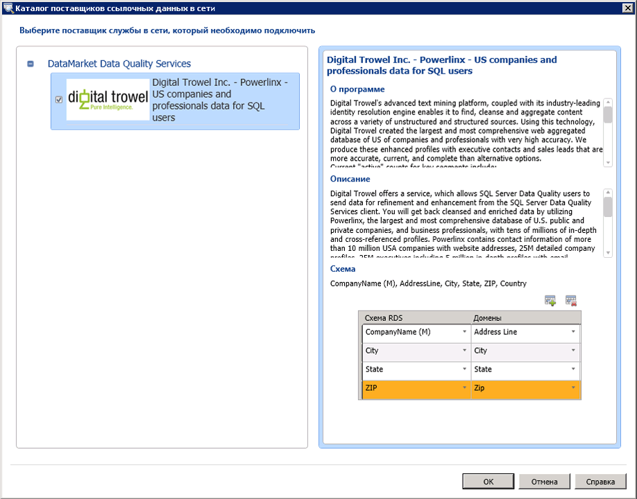

# Подключение домена или составного домена к ссылочным данным — службы Data Quality Services (DQS)

[!INCLUDE[appliesto-ss-xxxx-xxxx-xxx-md-winonly](../includes/appliesto-ss-xxxx-xxxx-xxx-md-winonly.md)]

  В этом разделе описывается, как подключить домены или составные домены в базе знаний качества данных к службе ссылочных данных в Azure Marketplace для создания знаний по высококачественным эталонным данным. Каждая служба ссылочных данных содержит схему (столбцы данных). После добавления домена или составного домена к службе ссылочных данных необходимо сопоставить добавленный домен или отдельные домены в составе составного домена с соответствующими столбцами в схеме службы ссылочных данных. Добавление составного домена в службу ссылочных данных позволяет добавить только один домен в службу ссылочных данных, а затем сопоставить отдельные домены в составе составного домена с соответствующими столбцами в схеме службы ссылочных данных.  

> [!IMPORTANT]
> В этой статье упоминаются сторонние службы ссылочных данных, которые ранее были доступны из Azure DataMarket. DataMarket и службы Data Services — включая данные об адресах Melissa — не поддерживаются после 31 декабря 2016 г. Таким образом, вы больше не можете запускать примеры в этой статье с помощью указанных служб из DataMarket. По-прежнему можно использовать службы эталонных данных, доступные через Интернет напрямую от сторонних поставщиков.

> [!WARNING]  
>  Составной домен, добавленный в службу ссылочных данных, доступен в раскрывающемся списке доменов во время сопоставления доменов со столбцами в схеме службы ссылочных данных. Не сопоставляйте составной домен со столбцом в схеме службы ссылочных данных. Следует сопоставлять только отдельные домены в рамках составного домена с соответствующими столбцами в схеме службы ссылочных данных. В противном случае процесс завершится ошибкой.  
  
 Схема ссылочных данных может включать обязательный столбец, который в случае использования данной схемы требуется сопоставить со службой ссылочных данных. Обязательный столбец в схеме ссылочных данных идентифицируется символом (M), который расположен рядом с именем столбца. Например, **AddressLine** — это обязательный столбец схемы в таблице **Адреса данных Мелиссы**, а **CompanyName** — обязательный столбец схемы в таблице **Digital Trowel Inc. — американские компании и профессиональные данные для пользователей SQL**.  
  
 В этой статье мы создадим четыре домена: **Адрес**, **Город**, **Штат** и **Почтовый индекс** внутри составного домена **Проверка адреса**, подключим составной домен к службе ссылочных данных **Данные Мелиссы — проверка адреса**, а затем сопоставим отдельные домены внутри составного домена с соответствующими столбцами в схеме службы ссылочных данных.  
  
## Перед началом  
  
###   Предварительные требования  
 Необходимо настроить [!INCLUDE[ssDQSnoversion](../includes/ssdqsnoversion-md.md)] (DQS) для использования служб ссылочных данных. См. раздел [Настройка служб DQS для использования эталонных данных](../data-quality-services/configure-dqs-to-use-reference-data.md).  
  
###   безопасность  
  
#### Разрешения  
 Для сопоставления доменов со ссылочными данными необходимо иметь роль dqs_kb_editor в базе данных DQS_MAIN.  
  
##  Сопоставьте домены с ссылочными данными из данных Melissa  
  
1.  [!INCLUDE[ssDQSInitialStep](../includes/ssdqsinitialstep-md.md)][Запустите приложение Data Quality Client](../data-quality-services/run-the-data-quality-client-application.md).  
  
2.  На главном экране клиента [!INCLUDE[ssDQSClient](../includes/ssdqsclient-md.md)] в разделе **Управление базами знаний**щелкните **Создать базу знаний**.  
  
3.  На экране **Новая база знаний** введите имя новой базы знаний, щелкните действие **Управление доменами** , а затем нажмите кнопку **Создать**.  
  
4.  Чтобы создать домен, на странице **Управление доменами** щелкните значок **Создать домен** . Создайте следующие четыре домена: **Адрес**, **Город**, **Штат**и **Zip-код**.  
  
5.  Чтобы создать составной домен, щелкните значок **Создать составной домен** . В диалоговом окне **Создать составной домен** введите текст **Проверка адреса** в поле **Имя составного домена** и включите в составной домен все домены, созданные при выполнении шага 3. Нажмите кнопку **ОК**.  
  
6.  На расположенной слева панели **Домен** выберите составной домен, щелкнув значение **Проверка адреса**, а затем перейдите на вкладку **Ссылочные данные** , расположенную справа.  
  
7.  Щелкните значок **Обзор** .  
  
8.  В диалоговом окне **Каталог поставщиков ссылочных данных в сети** выполните следующие действия.  
  
    1.  В разделе **Службы DataMarket Data Quality Services** выберите поле **Данные Мелиссы — проверка адреса**.  
  
    2.  Сопоставьте столбцы службы ссылочных данных "Данные Мелиссы — проверка адреса" с соответствующими доменами ("Адрес", "Город", "Штат" и "Почтовый индекс"). Для сопоставления столбцов выберите столбец службы ссылочных данных в столбце **Схема RDS** , а затем выберите соответствующий домен в столбце **Домен** . Для добавления в таблицу дополнительных строк щелкните значок **Добавить элемент схемы** .  
  
    3.  Нажмите кнопку **ОК** , чтобы сохранить изменения и закрыть диалоговое окно **Каталог поставщиков ссылочных данных в сети** .  
  
           
  
        > [!NOTE]  
        >  -   В диалоговом окне **Каталог поставщиков ссылочных данных в сети** в узле " **службы качества данных DataMarket** " отображаются все поставщики ссылочных данных, на которые вы подписаны в Azure Marketplace. Если в DQS настроены непосредственные сетевые сторонние поставщики служб ссылочных данных, они включены в другой узел с именем **Сторонние непосредственные сетевые поставщики** (в данный момент этот узел недоступен, так как в DQS прямые сетевые сторонние поставщики служб ссылочных данных не настроены).  
  
9. Вы вернетесь на вкладку **Ссылочные данные** . В области **Параметры поставщика** измените значения в следующих полях, если это необходимо:  
  
    -   **Пороговое значение автоматического исправления**: исправления из службы ссылочных данных с уровнем достоверности выше этого порогового значения будут выполняться автоматически. Введите значение в десятичной нотации для соответствующего значения в процентах. Например, введите 0,9 для 90 %.  
  
    -   **Предлагаемые кандидаты**: количество предлагаемых кандидатов, отображаемых в службе ссылочных данных.  
  
    -   **Минимальная достоверность**. предложения от службы ссылочных данных с уровнем достоверности ниже этого значения будут игнорироваться. Введите значение в десятичной нотации для соответствующего значения в процентах. Например, введите 0,6 для 60 %.  
  
10. Нажмите кнопку **Готово** , чтобы опубликовать базу знаний. После публикации базы знаний выдается сообщение с подтверждением.  
  
 Теперь вы можете использовать эту базу знаний для действия очистки в проекте служб DQS, чтобы стандартизировать и очистить адреса в исходных данных на основе знаний, предоставляемых Melissa данными через Azure Marketplace.  
  
##  Дальнейшие действия. После сопоставления домена с ссылочными данными  
 Создайте проект служб DQS и выполните действие очистки исходных данных, которые содержат адреса США, с помощью сравнения этих данных с базой знаний, созданной в данном разделе. См. раздел [Очистка данных с использованием набора знаний об эталонных данных &#40;внешних&#41;](../data-quality-services/cleanse-data-using-reference-data-external-knowledge.md).  
  
## См. также:  
 [Службы эталонных данных в DQS](../data-quality-services/reference-data-services-in-dqs.md)   
 [Data Cleansing](../data-quality-services/data-cleansing.md)  
  
  
