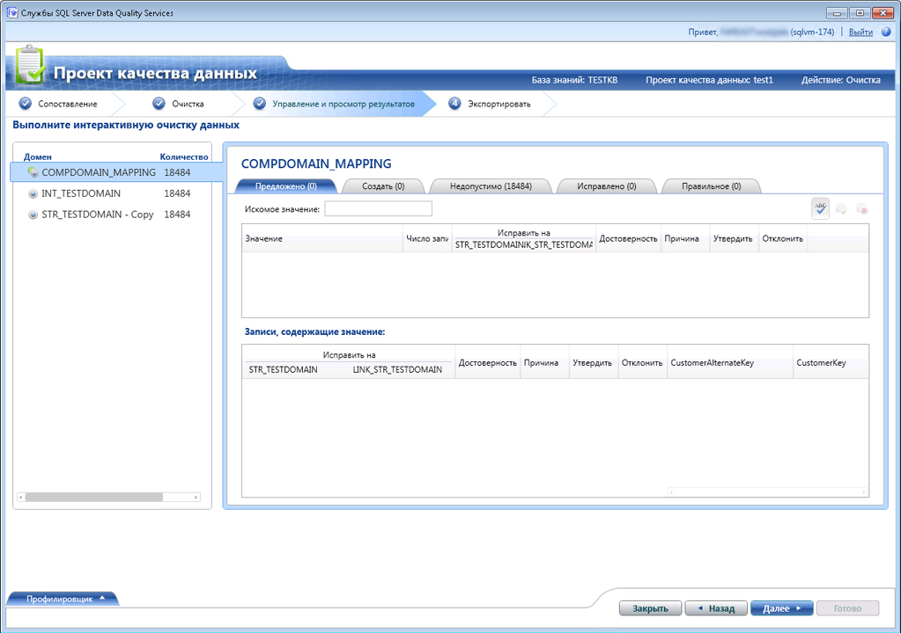

# Очистка данных с использованием знаний о справочных данных (внешних знаний)
  В этом разделе описывается очистка данных с использованием набора знаний из поставщиков ссылочных данных. Все этапы выполнения операции очистки остаются неизменными для очистки данных с использованием набора знаний из поставщиков ссылочных данных, как описано в [очистки данных с помощью DQS & #40; внутренний & #41; Базы знаний](../data-quality-services/cleanse-data-using-dqs-internal-knowledge.md), в этом разделе содержится информация для очистки данных с помощью службы ссылочных данных в [!INCLUDE[ssDQSnoversion](../includes/ssdqsnoversion-md.md)] (DQS).  
  
 При очистке данных с использованием функции службы ссылочных данных в DQS процесс очистки служб DQS отправляет сопоставленные значения домена поставщику служб ссылочных данных в виде пакетного запроса. Служба ссылочных данных в ответ отправляет следующие сведения:  
  
-   Предлагаемые исправления  
  
-   Достоверность  
  
-   Дополнительные сведения о сопоставленном домене. Ссылочные данные позволяют также стандартизировать, выполнять анализ или обогащать источник дополнительными данными. Эти сведения предоставляются в дополнительных полях в ответе.  
  
 После получения ответа от службы ссылочных данных в ходе действия по очистке в DQS происходит следующее.  
  
-   На основе значений **Пороговое значение автоматического исправления** и **Минимальная достоверность** , заданных при сопоставлении доменов со службой ссылочных данных, происходит автоматическое исправление или предоставление предлагаемых вариантов, в зависимости от уровня достоверности.  
  
    > [!NOTE]  
    >  Пороговые значения, указанные во время сопоставления домена со службой ссылочных данных, применяются при очистке данных с использованием набора знаний в службе ссылочных данных, а не данных, указанных на вкладке **Общие параметры** в разделе **Настройка** . Дополнительные сведения об указании пороговых значений для очистки ссылочных данных см. шаг 9 в [присоединить домен или составной домен со ссылочными данными](../data-quality-services/attach-domain-or-composite-domain-to-reference-data.md).  
  
-   Значения доменов категоризируются следующим образом: **Предложено**, **Новый**, **Недопустимый**, **Исправлено**и **Правильно**.  
  
-   Дополнительные данные присоединены к источнику, а сведения доступны вместе с очищенными данными для экспорта.  
  
## Перед началом  
  
###   Предварительные требования  
 Следует предварительно сопоставить требуемые домены в базе знаний DQS с соответствующей службой ссылочных данных. Кроме того, база знаний должна содержать набор знаний о типе данных, которые требуется очистить. Например, если требуется очистить исходные данные, содержащие адреса в США, необходимо сопоставить домены с поставщиком службы ссылочных данных, предоставляющим высококачественные данные по адресам в США. Дополнительные сведения см. в разделе [присоединить домен или составной домен со ссылочными данными](../data-quality-services/attach-domain-or-composite-domain-to-reference-data.md).  
  
###   Безопасность  
  
####   Разрешения  
 Для выполнения очистки данных необходимо иметь роль dqs_kb_editor или dqs_kb_operator в базе данных DQS_MAIN.  
  
##   Очистка данных с использованием набора знаний о ссылочных данных  
 Мы продолжим рассматривать этот же пример использования доменов, которые сопоставлялись в предыдущем разделе, [присоединить домен или составной домен со ссылочными данными](../data-quality-services/attach-domain-or-composite-domain-to-reference-data.md), со службой Melissa Data в Windows Azure Marketplace. Теперь мы будем использовать те же домены для очистки образцов адресов в США. Действия по очистке данных такие же, как описано в разделе [очистки данных с помощью DQS & #40; внутренний & #41; Базы знаний](../data-quality-services/cleanse-data-using-dqs-internal-knowledge.md). Однако мы будем привлекать ваше внимание к важным деталям в ходе этого процесса.  
  
1.  Создайте проект служб DQS и выберите действие **Очистка** . См. раздел [Create a Data Quality Project](../data-quality-services/create-a-data-quality-project.md).  
  
2.  На странице **Сопоставление** сопоставьте следующие 4 домена с соответствующими столбцами в исходных данных: **Строка адреса**, **Город**, **Штат**и **Почтовый индекс**. Нажмите кнопку **Далее**.  
  
    > [!NOTE]  
    >  Как сопоставлены 4 домена в пределах **Проверка адресов** составной домен, очистка данных будет выполнять на уровне составного домена, а не на уровне отдельных домена.  
  
3.  На **Очистка** страницу, запустите автоматизированный процесс очистки, щелкнув **запустить**. После завершения процесса очистки нажмите кнопку **Далее**.  
  
    > [!NOTE]  
    >  На **Очистка** DQS отображаются сведения о доменах, присоединенных к службе ссылочных данных в следующих двух способов:  
    >   
    >  -   Сообщение отображается под **запустить** кнопка: «домены \< Domain1>, \< домен2>,... \< DomainN> с использованием поставщика службы ссылочных данных.» В этом примере отображается следующее сообщение: «Выполняется очистка домена "Проверка адресов" с использованием поставщика службы ссылочных данных».  
    > -   Значок , отображается в **профилировщика** области с доменами, подключенный к поставщику службы ссылочных данных. В этом примере значок будет отображаться напротив составного домена **Проверка адресов** .  
  
4.  На странице **Управление результатами и просмотр результатов** просмотрите значения домена. Служба ссылочных данных может отображать, если доступно, несколько предлагаемых значений, количество которых зависит от максимума, заданного в поле **Предлагаемые варианты** во время сопоставления домена со службой ссылочных данных. Например, для следующего адреса в США отображаются два предлагаемых варианта.  
  
     **Исходное значение:**  
  
    |Строка адреса|Город|Штат|Почтовый индекс|  
    |------------------|----------|-----------|---------|  
    |1 msft way|Redmond||98052|  
  
     **Предлагаемые значения:**  
  
    |Строка адреса|Город|Штат|Почтовый индекс|  
    |------------------|----------|-----------|---------|  
    |1 Microsoft Way|Redmond|WA|98052|  
    |PO Box 1|Redmond|WA|98073|  
  
       
  
    > [!NOTE]  
    >  Что касается составных доменов, то службы DQS выделяют также другим цветом отдельные домены, где в процессе автоматизированной очистки вносились исправления. Например, в данном случае исправлениям подвергались домены **Строка адреса** и **Штат** , поэтому они выделены голубым.  
  
5.  После окончания просмотра всех значений домена нажмите кнопку **Далее** , чтобы экспортировать данные.  
  
6.  На **Экспорт** страницы, можно будет Обратите внимание, что помимо обычных сведений о действии очистки для каждого домена (источник, причина, надежности и состояние), Дополнительные сведения о предоставляемых по ссылке Melissa Data службы данных по данным адресов: широта и долгота ваш адрес, название, адрес, тип (высотный дом, улица, т. д.) и так далее.  
  
7.  Экспортируйте данные в нужное место (SQL Server, CSV или Excel) и нажмите кнопку **Готово** Закрыть проект.  
  
    > [!IMPORTANT]  
    >  Если используется 64-разрядная версия Excel, то нельзя экспортировать очищенные данные в файл Excel. Можно экспортировать данные только в базу данных SQL Server или в CSV-файл.  
  
  