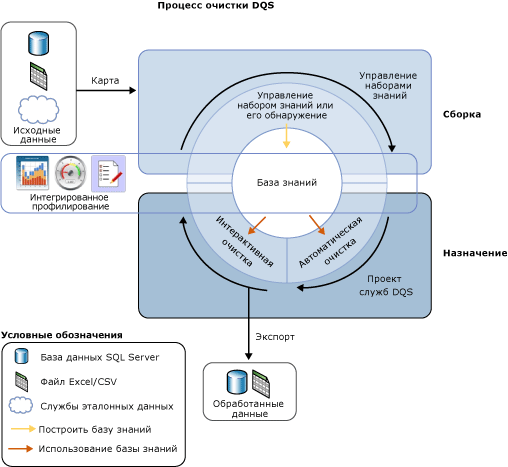

# Очистка данных
  Очистка данных — это процесс анализа качества данных в источнике данных с выполняемым вручную утверждением или отклонением рекомендаций, даваемых системой, и внесением изменений в данные. Очистка данных в службах [!INCLUDE[ssDQSnoversion](../includes/ssdqsnoversion-md.md)] (DQS) состоит из автоматического процесса, анализирующего соответствие данных знаниям из базы знаний, и интерактивного процесса, позволяющего диспетчеру данных проверять и изменять результаты автоматического процесса, чтобы обеспечить надлежащий результат очистки данных.  
  
 Диспетчер данных также может выполнять очистку данных в процессе обработки пакетов служб Integration Services. В этом случае диспетчер данных должен использовать компонент [!INCLUDE[ssDQSCleansingLong](../includes/ssdqscleansinglong-md.md)], который автоматически выполняет очистку данных на основе существующей базы знаний. Дополнительные сведения см. в разделе [Трансформация очистки DQS](../integration-services/data-flow/transformations/dqs-cleansing-transformation.md).  
  
 Функция очистки данных в DQS имеет следующие преимущества.  
  
-   Выявление неполных или неверных данных в источнике данных (файле Excel или базе данных SQL Server) с последующим исправлением данных или оповещением пользователя о недопустимых данных.  
  
-   Двухэтапный процесс очистки данных: *автоматизированный* и *интерактивной*. В автоматическом процессе используются знания из базы знаний DQS для автоматической обработки данных и создания рекомендаций по замене и исправлению. На следующем интерактивном этапе диспетчер данных может утвердить, отклонить или изменить операции, рекомендованные DQS в рамках автоматической очистки.  
  
-   Стандартизация и дополнение данных клиента с использованием значений домена, правил домена и эталонных данных. Например, стандартизируйте использование терминов, заменив "Ул." на "Улица", дополните данные, добавив пропущенные элементы, для чего замените "1 Microsoft way Redmond 98006" на "1 Microsoft Way, Redmond, WA 98006".  
  
-   Простой, интуитивно понятный и предсказуемый пользовательский интерфейс на основе мастеров для просмотра данных и проверки ошибок в очень крупных наборах данных.  
  
 На следующем рисунке показана очистка данных в DQS.  
  
   
  
##   Автоматическая очистка  
 Процесс очистки данных DQS применяет знания из базы знаний к данным, которые должны быть очищены, и предлагает изменения для данных. Диспетчер данных имеет доступ к каждому предложенному изменению, что позволяет ему оценить изменения и внести в них поправки. Для очистки данных диспетчер данных выполняет следующие действия.  
  
1.  Создание проекта качества данных, выберите базу знаний, в которой необходимо выполнить анализ и очистка исходных данных и выберите **Очистка** действия. Одну и ту же базу знаний можно использовать для нескольких проектов качества данных.  
  
2.  Указание таблицы/представления базы данных или файла Excel, содержащего исходные данные для очистки. Можно использовать базу данных или файл Excel, которые участвовали в обнаружении знаний, или другую базу данных либо файл Excel.  
  
    > [!NOTE]  
    >  Если выбрать для обнаружения знаний и операции очистки один источник данных, то в данных не будет изменений. Рекомендуется выполнять обнаружение знаний в образце данных, а затем проводить очистку исходных данных по знаниям, построенных в рамках обнаружения знаний.  
  
3.  Сопоставление полей данных для очистки с подходящими доменами и составными доменами в базе знаний. Если сопоставить поле с составным доменом, то сопоставление выполняется между полем и составным доменом, а не с отдельными доменами, входящими в составной. Кроме того, очистка данных для сопоставленного поля выполняется на основе правил, заданных для составного домена, а не для отдельных доменов, входящих в составной. Дополнительные сведения о составных доменах см. в разделе [базы знаний DQS и домены](../data-quality-services/dqs-knowledge-bases-and-domains.md).  
  
4.  Запустите автоматизированный процесс очистки, щелкнув **запуска** на **Очистка** страницы.  
  
 Процесс очистки данных ищет наилучшее соответствие экземпляра данных известным значениям домена данных. Этот процесс применяет знания о качестве данных ко всем исходным данным, в отличие от процесса обнаружения знаний, который выполняется только в процентной выборке данных.  
  
 В автоматическом процессе сведения о качестве данных отображаются в клиенте [!INCLUDE[ssDQSClient](../includes/ssdqsclient-md.md)], который будет использоваться в интерактивном процессе очистки. Помимо поиска несоответствия синтаксическим правилам, DQS также используют эталонные данные и дополнительные алгоритмы для классификации данных с помощью *уровень достоверности*. Уровень достоверности определяет экстент уверенности DQS в исправлении данных или создаваемых рекомендациях. Уровень достоверности зависит от следующих пороговых значений.  
  
-    *Пороговое значение автоматического исправления* значение выше которого DQS предлагает изменение и сделать его, если диспетчер данных отклоняет его. Пороговое значение автоматического исправления вы можете задать на вкладке **Общие параметры** экрана **Конфигурация** . Дополнительные сведения см. в статье [Configure Threshold Values for Cleansing and Matching](../data-quality-services/configure-threshold-values-for-cleansing-and-matching.md).  
  
-    *Порога автоматического предложения* значение ниже порогового значения автоматического исправления, выше которого DQS предлагает изменение и вносит его, если диспетчер данных его утвердит. Пороговое значение автоматической рекомендации вы можете задать на вкладке **Общие параметры** экрана **Конфигурация** . Дополнительные сведения см. в статье [Configure Threshold Values for Cleansing and Matching](../data-quality-services/configure-threshold-values-for-cleansing-and-matching.md).  
  
 Любое значение с уровнем достоверности ниже порогового значения автоматической рекомендации оставляется DQS без изменений, если диспетчер данных не указывает изменение.  
  
##   Интерактивная очистка  
 По результатам автоматического процесса очистки DQS предоставляет диспетчеру данных необходимую информацию для принятия решения об изменении данных. DQS классифицирует данные по пяти следующим вкладкам.  
  
-   **Предлагаемые**: значения, для которых DQS обнаружил рекомендации, имеющие более высокий уровень надежности *порога автоматического предложения* значение меньше *пороговое значение автоматического исправления* значение. Необходимо просмотреть эти значения и либо утвердить, либо отклонить их.  
  
-   **Новый**: допустимые значения, для которых DQS не имеет достаточной информации (рекомендаций) и поэтому не может быть сопоставлен ни в одну из других вкладок. Кроме того, эта вкладка также содержит значения, которые имеют уровень достоверности меньше, чем *порога автоматического предложения* значение, но достаточно высокую, были отмечены как допустимые.  
  
-   **Недопустимый**: значения, которые были помечены как недопустимые в домене базы знаний, или значения, которые оказались данные правила или ссылка домена. На этой вкладке также содержатся значения, отклоненные пользователем на остальных четырех вкладках в ходе интерактивного процесса очистки.  
  
-   **Исправлено**: значения, которые были исправлены DQS в рамках автоматической очистки обрабатывать как обнаружено исправление для значения с уровнем достоверности выше *пороговое значение автоматического исправления* значение. На этой вкладке также содержатся значения, для которых пользователь указал правильное значение в **исправить на** столбца во время интерактивной очистки и было утверждено, щелкнув переключатель в **Утвердить** на любой из четырех других вкладок.  
  
-   **Правильный**: обнаруженные правильные значения. Например, значение, которое соответствует значению домена. При необходимости можно переопределить очистку DQS, отклонив значения на этой вкладке или указав альтернативное слово в **исправить на** столбца и выбрав переключатель в **Accept** столбца. На этой вкладке также содержатся значения, которые были утверждены пользователем во время интерактивной очистки путем выбора переключателя в **Утвердить** столбца в **Создать** или **недопустимый** вкладки.  
  
> [!NOTE]  
>  В **предложенный**, **исправленные**, и **правильные** вкладки, DQS показывает начальное значение для домена, если это применимо в **исправить на** напротив соответствующего значения домена.  
  
 Диспетчер данных использует клиент [!INCLUDE[ssDQSClient](../includes/ssdqsclient-md.md)] для просмотра изменений, предложенных DQS, и принятия решения о необходимости их применения. Диспетчер может проверить значения, обозначенные DQS как правильные. Диспетчер данных может проверить, внесены ли изменения с высоким уровнем достоверности, уже внесенные службами DQS. Диспетчер данных может принять или отклонить изменения, предложенные автоматически. Диспетчер данных может просмотреть значения, которые не были изменены, на случай, если в них необходимо внести изменения, даже если автоматический процесс этого не обнаружил.  
  
 DQS объединяет все изменения, внесенные диспетчером данных, с результатами автоматической очистки данных. Изменения останутся с проектом, но не будут добавлены в базу знаний. Во время очистки данных соответствующая база знаний доступна только для чтения.  
  
 После завершения процесса очистки данных вы можете экспортировать обработанные данные в новую таблицу в базе данных SQL Server, в CSV-файл или файл Excel. Исходные данные, для которых выполнялась очистка, остаются в исходном состоянии. Диспетчер данных может использовать отдельные очищенные данные для исправления фактических исходных данных.  
  
 На следующем рисунке показана очистка данных в приложении [!INCLUDE[ssDQSClient](../includes/ssdqsclient-md.md)].  
  
   
  
##   Исправление начального значения  
 Исправление начального значения относится к значениям домена, имеющим синонимы, когда пользователю нужно использовать один из синонимов в качестве начального значения для согласованного представления этого значения. Например, термины «Петербург», «Санкт-Петербург» и «Северная столица» являются синонимами, а пользователю нужно использовать начальное значение «Санкт-Петербург». DQS поддерживает исправление начального значения в процессе очистки для упрощения стандартизации данных. Исправление начального значения выполняется, только если при создании домена в нем была включена эта операция. По умолчанию включены все домены для исправление начального значения, если не снят флажок **использовать начальные значения** флажок при создании домена. Дополнительные сведения об этом флажке см. в разделе [Задание свойств домена](../data-quality-services/set-domain-properties.md).  
  
##   Стандартизация очищенных данных  
 Можно выбрать, будут ли очищенные данные экспортироваться в стандартном формате на основе формата вывода, определенного для доменов. При создании домена вы можете выбрать форматирование, которое будет применяться при выводе значений данных в домене. Дополнительные сведения об указании форматов вывода для домена см. в разделе **Формат вывода** список [Задание свойств домена](../data-quality-services/set-domain-properties.md).  
  
 При экспорте очищенных данных на **Экспорт** страницы в мастере качества проекта очистки данных укажите, следует ли очищенные данные экспортироваться в стандартном формате, выбрав **стандартный вывод** флажок. По умолчанию очищенные данные экспортируются в стандартном формате, то есть этот флажок установлен. Дополнительные сведения об экспорте очищенных данных см. в разделе [очистки данных с помощью DQS & #40; внутренний & #41; Базы знаний](../data-quality-services/cleanse-data-using-dqs-internal-knowledge.md).  
  
##   Связанные задачи  
  
|Описание задачи|Раздел|  
|----------------------|-----------|  
|Описывает настройку пороговых значений для операции очистки.|[Настройка пороговых значений для очистки и сопоставления](../data-quality-services/configure-threshold-values-for-cleansing-and-matching.md)|  
|Описывает очистку данных с использованием знаний, построенных в DQS.|[Очистка данных с помощью DQS & #40; внутренняя & #41; Базы знаний](../data-quality-services/cleanse-data-using-dqs-internal-knowledge.md)|  
|Описывает очистку данных с использованием знаний, полученных от службы эталонных данных.|[Очистка данных с использованием ссылочных данных & #40; Внешние & #41; Базы знаний](../data-quality-services/cleanse-data-using-reference-data-external-knowledge.md)|  
|Описывает очистку составного домена.|[Очистка данных в составном домене](../data-quality-services/cleanse-data-in-a-composite-domain.md)|  
  
## См. также:  
 [Проекты качества данных & #40; DQS & #41;](../data-quality-services/data-quality-projects-dqs.md)   
 [Сопоставление данных](../data-quality-services/data-matching.md)  
  
  