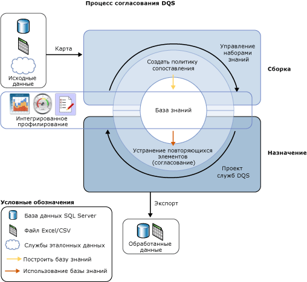

# Сопоставление данных

[!INCLUDE[appliesto-ss-xxxx-xxxx-xxx-md-winonly](../includes/appliesto-ss-xxxx-xxxx-xxx-md-winonly.md)]

  Процесс сопоставления данных [!INCLUDE[ssDQSnoversion](../includes/ssdqsnoversion-md.md)] (DQS) позволяет сократить дублирование данных и повысить их точность в источнике данных. Сопоставление анализирует степень дублирования во всех записях одного источника данных, возвращая взвешенные вероятности совпадения между всеми наборами сравниваемых записей. Затем вы можете принять решение, какие записи совпадают, и предпринять соответствующие действия в исходных данных.  
  
 Процесс сопоставления DQS имеет следующие преимущества.  
  
-   Сопоставление позволяет устранить различия между значениями данными, которые должны быть равны, определяя правильное значение и уменьшая риск возникновения ошибок, которые может вызвать такая разница в данных. К примеру, имена и адреса часто являются данными идентификации для источника данных, особенно пользовательских данных, но эти данные могут со временем стать «грязными» и устареть. Выполнение сопоставления для выявления и исправления этих ошибок делает использование и обслуживание данных намного проще.  
  
-   Сопоставление позволяет убедиться, что значения, которые являются эквивалентными, но введены в разных форматах или стилях, отображаются в единой форме.  
  
-   Сопоставление определяет точные и приблизительные совпадения, позволяя удалить повторяющиеся данные по мере их обнаружения. Можно определить точку, в которой приблизительное совпадение является фактическим совпадением. Можно определить, какие поля оцениваются для сопоставления, а какие — нет.  
  
-   DQS позволяет создавать политику сопоставления с помощью автоматизированного процесса, выполнить ее интерактивное изменение, исходя из результатов сопоставления, и добавить эту политику в повторно используемую базу знаний.  
  
-   Вы можете повторно проиндексировать данные, скопированные из источника в промежуточную таблицу, или не индексировать их повторно, в зависимости от состояния политики сопоставления и исходных данных. Производительность может улучшиться, если не индексировать данные повторно.  
  
 Для повышения общего качества данных процесс сопоставления вы можете выполнять совместно с другими процессами очистки данных. Также вы можете выполнить операцию удаления дубликатов данных с помощью функциональных возможностей DQS, встроенных в Master Data Services. Дополнительные сведения см. в статье [Общие сведения о службах Master Data Services &#40;MDS&#41;](../master-data-services/master-data-services-overview-mds.md).  
  
 На приведенном ниже рисунке отображен процесс сопоставления данных в DQS.  
  
   
  
##   Как выполнить сопоставление данных  
 Как и в случае с процессами качества данных в DQS, сопоставление выполняется с помощью построения базы знаний и выполнения операции сопоставления в проекте служб DQS путем следующих действий.  
  
1.  Создание политики сопоставления в базе знаний  
  
2.  Выполнение процесса удаления дубликатов в операции сопоставления, которая является частью проекта служб DQS.  
  
###   Построение политики сопоставления  
 База знаний подготавливается для выполнения сопоставления с помощью создания политики сопоставления в базе знаний, чтобы определить, каким образом DQS назначает вероятность сопоставления. Политика сопоставления состоит из одного или нескольких правил сопоставления, которые определяют, какие домены будут использованы, когда DQS оценит, насколько одна запись совпадает с другой, и задаст вес, который каждое значение домена вносит в оценку сопоставления. Можно задать в правиле, должны ли значения домена иметь точное совпадение или могут быть просто подобны, а также степень подобности. Также можно указать, является ли совпадение домена обязательным требованием.  
  
 Операция политики сопоставления в мастере управления базами знаний анализирует образец данных, используя каждое правило сопоставления для одновременного сравнения двух записей по всему диапазону записей. Записи, чьи показатели сопоставления больше, чем заданное минимальное значение, группируются в кластеры в результатах сопоставления. Эти результаты сопоставления не добавляются в базу знаний; они используются для настройки правила сопоставления. Создание политики сопоставления может быть интерактивным процессом, в котором правила сопоставления изменяются, исходя из результатов сопоставления или статистических данных профилирования.  
  
 Для домена вы можете задать нормализацию строк данных при загрузке данных из источника данных в домен. Этот процесс заключается в замене особых символов на ноль или пробел, что в большинстве случаев стирает разницу между двумя строками. Это может повысить точность сопоставления и зачастую позволяет результатам сопоставления преодолеть минимальный порог сопоставления, что без нормализации выполнить невозможно.  
  
> [!NOTE]  
>  Значения NULL в соответствующих полях двух записей будут считаться совпадающими.  
  
 Политика сопоставления выполняется на доменах, сопоставленных с образцами данных. Можно задать, будет ли выполняться копирование данных из источника данных в промежуточную таблицу, а также повторное индексирование при запуске политики сопоставления, или не будет. Это вы можете сделать, как при создании базы знаний, так и при запуске проекта сопоставления. Отказ от повторной индексации может привести к улучшению производительности. Повторная индексация не требуется, когда выполняются следующие условия: политика сопоставления не изменялась, не обновлялся источник данных, не выполнялось повторное сопоставление политики, не был выбран новый источник данных, а также не выполнялось сопоставление с одним или несколькими новыми доменами.  
  
 Каждое правило сопоставления при его создании сохраняется в базе знаний. Однако база знаний доступна для использования в проекте служб DQS только тогда, когда она опубликована. Кроме того, пока база знаний не опубликована, правила сопоставления в них не могут быть изменены пользователем, который не является создателем.  
  
###   Запуск проекта сопоставления  
 DQS выполняет удаление дубликатов данных, сравнивая каждую строку в исходных данных с каждой другой строкой с помощью политики сопоставления, определенной в базе знаний, и задавая вероятность того, что строки совпадают. Это делается в проекте служб DQS с типом «Сопоставление». Сопоставление является одним из основных действий в проекте служб DQS. Оно выполняется наилучшим образом после очистки данных так, чтобы в сопоставляемых данных не было ошибок. Перед тем как запустить процесс сопоставления, можно экспортировать результаты проекта очистки в таблицу данных или CSV-файл, а затем создать проект сопоставления, в котором можно сопоставить результаты очистки с доменами в проекте сопоставления.  
  
 Проект сопоставления данных состоит из автоматизированного и интерактивного процесса. Проект сопоставления применяет правила сопоставления в политике сопоставления к оцениваемому источнику данных. Этот процесс оценивает вероятность того, что любые две строки совпадают по показателю сопоставления. Совпадающими считаются только записи с вероятностью совпадения большей, чем значение, установленное администратором данных в политике сопоставления.  
  
 При выполнении анализа сопоставления служба DQS создает кластеры записей, которые эта служба считает совпадающими. DQS произвольно определяет одну из записей в каждом кластере в качестве сводной или старшей записи. Администратор данных проверяет результаты сопоставления и отвергает любые записи, которые являются неподходящим совпадением для кластера. Затем администратор данных выбирает правило выживания, которое DQS будет использовать для определения записи, успешно прошедшей процесс сопоставления, и замены записи сопоставления. Правилом выживания может быть «Сводная запись» (по умолчанию), «наиболее полная и длинная запись», «наиболее полная запись» или «наиболее длинная запись». Служба DQS определяет «выжившую» (старшую) запись в каждом кластере, исходя из чего определяется запись, которая наилучшим образом соответствует критерию правила выживания. Если несколько записей в данном кластере соблюдают правило выживания, DQS случайным образом выбирает одну из этих записей. DQS предлагает осуществить выбор единственного кластера из отображаемых кластеров с общими записями, выбрав параметр «Показать неперекрывающиеся кластеры». Для отображения результатов в соответствии с этим параметром необходимо выполнить процесс сопоставления.  
  
 Вы можете экспортировать результаты процесса сопоставления в таблицу SQL Server или CSV-файл. Экспортировать результаты сопоставления вы можете в двух форматах: первый — совпадающие и несовпадающие записи; второй — «выжившие» записи, которые содержат только «выжившую» запись для кластера, и несовпадающие результаты. При использовании правила выживания записей, если одна и та же запись определена как «выжившая» для нескольких кластеров, она будет экспортирована только один раз.  
  
## в этом разделе  
 Можно выполнять следующие задачи, связанные с сопоставлением в службах DQS.  
  
|||  
|-|-|  
|Создание и тестирование правил сопоставления в политике сопоставления|[Создание политики сопоставления](../data-quality-services/create-a-matching-policy.md)|  
|Запуск сопоставления в проекте служб DQS|[Запуск проекта сопоставления](../data-quality-services/run-a-matching-project.md)|  
  
  
