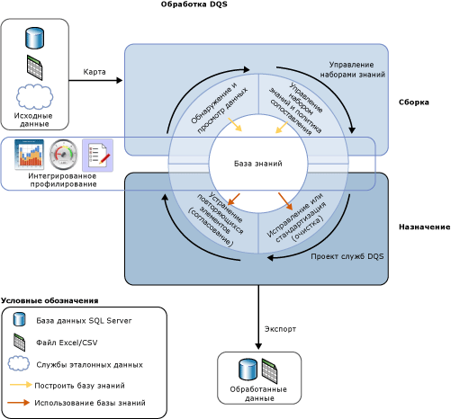

# Общие сведения о службах Data Quality Services

[!INCLUDE[appliesto-ss-xxxx-xxxx-xxx-md-winonly](../includes/appliesto-ss-xxxx-xxxx-xxx-md-winonly.md)]

  Решение по обеспечению качества данных, предоставляемое [!INCLUDE[ssDQSnoversion](../includes/ssdqsnoversion-md.md)] (DQS), позволяет диспетчеру данных или ИТ-специалисту поддерживать качество данных и обеспечивать их пригодность к бизнес-использованию. DQS — это решение на основе знаний, которое обеспечивает автоматизированные и интерактивные способы управления целостностью и качеством источников данных. DQS позволяет обнаруживать знания о данных, строить наборы знаний и управлять ими. Затем эти знания вы можете использовать для выполнения очистки, сопоставления и профилирования данных. Также вы можете использовать облачные службы поставщиков эталонных данных в проекте качества данных DQS.  
  
##   Потребность бизнеса в DQS  
 Неверные данные появляются из-за ошибок при вводе данных пользователем, из-за повреждения при передаче или хранении, из-за ошибок в определениях словаря данных и других проблем с качеством и обработкой данных. Статистическая обработка данных из разных источников, использующих различные стандарты, а также применение произвольных правил и перезапись прежних данных может привести к несогласованности в данных. Неверные данные мешают компании вести бизнес и предоставлять услуги клиентам, что приводит к неудовлетворенности клиентов и потере их доверия, падению доходов и проблемам с обеспечением соответствия нормативам. Автоматические системы часто не работают с неверными данными, и люди тратят время и силы на выполнение операций вручную. Неверные данные могут иметь катастрофические последствия в анализе данных, составлении отчетов, интеллектуальном анализе данных и работе хранилища.  
  
 Высокое качество данных исключительно важно для эффективной работы коммерческих организаций и учреждений. Организация любого размера может использовать DQS для повышения информационной ценности данных, чтобы сделать их более подходящими для целевого использования. Решение по обеспечению качества данных делает данные более надежными, более доступными и повышает коэффициент их повторного использования. Это может повысить полноту, адекватность и согласованность данных, устранить проблемы, вызванные некорректными данными в приложениях бизнес-аналитики и в рабочей нагрузке хранилища данных, а также в действующих системах OLTP.  
  
 DQS позволяет бизнес-пользователям, информационным работникам и ИТ-специалистам, не имеющим большого опыта в работе с БД и не являющимся программистами, создавать, сопровождать и выполнять операции по обеспечению качества данных в организации с минимальными затратами времени на установку и подготовку.  
  
##   Ответ на потребности с DQS  
 Качество данных не определяется в абсолютном выражении. Оно зависит от того, насколько данные подходят для выполнения исходной задачи. DQS выявляет потенциально неверные данные и дает оценку вероятности фактических ошибок в данных. DQS дает семантическое представление о данных, позволяющее оценить их пригодность. DQS позволяет устранять проблемы, связанные с неполнотой данных, несоответствием стандартам, несогласованностью, неточностью, недопустимостью данных, и исключать дублирование данных.  
  
 DQS предоставляет следующие функции для устранения проблем с качеством данных.  
  
-   **Очистка данных:** изменение, удаление или дополнение неверных или неполных данных с использованием автоматических и интерактивных процедур. Дополнительные сведения см. в статье [Data Cleansing](../data-quality-services/data-cleansing.md).  
  
-   **Сопоставление:** выявление семантических дубликатов в процессе, основанном на правилах, который позволяет определить содержание сопоставления и исключение дубликатов. Дополнительные сведения см. в статье [Data Matching](../data-quality-services/data-matching.md).  
  
-   **Службы ссылочных данных:** проверка качества данных с использованием служб поставщика ссылочных данных. Вы можете использовать службы эталонных данных из [Microsoft Azure Marketplace](https://azure.microsoft.com/marketplace/) для очистки, проверки, сопоставления и дополнения данных. Дополнительные сведения см. в статье [Reference Data Services in DQS](../data-quality-services/reference-data-services-in-dqs.md).  
  
-   **Профилирование:** анализ источника данных для получения представления о качестве данных на каждом этапе процессов обнаружения знаний, управления доменами, сопоставления и очистки данных. Профилирование является мощным средством в решении по обеспечению качества данных DQS. Вы можете создать решение по обеспечению качества данных, где профилирование будет столь же важно, как управление знаниями, сопоставление и очистка данных. Дополнительные сведения см. в статье [Data Profiling and Notifications in DQS](../data-quality-services/data-profiling-and-notifications-in-dqs.md).  
  
-   **Мониторинг:** отслеживание и определение состояния операций по обеспечению качества данных. Мониторинг позволяет убедиться, что решение по обеспечению качества данных работает надлежащим образом. Дополнительные сведения см. в статье [DQS Administration](../data-quality-services/dqs-administration.md).  
  
-   **База знаний:** службы Data Quality Services — это решение, которое анализирует данные на основе набора знаний, построенного с помощью DQS. Это позволяет создавать процессы по обеспечению качества данных, которые постоянно совершенствуют знания о данных и при этом постоянно повышают их качество.  
  
 На следующем рисунке показан процесс DQS.  
  
   
  
##   Решение на основе знаний  
 База знаний DQS представляет собой репозиторий трех типов знаний: готовые знания, знания, составленные [!INCLUDE[ssDQSServer](../includes/ssdqsserver-md.md)], и знания, составленные пользователем. DQS позволяет хранить знания о данных в базе знаний, добавлять бизнес-правила и изменять знания по мере необходимости, а затем применять их для проверки целостности и правильности данных. После построения базы знаний вы можете постоянно совершенствовать ее и многократно использовать в различных процессах по повышению качества данных.  
  
 Знания в базе знаний определяют возможные ошибки в неверных данных и предлагают изменения в данных. Знания могут находить сопоставления в данных, что позволяет исключать дубликаты. С помощью знаний можно сравнивать исходные данные с облачными эталонными данными, которые сопровождаются и сертифицируются поставщиками качества данных. Диспетчер данных или ИТ-специалист проверяет знания в базе знаний и изменения, которые должны вноситься в данные, а затем выполняет операции очистки данных, исключения дубликатов и сверки с эталонными данными.  
  
 В базе знаний хранятся все знания, связанные с определенным типом источника данных. Например, можно вести одну базу знаний для базы данных клиентов, а другую — для базы данных сотрудников. Знания содержатся в одном или нескольких доменах данных, каждый из которых является семантическим представлением типа данных в поле данных. База знаний для базы данных клиентов может содержать домены для названий компаний, адресов, контактов, контактных сведений и т. д. Домен содержит список доверенных значений, недопустимых значений и ошибочных данных. Знания домена содержат взаимосвязи синонимов, связи терминов, правила проверки и бизнес-правила, а также политики сопоставления. Используя эти знания, диспетчер данных может принять информированное решение о том, следует ли исправлять определенные экземпляры значений в домене.  
  
 DQS позволяет выполнять операции импорта и экспорта с базой знаний. Вы можете импортировать или экспортировать домены или базы знаний с помощью DQS-файла. Вы можете импортировать значения или домены из файла Excel. Также вы можете импортировать значения, обнаруженные в процессе очистки на основе базы знаний, обратно в домен. Эти операции позволяют постоянно совершенствовать базу знаний, гарантируя обратную передачу знаний, полученных при обнаружении и принятии решений, в базу знаний.  
  
 В решении DQS, основанном на знаниях, применяются два важных шага очистки данных.  
  
-   Процесс **управления знаниями** , который создает базу знаний  
  
-   **Проект качества данных** , который предлагает изменения в исходных данных на основе знаний в базе знаний.  
  
 Дополнительные сведения см. в разделах [Базы знаний и домены DQS](../data-quality-services/dqs-knowledge-bases-and-domains.md) и [Проекты служб Data Quality Services &#40;DQS&#41;](../data-quality-services/data-quality-projects-dqs.md).  
  
##   Компоненты DQS  
 Службы Data Quality Services состоят из [!INCLUDE[ssDQSServer](../includes/ssdqsserver-md.md)] и [!INCLUDE[ssDQSClient](../includes/ssdqsclient-md.md)]. Эти компоненты позволяют выполнять функции обеспечения качества данных отдельно от других операций SQL Server. И то и другое можно установить из программы установки SQL Server.  
  
 [!INCLUDE[ssDQSServer](../includes/ssdqsserver-md.md)] реализован в виде трех каталогов SQL Server, управление которыми и наблюдение за которыми ведется в среде SQL Server Management Studio (DQS_MAIN, DQS_PROJECTS и DQS_STAGING_DATA). DQS_MAIN включает хранимые процедуры DQS, подсистему DQS и опубликованные базы знаний. DQS_PROJECTS включает данные, необходимые для управления базой знаний и операциями проекта DQS. DQS_STAGING_DATA предоставляет промежуточную базу данных для копирования исходных данных с целью выполнения операций DQS и последующего экспорта обработанных данных.  
  
 [!INCLUDE[ssDQSClient](../includes/ssdqsclient-md.md)] — это изолированное приложение, позволяющее выполнять операции управления знаниями, проекты качества данных и административные задачи в одном пользовательском интерфейсе. Это приложение предназначено для диспетчеров данных и администраторов DQS. Это изолированный исполняемый файл, выполняющий обнаружение знаний, управление доменами, создание политик сопоставления, очистку данных, сопоставление данных, профилирование данных, мониторинг данных и администрирование сервера. [!INCLUDE[ssDQSClient](../includes/ssdqsclient-md.md)] может устанавливаться и работать на одном компьютере с [!INCLUDE[ssDQSServer](../includes/ssdqsserver-md.md)] или на отдельном компьютере в удаленном режиме. Многие операции в [!INCLUDE[ssDQSClient](../includes/ssdqsclient-md.md)] выполняются мастерами для удобства использования.  
  
##   Функции качества данных в службах Integration Services и Master Data Services  
 Функции качества данных, предоставляемые службами Data Quality Services, встроены в компонент служб SQL Server Integration Services (SSIS) и в компоненты служб Master Data Services (MDS), что позволяет выполнять процессы по обеспечению качества данных в пределах этих служб.  
  
 **[!INCLUDE[ssDQSCleansingLong](../includes/ssdqscleansinglong-md.md)]**  
  
 Службы [!INCLUDE[ssDQSCleansingLong](../includes/ssdqscleansinglong-md.md)] позволяют выполнять очистку данных в рамках пакета служб Integration Services. Когда пакет запускается, очистка данных выполняется в виде пакетного файла. Это альтернатива выполнению проекта очистки в приложении [!INCLUDE[ssDQSClient](../includes/ssdqsclient-md.md)] . Вы можете автоматически обеспечить качество данных. Не нужно выполнять интерактивные действия в рамках проекта очистки данных в приложении [!INCLUDE[ssDQSClient](../includes/ssdqsclient-md.md)] . Вы можете включить процесс очистки данных в поток данных, содержащий другие компоненты служб Integration Services. Дополнительные сведения см. в разделе [Преобразование "Очистка DQS"](../integration-services/data-flow/transformations/dqs-cleansing-transformation.md).  
  
 **Процессы качества данных в службах Master Data Services**  
  
 Службы Data Quality Services интегрированы в службы Master Data Services (MDS), что позволяет исключать дубликаты в исходных данных и основных данных в рамках надстройки Microsoft SQL Server 2014 Master Data Services для Microsoft Excel. Для выполнения сопоставления загрузите данные, управляемые службами MDS, в лист Excel, и объедините их с данными, не управляемыми службами MDS, а затем осуществите сопоставление в рамках Excel. Компоненты [!INCLUDE[ssDQSServer](../includes/ssdqsserver-md.md)] должны устанавливаться вместе с MDS. Дополнительные сведения см. в статье  [Сопоставление качества данных в надстройке MDS для Excel](../master-data-services/microsoft-excel-add-in/data-quality-matching-in-the-mds-add-in-for-excel.md).  
  
  
