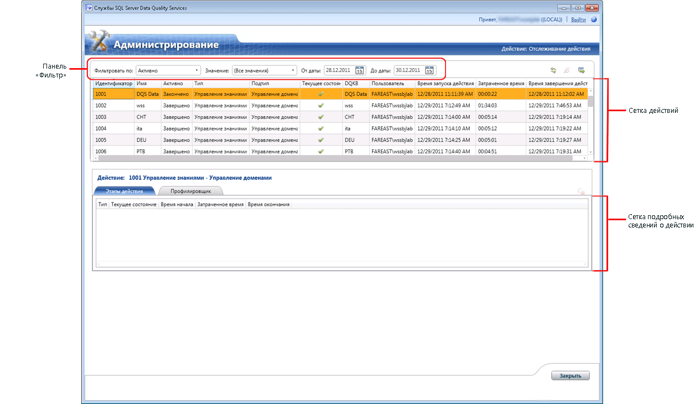

# Мониторинг операций DQS

[!INCLUDE[appliesto-ss-xxxx-xxxx-xxx-md-winonly](../includes/appliesto-ss-xxxx-xxxx-xxx-md-winonly.md)]

  В этом разделе описывается централизованный мониторинг следующих действий в [!INCLUDE[ssDQSnoversion](../includes/ssdqsnoversion-md.md)] (DQS): обнаружение знаний, управление доменами, политика сопоставления, очистка данных, сопоставление данных и очистка на базе служб SSIS.  
  
##   Перед началом  
  
###   ограничения  
 Только пользователи с ролью dqs_administrator в базе данных DQS_Main могут прерывать действие или останавливать процесс в составе действия.  
  
###   безопасность  
  
####   Permissions  
  
-   Для просмотра действий DQS необходимо иметь роль dqs_kb_editor или dqs_kb_operator в базе данных DQS_MAIN.  
  
-   Для завершения действия или остановки процесса в составе действия, помимо просмотра действий DQS, необходимо обладать ролью dqs_administrator в базе данных DQS_MAIN.  
  
##   Просмотр действий DQS  
  
1.  [!INCLUDE[ssDQSInitialStep](../includes/ssdqsinitialstep-md.md)] [Запуск клиентского приложения Data Quality Client](../data-quality-services/run-the-data-quality-client-application.md).  
  
2.  На главном экране [!INCLUDE[ssDQSClient](../includes/ssdqsclient-md.md)] нажмите **Мониторинг активности**. Появится экран мониторинга активности.  
  
       
  
3.  На экране мониторинга активности отображаются сведения о каждом действии в сетке действий. В сетке действий показаны следующие сведения о каждом действии DQS:  
  
     **Идентификатор**— целочисленное значение. Уникальный номер действия, формируемый системой для мониторинга активности.  
  
     **Имя**— имя базы знаний или проекта качества данных, используемого этим действием.  
  
     **Is Active**(Активно) — указывает, активно ли действие. Может иметь следующие значения.  
  
    -   **Активно**: действие выполняется в данный момент.  
  
    -   **Закончено**: действие завершено.  
  
    -   **Завершено**: действие было прервано с экрана мониторинга активности администратором служб DQS или отменено пользователем при запуске из соответствующей функциональной области в [!INCLUDE[ssDQSClient](../includes/ssdqsclient-md.md)].  
  
     **Тип**— указывает тип действия. **Подтип** — указывает конкретный рабочий процесс, который выполняется для действия данного типа. Отслеживаются следующие типы действий:  
  
    -   Подтипы**управления знаниями** :  
  
        -   **Обнаружение набора знаний**  
  
        -   **Управление доменами**  
  
        -   **Политика сопоставления**  
  
    -   Подтипы**проекта DQ** :  
  
        -   **очистка;**  
  
        -   **сопоставление.**  
  
    -   Подтипы**очистки SSIS** :  
  
        -   **очистка;**  
  
     **Текущее состояние**— указывает текущее состояние действия. Состояние действия определяется последним вычислительным процессом. Обратите внимание, что одно действие может включать несколько вычислительных процессов, например процесс обнаружения может быть запущен несколько раз (в рамках действия "Обнаружение знаний"). Таким образом, состояние в течение времени жизни действия может измениться несколько раз.  
  
     Параметр**Текущее состояние** может иметь следующие значения:  
  
    -   **Запущенные**: вычислительный процесс выполняется.  
  
    -   **Выполнено**— это состояние устанавливается перед запуском вычислительного процесса и еще раз после его успешного завершения.  
  
    -   **Ошибка**: вычислительный процесс завершился с ошибкой.  
  
    -   **Остановлен**: вычислительный процесс был приостановлен.  
  
     **DQKB**(База знаний качества данных) — имя базы знаний, используемой этим действием.  
  
     **Пользователь**— имя пользователя, который инициировал действие, либо последнего пользователя, который работал с действием (если они не совпадают).  
  
     **Время начала действия**— дата и время запуска действия.  
  
     **Истекшее время**— время, истекшее с момента запуска действия. Отображается в формате ЧЧ:ММ:СС.  
  
     **Время окончания действия**— дата и время завершения действия.  
  
##   Фильтр сведений о действиях DQS  
 С помощью панели фильтрации (**Фильтровать по**, **Значение**, **От даты**и **До даты**) на экране мониторинга активности можно фильтровать и просматривать необходимые действия по тому или иному критерию. Для фильтрации записей действий:  
  
1.  Выберите критерий фильтрации: следует ли фильтровать записи действий по значению в одном из столбцов сетки действий (по значениям), по диапазону дат либо по обоим критериям.  
  
    1.  **Фильтрация на основе значений**: выберите критерий фильтра в списке **Фильтровать по** , затем соответствующее значение для фильтра в списке **Значение** . После выбора параметра в списке **Фильтровать по** список **Значение** заполняется возможными значениями. Поддерживается фильтрация по следующим полям в записях о действиях: **Активность**, **Тип**, **Подтип**, **Текущее состояние**, **DQKB**и **Пользователь**.  
  
    2.  **Фильтрация по диапазону дат**: выбор нужных дат в полях **От даты** и **До даты** . По умолчанию в поле **От даты** отображается дата на два дня раньше текущей, а в поле **До даты** — текущая дата. Фильтрация выполняется не по отдельным датам *От* и *До* , а по диапазону. Это означает, что будут отображены все действия, которые выполнялись в указанном диапазоне дат.  
  
2.  Щелкните значок **Обновить список действий** , чтобы применить фильтрацию, затем просмотрите только отфильтрованные действия DQS.  
  
##   Просмотр подробных сведений о действиях DQS  
 На экране мониторинга активности можно просмотреть подробные сведения о действии DQS, например об этапах его выполнения, а также сведения профилировщика. Для этого:  
  
1.  Выберите действие DQS в сетке действий (на верхней панели).  
  
2.  На нижней панели отображаются подробные сведения о выбранном действии, они разбиты на две вкладки.  
  
    -   **Этапы действия**: отображает сетку вычислительных процессов (этапов действия), связанных с выбранным действием. На этой вкладке для одного действия могут отображаться несколько различных этапов. Это может наблюдаться в том случае, если один этап действия запускался пользователем несколько раз. Например, этап действия был остановлен, а затем снова запущен. Сетка на этой вкладке отображает следующие сведения по каждому этапу действия, связанному с действием: **Тип**, **Текущее состояние**, **Время начала**, **Затраченное время**и **Время окончания**.  
  
    -   **Профилировщик**: отображает профилировочные сведения для текущих и выполнявшихся ранее действий. Для текущих действий он содержит неполные, но согласованные сведения. Профилировочные сведения о действии экспортируются в файл Excel при экспорте соответствующих подробных сведений о действии в файл Excel. Сведения доступны на листах **Профилировщик — источник** и **Профилировщик — поля** в экспортированном файле Excel.  
  
##   Экспорт подробных сведений о действиях DQS  
 На экране мониторинга можно экспортировать в файл Excel свойства действий, процессы действий и профилировочные сведения для действия. Для этого:  
  
1.  Выберите действие в сетке действий (на верхней панели).  
  
2.  Щелкните значок **Экспортировать выбранное действие в Excel** . Можно также щелкнуть правой кнопкой мыши любое действие в сетке действий, а затем выбрать пункт **Экспортировать действие** в контекстном меню.  
  
3.  Будет предложено указать имя и расположение сохраняемого файла Excel. Экспортированный файл Excel содержит следующие листы:  
  
    |Имя листа|Description|  
    |----------------|-----------------|  
    |Действие|Содержит сведения (столбцы) о действии, как в сетке действий.|  
    |Процессы|Содержит сведения (столбцы) о процессах в действии, как на вкладке **Этапы действия** .|  
    |Профилировщик — источник|Для подтипа **Очистка** содержит следующие сведения о действии: «Записи», «Правильные записи», «Исправленные записи» и «Недопустимые записи».   Для подтипов **Обнаружение знаний**, **Управление доменами**, **Политика сопоставления**и **Сопоставление** содержит следующие сведения о действии: «Записи», «Всего значений», «Новые значения», «Уникальные значения» и «Новые уникальные значения».|  
    |Профилировщик — поля|Для подтипов **Очистка** и **Очистка SSIS** содержит следующие сведения о действии: «Поле», «Домен», «Исправленные значения», «Предложенные значения», «Полнота» и «Точность».   Для подтипов **Обнаружение знаний**, **Управление доменами**, **Политика сопоставления**и **Сопоставление** содержит следующие сведения о действии: «Поле», «Домен», «Новый», «Уникальный», «Действительный в домене» и «Полнота».|  
  
##   Прерывание действия DQS  
 Администраторы служб DQS (роль dqs_administrator) могут прервать запущенное (активное) действие, которое не относится к типу **Очистка на базе служб SSIS**. При прерывании действия будут остановлены все запущенные процессы в действии и удалится все, что относится к данному действию. Отменить эту операцию невозможно. Прерывание действия на экране мониторинга активности равносильно отмене соответствующего действия нажатием кнопки **Отмена** при запуске его в функциональной области [!INCLUDE[ssDQSClient](../includes/ssdqsclient-md.md)]. Прерывание действия:  
  
1.  Выберите запущенное действие в сетке действий (на верхней панели).  
  
2.  Щелкните значок **Завершить выбранное действие** . Можно также щелкнуть правой кнопкой мыши любое действие в сетке действий, затем выбрать пункт **Прервать действие** в контекстном меню.  
  
3.  Появится сообщение с запросом на подтверждение. Нажмите кнопку **Да**.  
  
##   Остановка процесса в составе действия DQS  
 Администраторы служб DQS (роль dqs_administrator) могут остановить запущенный (активный) процесс в действии, которое не относится к типу **Очистка на базе служб SSIS**. Остановка процесса в действии на экране мониторинга активности равносильна остановке процесса в соответствующем действии в функциональной области [!INCLUDE[ssDQSClient](../includes/ssdqsclient-md.md)]. Например, это может быть остановка процесса автоматизированной очистки или остановка процесса сопоставления в составе действия сопоставления. Приостановленный процесс невозможно повторно запустить на экране мониторинга активности. Повторный запуск процесса возможен в соответствующей функциональной области [!INCLUDE[ssDQSClient](../includes/ssdqsclient-md.md)]. В этом случае в сетке процессов на вкладке **Этапы действия** появляется дополнительная строка. Состояние остановленного процесса по-прежнему отображается как **Остановлен**. Чтобы остановить процесс:  
  
1.  Выберите запущенный процесс в сетке подробных сведений о действиях (на нижней панели).  
  
2.  Щелкните значок **Остановить выбранный процесс** . Можно также щелкнуть правой кнопкой мыши любой процесс в сетке подробных сведений о действиях, затем выбрать пункт **Остановить процесс** в контекстном меню.  
  
3.  Появится сообщение с запросом на подтверждение. Нажмите кнопку **Да**.  
  
  
