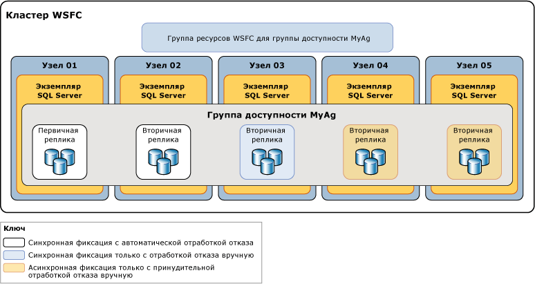

# Различия между режимами доступности для группы доступности Always On
[!INCLUDE[appliesto-ss-xxxx-xxxx-xxx-md](../../../includes/appliesto-ss-xxxx-xxxx-xxx-md.md)]

  В [!INCLUDE[ssHADR](../../../includes/sshadr-md.md)]*режим доступности* — это свойство реплики, которое определяет, способна ли данная реплика доступности работать в режиме синхронной фиксации. Для каждой реплики доступности режим доступности необходимо настроить на режим синхронной или асинхронной фиксации либо только на режим конфигурации.  Если первичная реплика настроена на *режим асинхронной фиксации*, она не ждет, что какая-либо вторичная реплика зафиксирует входящие записи журнала транзакций на диск (для *фиксации журнала*). Если данная вторичная реплика доступности настроена на режим асинхронной фиксации, первичная реплика не ждет, что эта вторичная реплика зафиксирует журнал. Если и первичная, и вторичная реплика настроены на использование *режима синхронной фиксации*, то первичная реплика ожидает от вторичной реплики подтверждения фиксации журнала (за исключением случая, если вторичная реплика окажется неспособной проверить связь с первичной репликой в течение *времени ожидания сеанса*первичной реплики). 
  

> [!NOTE]  
>  Если вторичная реплика превышает время ожидания сеанса первичной реплики, то последняя реплика временно переходит в режим асинхронной фиксации по отношению к этой вторичной реплике. Когда вторичная реплика восстанавливает соединение с первичной репликой, они снова начинают работать в режиме синхронной фиксации.  
  
##   Поддерживаемые режимы доступности  
 [!INCLUDE[ssHADR](../../../includes/sshadr-md.md)] поддерживает три режима доступности: режим асинхронной фиксации, режим синхронной фиксации, а также режим "только конфигурация".  
  
-   *Режим асинхронной фиксации* представляет собой решение аварийного восстановления, которое работает хорошо тогда, когда реплики доступности распределены на значительном расстоянии. Если каждая вторичная реплика доступности работает в режиме асинхронной фиксации, первичная реплика не ждет, пока какая-либо вторичная реплика зафиксирует журнал. Вместо этого сразу же после помещения записи журнала в локальный файл журнала первичная реплика отправляет клиенту подтверждение транзакции. Первичная реплика работает с минимальной задержкой транзакции в отношении вторичной реплики, настроенной для работы в режиме асинхронной фиксации.  Если текущая первичная реплика настроена на работу в режиме асинхронной фиксации, то она фиксирует транзакции асинхронно для всех вторичных реплик, независимо от режимов доступности, заданных в каждой из них.  
  
     Дополнительные сведения см. далее в подразделе [Режим доступности с асинхронной фиксацией](#AsyncCommitAvMode)далее в этом разделе.  
  
-   *Режим синхронной фиксации* отдает предпочтение высокому уровню доступности и защите данных перед производительностью ценой повышенной задержки транзакций. В режиме синхронной фиксации транзакции не отправляют клиенту подтверждение, пока вторичная реплика не зафиксирует журнал на диск. Когда в базе данных-получателе начинается синхронизация данных, вторичная реплика начинает применять записи журнала, поступающие от соответствующей базы данных-источника. Сразу после того, как все записи журнала зафиксированы на диск, база данных-получатель переходит в состояние SYNCHRONIZED. После этого каждая новая транзакция фиксируется вторичной репликой перед помещением записи журнала в локальный файл журнала. Когда все базы данных-получатели данной вторичной реплики синхронизированы, режим синхронной фиксации поддерживает переход на другой ресурс вручную, а также автоматический переход на другой ресурс.  
  
     Дополнительные сведения см. далее в подразделе [Режим доступности с синхронной фиксацией](#SyncCommitAvMode)далее в этом разделе.  

-   *Режим только конфигурации* применяется к группам доступности, которые не находятся на отказоустойчивом кластере Windows Server. Реплика в режиме только конфигурации не содержит данных пользователя. В этом режиме реплика базы данных master хранит метаданные конфигурации группы доступности. Дополнительные сведения см. в разделе [Группа доступности с репликой только для конфигурации](../../../linux/sql-server-linux-availability-group-ha.md).
  
 На следующем рисунке показана группа доступности с пятью репликами доступности. Первичная реплика и одна вторичная реплика настроены в режиме синхронной фиксации с автоматическим переходом на другой ресурс. Другая вторичная реплика настроена для синхронной фиксации только с запланированным переходом на другой ресурс вручную, а две вторичные реплики настроены в режиме асинхронной фиксации, который поддерживает только принудительный переход на другой ресурс вручную (обычно называется *принудительной отработкой отказа*).  
  
   
  
 Синхронизация и отработка отказа между двумя репликами доступности зависит от режима доступности обеих реплик. Например, для синхронной фиксации должны быть настроены обе рассматриваемые реплики: и текущая первичная, и вторичная. Аналогично обе реплики должны быть настроены для автоматического перехода на другой ресурс. Таким образом, сводку поведения для проиллюстрированного сценария развертывания можно показать в следующей таблице, которая анализирует поведение с каждой потенциальной первичной репликой.  
  
|Текущая первичная реплика|Целевые объекты автоматического перехода на другой ресурс|Режим синхронной фиксации с режимом|Режим асинхронной фиксации с режимом|Автоматическая отработка отказа возможна|  
|-----------------------------|--------------------------------|--------------------------------------------|---------------------------------------------|---------------------------------|  
|01|02|02 и 03|04|Да|  
|02|01|01 и 03|04|Да|  
|03||01 и 02|04|нет|  
|04|||01, 02 и 03|нет|  
  
 Как правило, узел 04 как реплика с асинхронной фиксацией развернут на сайте аварийного восстановления. Тот факт, что узлы 01, 02 и 03 остаются в режиме асинхронной фиксации после перехода на узел 04, помогает предотвратить потенциальное снижение производительности в группе доступности из-за большой задержки в сети между двумя сайтами.  
  
##   Asynchronous-Commit Availability Mode  
 В *режиме асинхронной фиксации*вторичная реплика никогда не бывает синхронизирована с первичной репликой. Хотя данная база данных-получатель может успевать за соответствующей базой данных-источником, любая другая база данных-получатель в любой момент может отставать. Режим асинхронной фиксации полезен для сценария аварийного восстановления, в котором первичная и вторичная реплики находятся на значительном расстоянии друг от друга, и когда необходимо, чтобы на работу первичной реплики не влияли небольшие ошибки. Также подобный режим полезен в тех ситуациях, когда производительность значительно важнее защиты данных, обеспечиваемой синхронной записью изменений. Более того, поскольку первичная реплика не ждет получения подтверждений от вторичной реплики, проблемы на вторичной реплике никогда не сказываются на работе первичной реплики.  
  
 Вторичная реплика асинхронной фиксации пытается соответствовать записям журнала, получаемых от первичной реплики. Однако базы данных-получатели асинхронной фиксации всегда остаются несинхронизированными и могут несколько отставать от соответствующих баз данных-источников. Как правило, разрыв между базой данных-получателем асинхронной фиксации и соответствующей базой данных-источником незначителен. Однако этот разрыв может стать существенным, если сервер, содержащий вторичную реплику, перегружен или у сети низкая пропускная способность.  
  
 В режиме асинхронной фиксации поддерживается только принудительная отработка отказа (с возможной потерей данных). Принудительная отработка отказа ― это крайняя мера, предназначенная только для таких ситуаций, когда текущая первичная реплика остается недоступной продолжительное время и немедленная доступность баз данных-источников более важна, чем риск возможной потери данных. Целевым объектом отработки отказа должна быть реплика с ролью в состоянии SECONDARY или RESOLVING. Цель отработки отказа принимает первичную роль, а ее копии баз данных станут при этом базами данных-источниками. Все остальные базы данных-получатели и бывшая база данных-источник (как только она вновь становится доступной) приостанавливаются. Затем потребуется ручное возобновление работы каждой из них. В режиме асинхронной фиксации все журналы транзакций, которые первоначальная первичная реплика не отправила вторичной реплике, будут потеряны. Это означает, что в некоторых или во всех новых базах данных-источниках могут отсутствовать транзакции, которые были зафиксированы недавно. Дополнительные сведения о том, как выполняется принудительная отработка отказа, и об оптимальных методах ее использования см. в статье [Отработка отказа и режимы отработки отказа (группы доступности AlwaysOn)](../../../database-engine/availability-groups/windows/failover-and-failover-modes-always-on-availability-groups.md).  
  
##   Synchronous-Commit Availability Mode  
 В режиме доступности с синхронной фиксацией (*режим синхронной фиксации*) после присоединения к группе доступности база данных-получатель синхронизируется с соответствующей базой данных-источником и переходит в состояние SYNCHRONIZED. База данных-получатель остается в состоянии SYNCHRONIZED, пока продолжается синхронизация данных. Это гарантирует, что все транзакции, зафиксированные в данной базе данных-источнике, также будут зафиксированы в соответствующей базе данных-получателе. Когда все базы данных-получатели данной вторичной реплики синхронизированы, вторичная реплика имеет общее состояние работоспособности синхронизации HEALTHY.  
  
 **В этом разделе.**  
  
-   [Факторы, нарушающие синхронизацию данных](#DisruptSync)  
  
-   [Как синхронизация работает на вторичной реплике](#HowSyncWorks)  
  
-   [Режим синхронной фиксации только с переходом на другой ресурс вручную](#SyncCommitWithManual)  
  
-   [Режим синхронной фиксации с автоматическим переходом на другой ресурс](#SyncCommitWithAuto)  
  
###   Факторы, нарушающие синхронизацию данных  
 После синхронизации всех баз данных вторичная реплика переходит в состояние HEALTHY. Синхронизированная вторичная реплика остается в исправном состоянии, если не происходят никакие из следующих событий.  
  
-   Задержка или сбой сети или компьютера вызывает истечение времени ожидания сеанса между вторичной и первичной репликами.  
  
    > [!NOTE]  
    >  Сведения о свойстве ожидания сеанса для реплик доступности см. в статье [Обзор групп доступности AlwaysOn (SQL Server)](../../../database-engine/availability-groups/windows/overview-of-always-on-availability-groups-sql-server.md).  
  
-   Пользователь приостанавливает базу данных-получатель на вторичной реплике. Вторичная реплика теряет синхронизацию и переходит в состояние работоспособности синхронизации NOT_HEALTHY. Вторичная реплика не становится вновь исправной, пока работа приостановленной базы данных-получателя не будет возобновлена и синхронизирована повторно либо удалена из группы доступности.  
  
-   В группу доступности добавляется база данных-источник. Ранее синхронизированные вторичные реплики переходят в состояние работоспособности синхронизации NOT_HEALTHY. Это состояние показывает, что по крайней мере одна база данных находится в состоянии синхронизации NOT SYNCHRONIZING. Данная вторичная реплика может вернуться в состояние HEALTHY только после того, как соответствующая база данных-получатель будет подготовлена в реплике, присоединена к группе доступности и синхронизирована с новой базой данных-источником.  
  
-   Пользователь устанавливает для первичной или вторичной реплики режим доступности с асинхронной фиксацией. После перехода в режим асинхронной фиксации вторичная реплика будет оставаться в состоянии работоспособности синхронизации HEALTHY, пока продолжается синхронизация данных. Однако если только первичная реплика переходит в режим асинхронной фиксации, то вторичная реплика синхронной фиксации переходит в состояние работоспособности синхронизации PARTIALLY_HEALTHY. Это состояние показывает, что по крайней мере одна база данных находится в состоянии синхронизации SYNCHRONIZING, но ни одна из баз данных не находится в состоянии NOT SYNCHRONIZING.  
  
-   Режим доступности какой-либо вторичной реплики изменяется на режим с синхронной фиксацией. В результате вторичная реплика помечается состоянием работоспособности синхронизации PARTIALLY_HEALTHY до тех пор, пока все ее базы данных не перейдут в состояние синхронизации SYNCHRONIZED.  
  
> [!TIP]  
>  Для просмотра работоспособности синхронизации группы доступности, реплики доступности или базы данных доступности выполните запрос столбца **synchronization_health** или **synchronization_health_desc** из [sys.dm_hadr_availability_group_states](../../../relational-databases/system-dynamic-management-views/sys-dm-hadr-availability-group-states-transact-sql.md), [sys.dm_hadr_availability_replica_states](../../../relational-databases/system-dynamic-management-views/sys-dm-hadr-availability-replica-states-transact-sql.md)или [sys.dm_hadr_database_replica_states](../../../relational-databases/system-dynamic-management-views/sys-dm-hadr-database-replica-states-transact-sql.md)соответственно.  
  
###   Как синхронизация работает на вторичной реплике  
 В режиме с синхронной фиксацией, после того как вторичная реплика присоединяется к группе доступности и устанавливает сеанс с первичной репликой, вторичная реплика сохраняет поступающие записи журнала на диск (*фиксирует журнал на диск*) и отправляет сообщение с подтверждением первичной реплике. После того как фиксированный журнал в базе данных-получателе достигает конца журнала в базе данных-источнике, база данных-получатель переходит в состояние SYNCHRONIZED. Время, необходимое для выполнения синхронизации, зависит главным образом от того, насколько база данных-получатель отстала от базы данных-источника в начале сеанса (отставание измеряется числом записей журнала, первоначально полученных от первичной реплики), от рабочей нагрузки на базу данных-источник и от быстродействия компьютера, на котором находится экземпляр сервера, где размещена вторичная реплика.  
  
 Синхронность операции достигается следующим образом.  
  
1.  Получив транзакцию от клиента, первичная реплика помещает запись в журнал транзакции и одновременно отправляет запись журнала во вторичные реплики.  
  
2.  После помещения записи в журнал транзакций базы данных-источника транзакцию можно отменить, только если в этот момент происходит переход на базу данных-получатель, которая не получила журнал. Первичная реплика ожидает подтверждения от вторичной реплики синхронной фиксации.  
  
3.  Вторичная реплика фиксирует журнал на диск и возвращает подтверждение первичной реплике.  
  
4.  Получив подтверждение от вторичной реплики, первичная реплика завершает обработку фиксации и отправляет клиенту сообщение с подтверждением.  
  
    > [!NOTE]  
    >  Если во вторичной реплике, работающей в режиме синхронной фиксации, истекает время ожидания без подтверждения фиксации журнала, то первичная реплика помечает вторичную как сбойную. Состояние подключения вторичной реплики меняется на DISCONNECTED, и первичная реплика прекращает ожидание подтверждения от вторичной реплики. Это позволяет избежать ситуации, в которой сбойная вторичная реплика синхронной фиксации препятствует фиксации журнала транзакций в первичной реплике.  
  
 Режим с синхронной фиксацией защищает данные за счет того, что требует их синхронизации между двумя экземплярами. Делается это за счет некоторого увеличения задержки транзакции.  
  
###  Режим синхронной фиксации только с переходом на другой ресурс вручную  
 Если между этими репликами имеется подключение и база данных синхронизирована, то поддерживается переход на другой ресурс вручную. Если работа вторичной реплики нарушается, то это никак не сказывается на первичной реплике. Первичная реплика не защищена, если ни одна реплика не находится в состоянии SYNCHRONIZED (то есть когда она не отправляет данные ни одной вторичной реплике). Если работа первичной реплики нарушается, вторичные реплики переходят в состояние RESOLVING, но владелец базы данных может принудительно выполнить отработку отказа на вторую реплику (с возможной потерей данных). Дополнительные сведения см. далее в подразделе [Отработка отказа и режимы отработки отказа (группы доступности AlwaysOn)](../../../database-engine/availability-groups/windows/failover-and-failover-modes-always-on-availability-groups.md).  
  
###   Режим синхронной фиксации с автоматическим переходом на другой ресурс  
 Автоматический переход на другой ресурс обеспечивает высокий уровень доступности за счет того, что доступ к базам данных быстро восстанавливается после потери первичной реплики. Чтобы настроить группу доступности для автоматического перехода на другой ресурс, нужно задать для текущей первичной реплики и хотя бы одной вторичной реплики режим синхронной фиксации с автоматическим переходом на другой ресурс. Можно иметь до трех реплик автоматического перехода на другой ресурс.  
  
 Кроме того, для автоматического перехода на другой ресурс в заданный момент вторичная реплика должна быть синхронизирована с первичной репликой (это значит, что все базы данных-получатели синхронизированы), а кластер WSFC должен иметь кворум. Если первичная реплика становится недоступной при описанных выше условиях, происходит автоматический переход на другой ресурс. Вторичная реплика переключается в роль первичной и предлагает свои базы данных как базы данных-источники. Дополнительные сведения об автоматической отработке отказа см. в статье [Отработка отказа и режимы отработки отказа (группы доступности AlwaysOn)](../../../database-engine/availability-groups/windows/failover-and-failover-modes-always-on-availability-groups.md).  
  
> [!NOTE]  
>  Дополнительные сведения о кворуме WSFC и [!INCLUDE[ssHADR](../../../includes/sshadr-md.md)] см. в статье [Режимы кворума и конфигурация голосования WSFC (SQL Server)](../../../sql-server/failover-clusters/windows/wsfc-quorum-modes-and-voting-configuration-sql-server.md).  

### Задержка данных на вторичной реплике
Применение доступа только для чтения ко вторичным репликам полезно, если для нагрузок, связанных с операциями с ними, приемлема некоторая задержка данных. В ситуациях, когда задержка данных неприемлема, рассмотрите возможность выполнения рабочих нагрузок только чтения за счет первичной реплики.

Из основной реплики выполняется отправка журнала изменений в базе данных-источнике на вторичные реплики. На каждой базе данных-получателе выделенный поток повтора применяет записи журнала. В базе данных, доступной для чтения, изменение данных не появляется среди результатов запроса до тех пор, пока запись журнала о данном изменении не будет применена к базе данных-получателю, а транзакция не будет зафиксирована в базе данных-источнике.+

Это означает, что между первичной и вторичной репликами возникает некоторая задержка, обычно порядка нескольких секунд. В нетипичных случаях, например в ситуации, когда проблемы с сетью ухудшают пропускную способность, задержка может стать значительной. Задержка увеличивается из-за наличия узких мест в системе ввода-вывода и в результате приостановки движения данных. Для отслеживания приостановок перемещения данных можно использовать [Панель управления AlwaysOn](../../../database-engine/availability-groups/windows/use-the-always-on-dashboard-sql-server-management-studio.md) или динамическое административное представление [sys.dm_hadr_database_replica_states](../../../relational-databases/system-dynamic-management-views/sys-dm-hadr-database-replica-states-transact-sql.md).

Дополнительные сведения об изучении задержки повтора на вторичной реплике см. в разделе [Устранение неполадок при отсутствии повтора изменений в источнике на вторичной реплике](../../../database-engine/availability-groups/windows/troubleshoot-primary-changes-not-reflected-on-secondary.md).
  
##   Связанные задачи  
 **Изменение режима доступности и режима отработки отказа**  
  
-   [Смена режима доступности для реплики доступности (SQL Server)](../../../database-engine/availability-groups/windows/change-the-availability-mode-of-an-availability-replica-sql-server.md)  
  
-   [Смена режима отработки отказа для реплики доступности (SQL Server)](../../../database-engine/availability-groups/windows/change-the-failover-mode-of-an-availability-replica-sql-server.md)  
  
 **Настройка голосов кворума**  
  
-   [Просмотр параметров NodeWeight кворума кластера](../../../sql-server/failover-clusters/windows/view-cluster-quorum-nodeweight-settings.md)  
  
-   [Настройка параметров NodeWeight для кворума кластера](../../../sql-server/failover-clusters/windows/configure-cluster-quorum-nodeweight-settings.md)  
  
-   [Принудительный запуск кластера WSFC без кворума](../../../sql-server/failover-clusters/windows/force-a-wsfc-cluster-to-start-without-a-quorum.md)  
  
 **Отработки отказа вручную**  
  
-   [Выполнение запланированного перехода на другой ресурс вручную для группы доступности (SQL Server)](../../../database-engine/availability-groups/windows/perform-a-planned-manual-failover-of-an-availability-group-sql-server.md)  
  
-   [Выполнение принудительного перехода на другой ресурс вручную для группы доступности (SQL Server)](../../../database-engine/availability-groups/windows/perform-a-forced-manual-failover-of-an-availability-group-sql-server.md)  
  
-   [Использование мастера отработки отказа группы доступности (среда SQL Server Management Studio)](../../../database-engine/availability-groups/windows/use-the-fail-over-availability-group-wizard-sql-server-management-studio.md)  
  
 **Просмотр состояний групп доступности, реплик доступности и баз данных**  
  
-   [sys.dm_hadr_availability_group_states (Transact-SQL)](../../../relational-databases/system-dynamic-management-views/sys-dm-hadr-availability-group-states-transact-sql.md)  
  
-   [sys.dm_hadr_availability_replica_states (Transact-SQL)](../../../relational-databases/system-dynamic-management-views/sys-dm-hadr-availability-replica-states-transact-sql.md)  
  
-   [sys.dm_hadr_database_replica_states (Transact-SQL)](../../../relational-databases/system-dynamic-management-views/sys-dm-hadr-database-replica-states-transact-sql.md)  
  
##   См. также  
  
-   [Руководство по решениям режима AlwaysOn в Microsoft SQL Server для обеспечения высокой доступности и аварийного восстановления](https://go.microsoft.com/fwlink/?LinkId=227600)  
  
-   [Блоги команды разработчиков SQL Server AlwaysOn: официальный блог по SQL Server AlwaysOn](https://blogs.msdn.microsoft.com/sqlalwayson/)  
  
## См. также:  
 [Обзор групп доступности AlwaysOn (SQL Server)](../../../database-engine/availability-groups/windows/overview-of-always-on-availability-groups-sql-server.md)   
 [Отработка отказа и режимы отработки отказа (группы доступности AlwaysOn)](../../../database-engine/availability-groups/windows/failover-and-failover-modes-always-on-availability-groups.md)   
 [Отказоустойчивая кластеризация Windows Server (WSFC) с SQL Server](../../../sql-server/failover-clusters/windows/windows-server-failover-clustering-wsfc-with-sql-server.md)  
  
  
