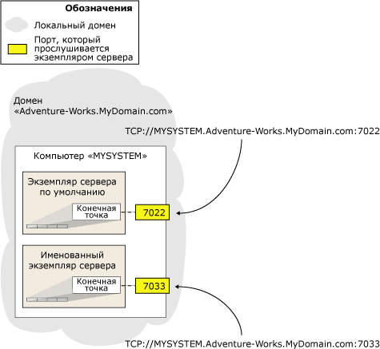

# <a name="specify-endpoint-url---adding-or-modifying-availability-replica"></a>Выбор URL-адреса конечной точки при добавлении или изменении реплики доступности
  Для размещения реплики доступности для группы доступности экземпляр сервера должен иметь конечную точку зеркального отображения базы данных. Экземпляр сервера использует эту конечную точку для прослушивания сообщений [!INCLUDE[ssHADR](../../../includes/sshadr-md.md)] , получаемых от реплик доступности, размещенных на других экземплярах сервера. Чтобы определить реплику доступности для группы доступности, необходимо задать URL-адрес конечной точки экземпляра сервера, на котором размещена реплика. *URL-адрес конечной точки* определяет транспортный протокол конечной точки зеркального отображения базы данных — TCP, системный адрес экземпляра сервера и номер порта, связанный с конечной точкой.  
  
> [!NOTE]  
>  Термин «URL-адрес конечной точки» является синонимом термина «сетевой адрес сервера», используемого в интерфейсе и документации по зеркальному отображению баз данных.  
  
-   [Синтаксис для URL-адреса конечной точки](#SyntaxOfURL)  
  
-   [Определение полного доменного имени системы](#Finding_FQDN)  
  
-   [Связанные задачи](#RelatedTasks)  
  
-   [См. также](#RelatedContent)  
  
##  <a name="SyntaxOfURL"></a> Синтаксис для URL-адреса конечной точки  
 Синтаксис URL-адреса конечной точки имеет следующую форму:  
  
 TCP**://***\<системный_адрес>***:***\<порт>*  
  
 где  
  
-   *\<адрес_системы>* — строка, однозначно определяющая целевой компьютер. Обычно сетевой адрес представляет собой системное имя (если компьютеры входят в один домен), полное доменное имя или IP-адрес.  
  
    -   Поскольку узлы отказоустойчивой кластеризации Windows Server (WSFC) входят в один домен, можно использовать имя компьютера, например `SYSTEM46`.  
  
    -   Если указывается IP-адрес, то он должен быть уникальным в используемой среде. Рекомендуется использовать IP-адрес только в том случае, если он является статическим. IP-адреса бывают версии 4 (IPv4) или 6 (IPv6). Адреса IPv6 следует заключать в квадратные скобки, например: **[***<адрес_IPv6>***]**.  
  
         Чтобы определить IP-адрес системы, в командной строке Windows введите команду **ipconfig** .  
  
    -   При указании полного доменного имени гарантируется правильная работа. Это локально определенная строка адреса, которая имеет различную форму в разных местах. Часто, но не всегда полное доменное имя представляет собой составное имя, состоящее из имени компьютера и нескольких компонентов доменов, разделенных точками, в следующем виде:  
  
         *имя_компьютера* **.** *компонент_домена*[...**.***компонент_домена*]  
  
         где *имя_компьютера*— сетевое имя компьютера, на котором запущен экземпляр сервера, а *сегмент_домена*[...**.***сегмент_домена*] — остальные сведения о домене для сервера, например `localinfo.corp.Adventure-Works.com`.  
  
         Содержание и количество доменных сегментов определяется компанией или организацией. Дополнительные сведения см. в подразделе [Определение полного доменного имени](#Finding_FQDN)далее в этом разделе.  
  
-   *\<порт>* — порт, используемый конечной точкой зеркального отображения экземпляра сервера-участника.  
  
     Конечная точка зеркального отображения базы данных может использовать любой доступный порт. Номер каждого порта должен быть связан только с одной конечной точкой, а каждая конечная точка должна быть связана только с одним экземпляром сервера; таким образом, разные экземпляры сервера на одном и том же сервере прослушивают различные конечные точки через различные порты. Поэтому порт, указанный в URL-адресе конечной точки при задании реплики доступности, будет всегда направлять входящие сообщения к экземпляру сервера, конечная точка которого связана с этим портом.  
  
     В URL-адресе конечной точки только номер порта определяет экземпляр сервера, связанный с конечной точкой зеркального отображения на целевом компьютере. На следующем рисунке показаны URL-адреса конечных точек двух экземпляров серверов, размещенных на одном компьютере. Экземпляр по умолчанию использует порт `7022` , именованный экземпляр — порт `7033`. URL-адрес конечной точки для этих двух экземпляров сервера будет соответственно иметь значение `TCP://MYSYSTEM.Adventure-works.MyDomain.com:7022` и `TCP://MYSYSTEM.Adventure-works.MyDomain.com:7033`. Обратите внимание, что имя экземпляра сервера в адресе не указывается.  
  
       
  
     Чтобы определить, какой порт в текущий момент связан с конечной точкой зеркального отображения базы данных экземпляра сервера, воспользуйтесь следующей инструкцией [!INCLUDE[tsql](../../../includes/tsql-md.md)] :  
  
    ```  
    SELECT type_desc, port FROM sys.TCP_endpoints  
    ```  
  
     Найдите строку параметра **type_desc** , имеющую значение "DATABASE_MIRRORING", и используйте соответствующий номер порта.  
  
### <a name="examples"></a>Примеры  
  
#### <a name="a-using-a-system-name"></a>A. Использование имени системы  
 В следующем URL-адресе конечной точки определено системное имя `SYSTEM46`и порт `7022`.  
  
 `TCP://SYSTEM46:7022`  
  
#### <a name="b-using-a-fully-qualified-domain-name"></a>Б. Использование полного доменного имени  
 В следующем URL-адресе конечной точки определено полное доменное имя `DBSERVER8.manufacturing.Adventure-Works.com`и порт `7024`.  
  
 `TCP://DBSERVER8.manufacturing.Adventure-Works.com:7024`  
  
#### <a name="c-using-ipv4"></a>В. Использование IPv4  
 В следующем URL-адресе конечной точки определены адрес IPv4 `10.193.9.134`и порт `7023`.  
  
 `TCP://10.193.9.134:7023`  
  
#### <a name="d-using-ipv6"></a>Г. Использование IPv6  
 В следующем URL-адресе конечной точки определен адрес IPv6 `2001:4898:23:1002:20f:1fff:feff:b3a3`и порт `7022`.  
  
 `TCP://[2001:4898:23:1002:20f:1fff:feff:b3a3]:7022`  
  
##  <a name="Finding_FQDN"></a> Определение полного доменного имени системы  
 Чтобы определить полное доменное имя системы, введите следующую команду в командной строке Windows:  
  
 **IPCONFIG /ALL**  
  
 Чтобы сформировать полное доменное имя, следует сцепить значения *<имя_узла>* и *<основной_DNS_суффикс>* следующим образом:  
  
 *<имя_узла>* **.** *<основной_DNS_суффикс>*  
  
 Например, следующая конфигурация IP:  
  
 `Host Name  .  .  .  .  .  .  : MYSERVER`  
  
 `Primary Dns Suffix  .  .  .  : mydomain.Adventure-Works.com`  
  
 соответствует следующему полному доменному имени:  
  
 `MYSERVER.mydomain.Adventure-Works.com`  
  
> [!NOTE]  
>  Более подробные сведения о полном доменном имени можно получить у системного администратора.  
  
##  <a name="RelatedTasks"></a> Связанные задачи  
 **Настройка конечной точки зеркального отображения базы данных**  
  
-   [Создание конечной точки зеркального отображения базы данных для групп доступности AlwaysOn (SQL Server PowerShell)](../../../database-engine/availability-groups/windows/database-mirroring-always-on-availability-groups-powershell.md)  
  
-   [Создание конечной точки зеркального отображения базы данных с проверкой подлинности Windows (Transact-SQL)](../../../database-engine/database-mirroring/create-a-database-mirroring-endpoint-for-windows-authentication-transact-sql.md)  
  
-   [Использование сертификатов для конечной точки зеркального отображения базы данных (Transact-SQL)](../../../database-engine/database-mirroring/use-certificates-for-a-database-mirroring-endpoint-transact-sql.md)  
  
    -   [Включение использования сертификатов для исходящих соединений в конечной точке зеркального отображения базы данных (Transact-SQL)](../../../database-engine/database-mirroring/database-mirroring-use-certificates-for-outbound-connections.md)  
  
    -   [Включение использования сертификатов для входящих соединений в конечной точке зеркального отображения базы данных (Transact-SQL)](../../../database-engine/database-mirroring/database-mirroring-use-certificates-for-inbound-connections.md)  
  
-   [Указание сетевого адреса сервера (зеркальное отображение базы данных)](../../../database-engine/database-mirroring/specify-a-server-network-address-database-mirroring.md)  
  
-   Укажите URL-адрес конечной точки при добавлении или изменении реплики доступности (SQL Server)  
  
-   [Поиск и устранение неисправностей конфигурации групп доступности AlwaysOn (SQL Server)](../../../database-engine/availability-groups/windows/troubleshoot-always-on-availability-groups-configuration-sql-server.md)  
  
 **Просмотр сведений о конечной точке зеркального отображения базы данных**  
  
-   [sys.database_mirroring_endpoints (Transact-SQL)](../../../relational-databases/system-catalog-views/sys-database-mirroring-endpoints-transact-sql.md)  
  
 **Добавление реплики доступности**  
  
-   [Добавление вторичной реплики к группе доступности (SQL Server)](../../../database-engine/availability-groups/windows/add-a-secondary-replica-to-an-availability-group-sql-server.md)  
  
-   [Присоединение вторичной реплики к группе доступности (SQL Server)](../../../database-engine/availability-groups/windows/join-a-secondary-replica-to-an-availability-group-sql-server.md)  
  
##  <a name="RelatedContent"></a> См. также  
  
-   [Руководство по решениям режима AlwaysOn в Microsoft SQL Server для обеспечения высокой доступности и аварийного восстановления](http://go.microsoft.com/fwlink/?LinkId=227600)  
  
## <a name="see-also"></a>См. также:  
 [Создание и настройка групп доступности (SQL Server)](../../../database-engine/availability-groups/windows/creation-and-configuration-of-availability-groups-sql-server.md)   
 [Обзор групп доступности AlwaysOn (SQL Server)](../../../database-engine/availability-groups/windows/overview-of-always-on-availability-groups-sql-server.md)   
 [CREATE ENDPOINT (Transact-SQL)](../../../t-sql/statements/create-endpoint-transact-sql.md)  
  
  

