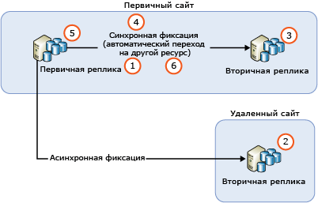
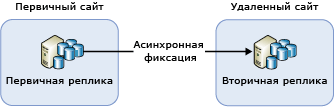
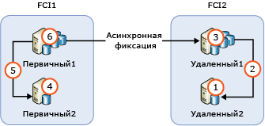

# Обновление экземпляров реплики группы доступности AlwaysOn
[!INCLUDE[appliesto-ss-xxxx-xxxx-xxx-md](../../../includes/appliesto-ss-xxxx-xxxx-xxx-md.md)]

  При обновлении группы доступности AlwaysOn [!INCLUDE[ssNoVersion](../../../includes/ssnoversion-md.md)] (при установке новой версии [!INCLUDE[ssCurrent](../../../includes/sscurrent-md.md)] , нового пакета обновления [!INCLUDE[ssNoVersion](../../../includes/ssnoversion-md.md)]или накопительного пакета обновления, а также при установке нового пакета обновления Windows или накопительного пакета обновления Windows) вы можете выполнить последовательное обновление. Это позволит сократить время простоя первичной реплики до одной операции перехода на другой ресурс вручную (или двух таких операций, если нужно перейти на исходную первичную реплику). При обновлении вторичная реплика будет недоступна для отработки отказа или операций только для чтения. После обновления для синхронизации между вторичной репликой и узлом первичной реплики может потребоваться некоторое время; кроме того, может отмечаться значительное увеличение сетевого трафика (в зависимости от объема действий на узле первичной реплики).  
  
> [!NOTE]  
>  В этой статье мы ограничимся обсуждением обновления только SQL Server. Мы не будем касаться обновлений операционной системы с отказоустойчивым кластером Windows Server (WSFC). Обновление операционной системы Windows, на которой размещен отказоустойчивый кластер, не поддерживается для операционных систем ниже Windows Server 2012 R2. Обновление узла кластера под управлением Windows Server 2012 R2 описано в статье [Последовательное обновление операционной системы в кластере](https://technet.microsoft.com/library/dn850430.aspx).  
  
## предварительные требования  
 Перед установкой ознакомьтесь со следующими важными сведениями.  
  
-   [Supported Version and Edition Upgrades](../../../database-engine/install-windows/supported-version-and-edition-upgrades.md). Убедитесь, что текущая версия операционной системы Windows позволяет обновить текущую версию SQL Server до версии SQL Server 2016. Например, вы не можете напрямую обновить экземпляр SQL Server 2005 до [!INCLUDE[ssCurrent](../../../includes/sscurrent-md.md)].  
  
-   [Choose a Database Engine Upgrade Method](../../../database-engine/install-windows/choose-a-database-engine-upgrade-method.md). Выберите подходящий метод обновления с учетом сведений о поддерживаемых версиях и обновлениях выпуска, а также компонентах, установленных в среде и требующих обновления (это нужно, чтобы обеспечить правильный порядок обновления этих компонентов).  
  
-   [Составление и тестирование плана обновления Database Engine](../../../database-engine/install-windows/plan-and-test-the-database-engine-upgrade-plan.md). Просмотрите заметки о выпуске и известные проблемы, связанные с обновлением, изучите контрольный список предварительных требований, а затем разработайте и протестируйте план обновления.  
  
-   [Требования к оборудованию и программному обеспечению для установки SQL Server 2016](../../../sql-server/install/hardware-and-software-requirements-for-installing-sql-server.md). Ознакомьтесь с требованиями к оборудованию и ПО для установки [!INCLUDE[ssCurrent](../../../includes/sscurrent-md.md)]. Если требуется дополнительное программное обеспечение, установите его на каждом узле перед запуском обновления, чтобы минимизировать время простоя.  

> [!NOTE]  
>  Использование различных версий SQL Server в одной и той же группе доступности не поддерживается вне последовательного обновления, при котором обновляются реплики на месте. Это означает, что вы не можете добавить в существующую группу доступности новую реплику с более поздней версией SQL Server. Например, реплика с SQL Server 2017 не добавляется в имеющуюся группу доступности SQL Server 2016. Единственный поддерживаемый способ перехода на новую версию SQL Server с группами доступности — использовать распределенную группу доступности с SQL Server 2016 Enterprise Edition или более поздней версией.

## Рекомендации по последовательному обновлению групп доступности AlwaysOn  
 Следует руководствоваться следующими рекомендациями при модернизации или обновлении сервера, чтобы минимизировать время простоя и потерю данных для групп доступности.  
  
-   Перед запуском последовательного обновления сделайте вот что.  
  
    -   Выполните тестовый переход на другой ресурс вручную по крайней мере для одного из экземпляров реплик синхронной фиксации.  
  
    -   Защитите данные, выполнив полное резервное копирование базы данных на каждой базе данных доступности.  
  
    -   Выполните команду DBCC CHECKDB на каждой базе данных доступности.  
  
-   Всегда сначала обновляйте удаленные экземпляры вторичных реплик, затем локальные экземпляры вторичных реплик, и только в последнюю очередь — экземпляр первичной реплики.  
  
-   Резервное копирование базы данных, которая находится в процессе обновления, не может быть выполнено.  Перед обновлением вторичных реплик настройте автоматическое резервное копирование так, чтобы оно создавало резервные копии только первичной реплики.  При обновлении до новой версии реплики будут недоступными для чтения или резервного копирования. При обновлении в рамках одной версии перед запуском обновления первичной реплики можно настроить автоматическое резервное копирование на вторичных репликах.  
  
-   При обновлении до новой версии доступные для чтения вторичные реплики будут недоступными после запуска обновления каждой из вторичных реплик — вплоть до перехода на обновленную вторичную реплику или завершения обновления первичной реплики.  
  
-   Чтобы предотвратить для групп доступности непреднамеренный переход на другой ресурс при обновлении, перед началом операции удалите на всех репликах с синхронной фиксацией конфигурацию перехода на другой ресурс для групп доступности.  
  
-   Не обновляйте экземпляр первичной реплики, пока для группы доступности не будет выполнен переход на обновленный ресурс (вторичную реплику). В противном случае время простоя клиентских приложений, запущенных на обновляемом экземпляре первичной реплики, может увеличиться.  
  
-   Обязательно выполняйте для группы доступности переход на другой ресурс (экземпляр вторичной реплики с синхронной фиксацией). Использование режима асинхронной фиксации приведет к потере данных в базах данных и автоматической приостановке перемещения данных (возобновление выполняется вручную).  
  
-   Не обновляйте экземпляр первичной реплики, пока не будет завершено обновление всех экземпляров вторичной реплики. Обновленная первичная реплика не сможет передавать журналы вторичным репликам, экземпляр [!INCLUDE[ssCurrent](../../../includes/sscurrent-md.md)] которых еще не был обновлен до соответствующей версии. Если перемещение данных к вторичной реплике приостанавливается, то для этой реплики не может осуществляться автоматический переход на другой ресурс, а базы данных доступности становятся подверженными потере данных.  
  
-   Перед возобновлением работы группы доступности проверьте, чтобы состоянием синхронизации для цели перехода на другой ресурс было SYNCHRONIZED.  
  
## Процесс последовательного обновления  
 На практике способ организации процесса зависит от многих факторов, в том числе топологии развертывания групп доступности и режима фиксации каждой реплики. Но даже в рамках простейшего сценария последовательное обновление — это процесс с несколькими этапами:  
  
   
  
1.  Удаление конфигурации автоматического перехода на другой ресурс на всех репликах с синхронной фиксацией  
  
2.  Обновление всех удаленных экземпляров вторичной реплики с запущенными вторичными репликами с асинхронной фиксацией.  
  
3.  Обновление всех локальных экземпляров вторичной реплики без запущенной первичной реплики.  
  
4.  Выполнение для группы доступности перехода на другой ресурс (локальную вторичную реплику с синхронной фиксацией) вручную.  
  
5.  Обновление локального экземпляра реплики, на котором прежде размещалась первичная реплика.  
  
6.  Настройка участников автоматического перехода на другой ресурс желаемым образом  
  
 В случае необходимости можно выполнить дополнительный переход на другой ресурс вручную, чтобы возвратить группу доступности к ее исходной конфигурации.  
  
## Группа доступности с одной удаленной вторичной репликой  
 Если группа доступности развернута только для аварийного восстановления, то может потребоваться возобновить работу группы доступности для вторичной реплики с асинхронной фиксацией. Такая конфигурация показана на следующем рисунке.  
  
   
  
 В этом сценарии при последовательном обновлении следует выполнить для группы доступности переход на другой ресурс (вторичную реплику с асинхронной фиксацией). Чтобы предотвратить потерю данных, измените режим фиксации на синхронную фиксацию и ожидайте, пока вторичная реплика не будет синхронизирована, прежде чем возобновить работу группы доступности. Следовательно, процесс последовательного обновления может выглядеть так:  
  
1.  Обновление экземпляра вторичной реплики на удаленном сайте.  
  
2.  Изменение режима фиксации на синхронную фиксацию  
  
3.  Ожидание достижения состояния синхронизации SYNCHRONIZED  
  
4.  Выполнение для группы доступности перехода на другой ресурс (удаленную реплику на вторичном сайте).  
  
5.  Обновление локального (на первичном сайте) экземпляра реплики.  
  
6.  Выполнение для группы доступности обратного перехода на другой ресурс (первичный сайт).  
  
7.  Изменение режима фиксации на асинхронную фиксацию  
  
 Режим синхронной фиксации не представляет собой рекомендуемую настройку для синхронизации данных на удаленном узле, поэтому в клиентских приложениях может обнаруживаться непосредственное увеличение задержки базы данных после изменения этого параметра. Кроме того, выполнение перехода на другой ресурс приведет к тому, что все неподтвержденные сообщения журнала будут отброшены. Количество отброшенных сообщений журнала может быть весьма большим из-за высокой задержки сети между этими двумя сайтами, а это приведет к тому, что клиенты столкнутся с увеличением количества сбоев транзакций. Можно свести к минимуму отрицательное воздействие на клиентские приложения, выполнив следующее.  
  
-   Тщательный выбор перерыва на профилактическое техобслуживание в период снижения клиентского трафика  
  
-   При обновлении [!INCLUDE[ssCurrent](../../../includes/sscurrent-md.md)] на первичном сайте снова включите режим асинхронной фиксации. Когда вы будете готовы снова выполнить переход на другой ресурс (первичный сайт), вернитесь к синхронной фиксации.  
  
## Группа доступности с узлами экземпляра отказоустойчивого кластера  
 Если группа доступности содержит узлы экземпляра отказоустойчивого кластера (FCI), сначала нужно обновлять неактивные узлы, а затем — активные. На приведенном ниже рисунке показан обычный сценарий для групп доступности с использованием экземпляров FCI для достижения локального высокого уровня доступности и асинхронной фиксации между экземплярами FCIs для удаленного аварийного восстановления, а также последовательность обновления.  
  
   
  
1.  Обновление REMOTE2.  
  
2.  Возобновление работы FCI2 на REMOTE2  
  
3.  Обновление REMOTE1.  
  
4.  Обновление PRIMARY2.  
  
5.  Возобновление работы FCI1 на PRIMARY2  
  
6.  Обновление PRIMARY1.  
  
## Обновление экземпляров SQL Server с несколькими группами доступности  
 Если вы используете несколько групп доступности с первичными репликами на разных узлах (режим "активный — активный"), процесс обновления будет включать больше циклов перехода на другие ресурсы. Это позволит сохранить высокий уровень доступности на протяжении всей операции. Предположим, что эксплуатируются три группы доступности на трех узлах сервера, как показано в следующей таблице, а все вторичные реплики работают в режиме синхронной фиксации.  
  
|Группа доступности|Узел1|Узел2|Node3|  
|------------------------|-----------|-----------|-----------|  
|ГД1|Первичная|||  
|ГД2||Первичная||  
|ГД3|||Первичная|  
  
 Иногда уместно будет выполнить последовательное обновление с балансировкой нагрузки. Операция будет включать следующие шаги:  
  
1.  Возобновление работы ГД2 на Узле3 (для освобождения Узла2)  
  
2.  Обновление Node2.  
  
3.  Возобновление работы ГД1 на Узле2 (для освобождения Узла1)  
  
4.  Обновление Node1.  
  
5.  Возобновление работы обеих групп доступности, ГД2 и ГД3, на Узле1 (для освобождения Узла3)  
  
6.  Обновление Node3.  
  
7.  Возобновление работы ГД3 на Узле3  
  
 Такая последовательность обновления обеспечит более короткое среднее время простоя, чем при двух переходах на другой ресурс для каждой группы доступности. Результирующая конфигурация показана в приведенной ниже таблице.  
  
|Группа доступности|Узел1|Узел2|Node3|  
|------------------------|-----------|-----------|-----------|  
|ГД1||Первичная||  
|ГД2|Первичная|||  
|ГД3|||Первичная|  
  
 Фактический процесс обновления (как и время простоя клиентских приложений) может отличаться в зависимости от особенностей реализации вашей системы.  
  
> [!NOTE]  
>  Во многих случаях после завершения последовательного обновления будет выполнен переход на другой ресурс (исходную первичную реплику).  
  
## См. также:  
 [Обновление до SQL Server 2016 с помощью мастера установки (программа установки)](../../../database-engine/install-windows/upgrade-sql-server-using-the-installation-wizard-setup.md)   
 [Установка SQL Server 2016 из командной строки](../../../database-engine/install-windows/install-sql-server-2016-from-the-command-prompt.md)  
  
  
