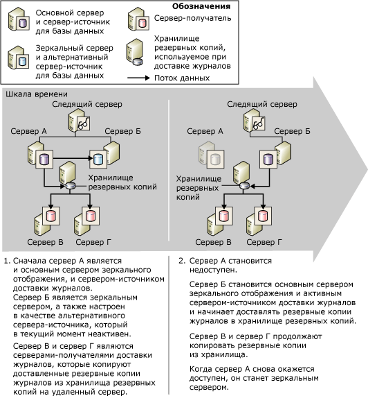

# Зеркальное отображение баз данных и доставка журналов (SQL Server)
[!INCLUDE[appliesto-ss-xxxx-xxxx-xxx-md](../../includes/appliesto-ss-xxxx-xxxx-xxx-md.md)]
  Для каждой базы данных может быть создано зеркальное отображение и доставка журналов; они также могут существовать одновременно. При выборе подхода примите во внимание следующее.  
  
-   Сколько требуется целевых серверов?  
  
     Если требуется только одна целевая база данных, рекомендуется использовать зеркальное отображение базы данных.  
  
     Если требуется несколько целевых баз данных, нужно использовать доставку журналов вместе с зеркальным отображением или без него. Комбинирование этих подходов дает преимущества зеркального отображения базы данных вместе с поддержкой нескольких целевых серверов, предоставляемой доставкой журналов.  
  
-   Если на целевом сервере баз данных нужно задержать процесс восстановления (обычно для защиты от логических ошибок), используйте доставку журналов отдельно или совместно с зеркальным отображением.  
  
 В этом разделе описываются причины комбинирования доставки журналов и зеркального отображения баз данных.  
  
> [!NOTE]  
>  Общие сведения об этих технологиях см. в разделе [Зеркальное отображение базы данных (SQL Server)](../../database-engine/database-mirroring/database-mirroring-sql-server.md) и [Сведения о доставке журналов (SQL Server)](../../database-engine/log-shipping/about-log-shipping-sql-server.md).  
  
## Сочетание доставки журналов и зеркальных отображений баз данных  
 Основная база данных сеанса зеркального отображения может также играть роль базы данных-источника в доставке журналов, или наоборот, так как ресурс резервных копий для доставки журналов остается неизменным. Сеанс зеркального отображения базы данных может выполняться в любом режиме работы: синхронном (полная безопасность транзакций) или асинхронном (безопасность транзакций не обеспечивается).  
  
> [!NOTE]  
>  Чтобы использовать зеркальное отображение базы данных, всегда необходима полная модель восстановления.  
  
 Обычно при сочетании доставки журналов и зеркального отображения баз данных сеанс отображения устанавливается перед доставкой журналов, но это необязательно. Затем текущая основная база данных настраивается в качестве источника для доставки журналов ( *основная база данных-источник*) вместе с одной или несколькими базами данных-получателями. Зеркальная база данных также должна быть настроена как источник в доставке журналов ( *зеркальная база данных-источник*). Базы данных-получатели должны находиться на экземплярах серверов, отличных от экземпляров основного сервера-источника и зеркального сервера-источника.  
  
> [!NOTE]  
>  Параметры чувствительности к регистру серверов, участвующих в доставке журналов, должны совпадать.  
  
 Во время сеанса доставки журналов задания резервного копирования на базе данных-источнике создают резервные копии журналов в папке резервных копий. Оттуда резервные копии копируются заданиями копирования на серверы-получатели. Чтобы задания создания и копирования резервных копий могли быть выполнены успешно, у них должен быть доступ к папке резервных копий журналов для доставки. Чтобы максимизировать доступность сервера-источника, рекомендуется создавать папку резервных копий на общем резервном ресурсе главного компьютера. Убедитесь, что все серверы, задействованные в доставке журналов, включая зеркальный сервер-источник, имеют доступ к этому ресурсу ( *ресурсу резервных копий*).  
  
 Чтобы отправка журналов могла продолжаться после переключения на другой ресурс в сеансе зеркального отображения, зеркальный сервер также нужно настроить как сервер-источник, используя ту же конфигурацию, что и у основной базы данных-источника. Зеркальная база данных находится в состоянии восстановления, поэтому задания резервного копирования не будут создавать резервные копии журналов на зеркальной базе данных. Это гарантирует, что зеркальная база данных-источник не будет мешать работе основной базы данных-источника, резервные копии журналов которой копируются на серверы-получатели. Чтобы предотвратить появление ложных предупреждений, по завершении резервного копирования на зеркальной базе данных-источнике задание резервного копирования записывает сообщение в таблицу**log_shipping_monitor_history_detail** , а задание агента сообщает об успешном завершении работы.  
  
 Зеркальная база данных-источник в сеансе доставки журналов неактивна. Однако при переходе на зеркальную базу данных она становится доступной в режиме «в сети» как основная. В этот момент она также становится активной базой данных-источником для доставки журналов. Задания резервного копирования в доставке журналов, которые раньше не могли доставлять журналы с этой базы данных, начинают работу. И наоборот, при отработке отказа с переходом на зеркальную базу данных бывшая основная база данных становится новой зеркальной базой данных-источником и входит в состояние восстановления, а задания резервного копирования на ней перестают создавать резервные копии журналов.  
  
> [!NOTE]  
>  В случае автоматической отработки отказа с переходом на зеркальную базу данных происходит, когда бывшая основная база данных-источник вновь подключается к сеансу зеркального отображения.  
  
 Чтобы работать в режиме высокой безопасности с автоматической отработкой отказа, сеанс зеркального отображения базы данных должен быть настроен для использования дополнительного экземпляра сервера, называющегося *следящим*. Если по какой-то причине после синхронизации основная база данных недоступна, а зеркальный и следящий серверы по-прежнему могут взаимодействовать друг с другом, происходит автоматическая отработка отказа с переходом на зеркальный сервер. После автоматической отработки отказа зеркальный сервер берет на себя роль основного, и его база данных становится доступной в режиме «в сети» как основная. Если ресурс для хранения резервных копий журналов доступен новому основному серверу-источнику, его задания резервного копирования начинают отправлять туда резервные копии журналов. Синхронный режим отображения базы данных гарантирует, что отработка отказа с переходом на зеркальный сервер не повлияет на последовательность журналов и что будут восстанавливаться только допустимые журналы. Серверы-получатели продолжают копировать резервные копии журналов, не зная о том, что основным стал другой экземпляр сервера.  
  
 Для реализации этого сценария при использовании монитора доставки журналов никаких особых действий предпринимать не нужно. Сведения об использовании удаленного экземпляра сервера мониторинга в этом сценарии см. в статье «Влияние зеркального отображения базы данных на удаленный экземпляр сервера мониторинга» далее в этом разделе.  
  
## Переход с основной базы данных на зеркальную  
 На следующем рисунке показано, как доставка журналов и зеркальное отображение базы данных работают вместе, если зеркальное отображение производится в режиме высокого уровня безопасности с автоматической отработкой отказа. Изначально **Server_A** является одновременно и основным сервером зеркального отображения, и сервером-источником в доставке журналов. **Server_B** — зеркальный сервер, также настроенный как сервер-источник, в данный момент неактивный. **Server_C** и **Server_D** — серверы-получатели в доставке журналов. Чтобы добиться максимальной доступности в сеансе доставки журналов, ресурс резервных копий находится в общей папке на главном компьютере.  
  
   
  
 После отработки отказа с переходом на зеркальный сервер имя сервера-источника, определенное на серверах-получателях, не меняется. .  
  
## Влияние зеркального отображения базы данных на удаленный экземпляр сервера мониторинга  
 При использовании удаленного экземпляра сервера мониторинга сочетание доставки журналов и зеркального отображения баз данных влияет на информацию, хранящуюся в таблицах монитора. Информация о сервере-источнике представляет собой комбинацию данных об основном сервере-источнике и мониторах, настроенных на каждом сервере-получателе.  
  
 Чтобы сделать мониторинг как можно менее заметным, при использовании удаленного монитора рекомендуется указывать имя исходного сервера-отправителя во время описания источника на сервере-получателе. Такой подход также упрощает изменение конфигурации доставки журналов из агента Microsoft [!INCLUDE[ssNoVersion](../../includes/ssnoversion-md.md)]. Дополнительные сведения о мониторинге см. в разделе [Наблюдение за доставкой журналов (Transact-SQL)](../../database-engine/log-shipping/monitor-log-shipping-transact-sql.md).  
  
## Совместная настройка зеркального отображения и доставки журналов  
 Чтобы совместно настроить зеркальное отображение и доставку журналов, выполните следующие шаги:  
  
1.  Восстановите резервные копии основной базы данных-источника с параметром NORECOVERY на другой экземпляр сервера, который затем будет использоваться как зеркальная база данных основной базы данных-источника. Дополнительные сведения см. в статье [Prepare a Mirror Database for Mirroring &#40;SQL Server&#41;](../../database-engine/database-mirroring/prepare-a-mirror-database-for-mirroring-sql-server.md).  
  
2.  Настройте зеркальное отображение базы данных. Дополнительные сведения см. в статьях [Создание сеанса зеркального отображения базы данных с использованием проверки подлинности Windows (среда SQL Server Management Studio)](../../database-engine/database-mirroring/establish-database-mirroring-session-windows-authentication.md) и [Настройка зеркального отображения базы данных (SQL Server)](../../database-engine/database-mirroring/setting-up-database-mirroring-sql-server.md).  
  
3.  Восстановите резервные копии основной базы данных-источника на другие экземпляры сервера, которые затем будут использоваться как серверы-получатели в доставке журналов.  
  
4.  Настройте доставку журналов на основной базе данных как на базе данных-источнике для одной или более баз данных-получателей.  
  
     Создайте общий ресурс для каталога резервных копий (ресурс резервных копий). Это гарантирует, что после переключения ролей между основным и зеркальным серверами задания резервного копирования будут продолжать вести запись в тот же каталог, что и ранее. Рекомендуется также убедиться, что этот ресурс находится на физическом сервере, отличном от тех серверов, на которых находятся серверы баз данных, участвующие в зеркальном отображении и доставке журналов.  
  
     Дополнительные сведения см. в разделе [Настройка доставки журналов (SQL Server)](../../database-engine/log-shipping/configure-log-shipping-sql-server.md).  
  
5.  Отработка отказа вручную при сбое с основного сервера на зеркальный.  
  
     Отработка отказа вручную.  
  
    -   [Переключение сеанса зеркального отображения базы данных на другой ресурс вручную (среда SQL Server Management Studio)](../../database-engine/database-mirroring/manually-fail-over-a-database-mirroring-session-sql-server-management-studio.md)  
  
    -   [Переключение сеанса зеркального отображения базы данных на другой ресурс вручную (язык Transact-SQL)](../../database-engine/database-mirroring/manually-fail-over-a-database-mirroring-session-transact-sql.md)  
  
6.  Настройте доставку журналов в главной (ранее зеркальной) базе данных как в базе данных-источнике.  
  
    > [!IMPORTANT]  
    >  Не выполняйте никаких действий со вторичной базой данных.  
  
     Укажите ту же папку резервных копий, которая использовалась на шаге 4.  
  
     Интерфейс **Доставки журналов транзакций** среды [!INCLUDE[ssManStudioFull](../../includes/ssmanstudiofull-md.md)] поддерживает работу только с одной базой данных-источником для каждой конфигурации доставки журналов. Следовательно, чтобы настроить нового участника в качестве сервера-источника, нужно использовать хранимые процедуры.  
  
7.  При необходимости можно вручную выполнить отработку отказа, чтобы вернуться к исходному участнику.  
  
  
