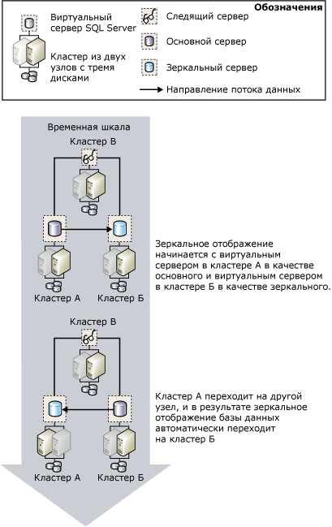

# Экземпляры зеркального отображения баз данных и отказоустойчивых кластеров (SQL Server)
  Отказоустойчивый кластер представляет собой сочетание одного или нескольких физических дисков в группе кластеров службы кластеров [!INCLUDE[msCoName](../../includes/msconame-md.md)] , называемой группой ресурсов, которые являются узлами-участниками кластера. Группа ресурсов настраивается как экземпляр кластера отработки отказа, на котором запускается экземпляр [!INCLUDE[ssNoVersion](../../includes/ssnoversion-md.md)]. Экземпляр кластера отработки отказа [!INCLUDE[ssNoVersion](../../includes/ssnoversion-md.md)] регистрируется в сети как одиночный компьютер, при этом он обладает функциональными возможностями, обеспечивающими отработку отказа с одного узла на другой, если один из узлов становится недоступным. Дополнительные сведения см. в разделе [Экземпляры отказоустойчивого кластера (режим AlwaysOn) (SQL Server)](../../sql-server/failover-clusters/windows/always-on-failover-cluster-instances-sql-server.md).  
  
 Отказоустойчивые кластеры обеспечивают поддержку высокого уровня доступности для всего экземпляра [!INCLUDE[msCoName](../../includes/msconame-md.md)] [!INCLUDE[ssNoVersion](../../includes/ssnoversion-md.md)] в противовес зеркальному отображению базы данных, которое обеспечивает поддержку высокого уровня доступности для отдельной базы данных. Зеркальное отображение базы данных может работать между отказоустойчивыми кластерами, а также между отказоустойчивым кластером и некластеризованным узлом.  
  
> [!NOTE]  
>  Базовые сведения о зеркальном отображении базы данных см. в разделе [Зеркальное отображение базы данных (SQL Server)](../../database-engine/database-mirroring/database-mirroring-sql-server.md).  
  
## Зеркальное отображение и кластер  
 Однако обычно при использовании зеркального отображения с кластеризацией основной и зеркальный серверы располагаются на кластерах, при этом основной сервер работает на экземпляре кластера отработки отказа одного кластера, а зеркальный сервер — на экземпляре кластера отработки отказа другого кластера. Можно установить сеанс зеркального отображения, в котором один участник находится на экземпляре кластера отработки отказа, а другой — на отдельном компьютере вне кластера.  
  
 Если при отработке отказа кластера основной сервер становится временно недоступным, клиентские соединения с базой данных разрываются. После завершения отработки отказа кластера клиенты могут повторно установить соединение с основным сервером на том же или на другом кластере (либо на компьютере вне кластера) в зависимости от [режима работы](../../database-engine/database-mirroring/database-mirroring-operating-modes.md). Поэтому при настройке зеркального отображения базы данных в кластерной среде существенным является режим работы, используемый для зеркального отображения.  
  
### Сеанс в режиме высокой безопасности с автоматическим отработкой отказа  
 Если необходимо реализовать зеркальное отображение базы данных в режиме высокой безопасности с автоматической отработкой отказа, для участников рекомендуется двухкластерная конфигурация. Эта конфигурация обеспечивает максимальный уровень доступности. Следящий сервер может располагаться либо в третьем кластере, либо на компьютере вне кластера.  
  
 В случае сбоя узла, работающего на текущем основном сервере, через несколько секунд начинается автоматическая отработка отказа на другой ресурс, в то время как кластер также продолжает переход на другой узел. Сеанс зеркального отображения базы данных переводится на зеркальный сервер в другом кластере (или на компьютер вне кластера), а бывший зеркальный сервер становится основным. Новый основной сервер выполняет накат своей копии базы данных как можно быстрее и переводит ее в режим в сети в качестве основной базы данных. После выполнения отработки отказа кластера, что обычно занимает несколько минут, экземпляр кластера отработки отказа, который раньше был основным, становится зеркальным.  
  
 Следующая схема показывает автоматическую отработку отказа между кластерами в ходе сеанса зеркального отображения, запущенного в режиме высокой безопасности со следящим сервером (который поддерживает автоматическую отработку отказа).  
  
   
  
 В сеансе зеркального отображения три экземпляра сервера расположены в трех различных кластерах: **Кластер_А**, **Кластер_Б**и **Кластер_В**. На каждом кластере экземпляр [!INCLUDE[ssNoVersion](../../includes/ssnoversion-md.md)] по умолчанию работает как экземпляр кластера отработки отказа [!INCLUDE[ssNoVersion](../../includes/ssnoversion-md.md)] . В начале сеанса зеркального отображения экземпляр кластера отработки отказа в кластере **Кластер_А** является основным сервером, экземпляр кластера отработки отказа в кластере **Кластер_Б** — зеркальным сервером, а экземпляр кластера отработки отказа в кластере **Кластер_В** — следящим сервером сеанса зеркального отображения. Предположим, что происходит сбой активного узла в кластере **Кластер_А** , что приводит к недоступности основного сервера.  
  
 Перед началом перехода кластера на другой ресурс зеркальный сервер обнаруживает сбой основного сервера с помощью следящего сервера. Зеркальный сервер как можно быстрее выполняет накат своей базы данных и переводит ее в режим в сети в качестве основной базы данных. После завершения перехода кластера **Кластер_А** на другой ресурс бывший основной сервер становится уже зеркальным и синхронизирует свою базу данных с текущей основной базой данных в кластере **Кластер_Б**.  
  
### Сеанс в режиме высокой безопасности без автоматической отработки отказа на другой ресурс  
 При выполнении зеркального отображения базы данных в режиме высокой безопасности без автоматической отработки отказа в случае сбоя узла, работающего как основной сервер, другой узел кластера будет работать в качестве основного сервера. Обратите внимание, что пока кластер недоступен, база данных также недоступна.  
  
### Сеанс в режиме высокой производительности  
 Если необходимо реализовать зеркальное отображение базы данных в режиме высокой производительности, следует расположить основной сервер на экземпляре кластера отработки отказа в кластере, а зеркальный сервер — на удаленном сервере вне кластера. В случае перехода кластера на другой узел экземпляр кластера отработки отказа будет продолжать работу в качестве основного сервера сеанса зеркального отображения. Если существуют проблемы на всем кластере, можно принудительно перевести обслуживание на зеркальный сервер.  
  
 **Установка нового отказоустойчивого кластера SQL Server**  
  
-   [Создание отказоустойчивого кластера SQL Server (программа установки)](../../sql-server/failover-clusters/install/create-a-new-sql-server-failover-cluster-setup.md)  
  
 **Настройка зеркального отображения базы данных**  
  
-   [Настройка зеркального отображения базы данных (SQL Server)](../../database-engine/database-mirroring/setting-up-database-mirroring-sql-server.md)  
  
-   [Создание сеанса зеркального отображения базы данных с использованием проверки подлинности Windows (среда SQL Server Management Studio)](../../database-engine/database-mirroring/establish-database-mirroring-session-windows-authentication.md)  
  
## См. также:  
 [Зеркальное отображение базы данных (SQL Server)](../../database-engine/database-mirroring/database-mirroring-sql-server.md)   
 [Режимы работы зеркального отображения базы данных](../../database-engine/database-mirroring/database-mirroring-operating-modes.md)   
 [Экземпляры отказоустойчивого кластера (режим AlwaysOn) (SQL Server)](../../sql-server/failover-clusters/windows/always-on-failover-cluster-instances-sql-server.md)  
  
  

