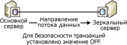
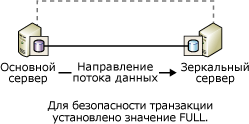
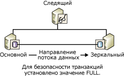

# <a name="database-mirroring-operating-modes"></a>Режимы работы зеркального отображения базы данных
 [!INCLUDE [SQL Server](../../includes/applies-to-version/sqlserver.md)]
  В этом разделе описываются синхронный и асинхронный режимы работы для сеансов зеркального отображения базы данных.  
  
> [!NOTE]  
>  Базовые сведения о зеркальном отображении базы данных см. в разделе [Зеркальное отображение базы данных (SQL Server)](../../database-engine/database-mirroring/database-mirroring-sql-server.md).  
  
  
##  <a name="terms-and-definitions"></a><a name="TermsAndDefinitions"></a> Термины и определения  
 В данном разделе описывается несколько терминов, которые имеют центральное значение для этой темы.  
  
 Высокопроизводительный режим  
 Сеанс зеркального отображения базы данных работает асинхронно и использует только основной сервер и зеркальный сервер. Единственной формой переключения ролей является принудительное обслуживание (с возможной потерей данных).  
  
 Режим высокой безопасности  
 Сеанс зеркального отображения базы данных работает синхронно, и в нем в случае необходимости используются следящий сервер, а также основной сервер и зеркальный сервер.  
  
 Безопасность транзакций  
 Характерное для зеркального отображения свойство базы данных, которое определяет, будет работать сеанс зеркального отображения базы данных в синхронном или асинхронном режиме. Существует два уровня безопасности: FULL и OFF.  
  
 Свидетель  
 Дополнительный экземпляр SQL Server для использования только в режиме повышенной безопасности, который позволяет зеркальному серверу узнавать время начала автоматического перехода на другой ресурс. В отличие от двух партнеров по обеспечению отработки отказа, следящий сервер не обслуживает базу данных. Его единственная функция заключается в поддержке автоматического перехода на другой ресурс.  
  
## <a name="asynchronous-database-mirroring-high-performance-mode"></a>Асинхронное зеркальное отображение баз данных (режим высокой производительности)  
 В этом разделе описываются принципы работы асинхронного зеркального отображения базы данных, ситуации, когда можно использовать режим высокой производительности, и меры, принимаемые в случае сбоя основного сервера.  
  
> [!NOTE]  
>  В большинстве выпусков [!INCLUDE[ssCurrent](../../includes/sscurrent-md.md)] поддерживается только синхронное зеркальное отображение базы данных (только в режиме полной безопасности). Дополнительные сведения о выпусках, полностью поддерживающих зеркальное отображение базы данных, см. в подразделе "Высокий уровень доступности (AlwaysOn)" раздела [Выпуски и поддерживаемые функции SQL Server 2016](../../sql-server/editions-and-supported-features-for-sql-server-2016.md).
  
 Если безопасность транзакций отключена, сеанс зеркального отображения базы данных выполняется в асинхронном режиме. Асинхронные операции поддерживаются только в режиме высокой производительности. В этом режиме производительность повышается за счет высокого уровня доступности. В режиме высокой производительности задействованы только основной сервер и зеркальный сервер. Проблемы, возникающие на зеркальном сервере, никогда не влияют на основной сервер. При потере соединения с основным сервером зеркальная база данных переходит в состояние DISCONNECTED, но остается доступной в режиме «горячего» резервирования.  
  
 Режим высокой производительности поддерживает только одну форму переключения ролей: принудительное обслуживание (с возможной потерей данных), при котором зеркальный сервер используется в качестве сервера «горячего» резервирования. Принудительное обслуживание — одна из возможных реакций на ошибку основного сервера. Так как при этом возможна потеря данных, перед переходом в режим вынужденного обслуживания зеркальным сервером следует рассмотреть другие возможности. Дополнительные сведения см. в подразделе [Реакция на ошибку основного сервера](#WhenPrincipalFails)далее в этом разделе.  
  
 На следующем рисунке показана конфигурация сеанса в режиме высокой производительности.  
  
   
  
 В режиме высокой производительности, как только основной сервер отправляет журнал транзакций зеркальному серверу, основной сервер отправляет подтверждение клиенту, не дожидаясь ответа от зеркального сервера. Транзакции фиксируются без ожидания записи журнала на диск на зеркальном сервере. Асинхронный режим позволяет основному серверу работать с минимальной задержкой транзакций.  
  
 Зеркальный сервер пытается соответствовать записям в журнале, отправляемым основным сервером. Но зеркальная база данных может отражать предыдущее состояние основной базы данных, однако разрыв между базами данных, как правило, небольшой. Однако этот разрыв может стать существенным, если основной сервер сильно загружен или перегружена система зеркального сервера.  
  
 **В этом разделе.**  
  
-   [Когда рекомендуется использовать режим высокой производительности?](#WhenUseHighPerf)  
  
-   [Влияние следящего сервера на высокопроизводительный режим](#WitnessImpactOnHighPerf)  
  
-   [Реакция на ошибку основного сервера](#WhenPrincipalFails)  
  
###  <a name="when-is-high-performance-mode-appropriate"></a><a name="WhenUseHighPerf"></a> Когда рекомендуется использовать режим высокой производительности?  
 Режим высокой производительности может быть полезен в сценарии аварийного восстановления, когда основной и зеркальный серверы значительно удалены друг от друга и когда необходимо, чтобы мелкие ошибки не влияли на основной сервер.  
  
> [!NOTE]  
>  Доставка журналов может дополнять зеркальное отображение базы данных и является подходящей альтернативой для асинхронного зеркального отображения базы данных. Дополнительные сведения о преимуществах применения доставки журналов см. в разделе [Решения высокого уровня доступности (SQL Server)](../../sql-server/failover-clusters/high-availability-solutions-sql-server.md). Сведения об использовании доставки журналов совместно с зеркальным отображением базы данных см. в разделе [Зеркальное отображение баз данных и доставка журналов (SQL Server)](../../database-engine/database-mirroring/database-mirroring-and-log-shipping-sql-server.md).  
  
###  <a name="the-impact-of-a-witness-on-high-performance-mode"></a><a name="WitnessImpactOnHighPerf"></a> Влияние следящего сервера на высокопроизводительный режим  
 При использовании Transact-SQL для настройки высокопроизводительного режима, если для параметра SAFETY установлено значение OFF, настоятельно рекомендуется также установить параметр WITNESS в значение OFF. Следящий сервер может использоваться с высокопроизводительным режимом, но это не принесет пользы и представляет риск.  
  
 Если следящий сервер отключен от сеанса и любой партнер завершает работу, база данных становится недоступной. Это происходит потому, что если следящий сервер установлен, сеансу необходим кворум, состоящий из двух или более экземпляров сервера, даже если для высокопроизводительного режима не требуется следящий сервер. Если сеанс теряет кворум, он не может обслуживать базу данных.  
  
 Если следящий сервер установлен для сеанса с высокопроизводительным режимом, принудительное исполнение кворума означает, что:  
  
-   если соединение с зеркальным сервером теряется, основной сервер должен быть подключен к следящему. В противном случае основной сервер переводит свою базу данных в режим «вне сети» до тех пор, пока следящий или зеркальный сервер не восстановит соединение с сеансом;  
  
-   если потеряно соединение с основным сервером, для переключения на зеркальный сервер необходимо, чтобы зеркальный сервер был подключен к следящему.  
  
> [!NOTE]  
>  Сведения о типах кворума см. в разделе [Кворум. Как следящий сервер влияет на доступность базы данных &#40;зеркальное отображение базы данных&#41;](../../database-engine/database-mirroring/quorum-how-a-witness-affects-database-availability-database-mirroring.md).  
  
###  <a name="responding-to-failure-of-the-principal"></a><a name="WhenPrincipalFails"></a> Реакция на ошибку основного сервера  
 Если на основном сервере произошла ошибка, у владельца базы данных есть несколько вариантов действия:  
  
-   Оставить базу данных недоступной, пока основной сервер снова не станет доступным.  
  
     Если основная база данных и ее журнал транзакций остаются неизменными, в этом случае все зафиксированные транзакции сохраняются за счет доступности.  
  
-   Завершить сеанс зеркального отображения базы данных, вручную обновив базу данных, а затем начать новый сеанс зеркального отображения.  
  
     Если основная база данных недоступна, но основной сервер все еще запущен, попытайтесь сразу сохранить резервную копию заключительного фрагмента журнала основной базы данных. Если эта операция завершится успешно, удаление зеркального отображения может быть лучшим вариантом. После удаления зеркального отображения можно восстановить журнал на бывшей зеркальной базе данных, сохранив при этом все данные.  
  
    > [!NOTE]  
    >  Если создать резервную копию заключительного фрагмента журнала не удается и нельзя ждать восстановления основного сервера, можно воспользоваться режимом вынужденного обслуживания, преимущество которого в продолжении сеанса в текущем состоянии.  
  
-   Принудительное обслуживание (с возможной потерей данных) зеркальным сервером.  
  
     Принудительное обслуживание является исключительно методом аварийного восстановления и должно использоваться ограниченно. Принудительное обслуживание возможно, только если основной сервер выключен, сеанс асинхронный (безопасность транзакций отключена) и нет следящих серверов (параметр WITNESS установлен в OFF) или следящий сервер подключен к зеркальному серверу (то есть они имеют кворум).  
  
     При принудительном обслуживании зеркальный сервер играет роль основного и предоставляет клиентам свою копию базы данных. В этом случае все журналы транзакций, которые основной сервер еще не отправил зеркальному, будут утеряны. Поэтому принудительное обслуживание следует ограничить ситуациями, когда возможная потеря данных приемлема, но важна доступность базы данных. Сведения о том, как выполняется принудительное обслуживание, и об оптимальных методах его использования см. в разделе [Переключение ролей во время сеанса зеркального отображения базы данных (SQL Server)](../../database-engine/database-mirroring/role-switching-during-a-database-mirroring-session-sql-server.md).  
  
##  <a name="synchronous-database-mirroring-high-safety-mode"></a><a name="Sync"></a> Синхронное зеркальное отображение базы данных (режим высокой безопасности)  
 В этом разделе описываются принципы работы синхронного зеркального отображения базы данных, включая альтернативные режимы повышенной безопасности (с автоматическим переходом на другой ресурс и без автоматического перехода на другой ресурс), а также содержатся сведения о роли следящего сервера в автоматическом переходе на другой ресурс.  
  
 Если параметр безопасности транзакций установлен в значение FULL, сеанс зеркального отображения базы данных выполняется в режиме высокой безопасности и после начальной синхронизации работает в синхронном режиме. В этом разделе описываются подробности сеансов зеркального отображения базы данных, которые конфигурируются для выполнения в синхронном режиме.  
  
 Чтобы сеанс проходил в синхронном режиме, зеркальный сервер должен синхронизировать зеркальную базу данных с основной базой данных. С началом сеанса сервер участника начинает передачу своего активного журнала зеркальному серверу. Зеркальный сервер записывает все поступающие записи журнала на диск с максимально возможной скоростью. Как только все полученные записи журнала оказываются записанными на диск, происходит синхронизация баз данных. До тех пор пока связь между участниками не прекращается, синхронизация баз данных сохраняется.  
  
> [!NOTE]  
>  Для контроля за изменениями состояния в сеансе зеркального отображения базы данных воспользуйтесь классом событий **Database Mirroring State Change** . Дополнительные сведения см. в статье [Database Mirroring State Change Event Class](../../relational-databases/event-classes/database-mirroring-state-change-event-class.md).  
  
 После завершения синхронизации любая транзакция, зафиксированная в основной базе данных, фиксируется и на зеркальном сервере, что гарантирует защиту данных. Это достигается за счет того, что транзакция не фиксируется в базе данных участника до тех пор, пока сервер участника не получит от зеркального сервера сообщение, подтверждающее, что последний записал журнал транзакции на диск. Отметим, что время ожидания этого сообщения приводит к увеличению задержки транзакции.  
  
 Время, необходимое для выполнения синхронизации, зависит главным образом от того, насколько зеркальная база данных отставала от базы данных участника в начале сеанса (отставание измеряется числом журнальных записей, первоначально полученных от сервера участника), от рабочей нагрузки на базу данных участника и от быстродействия системы зеркального отображения. По завершении синхронизации сеанса зафиксированный журнал, который еще должен быть перезаписан в зеркальную базу данных, остается в очереди повтора.  
  
 Как только процесс синхронизации зеркальной базы данных завершается, состояние обеих копий базы данных изменяется на SYNCHRONIZED.  
  
 Синхронность операции достигается следующим образом.  
  
1.  Получив транзакцию от клиента, основной сервер записывает ее в журнал транзакций.  
  
2.  Основной сервер записывает транзакцию в базу данных и одновременно направляет журнальную запись зеркальному серверу. Основной сервер ждет, пока от зеркального сервера поступит подтверждение, после чего направляет клиенту одно из следующих подтверждений: о фиксации или откате транзакции.  
  
3.  Зеркальный сервер записывает журнал на диск и возвращает подтверждение основному серверу.  
  
4.  Получив подтверждение от зеркального сервера, основной сервер направляет клиенту сообщение с подтверждением.  
  
 В режиме высокой безопасности данные защищаются за счет их синхронизации в двух местах хранения. Гарантируется запись всех зафиксированных транзакций на диск зеркального сервера.  
  
 **В этом разделе.**  
  
-   [Режим высокой безопасности без автоматического перехода на другой ресурс](#HighSafetyWithOutAutoFailover)  
  
-   [Режим высокой безопасности с автоматическим переходом на другой ресурс](#HighSafetyWithAutoFailover)  
  
###  <a name="high-safety-mode-without-automatic-failover"></a><a name="HighSafetyWithOutAutoFailover"></a> Режим высокой безопасности без автоматического перехода на другой ресурс  
 На следующем рисунке показана конфигурация режима высокой безопасности без автоматического перехода на другой ресурс. Эта конфигурация содержит только двух участников.  
  
   
  
 Если между участниками имеется соединение, а база данных синхронизирована, поддерживается отработка отказа вручную. Если экземпляр зеркального сервера отключен, это не влияет на экземпляр основного сервера, который остается работать в незащищенном режиме (без зеркального отображения данных). При выходе из строя основного сервера зеркальный сервер приостанавливается, но обслуживание может быть принудительно перенесено на него (с возможной потерей данных). Дополнительные сведения см. в статье [Переключение ролей во время сеанса зеркального отображения базы данных (SQL Server)](../../database-engine/database-mirroring/role-switching-during-a-database-mirroring-session-sql-server.md).  
  
###  <a name="high-safety-mode-with-automatic-failover"></a><a name="HighSafetyWithAutoFailover"></a> Режим высокой безопасности с автоматическим переходом на другой ресурс  
 Автоматический переход на другой ресурс обеспечивает высокий уровень доступности за счет того, что обслуживание базы данных продолжается после выхода из строя одного сервера. При использовании режима автоматической отработки отказа в сеансе должен присутствовать третий экземпляр сервера, *следящий сервер*, который в идеальном случае должен находиться на третьем компьютере. На следующем рисунке показана конфигурация сеанса режима высокой безопасности с автоматической отработкой отказа.  
  
   
  
 В отличие от двух участников зеркального отображения, следящий сервер не обслуживает базу данных. Следящий сервер только поддерживает автоматическую отработку отказа, проверяя готовность и функциональность основного сервера. Зеркальный сервер запускает автоматический переход на другой ресурс только в случае сохранения связи между зеркальным и следящим серверами после отключения обоих серверов от основного сервера.  
  
 При наличии следящего сервера для сеанса должен быть установлен *кворум* — связь между как минимум двумя экземплярами сервера, которая позволяет перевести базу данных в доступный режим. Дополнительные сведения см. в разделе [Следящий сервер зеркального отображения базы данных](../../database-engine/database-mirroring/database-mirroring-witness.md) и [Кворум. Как следящий сервер влияет на доступность базы данных &#40;зеркальное отображение базы данных&#41;](../../database-engine/database-mirroring/quorum-how-a-witness-affects-database-availability-database-mirroring.md).  
  
 Чтобы произвести автоматический переход на другой ресурс, необходимо выполнение следующих условий.  
  
-   База данных должна быть синхронизирована.  
  
-   Сбой должен произойти, когда все три экземпляра серверов соединены, при этом после сбоя должно остаться соединение между следящим и зеркальным серверами.  
  
 Потеря участника приведет к следующим последствиям.  
  
-   Если основной сервер становится недоступным при описанных выше условиях, происходит автоматическая отработка отказа. Зеркальный сервер начинает выполнять функции сервера участника и предлагает свою базу данных как основную.  
  
-   Если основной сервер становится недоступным, а описанные выше условия не выполняются, возможно принудительное обслуживание (с возможной потерей данных). Дополнительные сведения см. в статье [Переключение ролей во время сеанса зеркального отображения базы данных (SQL Server)](../../database-engine/database-mirroring/role-switching-during-a-database-mirroring-session-sql-server.md).  
  
-   Если становится недоступным только зеркальный сервер, сервер участника и следящий сервер продолжают работу.  
  
 Если сеанс теряет следящий сервер, для кворума необходимы оба участника. Если один из участников теряет кворум, то кворум теряется обоими участниками, и база данных становится недоступной до восстановления кворума. Эти требования для кворума гарантируют, что при отсутствии следящего сервера база данных никогда не будет работать *в незащищенном режиме*, т.е. без зеркального отображения.  
  
> [!NOTE]  
>  Если ожидается, что следящий сервер будет оставаться отключенным в течение значительного промежутка времени, рекомендуется удалить следящий сервер из сеанса до тех пор, пока он не будет доступен.  
  
##  <a name="transact-sql-settings-and-database-mirroring-operating-modes"></a><a name="TsqlSettingsAndOpModes"></a> Настройки Transact-SQL и режимы зеркального отображения базы данных  
 В этом разделе описывается сеанс зеркального отображения базы данных в терминах параметров инструкции ALTER DATABASE, а также состояния зеркальной базы данных и следящего сервера, если они присутствуют. Раздел предназначен для пользователей, которые управляют зеркальным отображением базы данных целиком или частично с помощью [!INCLUDE[tsql](../../includes/tsql-md.md)], а не в среде [!INCLUDE[ssManStudioFull](../../includes/ssmanstudiofull-md.md)].  
  
> [!TIP]  
>  В качестве альтернативы языку [!INCLUDE[tsql](../../includes/tsql-md.md)]управление рабочим режимом сеанса в обозревателе объектов может осуществляться на странице **Зеркальное отображение** диалогового окна **Свойства базы данных** . Дополнительные сведения см. в подразделе [Создание сеанса зеркального отображения базы данных с использованием проверки подлинности Windows (среда SQL Server Management Studio)](../../database-engine/database-mirroring/establish-database-mirroring-session-windows-authentication.md).  
  
 **В этом разделе.**  
  
-   [Влияние безопасности транзакций и состояния следящего сервера на режим работы](#TxnSafetyAndWitness)  
  
-   [Просмотр установки безопасности и состояния следящего сервера](#ViewWitness)  
  
-   [Факторы, влияющие на работу в случае потери основного сервера](#FactorsOnLossOfPrincipal)  
  
###  <a name="how-transaction-safety-and-witness-state-affect-the-operating-mode"></a><a name="TxnSafetyAndWitness"></a> Влияние безопасности транзакций и состояния следящего сервера на режим работы  
 Режим работы сеанса определяется сочетанием его настройки безопасности транзакций и состояния следящего сервера. Владелец базы данных может в любой момент изменить уровень безопасности транзакций, а также добавить или удалить следящий сервер.  
  
 **В этом разделе.**  
  
-   [Transaction Safety](#TxnSafety)  
  
-   [Состояние следящего сервера](#WitnessState)  
  
####  <a name="transaction-safety"></a><a name="TxnSafety"></a> Transaction Safety  
 Безопасность транзакций — специфичное для зеркального отображения свойство базы данных, которое определяет, будет ли работать сеанс зеркального отображения базы данных в синхронном или асинхронном режиме. Существует два уровня безопасности: FULL и OFF.  
  
-   SAFETY FULL  
  
     При обеспечении полной безопасности транзакций (уровень FULL) сеанс работает синхронно, в режиме высокой безопасности. При наличии следящего сервера поддерживается автоматическая отработка отказа сеанса на другой ресурс.  
  
     При создании сеанса инструкцией ALTER DATABASE он начинается с установки SAFETY в значение FULL. Это означает, что сеанс начинается в режиме высокой безопасности. После начала сеанса можно добавить следящий сервер.  
  
     Дополнительные сведения см. в подразделе [Синхронное зеркальное отображение базы данных (режим повышенной безопасности)](#Sync)ранее в этом разделе.  
  
-   SAFETY OFF  
  
     При отключении обеспечения безопасности транзакций (уровень OFF) сеанс работает асинхронно, в высокопроизводительном режиме. Если параметр SAFETY установлен в OFF, параметр WITNESS также должен быть установлен в OFF (значение по умолчанию). Сведения о влиянии следящего сервера на режим высокой производительности см. в подразделе [Состояние следящего сервера](#WitnessState)далее в этом разделе. Дополнительные сведения об эксплуатации с выключенным режимом безопасности транзакций см. в подразделе [Асинхронное зеркальное отображение баз данных (режим высокой производительности)](#asynchronous-database-mirroring-high-performance-mode)выше в этом разделе.  
  
 Параметры безопасности транзакций для каждого участника на экземпляре сервера доступны через представление каталога **sys.database_mirroring**, в столбцах **mirroring_safety_level** и **mirroring_safety_level_desc**. Дополнительные сведения см. в разделе [sys.database_mirroring (Transact-SQL)](../../relational-databases/system-catalog-views/sys-database-mirroring-transact-sql.md).  
  
 Владелец базы данных может в любой момент изменить уровень безопасности транзакций.  
  
####  <a name="the-state-of-the-witness"></a><a name="WitnessState"></a> Состояние следящего сервера  
 Если установлен следящий сервер, требуется кворум, поэтому состояние следящего сервера всегда имеет значение.  
  
 При наличии следящего сервера он может находиться в одном из двух состояний:  
  
-   Если следящий сервер подключен к участнику, относительно этого участника следящий сервер находится в состоянии CONNECTED и с этим участником образуется кворум. В этом случае базу данных можно сделать доступной даже в случае, если один из участников недоступен.  
  
-   Если следящий сервер существует, но не подключен к участнику, относительно этого участника следящий сервер находится в состоянии UNKNOWN или DISCONNECTED. В этом случае кворум следящего сервера с этим участником отсутствует, и если участники не подключены друг к другу, база данных становится недоступной.  
  
 Дополнительные сведения о кворуме см. в разделе [Кворум. Как следящий сервер влияет на доступность базы данных &#40;зеркальное отображение базы данных&#41;](../../database-engine/database-mirroring/quorum-how-a-witness-affects-database-availability-database-mirroring.md).  
  
 Состояние каждого из следящих серверов на экземпляре сервера доступно через представление каталога **sys.database_mirroring**, в столбцах **mirroring_witness_state** и **mirroring_witness_state_desc**. Дополнительные сведения см. в разделе [sys.database_mirroring (Transact-SQL)](../../relational-databases/system-catalog-views/sys-database-mirroring-transact-sql.md).  
  
 В следующей таблице приведены сводные данные о том, как режим работы сеанса зависит от его установки безопасности транзакций и от состояния следящего сервера.  
  
|Режим работы|Безопасность транзакций|Состояние следящего сервера|  
|--------------------|------------------------|-------------------|  
|Высокопроизводительный режим|OFF|NULL (нет следящего сервера)**|  
|Режим высокой безопасности без автоматического перехода на другой ресурс|FULL|NULL (нет следящего сервера)|  
|Режим высокого уровня защиты с автоматическим переходом на другой ресурс*|FULL|CONNECTED|  
  
 *Если следящий сервер будет отключен, рекомендуется установить для параметра WITNESS значение OFF, пока экземпляр следящего сервера не станет доступен.  
  
 **Если в высокопроизводительном режиме присутствует следящий сервер, то он не участвует в сеансе. Но для обеспечения доступности базы данных необходимо, чтобы по крайней мере два экземпляра сервера оставались подключенными. Поэтому для сеансов, выполняющихся в высокопроизводительном режиме, рекомендуется оставить параметр WITNESS в состоянии OFF. Дополнительные сведения см. в статье [Кворум. Как следящий сервер влияет на доступность базы данных &#40;зеркальное отображение базы данных&#41;](../../database-engine/database-mirroring/quorum-how-a-witness-affects-database-availability-database-mirroring.md).  
  
###  <a name="viewing-the-safety-setting-and-state-of-the-witness"></a><a name="ViewWitness"></a> Просмотр установки безопасности и состояния следящего сервера  
 Для просмотра настройки безопасности и состояния следящего сервера для базы данных используется представление каталога **sys.database_mirroring** . Соответствующие данные отображаются в следующих столбцах:  
  
|Фактор|Столбцы|Описание|  
|------------|-------------|-----------------|  
|Безопасность транзакций|**mirroring_safety_level** или **mirroring_safety_level_desc**|Установка безопасности транзакций для обновления на зеркальной базе данных. Может принимать одно из следующих значений:<br /><br /> UNKNOWN<br /><br /> OFF<br /><br /> FULL<br /><br /> NULL = база данных находится не в режиме в сети.|  
|Существует ли следящий сервер?|**mirroring_witness_name**|Имя следящего сервера зеркального отображения базы данных или значение NULL, означающее, что следящий сервер не существует.|  
|Состояние следящего сервера|**mirroring_witness_state** или **mirroring_witness_state_desc**|Состояние следящего сервера в базе данных этого участника:<br /><br /> UNKNOWN<br /><br /> CONNECTED<br /><br /> DISCONNECTED<br /><br /> NULL = нет следящего сервера, либо база данных находится не в режиме в сети.|  
  
 Например, на основном или на зеркальном сервере введите:  
  
```  
SELECT mirroring_safety_level_desc, mirroring_witness_name, mirroring_witness_state_desc FROM sys.database_mirroring  
```  
  
 Дополнительные сведения о представлении каталога см. в разделе [sys.database_mirroring (Transact-SQL)](../../relational-databases/system-catalog-views/sys-database-mirroring-transact-sql.md).  
  
###  <a name="factors-affecting-behavior-on-loss-of-the-principal-server"></a><a name="FactorsOnLossOfPrincipal"></a> Факторы, влияющие на работу в случае потери основного сервера  
 В следующей таблице сведены данные о воздействии установки безопасности транзакций, состояния базы данных и состояния следящего сервера на работу сеанса зеркального отображения при потере основного сервера.  
  
|Безопасность транзакций|Состояние зеркального отображения зеркальной базы данных|Состояние следящего сервера|Действия в случае потери связи с основным сервером|  
|------------------------|----------------------------------------|-------------------|-------------------------------------|  
|FULL|SYNCHRONIZED|CONNECTED|Производится автоматическая отработка отказа.|  
|FULL|SYNCHRONIZED|DISCONNECTED|Зеркальный сервер останавливается; отработка отказа невозможна, и база данных не может стать доступной.|  
|OFF|SUSPENDED или DISCONNECTED|NULL (нет следящего сервера)|Обслуживание может быть принудительно переключено на зеркальный сервер (с возможностью потери данных).|  
|FULL|SYNCHRONIZING или SUSPENDED|NULL (нет следящего сервера)|Обслуживание может быть принудительно переключено на зеркальный сервер (с возможностью потери данных).|  
  
##  <a name="related-tasks"></a><a name="RelatedTasks"></a> Связанные задачи  
  
-   [Добавление или замена следящего сервера зеркального отображения базы данных (среда SQL Server Management Studio)](../../database-engine/database-mirroring/add-or-replace-a-database-mirroring-witness-sql-server-management-studio.md)  
  
-   [Создание сеанса зеркального отображения базы данных с использованием проверки подлинности Windows (среда SQL Server Management Studio)](../../database-engine/database-mirroring/establish-database-mirroring-session-windows-authentication.md)  
  
-   [Добавление следящего сервера для зеркального отображения базы данных с использованием проверки подлинности Windows (Transact-SQL)](../../database-engine/database-mirroring/add-a-database-mirroring-witness-using-windows-authentication-transact-sql.md)  
  
-   [Удаление следящего сервера из сеанса зеркального отображения базы данных (SQL Server)](../../database-engine/database-mirroring/remove-the-witness-from-a-database-mirroring-session-sql-server.md)  
  
-   [Изменение безопасности транзакций в сеансах зеркального отображения базы данных (Transact-SQL)](../../database-engine/database-mirroring/change-transaction-safety-in-a-database-mirroring-session-transact-sql.md)  
  
## <a name="see-also"></a>См. также:  
 [Мониторинг зеркального отображения базы данных (SQL Server)](../../database-engine/database-mirroring/monitoring-database-mirroring-sql-server.md)   
 [Следящий сервер зеркального отображения базы данных](../../database-engine/database-mirroring/database-mirroring-witness.md)  
  
  
