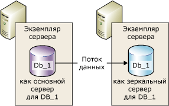
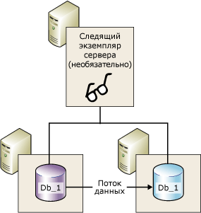
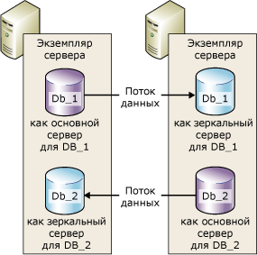

# Зеркальное отображение базы данных (SQL Server)
    
> [!NOTE]  
>  [!INCLUDE[ssNoteDepFutureAvoid](../../includes/ssnotedepfutureavoid-md.md)] Вместо этого используйте [!INCLUDE[ssHADR](../../includes/sshadr-md.md)].  
  
 *Зеркальное отображение базы данных* — это решение, нацеленное на повышение доступности базы данных [!INCLUDE[ssNoVersion](../../includes/ssnoversion-md.md)] . Зеркальное отображение каждой базы данных осуществляется отдельно и работает только с теми базами данных, которые используют модель полного восстановления.  
  
> [!IMPORTANT]  
>  Сведения о поддержке зеркального отображения баз данных, ограничениях, предварительных требованиях, рекомендациях для настройки серверов-партнеров и рекомендациях для развертывания зеркального отображения баз данных см. в разделе [Предварительные условия, ограничения и рекомендации по зеркальному отображению базы данных](../../database-engine/database-mirroring/prerequisites-restrictions-and-recommendations-for-database-mirroring.md).  
  
  
##   Преимущества зеркального отображения базы данных  
 Зеркальное отображение базы данных — это простая стратегия обеспечения надежности, имеющая следующие преимущества:  
  
-   Повышает доступность базы данных.  
  
     В режиме высокой безопасности с автоматическим переходом на другой ресурс и возникновении сбоя резервная копия базы данных переводится в режим «в сети» (без потери данных). В других режимах работы администратор базы данных может включить принудительное обслуживание (с возможной потерей данных) на резервной копии базы данных. Дополнительные сведения см. в подразделе [Переключение ролей](#RoleSwitching)далее в этом разделе.  
  
-   Повышает защиту данных.  
  
     Зеркальное отображение базы данных обеспечивает полную или почти полную избыточность данных в зависимости от того, какой режим установлен: высокой безопасности или высокой производительности. Дополнительные сведения см. в подразделе [Режимы работы](#OperatingModes)ниже в этом разделе.  
  
     Участник зеркального отображения, запущенный в [!INCLUDE[ssEnterpriseEd10](../../includes/ssenterpriseed10-md.md)] или более поздней версии, предпринимает попытки автоматически разрешить ошибки некоторых типов, которые могут мешать чтению страницы данных. Участник, который не может прочитать страницу, запрашивает новую копию у другого участника. Если этот запрос завершился успешно, то нечитаемая страница заменяется копией, в результате чего ошибка обычно устраняется. Дополнительные сведения см. в подразделе [Автоматическое восстановление страниц (группы доступности: зеркальное отображение баз данных)](../../sql-server/failover-clusters/automatic-page-repair-availability-groups-database-mirroring.md).  
  
-   Повышает доступность рабочей базы данных при обновлениях.  
  
     Чтобы свести к минимуму время простоя базы данных, участвующей в зеркальном отображении, можно последовательно обновить экземпляры [!INCLUDE[ssNoVersion](../../includes/ssnoversion-md.md)] , на которых размещены партнеры по обеспечению отработки отказа. Это вызовет простой только на время одной отработки отказа. Этот вид обновления известен как *пошаговое обновление*. Дополнительные сведения см. в статье [Upgrading Mirrored Instances](../../database-engine/database-mirroring/upgrading-mirrored-instances.md).  
  
  
##   Термины и определения зеркального отображения базы данных  
 автоматический переход на другой ресурс  
 Процесс, согласно которому при недоступности основного сервера зеркальный сервер берет на себя роль основного сервера и выводит свою копию базы данных в сеть как основную базу данных.  
  
 партнеры по обеспечению отработки отказа  
 Два экземпляра сервера (основной сервер или зеркальный сервер), которые работают как участники переключения ролей для зеркальной базы данных.  
  
 принудительное обслуживание  
 Отработка отказа, начатая владельцем базы данных при сбое основного сервера, когда в ходе передачи обслуживание переносится в зеркальную базу данных, находящуюся в неизвестном состоянии.  
  
 Высокопроизводительный режим  
 Сеанс зеркального отображения базы данных работает асинхронно и использует только основной сервер и зеркальный сервер. Единственной формой переключения ролей является принудительное обслуживание (с возможной потерей данных).  
  
 Режим высокой безопасности  
 Сеанс зеркального отображения базы данных работает синхронно, и в нем в случае необходимости используются следящий сервер, а также основной сервер и зеркальный сервер.  
  
 переход на другой ресурс вручную  
 Переход на другой ресурс вручную, начатый владельцем базы данных, притом что основной сервер все еще продолжает работу. В результате обслуживание переносится с основной базы данных в зеркальную, в то время как они находятся в синхронизированном состоянии.  
  
 зеркальная база данных  
 Копия базы данных, которая обычно полностью синхронизирована с основной базой данных.  
  
 зеркальный сервер  
 Экземпляр сервера в конфигурации зеркального отображения базы данных, на котором хранится зеркальная база данных.  
  
 зеркальный сервер  
 Экземпляр сервера в конфигурации зеркального отображения базы данных, на котором хранится зеркальная база данных.  
  
 основная база данных  
 При зеркальном отображении базы данных, база данных, доступная для чтения-записи, записи журнала транзакций которой применяются к копии базы данных только для чтения (зеркальной базы данных).  
  
 основной сервер  
 При зеркальном отображении базы данных — участник, база данных которого в текущий момент времени является основной.  
  
 очередь повтора  
 Полученные записи журнала транзакций, ожидающие на диске зеркального сервера.  
  
 роль  
 Основной сервер и зеркальный сервер выполняют взаимно дополнительные роли основного и зеркального. Необязательную роль следящего сервера выполняет третий экземпляр сервера.  
  
 Переключение ролей  
 Принятие зеркалом на себя роли основного.  
  
 очередь отправки  
 Неотправленные записи журнала транзакций, которые накопились на диске журнала основного сервера.  
  
 сеанс  
 Связь, возникающая в ходе зеркального отображения базы данных между основным сервером, зеркальным сервером и следящим сервером (если таковой присутствует).  
  
 После запуска или возобновления сеанса зеркального отображения процесс, при помощи которого собранные на основном сервере записи журнала основной базы данных отправляются на зеркальный сервер, который как можно быстрее записывает их на диск, чтобы приблизиться к состоянию основного сервера.  
  
 Безопасность транзакций  
 Характерное для зеркального отображения свойство базы данных, которое определяет, будет работать сеанс зеркального отображения базы данных в синхронном или асинхронном режиме. Предусмотрены два уровня безопасности: FULL и OFF.  
  
 Свидетель  
 Дополнительный экземпляр SQL Server для использования только в режиме повышенной безопасности, который позволяет зеркальному серверу узнавать время начала автоматического перехода на другой ресурс. В отличие от двух партнеров по обеспечению отработки отказа, следящий сервер не обслуживает базу данных. Его единственная функция заключается в поддержке автоматического перехода на другой ресурс.  
  
  
##   Обзор зеркального отображения базы данных  
 Зеркальное отображение базы данных поддерживает две копии одной базы данных, которые должны находиться на различных экземплярах сервера [!INCLUDE[ssDEnoversion](../../includes/ssdenoversion-md.md)]. Обычно такие экземпляры находятся на компьютерах, расположенных в разных местах. Запуская зеркальное отображение базы данных, устанавливает связь, известную как *сеанс зеркального отображения базы данных*между этими экземплярами сервера.  
  
 Один экземпляр сервера предоставляет базу данных клиентам ( *основной сервер*). Другой экземпляр выступает в качестве сервера горячей замены или горячего резерва ( *зеркальный сервер*) в зависимости от конфигурации и состоянии сеанса зеркального отображения. Синхронизация сеанса зеркального отображения базы данных позволяет получить сервер «горячего» резервирования, поддерживающий быструю отработку отказа без потери данных зафиксированных транзакций. Если сеанс не синхронизирован, то зеркальный сервер обычно работает в качестве сервера «теплого» резервирования (с возможной потерей данных).  
  
 Основной и зеркальный серверы соединены и работают совместно, являясь *участниками* *сеанса зеркального отображения базы данных*. Два участника выполняют в сеансе взаимодополняющие роли: *основную роль* и *зеркальную роль*. В любой момент времени один из участников играет роль основного сервера, а другой участник — зеркального. При этом говорится, что участник *владеет* своей текущей ролью. Участник, владеющий основной ролью, называется *основным сервером*, а его копия базы данных является текущей основной базой данных. Участник, владеющий зеркальной ролью, называется *зеркальным сервером*, а его копия базы данных является текущей зеркальной базой данных. При развертывании зеркального отображения базы данных в рабочей среде основная база данных является *рабочей базой данных*.  
  
 Зеркальное отображение базы данных заключается в том, что в зеркальной базе данных *повторяются* все операции вставки, обновления и удаления, производимые в основной базе данных. Для этого поток записей активных транзакций с максимально возможной быстротой отправляется на зеркальный сервер. В отличие от репликации, которая работает на логическом уровне, зеркальное отображение базы данных работает на уровне физической записи журнала. Начиная с [!INCLUDE[ssKatmai](../../includes/sskatmai-md.md)], основной сервер сжимает поток записей журнала транзакций перед отправкой на зеркальный сервер. Такое сжатие журнала осуществляется во всех сеансах зеркального отображения.  
  
> [!NOTE]  
>  Указанный экземпляр сервера может быть задействован в нескольких одновременных сеансах зеркального отображения базы данных с одними и теми же или разными участниками. В некоторых сеансах указанный экземпляр сервера может быть участником, в других — следящим сервером. На экземпляре зеркального сервера должен эксплуатироваться тот же выпуск [!INCLUDE[ssNoVersion](../../includes/ssnoversion-md.md)].  
  
 **В этом разделе.**  
  
-   [Режимы работы](#OperatingModes)  
  
-   [Переключение ролей](#RoleSwitching)  
  
-   [Параллельные сеансы](#ConcurrentSessions)  
  
-   [Клиентские соединения](#ClientConnections)  
  
-   [Влияние приостановки сеанса на журнал транзакций основного сервера](#ImpactOfPausing)  
  
  
###   Режимы работы  
 Сеансы зеркального отображения базы данных выполняется при помощи синхронных или асинхронных операций. В асинхронном режиме транзакции фиксируются немедленно, не ожидая, пока зеркальный сервер запишет журнал на диск, что позволяет повысить производительность. Синхронный режим обеспечивает фиксацию транзакции на обоих участниках, но при этом повышается риск задержки транзакций.  
  
 Существует два режима работы зеркального отображения. Первый *режим высокого уровня безопасности* поддерживает синхронную работу. В этом режиме в момент начала сеанса зеркальный сервер с максимально возможной скоростью синхронизирует зеркальную базу данных с основной базой данных. После синхронизации базы данных транзакция фиксируется на обоих участниках за счет повышения риска задержки транзакции.  
  
 Второй режим *высокой производительности*работает асинхронно. Зеркальный сервер пытается соответствовать записям в журнале, отправляемым основным сервером. Зеркальная база данных может несколько отставать от основной базы данных. Хотя разрыв между базами данных, как правило, очень мал. Однако этот разрыв может стать существенным, если основной сервер сильно загружен или перегружена система зеркального сервера.  
  
 В режиме высокой производительности, как только основной сервер отправляет журнал транзакций зеркальному серверу, основной сервер отправляет подтверждение клиенту. Он не дожидается подтверждения от зеркального сервера. Это означает, что транзакции фиксируются немедленно, не ожидая, пока зеркальный сервер запишет запись журнала транзакций на диск. Такая асинхронная операция позволяет основному серверу работать с минимальной задержкой транзакций, но с риском возможной потери некоторых данных.  
  
 Для всех сеансов зеркального отображения базы данных поддерживается только один основной и один зеркальный сервер. Эта конфигурация показана на следующем рисунке.  
  
   
  
 Для режима высокого уровня безопасности с автоматической отработкой отказа требуется третий экземпляр сервера, называемый *следящим*. В отличие от двух участников зеркального отображения, следящий сервер не обслуживает базу данных. Он отвечает за автоматическую отработку отказа, следя за работоспособностью и функциональностью основного сервера. Зеркальный сервер запускает автоматический переход на другой ресурс только в случае сохранения связи между зеркальным и следящим серверами после отключения обоих серверов от основного сервера.  
  
 На следующей иллюстрации показана конфигурация с участием следящего сервера.  
  
   
  
 Дополнительные сведения см. в подразделе [Переключение ролей](#RoleSwitching)далее в этом разделе.  
  
> [!NOTE]  
>  Установление нового сеанса зеркального отображения или добавление следящего сервера к существующей конфигурации требует, чтобы на всех применяемых экземплярах серверов работала одна и та же версия [!INCLUDE[ssNoVersion](../../includes/ssnoversion-md.md)]. Однако при обновлении до [!INCLUDE[ssKatmai](../../includes/sskatmai-md.md)] или более поздней версии допускается, чтобы версии экземпляров различались. Дополнительные сведения см. в статье [Upgrading Mirrored Instances](../../database-engine/database-mirroring/upgrading-mirrored-instances.md).  
  
  
####   Безопасность транзакций и рабочие режимы  
 Тип режима работы (асинхронный или синхронный) зависит от установки безопасности транзакций. Если для настройки зеркального отображения базы данных монопольно используется среда [!INCLUDE[ssManStudioFull](../../includes/ssmanstudiofull-md.md)] , параметры безопасности транзакций настраиваются автоматически при выборе режима работы.  
  
 При настройке зеркального отображения базы данных с помощью инструкций [!INCLUDE[tsql](../../includes/tsql-md.md)] необходимо обладать знаниями о настройке безопасности транзакций. Безопасность транзакций управляется свойством SAFETY инструкции ALTER DATABASE. Для базы данных, зеркальная копия которой создается, свойство SAFETY имеет значение FULL или OFF.  
  
-   Если параметр SAFETY имеет значение FULL, операция зеркального отображения базы данных выполняется в синхронном режиме после начальной фазы синхронизации. Если следящий сервер установлен в режим высокой производительности, то в сеансе поддерживается автоматическая отработка отказа.  
  
-   Если параметр SAFETY имеет значение OFF, то операция зеркального отображения базы данных выполняется в асинхронном режиме. Сеанс работает в режиме высокой производительности, и параметр WITNESS также должен иметь значение OFF.  
  
 Дополнительные сведения см. в статье [Database Mirroring Operating Modes](../../database-engine/database-mirroring/database-mirroring-operating-modes.md).  
  
  
###   Переключение ролей  
 В контексте сеанса зеркального отображения базы данных роли основного и зеркального серверов обычно взаимозаменяемы посредством так называемого *переключения ролей*. Переключение ролей заключается в передаче основной роли зеркальному серверу. При этом зеркальный сервер действует в качестве *партнера по обеспечению отработки отказа* для основного сервера. При переключении роли зеркальный сервер принимает на себя роль основного и переводит свою копию базы данных в  режим «в сети», начиная функционировать в качестве основной базы данных. Бывший основной сервер (если он доступен) принимает на себя роль зеркального, а его база данных становится новой зеркальной базой данных. В принципе, переключение ролей туда и обратно может выполняться многократно.  
  
 Существует три формы переключения ролей.  
  
-   *Automatic failover*  
  
     Для этого требуется режим высокого уровня безопасности и наличие зеркального сервера и следящего сервера. База данных уже должна быть синхронизирована, а следящий сервер должен быть подключен к зеркальному.  
  
     Роль следящего сервера заключается в определении готовности и функциональности указанного сервера-участника. При нарушении соединения зеркального сервера с основным сервером, но сохранении соединения следящего сервера с основным следящий сервер не инициирует отработку отказа. Дополнительные сведения см. в разделе [Следящий сервер зеркального отображения базы данных](../../database-engine/database-mirroring/database-mirroring-witness.md).  
  
-   *Manual failover*  
  
     Для перехода требуется режим высокого уровня безопасности. Участники должны быть подключены друг к другу, а база данных должна быть уже синхронизирована.  
  
-   *Принудительное обслуживание* (с возможной потерей данных)  
  
     В режиме высокой производительности и режиме высокого уровня безопасности без автоматической отработки отказа принудительное обслуживание возможно при сбое основного сервера и доступном зеркальном сервере.  
  
    > [!IMPORTANT]  
    >  Режим высокой производительности предназначен для работы без следящего сервера. Но если существует следящий сервер, то для принудительного обслуживания необходимо, чтобы он был подключен к зеркальному серверу.  
  
 При любом сценарии переключения ролей, как только новая основная база данных переходит в режим «в сети», клиентские приложения быстро восстанавливают свою работу, заново соединившись с базой данных.  
  
  
###   Параллельные сеансы  
 Указанный экземпляр сервера может участвовать в нескольких одновременных сеансах зеркального отображения базы данных (по одному на каждую зеркальную базу данных) с теми же или другими экземплярами сервера. Часто экземпляр сервера служит исключительно в качестве участника или следящего сервера во всех сеансах зеркального отображения своей базы данных. Но поскольку каждый сеанс не зависит от остальных сеансов, экземпляр сервера может действовать в некоторых сеансах в качестве участника и в качестве следящего сервера в прочих сеансах. Например, рассмотрим следующие четыре сеанса среди трех экземпляров сервера (`SSInstance_1`, `SSInstance_2`и `SSInstance_3`). Каждый экземпляр сервера служит в качестве участника в одних сеансах и в качестве следящего сервера в остальных.  
  
|Экземпляр сервера|Сеанс для базы данных А|Сеанс для базы данных Б|Сеанс для базы данных В|Сеанс для базы данных Г|  
|---------------------|----------------------------|----------------------------|----------------------------|----------------------------|  
|`SSInstance_1`|Свидетель|Партнер|Партнер|Партнер|  
|`SSInstance_2`|Партнер|Свидетель|Партнер|Партнер|  
|`SSInstance_3`|Партнер|Партнер|Свидетель|Свидетель|  
  
 На рисунке, показанном ниже, изображены два экземпляра сервера, участвующие в качестве участников в двух сеансах зеркального отображения. Один из сеансов проводится для базы данных **Db_1**, а другой сеанс — для базы данных **Db_2**.  
  
   
  
 Каждая из баз данных независима от других. Например, экземпляр сервера изначально может быть зеркальным сервером для двух баз данных. В случае если в одной из этих баз данных произойдет сбой, экземпляр сервера становится основным сервером для перехода на другой ресурс проблемной базы данных, оставаясь зеркальным сервером для другой базы данных.  
  
 В качестве другого примера рассмотрим ситуацию с экземпляром сервера, являющимся основным сервером для двух или более баз данных, работающих в режиме высокого уровня безопасности. Если в работе экземпляра сервера происходит сбой, выполняется автоматическая отработка отказа с переходом всех баз данных на соответствующие зеркальные базы данных.  
  
 При настройке экземпляра сервера для работы одновременно в качестве участника и следящего сервера убедитесь в том, что конечная точка зеркального отображения базы данных поддерживает обе роли (дополнительные сведения см. в разделе [Конечная точка зеркального отображения базы данных (SQL Server)](../../database-engine/database-mirroring/the-database-mirroring-endpoint-sql-server.md)). Также убедитесь в том, что система обладает достаточными ресурсами для уменьшения вероятности конфликтных ситуаций.  
  
> [!NOTE]  
>  Зеркальные базы данных независимы друг от друга, поэтому эти базы данных не могут переключаться при сбое как единая группа.  
  
###   Клиентские соединения  
 Поддержка клиентских соединений для сеансов зеркального отображения базы данных предоставлена поставщиком данных [!INCLUDE[msCoName](../../includes/msconame-md.md)] .NET для [!INCLUDE[ssNoVersion](../../includes/ssnoversion-md.md)]. Дополнительные сведения см. в подразделе [Подключение клиентов к сеансу зеркального отображения базы данных (SQL Server)](../../database-engine/database-mirroring/connect-clients-to-a-database-mirroring-session-sql-server.md).  
  
  
###   Влияние приостановки сеанса на журнал транзакций основного сервера  
 В любой момент владелец базы данных может приостановить сеанс. Приостановление сохраняет состояние сеанса при удалении зеркального отображения. При приостановке сеанса основной сервер не отправляет никаких новых транзакций на зеркальный сервер. Все такие транзакции остаются активными и накапливаются в журнале транзакций основной базы данных. Пока сеанс зеркального отображения базы данных остается приостановленным, журнал транзакций не может быть усечен. Таким образом, если сеанс зеркального отображения базы данных приостанавливается на долгое время, журнал может заполниться до конца.  
  
 Дополнительные сведения см. в подразделе [Приостановка и возобновление зеркального отображения базы данных (SQL Server)](../../database-engine/database-mirroring/pausing-and-resuming-database-mirroring-sql-server.md).  
  
##   Настройка сеанса зеркального отображения базы данных  
 Перед началом сеанса зеркального отображения владелец базы данных или системный администратор должен создать зеркальную базу данных, настроить конечные точки и учетные записи, а также в некоторых случаях создать и настроить сертификаты. Дополнительные сведения см. в подразделе [Настройка зеркального отображения базы данных (SQL Server)](../../database-engine/database-mirroring/setting-up-database-mirroring-sql-server.md).  
  
##   Возможности взаимодействия и совместной работы с другими функциями компонента Database Engine  
 Зеркальное отображение базы данных можно использовать со следующими возможностями и компонентами [!INCLUDE[ssNoVersion](../../includes/ssnoversion-md.md)].  
  
-   [доставка журналов;](../../database-engine/database-mirroring/database-mirroring-and-log-shipping-sql-server.md)  
  
-   [Полнотекстовые каталоги](../../database-engine/database-mirroring/database-mirroring-and-full-text-catalogs-sql-server.md)  
  
-   [Моментальные снимки базы данных](../../database-engine/database-mirroring/database-mirroring-and-database-snapshots-sql-server.md)  
  
-   [Репликация](../../database-engine/database-mirroring/database-mirroring-and-replication-sql-server.md)  
  
##   В этом разделе  
 [Предварительные условия, ограничения и рекомендации по зеркальному отображению базы данных](../../database-engine/database-mirroring/prerequisites-restrictions-and-recommendations-for-database-mirroring.md)  
 Описание предварительных условий и рекомендаций по настройке зеркального отображения базы данных.  
  
 [Database Mirroring Operating Modes](../../database-engine/database-mirroring/database-mirroring-operating-modes.md)  
 Содержит сведения о синхронном и асинхронном режимах работы для сеансов зеркального отображения базы данных, а также о переключении ролей участников в ходе сеанса зеркального отображения базы данных.  
  
 [Следящий сервер зеркального отображения базы данных](../../database-engine/database-mirroring/database-mirroring-witness.md)  
 Описывает роль следящего сервера в зеркальном отображении базы данных, порядок использования единого следящего сервера в нескольких сеансах зеркального отображения, рекомендации по аппаратному и программному обеспечению для следящих серверов, а также роль следящего сервера при автоматическом переходе на другой ресурс. Он также содержит сведения о добавлении или удалении следящего сервера.  
  
 [Переключение ролей во время сеанса зеркального отображения базы данных (SQL Server)](../../database-engine/database-mirroring/role-switching-during-a-database-mirroring-session-sql-server.md)  
 Содержит сведения о переключении ролей участников в ходе сеанса зеркального отображения базы данных, включая переход на другой ресурс автоматически и вручную, а также принудительное обслуживание (с возможной потерей данных). Также содержит сведения об оценке эффекта прерывания обслуживания в ходе переключения ролей.  
  
 [Возможные неполадки при зеркальном отображении базы данных](../../database-engine/database-mirroring/possible-failures-during-database-mirroring.md)  
 Описывает физические проблемы, неполадки операционной системы и проблемы [!INCLUDE[ssNoVersion](../../includes/ssnoversion-md.md)] , включая аппаратные и программные ошибки, которые могут вызвать сбой в сеансе зеркального отображения базы данных. Описывает, как механизм ожидания при зеркальном отображении реагирует на кратковременные ошибки.  
  
 [Конечная точка зеркального отображения базы данных (SQL Server)](../../database-engine/database-mirroring/the-database-mirroring-endpoint-sql-server.md)  
 Объяснение функционирования конечных точек зеркального отображения базы данных.  
  
 [Настройка зеркального отображения базы данных (SQL Server)](../../database-engine/database-mirroring/setting-up-database-mirroring-sql-server.md)  
 Содержит разделы, описывающие предварительные условия, рекомендации и шаги настройки зеркального отображения базы данных.  
  
 [Подключение клиентов к сеансу зеркального отображения базы данных (SQL Server)](../../database-engine/database-mirroring/connect-clients-to-a-database-mirroring-session-sql-server.md)  
 Содержит разделы, описывающие атрибуты строки соединения, используемой клиентом, и алгоритмы подключения и повторного подключения клиента к зеркальной базе данных.  
  
 [Приостановка и возобновление зеркального отображения базы данных (SQL Server)](../../database-engine/database-mirroring/pausing-and-resuming-database-mirroring-sql-server.md)  
 Описывает, что происходит при приостановке зеркального отображения базы данных, включая влияние на усечение журнала транзакций, а также содержит описание приостановки и возобновления зеркального отображения базы данных.  
  
 [Удаление зеркального отображения базы данных (SQL Server)](../../database-engine/database-mirroring/removing-database-mirroring-sql-server.md)  
 Описывает влияние удаления зеркального отображения и содержит описание порядка завершения сеанса.  
  
 [Наблюдение за зеркальным отображением базы данных (SQL Server)](../../database-engine/database-mirroring/monitoring-database-mirroring-sql-server.md)  
 Содержит информацию об использовании хранимых процедур монитора зеркального отображения баз данных ( **dbmmonitor** ) для мониторинга зеркального отображения базы данных и соответствующих сеансов.  
  
  
##   Связанные задачи  
  
### Задачи конфигурации  
 **Использование среды SQL Server Management Studio**  
  
-   [Запуск мастера настройки безопасности зеркального отображения баз данных (среда SQL Server Management Studio)](../../database-engine/database-mirroring/start-the-configuring-database-mirroring-security-wizard.md)  
  
-   [Создание сеанса зеркального отображения базы данных с использованием проверки подлинности Windows (среда SQL Server Management Studio)](../../database-engine/database-mirroring/establish-database-mirroring-session-windows-authentication.md)  
  
 **Использование Transact-SQL**  
  
-   [Разрешение сетевого доступа к конечной точке зеркального отображения базы данных с использованием проверки подлинности Windows (SQL Server)](../../database-engine/database-mirroring/database-mirroring-allow-network-access-windows-authentication.md)  
  
-   [Включение использования сертификатов для исходящих соединений в конечной точке зеркального отображения базы данных (Transact-SQL)](../../database-engine/database-mirroring/database-mirroring-use-certificates-for-outbound-connections.md)  
  
-   [Включение использования сертификатов для входящих соединений в конечной точке зеркального отображения базы данных (Transact-SQL)](../../database-engine/database-mirroring/database-mirroring-use-certificates-for-inbound-connections.md)  
  
-   [Создание конечной точки зеркального отображения базы данных с проверкой подлинности Windows (Transact-SQL)](../../database-engine/database-mirroring/create-a-database-mirroring-endpoint-for-windows-authentication-transact-sql.md)  
  
-   [Создание сеанса зеркального отображения базы данных с использованием проверки подлинности Windows (Transact-SQL)](../../database-engine/database-mirroring/database-mirroring-establish-session-windows-authentication.md)  
  
-   [Добавление следящего сервера для зеркального отображения базы данных с использованием проверки подлинности Windows (Transact-SQL)](../../database-engine/database-mirroring/add-a-database-mirroring-witness-using-windows-authentication-transact-sql.md)  
  
-   [Настройка зеркальной базы данных на использование свойства TRUSTWORTHY (Transact-SQL)](../../database-engine/database-mirroring/set-up-a-mirror-database-to-use-the-trustworthy-property-transact-sql.md)  
  
 **Использование Transact-SQL или среды SQL Server Management Studio**  
  
-   [Upgrading Mirrored Instances](../../database-engine/database-mirroring/upgrading-mirrored-instances.md)  
  
-   [Подготовка зеркальной базы данных к зеркальному отображению (SQL Server)](../../database-engine/database-mirroring/prepare-a-mirror-database-for-mirroring-sql-server.md)  
  
  
### Задачи администрирования  
 **Transact-SQL**  
  
-   [Изменение безопасности транзакций в сеансах зеркального отображения базы данных (Transact-SQL)](../../database-engine/database-mirroring/change-transaction-safety-in-a-database-mirroring-session-transact-sql.md)  
  
-   [Переключение сеанса зеркального отображения базы данных на другой ресурс вручную (язык Transact-SQL)](../../database-engine/database-mirroring/manually-fail-over-a-database-mirroring-session-transact-sql.md)  
  
-   [Принудительный запуск службы в сеансе зеркального отображения базы данных (Transact-SQL)](../../database-engine/database-mirroring/force-service-in-a-database-mirroring-session-transact-sql.md)  
  
-   [Приостановка или возобновление сеанса зеркального отображения базы данных (SQL Server)](../../database-engine/database-mirroring/pause-or-resume-a-database-mirroring-session-sql-server.md)  
  
-   [Удаление следящего сервера из сеанса зеркального отображения базы данных (SQL Server)](../../database-engine/database-mirroring/remove-the-witness-from-a-database-mirroring-session-sql-server.md)  
  
-   [Удаление зеркального отображения базы данных (SQL Server)](../../database-engine/database-mirroring/remove-database-mirroring-sql-server.md)  
  
 **Среда SQL Server Management Studio**  
  
-   [Добавление или замена следящего сервера зеркального отображения базы данных (среда SQL Server Management Studio)](../../database-engine/database-mirroring/add-or-replace-a-database-mirroring-witness-sql-server-management-studio.md)  
  
-   [Переключение сеанса зеркального отображения базы данных на другой ресурс вручную (среда SQL Server Management Studio)](../../database-engine/database-mirroring/manually-fail-over-a-database-mirroring-session-sql-server-management-studio.md)  
  
-   [Приостановка или возобновление сеанса зеркального отображения базы данных (SQL Server)](../../database-engine/database-mirroring/pause-or-resume-a-database-mirroring-session-sql-server.md)  
  
-   [Удаление следящего сервера из сеанса зеркального отображения базы данных (SQL Server)](../../database-engine/database-mirroring/remove-the-witness-from-a-database-mirroring-session-sql-server.md)  
  
-   [Удаление зеркального отображения базы данных (SQL Server)](../../database-engine/database-mirroring/remove-database-mirroring-sql-server.md)  
  
  
## См. также:  
 [Конечная точка зеркального отображения базы данных (SQL Server)](../../database-engine/database-mirroring/the-database-mirroring-endpoint-sql-server.md)   
 [Автоматическое восстановление страниц (группы доступности: зеркальное отображение баз данных)](../../sql-server/failover-clusters/automatic-page-repair-availability-groups-database-mirroring.md)   
 [Диагностика конфигурации зеркального отображения базы данных (SQL Server)](../../database-engine/database-mirroring/troubleshoot-database-mirroring-configuration-sql-server.md)   
 [Зеркальное отображение базы данных: взаимодействие и сосуществание (SQL Server)](../../database-engine/database-mirroring/database-mirroring-interoperability-and-coexistence-sql-server.md)   
 [Предварительные условия, ограничения и рекомендации по зеркальному отображению базы данных](../../database-engine/database-mirroring/prerequisites-restrictions-and-recommendations-for-database-mirroring.md)   
 [Обзор групп доступности AlwaysOn (SQL Server)](../../database-engine/availability-groups/windows/overview-of-always-on-availability-groups-sql-server.md)   
 [Сведения о доставке журналов (SQL Server)](../../database-engine/log-shipping/about-log-shipping-sql-server.md)  
  
  

