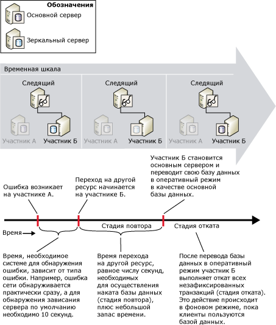

# Оценка прерывания обслуживания во время переключения ролей (зеркальное отображение базы данных)
  Во время переключения ролей интервал времени, в течение которого зеркальное отображение базы данных не будет обслуживаться, зависит от типа переключения ролей и его причины.  
  
-   Во время автоматической отработки отказа два фактора влияют на время прерывания обслуживания: требуется время, чтобы зеркальный сервер смог определить, что основной экземпляр сервера потерпел неудачу (время обнаружения ошибки), а также требуется время для переключения базы данных (время отработки отказа).  
  
-   Для операции принудительного обслуживания, хотя выполнение завершилось неудачно, обнаружение и ответ на неудачное выполнение, зависит от реакции пользователя. Однако оценка потенциального прерывания обслуживания ограничена оценкой времени зеркального сервера для переключения ролей после того, как команда принудительного обслуживания выполнена.  
  
    > [!NOTE]  
    >  Чтобы сократить время, требуемое для обнаружения специальных условий, например некоторых типов ошибок, необходимо определить предупреждения для этих условий.  
  
-   При отработке отказа вручную имеет значение только время перехода на базу данных после выполнения команды отработки отказа.  
  
## Определение ошибки  
 Время, за которое система заметит ошибку, зависит от типа ошибки, например сетевая ошибка будет замечена практически сразу, так как определение потери соединения с сервером по умолчанию занимает 10 секунд — это время ожидания по умолчанию.  
  
 Сведения об ошибках, которые могут вызвать сбой во время сеанса зеркального отображения базы данных, и о времени ожидания обнаружения в режиме высокой безопасности с автоматической отработкой отказа см. в статье [Возможные неполадки при зеркальном отображении базы данных](../../database-engine/database-mirroring/possible-failures-during-database-mirroring.md).  
  
## Время отработки отказа  
 Время отработки отказа делится на время, которое необходимо бывшему зеркальному серверу для выполнения наката журналов, оставшихся в его очереди повторов, и на короткое дополнительное время (дополнительные сведения о том, как зеркальный сервер обрабатывает записи журнала, см. в статье [Зеркальное отображение базы данных (SQL Server)](../../database-engine/database-mirroring/database-mirroring-sql-server.md)). Сведения об оценке времени отработки отказа см. в статье «Оценка частоты повторов при отработке отказа» далее в этом подразделе.  
  
> [!IMPORTANT]  
>  Если отработка отказа происходит во время транзакции, в которой индекс или таблица созданы и затем изменены, переход может занять больше времени, чем обычно.  Например, время отработки отказа может увеличить следующий ряд операций: BEGIN TRANSACTION, CREATE INDEX для таблицы и SELECT INTO из таблицы. Вероятность увеличения времени отработки отказа во время такой транзакции сохраняется, пока она не завершается инструкцией COMMIT TRANSACTION или ROLLBACK TRANSACTION.  
  
### Очередь повторов  
 Накат базы данных подразумевает применение всех записей журнала, находящихся в очереди повторов зеркального сервера. *Очередь повторов* состоит из записей журнала, сохраненных на жестком диске зеркального сервера, накат которых в зеркальной базе данных еще не был выполнен.  
  
 Время отработки отказа зависит от того, как быстро зеркальный сервер может выполнить накат журнала в очереди повторов, а это, в свою очередь, зависит, прежде всего, от оборудования системы и текущей рабочей нагрузки. Теоретически, основная база данных может стать настолько загруженной, что основный сервер будет доставлять журналы на зеркальный сервер быстрее, чем тот сможет выполнять накат. В этой ситуации отработка отказа может занять значительное время, пока зеркальный сервер не выполнит накат всех журналов в очереди повтора. Узнать текущий размер очереди повтора можно с помощью счетчика **Очередь повторов** в объекте производительности зеркального отображения. Дополнительные сведения см. в статье [SQL Server, Database Mirroring Object](../../relational-databases/performance-monitor/sql-server-database-mirroring-object.md).  
  
### Оценка частоты повторов при отработке отказа  
 Можно оценить количество времени, необходимое для наката записей журнала ( *частота повторов*), с помощью тестовой копии рабочей базы данных.  
  
 Метод оценки времени наката во время отработки отказа зависит от числа потоков, задействованных на стадии повтора зеркальным сервером. Число потоков зависит от следующего:  
  
-   В выпуске [!INCLUDE[ssStandard](../../includes/ssstandard-md.md)]для наката базы данных зеркальный сервер всегда использует один поток.  
  
-   в [!INCLUDE[ssEnterprise](../../includes/ssenterprise-md.md)] зеркальные серверы на компьютерах с числом процессоров менее пяти также используют один поток. Если процессоров пять или более, зеркальный сервер распределяет операции наката во время отработки отказа между несколькими потоками (*параллельные повторы*). Параллельные повторы оптимизированы для использования одного потока на каждые четыре процессора.  
  
#### Оценка частоты однопоточных повторов  
 При использовании однопоточных повторов накат зеркальной базы данных во время отработки отказа занимает примерно столько же времени, как при восстановлении резервной копии журнала для наката такого же объема записей. Чтобы оценить время отработки отказа, создайте тестовую базу данных в среде, которая будет использоваться при зеркальном отображении. Затем возьмите резервные копии журналов из рабочей базы данных. Чтобы измерить частоту повторов для этих журналов, засеките, сколько времени понадобится для восстановления тестовой базы данных из журналов с параметром WITH NORECOVERY.  
  
 Зная частоту повторов зеркального сервера, можно оценить время, которое понадобится для перехода на другую базу данных в заданный момент времени, разделив объем текущих журналов на зеркальном сервере (этот объем можно измерить с помощью счетчика производительности **Очередь повтора**) на частоту повторов. В нормальных условиях, если зеркальный сервер справляется с нагрузкой с основного сервера, значение счетчика **Очередь повтора** очень мало или близко к нулю, а отработка отказа занимает несколько секунд.  
  
#### Оценка частоты параллельных повторов  
 В [!INCLUDE[ssEnterprise](../../includes/ssenterprise-md.md)]параллельные повторы оптимизированы для использования одного потока на каждые четыре процессора. Чтобы оценить время наката параллельных повторов, лучше использовать работающую тестовую систему, а не тестовую базу данных. Наблюдая за очередью повтора на зеркальном сервере, увеличьте нагрузку на основной сервер. В нормальных условиях очередь повтора будет близка к нулю. Увеличьте нагрузку на основной сервер, пока очередь повтора не начнет постоянно расти; система будет находиться на пике частоты повторов, а счетчик производительности **Повтор байты/с** в этот момент будет показывать максимальное значение частоты повторов. Дополнительные сведения см. в статье [SQL Server, Database Mirroring Object](../../relational-databases/performance-monitor/sql-server-database-mirroring-object.md).  
  
## Оценка прерывания обслуживания во время автоматической отработки отказа  
 На следующем рисунке показан вклад времени определения ошибки и времени отработки отказа в общее время, требуемое для завершения автоматического перехода на сервер **Partner_B**. При отработке отказа требуется время для наката базы данных (стадия повтора) плюс короткое время для перевода базы данных в режим в сети. Стадия отката, когда выполняются откаты всех незафиксированных транзакций, происходит после того, как новая основная база данных переходит в режим в сети и продолжает работу после перехода. Во время стадии отката база данных доступна.  
  
   
  
## См. также:  
 [Режимы работы зеркального отображения базы данных](../../database-engine/database-mirroring/database-mirroring-operating-modes.md)   
 [Переключение ролей во время сеанса зеркального отображения базы данных (SQL Server)](../../database-engine/database-mirroring/role-switching-during-a-database-mirroring-session-sql-server.md)   
 [Наблюдение за зеркальным отображением базы данных (SQL Server)](../../database-engine/database-mirroring/monitoring-database-mirroring-sql-server.md)  
  
  