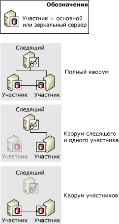
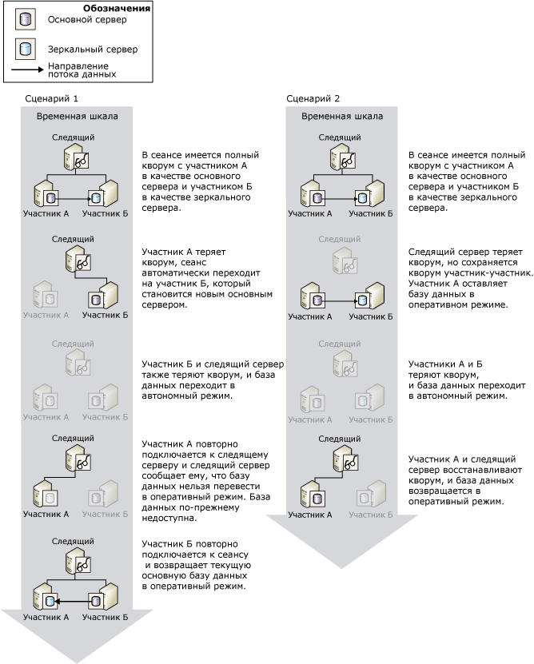

# Кворум. Как следящий сервер влияет на доступность базы данных (зеркальное отображение базы данных)
[!INCLUDE[appliesto-ss-xxxx-xxxx-xxx-md](../../includes/appliesto-ss-xxxx-xxxx-xxx-md.md)]
  Когда для сеанса зеркального отображения базы данных назначен следящий сервер, обязательно наличие *кворума* . Кворум — это связь, возникающая, когда два или несколько экземпляров сервера в сеансе зеркального отображения подключаются друг к другу. Обычно кворум включает три соединенных друг с другом экземпляра сервера. Если указан следящий сервер, то кворум необходим, чтобы сделать базу данных доступной. Кворум, рассчитанный на режим высокого уровня безопасности с автоматической отработкой отказа, гарантирует, что в любой момент времени база данных принадлежит только одному участнику.  
  
 Если экземпляр сервера отключается от сеанса зеркального отображения, экземпляр теряет кворум. Если не подключено ни одного экземпляра сервера, сеанс теряет кворум и база данных выходит из режима «в сети». Возможны три типа кворума.  
  
-   *Полный кворум* состоит из обоих участников и следящего сервера.  
  
-   *Кворум "следящий сервер-участник"* состоит из следящего сервера и одного из участников.  
  
-   *Кворум "участник-участник"* состоит из двух участников.  
  
 На следующем рисунке показаны все три типы кворума.  
  
   
  
 Пока текущий основной сервер имеет кворум, он играет роль основного и продолжает обслуживать базу данных, пока владелец базы данных не произведет отработку отказа вручную. Если основной сервер теряет кворум, он перестает обслуживать базу данных. Автоматическая отработка отказа может произойти только в том случае, если основной сервер утратил кворум, что является сигналом прекращения обслуживания им основной базы данных.  
  
 Отключенный экземпляр сервера сохраняет свою последнюю роль в сеансе. Как правило, в определенный момент времени отключенный экземпляр сервера производит повторное подключение к сеансу и восстанавливает кворум.  
  
> [!IMPORTANT]  
>  Следящий сервер следует устанавливать только в том случае, когда предполагается использовать режим высокого уровня безопасности с автоматической отработкой отказа. В режиме высокой производительности, для которого следящий сервер не нужен, настоятельно рекомендуется установить WITNESS в значение OFF. Дополнительные сведения о том, каким образом следящий сервер влияет на режим высокой производительности, см. в разделе [Режимы работы зеркального отображения базы данных](../../database-engine/database-mirroring/database-mirroring-operating-modes.md).  
  
## Кворум в сеансах с режимом высокого уровня безопасности  
 В режиме высокого уровня безопасности кворум обеспечивает автоматическую отработку отказа благодаря наличию контекста, по которому находящиеся в кворуме экземпляры серверов определяют, какой из участников играет роль основного. Основной сервер обслуживает базу данных, если он имеет кворум. Если основной сервер теряет кворум, а синхронизированный зеркальный и следящий серверы сохраняют его, то выполняется автоматическая отработка отказа.  
  
 В сеансах с режимом высокого уровня безопасности существуют следующие сценарии кворума.  
  
-   *Полный кворум* состоит из участников и следящего сервера.  
  
     Обычно в трехстороннем кворуме участвуют все три экземпляра серверов, что называется *полным кворумом*. При полном кворуме основной и зеркальный сервера продолжают играть соответствующие роли (пока не произойдет отработки отказа вручную).  
  
-   *Кворум "следящий сервер-участник"* состоит из следящего сервера и одного из участников.  
  
     Если вследствие выхода из строя одного из участников зеркального отображения произойдет разрыв сетевого подключения, возможны следующие варианты развития событий.  
  
    -   Соединение с зеркальным сервером теряется, а основной и следящий серверы удерживают кворум.  
  
         В этом случае основной сервер устанавливает свою базу данных в режим DISCONNECTED и работает с зеркальным отображением в состоянии SUSPENDED (Это называется *работой в незащищенном режиме*, поскольку в это время зеркальное отображение базы данных не производится.) Когда зеркальный сервер снова подключается к сеансу, он восстанавливает кворум в роли зеркального и заново начинает синхронизацию своей копии базы данных.  
  
    -   Соединение с основным сервером теряется, а следящий и зеркальный серверы удерживают кворум.  
  
         В этом случае происходит автоматическая отработка отказа. Дополнительные сведения см. в статье [Database Mirroring Operating Modes](../../database-engine/database-mirroring/database-mirroring-operating-modes.md).  
  
    -   Все экземпляры сервера теряют кворум, но впоследствии зеркальный сервер и следящий сервер восстанавливают соединение. База данных в этом случае обслуживаться не будет.  
  
     Изредка возможна ситуация, когда сетевое соединение между партнерами по обеспечению отработки отказа зеркального отображения теряется, в то время как оба участника остаются подключенными к следящему серверу. В этом случае существует два отдельных кворума "следящий сервер — участник", причем следящий сервер является соединяющим элементом. Следящий сервер уведомляет зеркальный сервер о том, что основной сервер еще подключен. Поэтому автоматической отработки отказа не происходит. Зеркальный сервер остается в роли зеркального и ожидает соединения с основным сервером. Если в этот момент в очереди повторного выполнения имеются записи журнала, зеркальный сервер продолжает накат зеркальной базы данных. После восстановления соединения зеркальный сервер заново синхронизирует зеркальную базу данных.  
  
-   *Кворум "участник-участник"* состоит из двух участников.  
  
     Пока участники удерживают кворум, база данных продолжает функционировать в состоянии SYNCHRONIZED и имеется возможность отработки отказа вручную. Без следящего сервера автоматическая отработка отказа невозможна, но, когда он восстанавливает кворум, сеанс зеркального отображения возобновляется, и автоматическая отработка отказа снова поддерживается.  
  
-   Сеанс теряет кворум.  
  
     Если все экземпляры сервера отключены друг от друга, то говорят, что сеанс *потерял кворум*. Как только экземпляры сервера заново подключатся друг к другу, кворум между ними восстанавливается.  
  
    -   Если основной сервер заново подключается к одному из экземпляров сервера, база данных становится доступной.  
  
    -   Если основной сервер остается отключенным, а зеркальный и следящий заново подключаются друг к другу, то автоматическая отработка отказа невозможна из-за возможной потери данных. Поэтому база данных остается недоступной, пока основной сервер вновь не подключится к сеансу.  
  
    -   Когда все три экземпляра сервера снова подключаются друг к другу, восстанавливается полный кворум, и сеанс возобновляет нормальную работу.  
  
> [!IMPORTANT]  
>  Когда в сеансе имеется только кворум «участник-участник», то при утере кворума одним из участников другой участник также теряет кворум. Поэтому, если ожидается, что следящий сервер будет оставаться отключенным в течение значительного промежутка времени, рекомендуется временно удалить следящий сервер из сеанса. Удаление следящего сервера удаляет требование кворума. Затем, если зеркальный сервер будет отключен, основной сервер может продолжать обслуживать базу данных. Сведения о добавлении и удалении следящего сервера см. в разделе [Database Mirroring Witness](../../database-engine/database-mirroring/database-mirroring-witness.md).  
  
### Влияние кворума на доступность базы данных  
 На следующем рисунке показано, как взаимодействуют следящий сервер и стороны зеркального отображения, чтобы в один момент времени только одна из сторон выступала в роли основного сервера и только текущий основной сервер мог перевести свою базу данных в режим «в сети». Оба сценария начинаются с полного кворума, **Участник A** в роли основного сервера и **Участник Б** — в роли зеркального.  
  
   
  
 В сценарии 1 демонстрируется, как после сбоя в работе исходного основного сервера (**Участник A**) следящий сервер и зеркальный сервер соглашаются с тем, что основной сервер ( **Участник A**) стал недоступен, и формируют кворум. Затем зеркальный сервер **Участник Б** принимает на себя роль основного сервера. Производится автоматическая отработка отказа, и **Участник Б**переводит свою копию базы данных в режим "в сети". Затем **Участник Б** отключается, и его база данных переходит в режим "вне сети". Затем бывший основной сервер **Участник A**восстанавливает соединение со следящим сервером, вновь образуя кворум, однако получает от следящего сервера **Участник A** уведомление о том, что его копия базы данных не может быть переведена в режим "в сети", поскольку роль основного сервера теперь принадлежит **Участнику Б** . Когда **Участник Б** вновь присоединяется к сеансу, он переводит базу данных обратно в режим "в сети".  
  
 В сценарии 2 следящий сервер теряет кворум, в то время как **Участник A** и **Участник Б**сохраняют кворум друг с другом, и база данных остается в режиме "в сети". Затем участники также теряют свой кворум, и база данных переходит в режим «вне сети». После этого основной сервер **Участник A**восстанавливает соединение со следящим сервером, вновь образуя кворум. Следящий сервер подтверждает, что **Участнику A** по-прежнему принадлежит **Участнику A**, который переводит базу данных обратно в режим "в сети".  
  
## См. также:  
 [Режимы работы зеркального отображения базы данных](../../database-engine/database-mirroring/database-mirroring-operating-modes.md)   
 [Переключение ролей во время сеанса зеркального отображения базы данных (SQL Server)](../../database-engine/database-mirroring/role-switching-during-a-database-mirroring-session-sql-server.md)   
 [Database Mirroring Witness](../../database-engine/database-mirroring/database-mirroring-witness.md)   
 [Возможные неполадки при зеркальном отображении базы данных](../../database-engine/database-mirroring/possible-failures-during-database-mirroring.md)   
 [Состояния зеркального отображения (SQL Server)](../../database-engine/database-mirroring/mirroring-states-sql-server.md)  
  
  
