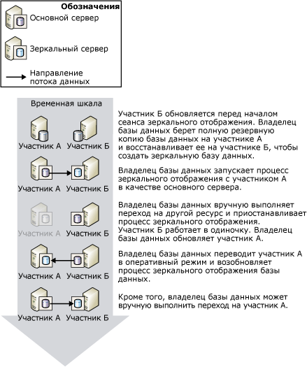
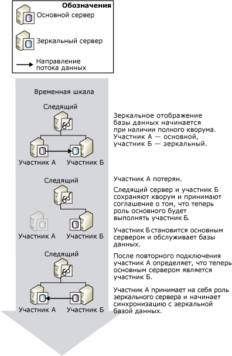
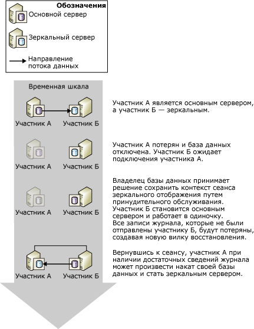

# Переключение ролей во время сеанса зеркального отображения базы данных (SQL Server)
  В контексте сеанса зеркального отображения базы данных роли основного и зеркального серверов обычно взаимозаменяемы посредством так называемого *переключения ролей*. Во время переключения ролей зеркальный сервер играет роль *партнера по обеспечению отработки отказа* для основного сервера, принимая роль основного сервера и переводя свою копию базы данных в оперативное состояние в качестве новой основной базы данных. Когда бывший основной сервер входит в строй, он принимает роль зеркального, и его база данных становится новой зеркальной базой данных. Возможно многократное переключение ролей либо в ответ на многочисленные ошибки, либо в целях администрирования.  
  
> [!NOTE]  
>  Подразумевается, что рабочие режимы зеркального отображения базы данных знакомы. Дополнительные сведения см. в статье [Database Mirroring Operating Modes](../../database-engine/database-mirroring/database-mirroring-operating-modes.md).  
  
 На следующей иллюстрации показано, как два участника зеркального отображения, **участник А** и **участник Б**, обмениваются ролями основного сервера и зеркального сервера в течение ряда отработок отказов, осуществляемых как автоматически, так и вручную.  
  
   
  
> [!IMPORTANT]  
>  Задания, работающие в бывшей основной базе данных после переключения ролей, должны быть созданы повторно в новой основной базе данных для работы с ней. Дополнительные сведения см. в разделе [Управление именами входа и заданиями после переключения ролей (SQL Server)](../../sql-server/failover-clusters/management-of-logins-and-jobs-after-role-switching-sql-server.md).  
  
 Существует три вида переключения ролей: автоматический переход на другой ресурс, переход на другой ресурс вручную и вынужденное обслуживание (с возможной потерей данных). Поддержка каждой из форм переключения ролей зависит от режима функционирования сеанса.  
  
> [!NOTE]  
>  Сведения о режимах функционирования сеансов зеркального отображения см. в разделе [Режимы работы зеркального отображения базы данных](../../database-engine/database-mirroring/database-mirroring-operating-modes.md).  
  
-   **Отработка отказа вручную**  
  
     Режим высокого уровня безопасности поддерживает отработку отказа вручную. Если база данных синхронизирована, владелец базы данных может инициировать отработку отказа вручную.  
  
     Отработка отказа вручную используется в целях администрирования. Дополнительные сведения см. в подразделе [Переход на другой ресурс вручную](#ManualFailover)далее в этом разделе.  
  
-   **Автоматическая отработка отказа**  
  
     В присутствии следящего сервера режим высокого уровня безопасности поддерживает автоматическую отработку отказа. Автоматическая отработка отказа происходит только при потере связи с основным сервером, когда зеркальный и следящий серверы все еще связаны друг с другом, а база данных уже синхронизирована. Дополнительные сведения см. в подразделе [Автоматический переход на другой ресурс](#AutomaticFailover)далее в этом разделе.  
  
-   **Принудительное обслуживание (с возможной потерей данных)**  
  
     Принудительное обслуживание поддерживается в режиме высокого уровня безопасности при отсутствии следящего сервера и в высокопроизводительном режиме. При потере связи с основным сервером владелец базы данных может принудительно сделать базу данных доступной, включив принудительное обслуживание зеркальным сервером (это может привести к потере данных).  
  
    > [!NOTE]  
    >  Рекомендуется установить свойство «WITNESS» в положение «OFF» в высокопроизводительном режиме. Иначе для перевода базы данных в режим «в сети» будет необходимо соединение зеркального сервера со следящим сервером.  
  
     Дополнительные сведения см. в подразделе [Принудительное обслуживание (с возможной потерей данных)](#ForcedService)далее в этом разделе.  
  
 Следующая таблица содержит сводные данные о поддержке различных способов отработки отказа для каждого из режимов функционирования.  
  
||Высокая производительность|Режим высокого уровня безопасности без следящего сервера|Режим высокого уровня безопасности в присутствии следящего сервера|  
|-|----------------------|-----------------------------------------|--------------------------------------|  
|Автоматическая отработка отказа|Нет|Нет|Да|  
|Отработка отказа вручную|Нет|Да|Да|  
|Принудительное обслуживание|Да|Да|Нет|  
  
 После переключения ролей определенные метаданные должны существовать на обоих участниках, чтобы гарантировать, что все пользователи базы данных смогут получить доступ к новой основной базе данных. Кроме того, задания резервирования должны быть созданы на новом основном сервере, чтобы гарантировать, что сохраняется возможность резервирования базы данных по регулярному расписанию. Дополнительные сведения см. в разделе [Управление именами входа и заданиями после переключения ролей (SQL Server)](../../sql-server/failover-clusters/management-of-logins-and-jobs-after-role-switching-sql-server.md).  
  
 При переключении ролей время недоступности зеркального отображения базы данных зависит от типа переключения ролей и типа причины переключения. Дополнительные сведения см. в статье [Оценка прерывания обслуживания во время переключения ролей (зеркальное отображение базы данных)](../../database-engine/database-mirroring/estimate-the-interruption-of-service-during-role-switching-database-mirroring.md).  
  
##   Manual Failover  
 При отработке отказа вручную клиенты отключаются от базы данных, а роли участников меняются на противоположные. Отработка отказа вручную поддерживается только в режиме высокого уровня безопасности.  
  
 **В этом разделе.**  
  
-   [Поддержка уровня доступности при обновлениях](#AvailabilityDuringUpgrades)  
  
-   [Условия для отработки отказа вручную](#ConditionsForManualFo)  
  
-   [Принципы работы отработки отказа вручную](#HowManualFoWorks)  
  
###   Поддержка уровня доступности при обновлениях  
 Администратор базы данных может вручную произвести отработку отказа для обновления оборудования или программного обеспечения, не снижая уровня доступности. Если зеркальное отображение базы данных используется для обновления программного обеспечения, зеркальный сервер и (или) система уже должны получить эти обновления.  
  
> [!NOTE]  
>  Зеркальное отображение базы данных должно быть способно выполнить последовательное обновление, однако это не гарантируется, поскольку последующие изменения не известны. Дополнительные сведения см. в статье [Upgrading Mirrored Instances](../../database-engine/database-mirroring/upgrading-mirrored-instances.md).  
  
 Приведенный ниже рисунок иллюстрирует отработку отказа вручную для поддержки уровня доступности базы данных при обновлении экземпляра сервера базы данных. По завершении обновления администратор может вновь переключиться на первоначальный экземпляр сервера. Эта возможность полезна в том случае, если администратор хочет остановить сеанс зеркального отображения и использовать какой-нибудь другой зеркальный сервер. При этом один экземпляр сервера может использоваться многократно, для обновления нескольких экземпляров сервера базы данных.  
  
   
  
###   Условия для отработки отказа вручную  
 Для отработки отказа вручную безопасность транзакций должна быть установлена в FULL (т. е. транзакция должна находиться в режиме высокой защиты). Если между участниками имеется соединение, а база данных синхронизирована, поддерживается отработка отказа вручную.  
  
###   Принципы работы отработки отказа вручную  
 Отработка отказа вручную включает в себя следующие действия.  
  
1.  Основной сервер отключает клиентов от основной базы данных и отправляет заключительный фрагмент журнала транзакций на зеркальный сервер и, готовясь к переключению ролей зеркальных серверов, устанавливает основную базу данных в состояние SYNCHRONIZING.  
  
2.  Зеркальный сервер регистрирует номер LSN последней записи журнала, полученной от основного сервера, в качестве номера LSN отработки отказа.  
  
    > [!NOTE]  
    >  Чтобы выяснить этот номер, запросите столбец **mirroring_failover_lsn** из таблицы [sys.database_mirroring (Transact-SQL)](../../relational-databases/system-catalog-views/sys-database-mirroring-transact-sql.md).  
  
3.  Если в очереди повтора остался какой-либо журнал, то зеркальный сервер завершает накат зеркальной базы данных. Длительность выполнения зависит от скорости системы, текущей рабочей нагрузки и количества записей журнала в очереди повторного выполнения. Для синхронного режима работы время отработки отказа регулируется ограничением размера очереди повторного выполнения. Однако это может привести к замедлению работы основного сервера, ожидающего выполнения операций зеркальным сервером.  
  
    > [!NOTE]  
    >  Чтобы узнать текущую длину очереди повторов, используйте счетчик **Очередь повторов** в объекте производительности зеркального отображения (дополнительные сведения см. в разделе [Наблюдение за зеркальным отображением базы данных (SQL Server)](../../database-engine/database-mirroring/monitoring-database-mirroring-sql-server.md)).  
  
4.  Зеркальный сервер становится новым основным сервером, а бывший основной сервер становится новым зеркальным сервером.  
  
5.  Новый основной сервер выполняет откат всех незафиксированных транзакций и переводит свою копию базы данных в режим в сети в качестве основной базы данных.  
  
6.  Бывший основной сервер берет на себя роль зеркального сервера, а бывшая основная база данных становится зеркальной базой данных. Новый зеркальный сервер проводит быструю повторную синхронизацию новой зеркальной базы данных с новой основной базой данных.  
  
    > [!NOTE]  
    >  Как только новый зеркальный сервер выполнил повторную синхронизацию баз данных, снова становится возможной отработка отказа, но уже в обратном направлении.  
  
 После отработки отказа клиенты должны повторно подключиться к текущей основной базе данных. Дополнительные сведения см. в статье [Подключение клиентов к сеансу зеркального отображения базы данных (SQL Server)](../../database-engine/database-mirroring/connect-clients-to-a-database-mirroring-session-sql-server.md).  
  
 **Инициация отработки отказа вручную**  
  
-   [Переключение сеанса зеркального отображения базы данных на другой ресурс вручную (среда SQL Server Management Studio)](../../database-engine/database-mirroring/manually-fail-over-a-database-mirroring-session-sql-server-management-studio.md)  
  
-   [Переключение сеанса зеркального отображения базы данных на другой ресурс вручную (язык Transact-SQL)](../../database-engine/database-mirroring/manually-fail-over-a-database-mirroring-session-transact-sql.md).  
  
##   Automatic Failover  
 Автоматическая отработка отказа поддерживается только в сеансах зеркального отображения базы данных, выполняющихся со следящим сервером в режиме высокой безопасности (*режим высокой безопасности с автоматической отработкой отказа*). Если при работе в режиме высокой безопасности с автоматической отработкой отказа основная база данных становится недоступной, после синхронизации выполняется автоматическая отработка отказа. При автоматической отработке отказа зеркальный сервер берет на себя роль основного сервера данных и выводит свою копию базы данных в режим в сети как основную базу данных. Обязательная синхронизация базы данных предотвращает потерю данных во время отработки отказа, поскольку все транзакции, которые фиксируется в основной базе данных, фиксируются также в зеркальной базе данных.  
  
> [!IMPORTANT]  
>  Для повышения надежности при автоматической отработке отказа зеркальная и основная базы данных должны находиться на разных компьютерах.  
  
 **В этом разделе.**  
  
-   [Необходимые условия для автоматического перехода на другой ресурс](#ConditionsForAutoFo)  
  
-   [Принцип работы автоматической отработки отказа](#HowAutoFoWorks)  
  
-   [Отключение автоматического перехода на другой ресурс (среда SQL Server Management Studio)](#DisableAutoSSMS)  
  
-   [Отключение автоматического перехода на другой ресурс (с помощью Transact-SQL)](#DisableAutoTsql)  
  
###   Необходимые условия для автоматического перехода на другой ресурс  
 Чтобы произвести автоматический переход на другой ресурс, необходимо выполнение следующих условий.  
  
-   Сеанс зеркального отображения базы данных должен выполняться в режиме высокой безопасности и при наличии следящего сервера. Дополнительные сведения см. в статье [Database Mirroring Operating Modes](../../database-engine/database-mirroring/database-mirroring-operating-modes.md).  
  
-   Зеркальная база данных должна быть синхронизирована. Это обеспечивает гарантированную запись на диск всех данных журналов, отправляемых зеркальному серверу.  
  
-   Основной сервер потерял соединение с остальной частью конфигурации зеркального отображения базы данных, в то время как зеркальная база данных и следящий сервер удерживают кворум. Однако если утрачивается связь со всеми экземплярами серверов, а позднее следящий и зеркальный серверы восстанавливают связь, автоматическая отработка отказа не выполняется.  
  
    > [!NOTE]  
    >  Дополнительные сведения см. в разделе [Кворум: как следящий сервер влияет на доступность базы данных (зеркальное отображение базы данных)](../../database-engine/database-mirroring/quorum-how-a-witness-affects-database-availability-database-mirroring.md).  
  
-   Зеркальный сервер обнаружил потерю основного сервера.  
  
     Способ определения сбоя основного сервера зависит от того, связан ли этот сбой с оборудованием или программным обеспечением. Дополнительные сведения см. в статье [Possible Failures During Database Mirroring](../../database-engine/database-mirroring/possible-failures-during-database-mirroring.md).  
  
###   Принцип работы автоматической отработки отказа  
 Если приведенные выше условия выполнены, автоматическая отработка отказа инициирует следующую последовательность действий.  
  
1.  Если основной сервер все еще работает, он изменяет состояние основной базы данных на DISCONNECTED и отсоединяет от нее все клиентские приложения.  
  
2.  Следящий и зеркальный серверы регистрируют недоступность основного сервера.  
  
3.  Если в очереди повтора остался какой-либо журнал, то зеркальный сервер завершает накат зеркальной базы данных.  
  
    > [!NOTE]  
    >  Длительность применения журнала зависит от скорости системы, текущего уровня загрузки и количества записей журнала в очереди на повтор.  
  
4.  Бывшая зеркальная база данных переводится в режим в сети как новая основная база данных, после чего как можно быстрее выполняется откат всех незафиксированных транзакций. Блокировка изолирует эти транзакции.  
  
5.  Когда бывший основной сервер снова присоединяется к сеансу, он определяет, что роль основного сервера перешла к его партнеру по обеспечению отработки отказа. Следовательно, бывший основной сервер берет на себя роль зеркального и делает свою базу данных зеркальной базой данных. Затем новый зеркальный сервер как можно быстрее синхронизирует новую зеркальную базу данных с основной базой данных. Как только новый зеркальный сервер выполнил повторную синхронизацию баз данных, снова становится возможной отработка отказа, но уже в обратном направлении.  
  
 Автоматическая отработка отказа показана на следующем рисунке.  
  
   
  
 Первоначально присоединены все три сервера (сеанс имеет полный кворум). **Участник А** — это основной сервер, а **участник Б** — зеркальный сервер. **Участник_A** (или основная база данных на сервере **Участник_A**) становится недоступным. Когда как следящий сервер, так и **Участник_Б** узнают, что этот субъект больше недоступен, сеанс удерживает кворум. **Участник Б** становится основным сервером и создает свою копию базы данных, которая используется как новая основная база данных. Рано или поздно **участник А** снова присоединяется к сеансу и обнаруживает, что теперь роль основного сервера выполняет **участник Б** . Выяснив это,**участник А** берет на себя функции зеркального сервера.  
  
 После отработки отказа клиенты должны повторно подключиться к текущей основной базе данных. Дополнительные сведения см. в статье [Подключение клиентов к сеансу зеркального отображения базы данных (SQL Server)](../../database-engine/database-mirroring/connect-clients-to-a-database-mirroring-session-sql-server.md).  
  
> [!NOTE]  
>  Транзакции, подготовленные с помощью координатора распределенных транзакций [!INCLUDE[msCoName](../../includes/msconame-md.md)] , но еще не зафиксированные на момент перехода на другой ресурс, считаются отмененными после перехода.  
  
###   Отключение автоматического перехода на другой ресурс (среда SQL Server Management Studio)  
 Откройте страницу **Зеркальное отображение** окна "Свойства базы данных" и измените режим работы, выбрав один из следующих параметров:  
  
-   **Высокий уровень безопасности без автоматического перехода на другой ресурс (синхронного)**  
  
     В этом режиме база данных продолжает синхронизироваться, и остается возможным отработка отказа вручную.  
  
-   **Высокая производительность (асинхронный)**  
  
     В этом режиме зеркальная база данных может немного отставать от основной, и отработка отказа вручную невозможна.  
  
###   Отключение автоматического перехода на другой ресурс (с помощью Transact-SQL)  
 Владелец базы данных может на любом этапе сеанса зеркального отображения базы данных заблокировать автоматическую отработку отказа, отключив следящий сервер.  
  
 **Отключение следящего сервера**  
  
-   [Удаление следящего сервера из сеанса зеркального отображения базы данных (SQL Server)](../../database-engine/database-mirroring/remove-the-witness-from-a-database-mirroring-session-sql-server.md)  
  
    > [!NOTE]  
    >  Отключение следящего сервера при сохранении полной безопасности транзакций переводит сеанс в режим высокой безопасности без автоматической отработки отказа.  
  
##   Forced Service (with Possible Data Loss)  
 Зеркальное отображение базы данных предоставляет принудительное обслуживание (с возможной потерей данных) в качестве метода аварийного восстановления, позволяющего использовать зеркальный сервер в качестве сервера «горячего» резервирования. Принудительное обслуживание возможно только в том случае, если основной сервер не подключен к зеркальному во время сеанса зеркального отображения. Поскольку принудительное обслуживание может привести к потере данных, его следует использовать осторожно и только в случае необходимости.  
  
 Поддержка принудительного обслуживания зависит от режима работы и состояния сеанса.  
  
-   Обычно режим высокой производительности поддерживает принудительное обслуживание в любой момент, когда основной сервер отключен. При необходимости во время сеанса в режиме высокой производительности можно использовать следящий сервер. В этом случае для принудительного обслуживания требуется, чтобы зеркальный и следящий серверы были подключены друг к другу.  
  
-   Режим высокой защиты с автоматической отработкой отказа поддерживает принудительное обслуживание в любой момент, когда основной сервер отключен.  
  
-   Режим высокой защиты с автоматической отработкой отказа поддерживает принудительное обслуживание в любой момент, когда зеркальный и следящий серверы подключены друг к другу, и ни тот, ни другой не подключены к основному серверу (если только зеркальный сервер не занимался откатом зеркальной базы данных во время последнего подключения к основному серверу).  
  
 Принудительное обслуживание рекомендуется применять, только когда требуется немедленное восстановление доступа к базе данных и допускается риск потери данных. Эффект принудительного обслуживания подобен удалению зеркального отображения, он отличается тем, что принудительное обслуживание способствует повторной синхронизации баз данных при возобновлении зеркального отображения с риском потери данных. При принудительном обслуживании производится незаметная, «на ходу», передача роли основного участника зеркальной базе данных. Зеркальный сервер берет на себя роль основного сервера и немедленно предоставляет клиентам доступ к своей копии базы данных. Новая база данных работает без зеркального отображения (то есть остается не защищенной).  
  
> [!IMPORTANT]  
>  Если основной сервер был просто отключен от сеанса зеркального отображения базы данных и по-прежнему работает, некоторые клиенты могут продолжить обращаться к базе данных на исходном основном сервере. Перед принудительным обслуживанием важно запретить клиентам доступ к исходному основному серверу. В противном случае, после запуска принудительного обслуживания исходная и текущая базы данных могут обновляться независимо друг от друга.  
  
 **В этом разделе.**  
  
-   [Типичные ситуации использования принудительного обслуживания](#TypicalCaseFS)  
  
-   [Риск использования принудительного обслуживания](#FSrisks)  
  
-   [Управление возможной потерей данных](#ManageDataLoss)  
  
-   [Связанные задачи для управления принудительной отработкой отказа](#RelatedTasksForFS)  
  
###   Типичные ситуации использования принудительного обслуживания  
 Следующий рисунок демонстрирует типичную ситуацию применения принудительного обслуживания (с вероятностью потери данных).  
  
   
  
 На рисунке демонстрируется ситуация, когда основной сервер **Участник А**становится недоступен зеркальному серверу **Участник Б**, что приводит к отключению зеркальной базы данных. Убедившись в том, что сервер **Участник А** недоступен клиентам, администратор базы данных применяет принудительное обслуживание с возможной потерей данных на сервере **Участник Б**. **Участник Б** становится основным сервером, а база данных остается *незащищенной* (то есть зеркальное отображение не применяется). В этот момент клиенты могут переключиться на сервер **Участник Б**.  
  
 Когда сервер **Участник А** становится доступным, он восстанавливает подключение к новому основному серверу, присоединяется к сеансу и берет на себя роль зеркального сервера. Сеанс зеркального отображения немедленно приостанавливается, не осуществляя синхронизацию с новой зеркальной базой данных. Приостановка сеанса позволяет администратору базы данных принять решение о его возобновлении или в экстремальных ситуациях удалить зеркальное отображение и попытаться спасти данные в базе данных бывшего основного сервера. В этом случае администратор базы данных возобновляет зеркальное отображение. В этот момент сервер **Участник А** берет на себя роль зеркального сервера и выполняет откат бывшей основной базы данных до момента последней успешно синхронизированной транзакции; зафиксированные транзакции, которые не были записаны на диск зеркального сервера до принудительного обслуживания, будут потеряны. Затем сервер**Участник А** выполняет накат новой зеркальной базы данных, применяя любые изменения, которые произошли в новой основной базе данных, после того как зеркальный сервер стал играть роль основного.  
  
> [!NOTE]  
>  В режиме высокой производительности следящий сервер не требуется, однако, если такой сервер настроен, принудительное обслуживание возможно только тогда, когда следящий сервер подключен к зеркальному.  
  
###   Риск использования принудительного обслуживания  
 Важно понимать, что принудительное обслуживание может привести к потере данных. Возможность потери данных обусловлена тем, что зеркальный сервер не может взаимодействовать с основным, и поэтому не может гарантировать синхронизацию двух баз данных. Кроме того, принудительное обслуживание создает новую вилку восстановления. Поскольку исходная основная и зеркальная базы данных находятся на разных вилках восстановления, то каждая из них теперь содержит данные, которых нет в другой базе данных. Исходная основная база данных содержит все изменения, которые еще не были посланы из ее очереди на отправку прежней зеркальной базе данных (журнал неотправленного), а прежняя зеркальная база данных содержит все изменения, которые произошли после принудительного запуска службы.  
  
 Если принудительное обслуживание выполняется из-за выхода из строя основного сервера, вероятность потери данных зависит от того, были ли журналы транзакций отправлены зеркальному серверу перед сбоем. В режиме высокой защиты это возможно, пока зеркальная база данных остается синхронизованной. В режиме высокой производительности всегда возможно накопление журнала неотправленных изменений.  
  
 Последствия принудительного обслуживания частично зависят от того, применяется ли во время сеанса следящий сервер.  
  
-   Если следящий сервер отсутствует, принудительное обслуживание выполняется, когда участники отключены друг от друга, например, когда сетевое соединение разорвано. Если исходный основной сервер по-прежнему работает, оба участника обретают роль основного сервера. Клиенты, подключившиеся к новому основному серверу, будут обращаться к текущей версии базы данных, а клиенты, подключившиеся к бывшему основному серверу — к исходной. Данная ситуация увеличивает вероятность потери данных. Если разрешить участникам восстановить соединение, исходный основной сервер возьмет на себя роль зеркального и переведет базу данных в состояние восстановления до приостановки зеркального отображения. Если возобновить сеанс, транзакции в бывшей основной базе данных, журнал которой находился в очереди отправки с момента разрыва связи, будут потеряны. Кроме того, будут потеряны все транзакции, которые произошли после принудительного обслуживания.  
  
-   Если зеркальный сервер отсоединяется от основного и следящего сервера (при его применении), которые остаются подключенными друг к другу, основной сервер остается незащищенным. Если основной сервер отключается от следящего, он прекращает обслуживание базы данных. Если впоследствии зеркальный сервер восстановит соединение со следящим сервером, принудительное обслуживание станет возможным. При использовании принудительного обслуживания все изменения, которые произошли пока бывший основной сервер оставался незащищенным, будут потеряны, если он восстановит соединение.  
  
 Дополнительные сведения см. в подразделе [Управление возможной потерей данных](#ManageDataLoss)далее в этом разделе.  
  
###   Управление возможной потерей данных  
 Как только бывший основной сервер становится доступным после принудительного обслуживания, можно попытаться избежать потери данных, предполагая, что база данных осталась неповрежденной. Доступные подходы управления возможной потерей данных зависит от того, смог ли бывший основной сервер восстановить соединение с остальными участниками и присоединиться к сеансу зеркального отображения. Если бывший основной сервер может обратиться к новому основному серверу, восстановление соединения произойдет автоматически и прозрачно.  
  
#### Исходный основной сервер смог восстановить соединение  
 После сбоя бывший основной сервер обычно быстро восстанавливает соединение со своим партнером. При восстановлении соединения он становится зеркальным сервером. Его база данных становится зеркальной и переходит в состояние восстановления до приостановки сеанса. Откат зеркальной базы данных выполнить нельзя до тех пор, пока зеркальное отображение не будет возобновлено.  
  
 Тем не менее, восстанавливаемая база данных остается недоступной, поэтому можно исследовать ее и определить, какие данные будут потеряны, если возобновить зеркальное отображение. Таким образом, решение о возобновлении или удалении зеркального отображения зависит от того, допустима ли потеря данных.  
  
-   Если потеря данных недопустима, следует удалить зеркальное отображение, чтобы сохранить их.  
  
     Удалив зеркальное отображение, администратор базы данных сможет восстановить исходную основную базу данных и попытаться восстановить данные, которые в противном случае были бы потеряны. Тем не менее, когда бывшая зеркальная база данных перейдет в режим «в сети», участники будут содержать разные версии базы данных с одним именем. Администратору базы данных придется сделать одну из баз данных недоступной для клиентов, чтобы избежать дальнейшей рассогласованности баз данных и проблем, связанных с отработкой отказа, на стороне клиентов.  
  
-   Если потеря данных допустима, зеркальное отображение можно возобновить.  
  
     Возобновление зеркального отображения приведет к откату новой зеркальной базы данных в качестве первого этапа синхронизации базы данных. Если очередь отправки содержала какие-либо записи журнала в момент выхода из строя сервера, соответствующие транзакции будут потеряны, даже если они были зафиксированы.  
  
#### Исходный основной сервер не смог восстановить соединение  
 Если существует возможность временно воспрепятствовать исходному основному серверу соединиться по сети с новым основным сервером, можно исследовать исходную основную базу данных и определить, какие данные будут потеряны при возобновлении зеркального отображения.  
  
-   Если потенциальная потеря данных допустима  
  
     Разрешите исходному основному серверу соединиться с новым основным сервером. После восстановления соединения зеркальное отображение будет приостановлено. Чтобы продолжить зеркальное отображение, просто возобновите сеанс. Бывший основной сервер возьмет на себя роль зеркального. Новый зеркальный сервер удалит данные, которые относятся к исходной вилке восстановления, потеряв все транзакции, которые не были переданы или получены бывшим зеркальным сервером.  
  
-   Потеря данных недопустима  
  
     Если исходная основная база данных содержит важные данные, которые будут потеряны при возобновлении сеанса, их можно сохранить, удалив зеркальное отображение. В данный момент рекомендуется попытаться выполнить резервное копирование заключительного фрагмента журнала основного сервера. Затем можно обновить текущую основную (бывшую зеркальную) базу данных, экспортировав данные, которые необходимо сохранить, из исходной основной базы данных и импортировав их в текущую основную базу данных. При этом рекомендуется как можно скорее создать полную резервную копию обновленной базы данных.  
  
     Чтобы восстановить зеркальное отображение обновленной базы данных в качестве первоначальной основной базы данных, используйте эту резервную копию (и по крайней мере одну из последующих резервных копий журнала) для создания новой зеркальной базы данных. Необходимо применить все резервные копии журнала, созданные после удаления зеркального отображения. Таким образом, рекомендуется отложить создание новых резервных копий журнала основной базы данных до запуска нового сеанса зеркального отображения.  
  
###   Связанные задачи для управления принудительной отработкой отказа  
 **Принудительное обслуживание**  
  
-   [Принудительный запуск службы в сеансе зеркального отображения базы данных (Transact-SQL)](../../database-engine/database-mirroring/force-service-in-a-database-mirroring-session-transact-sql.md).  
  
 **Возобновление зеркального отображения базы данных**  
  
-   [Приостановка или возобновление сеанса зеркального отображения базы данных (SQL Server)](../../database-engine/database-mirroring/pause-or-resume-a-database-mirroring-session-sql-server.md)  
  
 **Создание новой зеркальной базы данных**  
  
 [Подготовка зеркальной базы данных к зеркальному отображению (SQL Server)](../../database-engine/database-mirroring/prepare-a-mirror-database-for-mirroring-sql-server.md)  
  
 **Запуск зеркального отображения базы данных**  
  
-   [Настройка зеркального отображения базы данных (SQL Server)](../../database-engine/database-mirroring/setting-up-database-mirroring-sql-server.md)  
  
-   [Создание сеанса зеркального отображения базы данных с использованием проверки подлинности Windows (среда SQL Server Management Studio)](../../database-engine/database-mirroring/establish-database-mirroring-session-windows-authentication.md)  
  
## См. также:  
 [Оценка прерывания обслуживания во время переключения ролей (зеркальное отображение базы данных)](../../database-engine/database-mirroring/estimate-the-interruption-of-service-during-role-switching-database-mirroring.md)   
 [Возможные неполадки при зеркальном отображении базы данных](../../database-engine/database-mirroring/possible-failures-during-database-mirroring.md)   
 [Подключение клиентов к сеансу зеркального отображения базы данных (SQL Server)](../../database-engine/database-mirroring/connect-clients-to-a-database-mirroring-session-sql-server.md)   
 [Следящий сервер зеркального отображения базы данных](../../database-engine/database-mirroring/database-mirroring-witness.md)   
 [Выполнение полного восстановления базы данных (модель полного восстановления)](../../relational-databases/backup-restore/complete-database-restores-full-recovery-model.md)   
 [Режимы работы зеркального отображения базы данных](../../database-engine/database-mirroring/database-mirroring-operating-modes.md)   
 [Состояния зеркального отображения (SQL Server)](../../database-engine/database-mirroring/mirroring-states-sql-server.md)  
  
  
