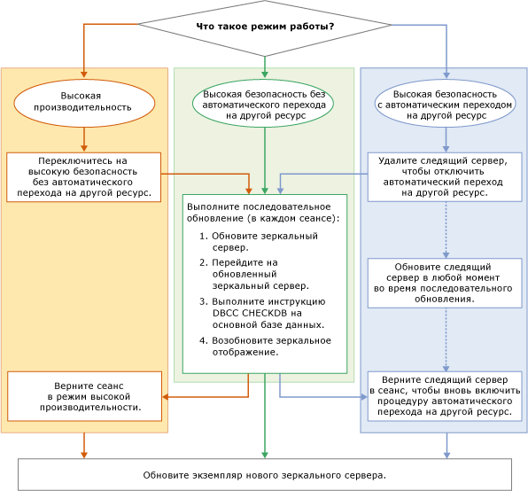

# Обновление зеркальных экземпляров
  При обновлении зеркального экземпляра [!INCLUDE[ssNoVersion](../../includes/ssnoversion-md.md)] установкой новой версии [!INCLUDE[ssCurrent](../../includes/sscurrent-md.md)] , нового пакета обновления [!INCLUDE[ssNoVersion](../../includes/ssnoversion-md.md)]или накопительного пакета обновления, а также при установке нового пакета обновления Windows или накопительного пакета обновления Windows вы можете выполнить последовательное обновление, что позволит сократить время простоя каждой зеркальной базы данных до одного цикла перехода на другой ресурс вручную (или двух циклов перехода на другой ресурс вручную, если нужно вернуться к исходной первичной реплике). Последовательное обновление является многоэтапным процессом, который в самом простом случае заключается в обновлении экземпляра [!INCLUDE[ssCurrent](../../includes/sscurrent-md.md)] , выступающего в роли зеркального сервера в сеансе зеркального отображения, последующем переходе на зеркальную базу данных вручную, обновлении экземпляра [!INCLUDE[ssCurrent](../../includes/sscurrent-md.md)] , бывшего основным, и возобновлении зеркального отображения. Набор операций, фактически применяемый на практике, будет зависеть от режима работы, а также от количества и структуры сеансов зеркального отображения, активных в обновляемых экземплярах [!INCLUDE[ssCurrent](../../includes/sscurrent-md.md)] .  
  
> [!NOTE]  
>  Для получения сведений об использовании зеркального отображения базы данных с доставкой журналов во время миграции скачайте [технический документ "Зеркальное отображение баз данных и доставка журналов"](https://t.co/RmO6ruCT4J).  
  
## Предварительные требования  
 Перед установкой ознакомьтесь со следующими важными сведениями.  
  
-   [Supported Version and Edition Upgrades](../../database-engine/install-windows/supported-version-and-edition-upgrades.md). Убедитесь, что текущая версия операционной системы Windows позволяет обновить текущую версию SQL Server до версии SQL Server 2016. Например, вы не можете напрямую обновить экземпляр SQL Server 2005 до [!INCLUDE[ssCurrent](../../includes/sscurrent-md.md)].  
  
-   [Choose a Database Engine Upgrade Method](../../database-engine/install-windows/choose-a-database-engine-upgrade-method.md). Выберите подходящий метод обновления с учетом сведений о поддерживаемых версиях и обновлениях выпуска, а также компонентах, установленных в среде и требующих обновления (это нужно, чтобы обеспечить правильный порядок обновления этих компонентов).  
  
-   [Составление и тестирование плана обновления Database Engine](../../database-engine/install-windows/plan-and-test-the-database-engine-upgrade-plan.md). Просмотрите заметки о выпуске и известные проблемы, связанные с обновлением, изучите контрольный список предварительных требований, а затем разработайте и протестируйте план обновления.  
  
-   [Требования к оборудованию и программному обеспечению для установки SQL Server 2016](../../sql-server/install/hardware-and-software-requirements-for-installing-sql-server.md). Ознакомьтесь с требованиями к оборудованию и ПО для установки [!INCLUDE[ssCurrent](../../includes/sscurrent-md.md)]. Если требуется дополнительное программное обеспечение, установите его на каждом узле перед запуском обновления, чтобы минимизировать время простоя.  
  
## Рекомендуемые подготовительные действия (рекомендации)  
 Перед запуском последовательного обновления рекомендуется выполнить следующие действия.  
  
1.  Выполните пробную отработку отказа вручную по крайней мере в одном из сеансов зеркального отображения:  
  
    -   [Переключение сеанса зеркального отображения базы данных на другой ресурс вручную (среда SQL Server Management Studio)](../../database-engine/database-mirroring/manually-fail-over-a-database-mirroring-session-sql-server-management-studio.md)  
  
    -   [Переключение сеанса зеркального отображения базы данных на другой ресурс вручную (язык Transact-SQL)](../../database-engine/database-mirroring/manually-fail-over-a-database-mirroring-session-transact-sql.md).  
  
    > [!NOTE]  
    >  Дополнительные сведения об отработке отказа вручную см. в разделе [Переключение ролей во время сеанса зеркального отображения базы данных (SQL Server)](../../database-engine/database-mirroring/role-switching-during-a-database-mirroring-session-sql-server.md).  
  
2.  Обеспечьте защиту данных.  
  
    1.  Создайте полную резервную копию каждой основной базы данных.  
  
         [Создание полной резервной копии базы данных (SQL Server)](../../relational-databases/backup-restore/create-a-full-database-backup-sql-server.md)  
  
    2.  Выполните команду [DBCC CHECKDB](../../t-sql/database-console-commands/dbcc-checkdb-transact-sql.md) в каждой основной базе данных.  
  
## Этапы последовательного обновления  
 Конкретная последовательность действий в ходе последовательного обновления зависит от режима работы конфигурации зеркального отображения. Однако основные этапы остаются одинаковыми.  
  
> [!NOTE]  
>  Сведения о режимах работы см. в разделе [Режимы работы зеркального отображения базы данных](../../database-engine/database-mirroring/database-mirroring-operating-modes.md).  
  
 Блок-схема на следующем рисунке показывает основные этапы последовательного обновления для каждого режима работы. После рисунка описаны соответствующие процедуры.  
  
   
  
> [!IMPORTANT]  
>  Экземпляр сервера может одновременно исполнять различные роли зеркального отображения (основной сервер, зеркальный сервер или следящий сервер) в параллельных сеансах зеркального отображения. В этом случае придется соответствующим образом адаптировать процесс последовательного обновления. Дополнительные сведения см. в разделе [Переключение ролей во время сеанса зеркального отображения базы данных (SQL Server)](../../database-engine/database-mirroring/role-switching-during-a-database-mirroring-session-sql-server.md).  
  
> [!NOTE]  
>  Во многих случаях после завершения последовательного обновления будет выполнено переключение на исходный основной сервер.  
  
### Изменение режима сеанса с высокопроизводительного на режим высокой безопасности  
  
1.  Если сеанс зеркального отображения выполняется в высокопроизводительном режиме, перед выполнением последовательного обновления измените его на режим высокой безопасности без автоматической отработки отказа.  
  
    > [!IMPORTANT]  
    >  Если зеркальный сервер географически удален от основного, то последовательное обновление может оказаться неподходящим вариантом.  
  
    -   В [!INCLUDE[ssManStudioFull](../../includes/ssmanstudiofull-md.md)]: измените параметр **Режим работы** на **Высокая безопасность без автоматической отработки отказа (синхронный)** с помощью страницы [Зеркальное отображение](../../relational-databases/databases/database-properties-mirroring-page.md) диалогового окна **Свойства базы данных**. Дополнительные сведения о доступе к этой странице см. в разделе [Запуск мастер настройки безопасности зеркального отображения баз данных (среда SQL Server Management Studio)](../../database-engine/database-mirroring/start-the-configuring-database-mirroring-security-wizard.md).  
  
    -   В [!INCLUDE[tsql](../../includes/tsql-md.md)]: установите безопасность транзакций в значение FULL. Дополнительные сведения см. в разделе [Изменение безопасности транзакций в сеансах зеркального отображения базы данных (Transact-SQL)](../../database-engine/database-mirroring/change-transaction-safety-in-a-database-mirroring-session-transact-sql.md).  
  
### Удаление следящего сервера из сеанса  
  
1.  Если сеанс зеркального отображения включает следящий сервер, рекомендуется удалить его перед выполнением последовательного обновления. В противном случае при обновлении экземпляра зеркального сервера доступность базы данных будет зависеть от следящего сервера, остающегося подключенным к экземпляру основного сервера. После удаления следящего сервера его можно обновить в любой момент во время последовательного обновления, без дополнительного простоя базы данных.  
  
    > [!NOTE]  
    >  Дополнительные сведения см. в разделе [Кворум: как следящий сервер влияет на доступность базы данных (зеркальное отображение базы данных)](../../database-engine/database-mirroring/quorum-how-a-witness-affects-database-availability-database-mirroring.md).  
  
    -   [Удаление следящего сервера из сеанса зеркального отображения базы данных (SQL Server)](../../database-engine/database-mirroring/remove-the-witness-from-a-database-mirroring-session-sql-server.md)  
  
### Выполнение последовательного обновления  
  
1.  Чтобы свести к минимуму время простоя, необходимо выполнить следующие рекомендации. Начните последовательное обновление с обновления участника зеркального отображения, который в настоящий момент является зеркальным сервером во всех сеансах зеркального отображения. На этом этапе, возможно, придется обновить несколько экземпляров сервера.  
  
    > [!NOTE]  
    >  Следящий сервер можно обновить в любой момент пошагового обновления. Например, если экземпляр сервера является зеркальным сервером в сеансе 1 и следящим сервером в сеансе 2, этот сервер можно обновить сразу.  
  
     Экземпляр сервера, который следует обновлять в первую очередь, зависит от текущей конфигурации сеансов зеркального отображения следующим образом.  
  
    -   Если какой-либо экземпляр сервера уже является зеркальным сервером во всех сеансах зеркального отображения, обновите его до новой версии.  
  
    -   Если все экземпляры сервера в настоящий момент являются основным сервером в одном из сеансов зеркального отображения, выберите для обновления один экземпляр сервера. Затем вручную переведите на другой ресурс каждую из его основных баз данных и обновите экземпляр сервера.  
  
     После обновления экземпляр сервера автоматически подключится к сеансам зеркального отображения.  
  
2.  В каждом сеансе зеркального отображения, зеркальный сервер которого был обновлен, дождитесь окончания синхронизации сеанса. Затем подключитесь к экземпляру основного сервера и вручную переведите этот сеанс на другой ресурс. При отработки отказа обновленный сервер становится основным сервером для этого сеанса, а бывший основной сервер становится зеркальным.  
  
     Цель этого этапа — сделать другой экземпляр сервера зеркальным во всех сеансах зеркального отображения, в которых он участвует.  
  
     **Ограничения, возникающие после перехода на обновленную отработку отказа сервера.**  
  
     После перехода с более ранней версии экземпляра сервера на экземпляр сервера [!INCLUDE[ssCurrent](../../includes/sscurrent-md.md)] сеанс зеркального отображения базы данных приостанавливается. Его нельзя возобновить, пока не будет обновлен другой участник. Однако основной сервер принимает подключения и разрешает доступ и изменение данных в основной базе данных.  
  
    > [!NOTE]  
    >  Для установки нового сеанса зеркального отображения требуется, чтобы на всех участниках работала одинаковая версия [!INCLUDE[ssNoVersion](../../includes/ssnoversion-md.md)].  
  
3.  После перехода на другой ресурс рекомендуется выполнить в основной базе данных команду [DBCC CHECKDB](../../t-sql/database-console-commands/dbcc-checkdb-transact-sql.md) .  
  
4.  Обновите каждый экземпляр сервера, который в настоящий момент является зеркальным сервером во всех сеансах зеркального отображения, в которых он участвует. На этом этапе, возможно, придется обновить несколько серверов.  
  
    > [!IMPORTANT]  
    >  В сложной конфигурации зеркального отображения некоторые экземпляры сервера могут все еще исполнять роль основного сервера в одном или нескольких сеансах зеркального отображения. Повторите шаги 2 — 4 для этих экземпляров серверов, пока не будут обновлены все вовлеченные в этот процесс экземпляры.  
  
5.  Возобновление сеанса зеркального отображения.  
  
    > [!NOTE]  
    >  Автоматическая отработка отказа не будет работать, пока следящий сервер не будет обновлен и возвращен в сеанс зеркального отображения.  
  
6.  Обновите все оставшиеся экземпляры сервера, являющиеся следящими во всех сеансах зеркального отображения. После подключения обновленного следящего сервера к сеансу зеркального отображения становится возможным автоматическая отработка отказа. На этом этапе, возможно, придется обновить несколько серверов.  
  
### Возвращение сеанса в высокопроизводительный режим  
  
1.  При необходимости вернитесь в высокопроизводительный режим, используя один из следующих методов.  
  
    -   В [!INCLUDE[ssManStudioFull](../../includes/ssmanstudiofull-md.md)]: измените параметр **Режим работы** на **Высокая производительность (асинхронный)** с помощью страницы [Зеркальное отображение](../../relational-databases/databases/database-properties-mirroring-page.md) диалогового окна **Свойства базы данных** .  
  
    -   В [!INCLUDE[tsql](../../includes/tsql-md.md)]: с помощью команды [ALTER DATABASE](../../t-sql/statements/alter-database-transact-sql-database-mirroring.md)установите безопасность транзакций в значение OFF.  
  
### Возвращение следящего сервера в сеанс зеркального отображения  
  
1.  При необходимости в режиме высокой безопасности повторно соедините следящий сервер со всеми сеансами зеркального отображения.  
  
     **Возврат следящего сервера**  
  
    -   [Добавление или замена следящего сервера зеркального отображения базы данных (среда SQL Server Management Studio)](../../database-engine/database-mirroring/add-or-replace-a-database-mirroring-witness-sql-server-management-studio.md)  
  
    -   [Добавление следящего сервера для зеркального отображения базы данных с использованием проверки подлинности Windows (Transact-SQL)](../../database-engine/database-mirroring/add-a-database-mirroring-witness-using-windows-authentication-transact-sql.md)  
  
## См. также:  
 [Обновление до SQL Server 2016 с помощью мастера установки (программа установки)](../../database-engine/install-windows/upgrade-sql-server-using-the-installation-wizard-setup.md)   
 [Установка SQL Server 2016 из командной строки](../../database-engine/install-windows/install-sql-server-2016-from-the-command-prompt.md)   
 [Зеркальное отображение базы данных ALTER DATABASE (Transact-SQL)](../../t-sql/statements/alter-database-transact-sql-database-mirroring.md)   
 [BACKUP (Transact-SQL)](../../t-sql/statements/backup-transact-sql.md)   
 [Просмотр состояния зеркального отображения базы данных (среда SQL Server Management Studio)](../../database-engine/database-mirroring/view-the-state-of-a-mirrored-database-sql-server-management-studio.md)   
 [Зеркальное отображение базы данных (SQL Server)](../../database-engine/database-mirroring/database-mirroring-sql-server.md)   
 [Переключение ролей во время сеанса зеркального отображения базы данных (SQL Server)](../../database-engine/database-mirroring/role-switching-during-a-database-mirroring-session-sql-server.md)   
 [Принудительный запуск службы в сеансе зеркального отображения базы данных (Transact-SQL)](../../database-engine/database-mirroring/force-service-in-a-database-mirroring-session-transact-sql.md)   
 [Запуск монитора зеркального отображения баз данных (среда SQL Server Management Studio)](../../database-engine/database-mirroring/start-database-mirroring-monitor-sql-server-management-studio.md)   
 [Режимы работы зеркального отображения базы данных](../../database-engine/database-mirroring/database-mirroring-operating-modes.md)  
  
  

