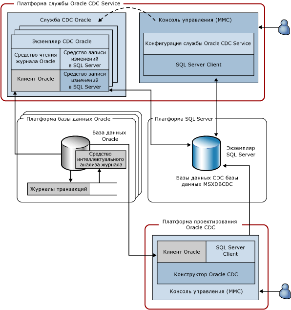

# Архитектура службы системы отслеживания измененных данных для Oracle компании Attunity
  Служба CDC Service для Oracle отслеживает изменения выбранных таблиц из одной или нескольких исходных баз данных Oracle и записывает сведения о них в базы данных CDC [!INCLUDE[ssNoVersion](../../includes/ssnoversion-md.md)] , расположенные в экземпляре [!INCLUDE[ssNoVersion](../../includes/ssnoversion-md.md)] . На следующей диаграмме показаны компоненты, составляющие службу CDC Service для Oracle.  
  
   
  
 На рисунке показано использование четырех платформ. Во многих случаях эти платформы могут дублировать друг друга, однако на диаграмме представлен стандартный вариант использования. Например, часто бывает целесообразно, чтобы Oracle и базы данных [!INCLUDE[ssNoVersion](../../includes/ssnoversion-md.md)] выполнялись на разных компьютерах, а не совместно с платформой службы Oracle CDC Service или платформой, с которой запускается служба CDC Service. На этом рисунке показаны следующие платформы:  
  
-   Служба Oracle CDC Service. Это может быть любой поддерживаемый компьютер с ОС Windows, где установлена и запущена служба Oracle CDC Service. Эта платформа может также представлять собой узел в отказоустойчивом кластере Microsoft (конфигурации высокого уровня доступности описаны далее в этом документе).  
  
-   База данных Oracle. Это может быть любой компьютер, на котором работает поддерживаемая версия базы данных Oracle. Сюда входят любые компьютеры, работающие под управлением ОС Windows, Linux или любой другой операционной системы, поддерживаемой версией установленной базы данных Oracle. Следует отметить, что на диаграмме показано несколько таких платформ, поскольку одна служба Oracle CDC Service может отслеживать изменения в нескольких исходных базах данных Oracle.  
  
-   [!INCLUDE[ssNoVersion](../../includes/ssnoversion-md.md)]: это может быть любой компьютер, на котором работает база данных-получатель [!INCLUDE[ssNoVersion](../../includes/ssnoversion-md.md)] (поддерживаемый номер SKU [!INCLUDE[ssCurrent](../../includes/sscurrent-md.md)]). Служба Oracle CDC Service поддерживает один целевой экземпляр [!INCLUDE[ssNoVersion](../../includes/ssnoversion-md.md)] , где хранятся таблицы изменений и конфигурация службы. Платформа [!INCLUDE[ssNoVersion](../../includes/ssnoversion-md.md)] может также представлять собой кластеризованный экземпляр [!INCLUDE[ssCurrent](../../includes/sscurrent-md.md)] или зеркалированный экземпляр [!INCLUDE[ssCurrent](../../includes/sscurrent-md.md)] с функцией **AlwaysOn** .  
  
-   Конструктор Oracle CDC. Это может быть любой поддерживаемый компьютер с ОС Windows, который может осуществлять доступ к базе данных-источнику Oracle и базе данных-получателю [!INCLUDE[ssNoVersion](../../includes/ssnoversion-md.md)] .  
  
 В следующей таблице описаны компоненты, которые выполняются на четырех платформах, указанных выше.  
  
|Компонент/Описание|Компонент включает в себя следующее:|  
|----------------------------|----------------------------|  
|Служба Oracle CDC Service. Это служба Windows, где выполняются действия по отслеживанию измененных данных.|Экземпляр Oracle CDC. Подпроцесс службы Oracle CDC Service, который обрабатывает действия по отслеживанию измененных данных для одной исходной базы данных Oracle (на одну исходную базу данных Oracle приходится один экземпляр Oracle CDC).|  
||Средство чтения журнала Oracle. Читает журналы транзакций Oracle с помощью клиента Oracle.|  
||Клиент Oracle. Клиент Oracle Instant Client, используемый для связи с Oracle. Это обязательный компонент, который нужно получить у Oracle и установить до установки службы Oracle CDC Service.|  
||[!INCLUDE[ssNoVersion](../../includes/ssnoversion-md.md)] . Записывает зафиксированные изменения, внесенные в отслеживаемые таблицы Oracle, в таблицы изменений [!INCLUDE[ssNoVersion](../../includes/ssnoversion-md.md)]. Этот компонент также поддерживает состояние отслеживания в целевой базе данных [!INCLUDE[ssNoVersion](../../includes/ssnoversion-md.md)] .|  
||[!INCLUDE[ssNoVersion](../../includes/ssnoversion-md.md)]Клиент ODBC. Собственный клиент Microsoft Native Client для [!INCLUDE[ssCurrent](../../includes/sscurrent-md.md)]. Это обязательный компонент, который нужно получить у Microsoft и установить до установки службы Oracle CDC Service.|  
|Конфигурация службы Oracle CDC Service. Это оснастка консоли управления (MMC), которая создает службу Windows и настраивает ее конфигурацию.|[!INCLUDE[ssNoVersion](../../includes/ssnoversion-md.md)] . Клиент SQL ADO.NET, который поставляется с платформой .NET Framework версии 4.|  
|База данных Oracle. База данных-источник Oracle, в которой отслеживаются изменения выбранных таблиц.|Средство анализа журналов. Компонент Oracle, с помощью которого читаются журналы транзакций Oracle.|  
||Журнал транзакций. Активные и архивированные журналы операций повтора Oracle, используемые Oracle для отката транзакций и восстановления после сбоев (в этом случае база данных Oracle должна работать в режиме ARCHIVELOG).|  
|[!INCLUDE[ssNoVersion](../../includes/ssnoversion-md.md)] . Экземпляр [!INCLUDE[ssNoVersion](../../includes/ssnoversion-md.md)] , где размещаются базы данных CDC. Это может быть кластеризованный экземпляр [!INCLUDE[ssNoVersion](../../includes/ssnoversion-md.md)] (отказоустойчивый кластер) или зеркальная база данных (с функцией AlwaysOn).|База данных MSXDBCDC. База данных, в которой хранятся сведения о службе CDC Service, работающей с этим экземпляром [!INCLUDE[ssNoVersion](../../includes/ssnoversion-md.md)] . Здесь также хранятся сведения об экземплярах Oracle CDC, обрабатываемых каждой службой CDC Service. Эта база данных создается в ходе процесса создания службы CDC Service.|  
||Базы данных CDC. Базы данных [!INCLUDE[ssNoVersion](../../includes/ssnoversion-md.md)] , в которых хранятся изменения одной из баз данных-источников Oracle. В базах данных CDC обеспечена возможность работы CDC [!INCLUDE[ssNoVersion](../../includes/ssnoversion-md.md)] , поэтому у них есть таблицы и функции CDC [!INCLUDE[ssNoVersion](../../includes/ssnoversion-md.md)] , облегчающие прием данных об изменениях, получаемых из Oracle.|  
|Конструктор Oracle CDC. Оснастка консоли управления (MMC), которая позволяет создавать экземпляры Oracle CDC. Используется для выбора таблиц и столбцов, в которых будут отслеживаться изменения, указания данных подключения к Oracle и управления жизненным циклом экземпляров CDC.|[!INCLUDE[ssNoVersion](../../includes/ssnoversion-md.md)] . Клиент SQL ADO.NET, который поставляется с платформой .NET Framework версии 4.|  
||Клиент Oracle. Клиент Oracle Instant Client, используемый для связи с Oracle. Это обязательный компонент, который нужно получить у Oracle и установить до установки службы Oracle CDC Service.|  
  
 Служба Oracle CDC Service и ее дочерние экземпляры Oracle CDC могут обмениваться данными только с исходной базой (базами) данных Oracle и целевым экземпляром [!INCLUDE[ssNoVersion](../../includes/ssnoversion-md.md)] в качестве клиентов. Они не занимаются активным прослушиванием какого-либо сетевого или иного протокола. Служба Oracle CDC Service отслеживает изменения конфигурации баз данных CDC и обновляет свою работу с учетом обновленной конфигурации.  
  
  
