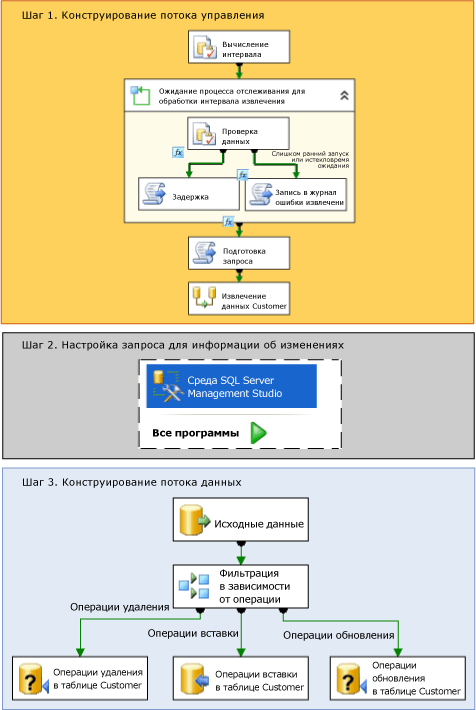

# Система отслеживания измененных данных (SSIS)
  В [!INCLUDE[ssNoVersion](../../includes/ssnoversion-md.md)]система отслеживания измененных данных предоставляет эффективное решение для проблемы проведения добавочных загрузок из исходных таблиц в киоски и хранилища данных.  
  
## Система отслеживания измененных данных  
 Исходные таблицы со временем изменяются. Витрины данных или хранилища данных, основанные на этих таблицах, должны отражать эти изменения. Однако процесс, предполагающий периодическое копирование моментальных снимков всего источника данных, требует слишком много времени и ресурсов. Альтернативные подходы, предусматривающие использование столбцов отметок времени, триггеров или сложных запросов, часто приводят к снижению производительности и повышению сложности системы. Необходим надежный поток измененных данных, структурированный таким образом, чтобы потребители могли легко применять его к целевым представлениям данных. Это обеспечивает система отслеживания измененных данных, реализованная в [!INCLUDE[ssNoVersion](../../includes/ssnoversion-md.md)] .  
  
 Система отслеживания измененных данных компонента [!INCLUDE[ssDE](../../includes/ssde-md.md)] регистрирует действия по вставке, обновлению и удалению, применяемые к таблицам [!INCLUDE[ssNoVersion](../../includes/ssnoversion-md.md)] , сохраняя сведения об операциях изменения в легкообрабатываемом реляционном формате. Таблицы изменений, используемые системой отслеживания измененных данных, содержат столбцы, отражающие структуру столбцов отслеживаемых исходных таблиц, а также метаданные, необходимые для понимания того, какие изменения произошли в каждой строке.  
  
> [!NOTE]
>  Система отслеживания измененных данных доступна не во всех выпусках [!INCLUDE[msCoName](../../includes/msconame-md.md)][!INCLUDE[ssNoVersion](../../includes/ssnoversion-md.md)]. Сведения о функциях, поддерживаемых различными выпусками [!INCLUDE[ssNoVersion](../../includes/ssnoversion-md.md)], см. в статье [Возможности, поддерживаемые выпусками SQL Server 2016](~/sql-server/editions-and-supported-features-for-sql-server-2016.md).  
  
## Работа системы отслеживания измененных данных в службах Integration Services  
 Пакет служб [!INCLUDE[ssISnoversion](../../includes/ssisnoversion-md.md)] может легко собирать в базах данных [!INCLUDE[ssNoVersion](../../includes/ssnoversion-md.md)] информацию об изменениях, чтобы выполнять рациональные добавочные загрузки в хранилище данных. Однако применять службы [!INCLUDE[ssISnoversion](../../includes/ssisnoversion-md.md)] для загрузки измененных данных можно лишь после того, как администратор включит систему отслеживания измененных данных для базы данных и таблиц, в которых будут отслеживаться изменения. Дополнительные сведения о настройке системы отслеживания измененных данных см. в разделе [Включение и отключение фиксации измененных данных (SQL Server)](../../relational-databases/track-changes/enable-and-disable-change-data-capture-sql-server.md).  
  
 После того, как администратор включил систему отслеживания измененных данных в соответствующей базе данных, можно создать пакет, выполняющий добавочную загрузку измененных данных. На следующей диаграмме показаны шаги по созданию такого пакета, который выполняет добавочную загрузку измененных данных из одной таблицы.  
  
   
  
 Как показано в предыдущей диаграмме, процесс создания пакета, выполняющего добавочную загрузку измененных данных, состоит из следующих шагов.  
  
 **Шаг 1. Конструирование потока управления**  
 В потоке управления пакета необходимо определить следующие задачи.  
  
-   Вычисление начального и конечного значения **datetime** для интервала изменений в исходных данных, которые необходимо получить.  
  
     Чтобы вычислить эти значения, можно использовать задачу "Выполнение SQL" или выражения служб [!INCLUDE[ssISnoversion](../../includes/ssisnoversion-md.md)] с функциями **datetime** . Затем эти конечные точки сохраняются в переменных пакета для дальнейшего использования в пакете.  
  
     **Дополнительные сведения см. в следующих разделах:** [Задание интервала для информации об изменениях данных](../../integration-services/change-data-capture/specify-an-interval-of-change-data.md)  
  
-   Определение готовности измененных данных в выбранном временном интервале. Этот шаг необходим потому, что процесс асинхронного сбора, возможно, еще не дошел до выбранной конечной точки.  
  
     Чтобы определить, готовы ли данные, начните с контейнера «цикл по элементам». При необходимости отложите выполнение до тех пор, пока не будут готовы данные об изменениях для выбранного интервала времени. Внутри контейнера «цикл по элементам» используйте задачу «Выполнение SQL», чтобы выполнить запрос к таблицам сопоставления времени, обслуживаемых с помощью системы отслеживания измененных данных. Затем при необходимости временно отложите выполнение пакета с помощью задачи «Скрипт», которая вызывает метод **Thread.Sleep** , или с помощью другой задачи «Выполнение SQL» с инструкцией **WAITFOR** . Можно также с помощью другой задачи «Скрипт» зарегистрировать ошибку или время ожидания.  
  
     **Дополнительные сведения см. в следующих разделах:** [Определение готовности информации об изменениях данных](../../integration-services/change-data-capture/determine-whether-the-change-data-is-ready.md)  
  
-   Подготовка строки запроса, которая будет использована для запроса измененных данных.  
  
     Используйте задачу «Скрипт» или задачу «Выполнение SQL», чтобы собрать инструкцию SQL, которая будет использоваться для запроса изменений.  
  
     **Дополнительные сведения см. в следующих разделах:** [Подготовка к запросу информации об изменениях данных](../../integration-services/change-data-capture/prepare-to-query-for-the-change-data.md)  
  
 **Шаг 2. Настройка запроса для получения информации об изменениях**  
 Создайте возвращающую табличное значение функцию, которая будет запрашивать данные.  
  
 Для разработки и сохранения запроса используйте среду [!INCLUDE[ssManStudioFull](../../includes/ssmanstudiofull-md.md)] .  
  
 **Дополнительные сведения см. в следующих разделах:** [Получение и интерпретация информации об изменениях данных](../../integration-services/change-data-capture/retrieve-and-understand-the-change-data.md)  
  
 **Шаг 3. Проектирование потока данных**  
 В потоке данных пакета необходимо определить следующие задачи.  
  
-   Получение измененных данных из таблиц изменений.  
  
     Чтобы получить данные, используйте исходный компонент для выполнения запросов к таблицам изменений, попадающих в выбранный временной интервал. Источник вызывает возвращающую табличное значение функцию Transact-SQL, которая должна быть подготовлена заранее.  
  
     **Дополнительные сведения см. в следующих разделах:** [Получение и интерпретация информации об изменениях данных](../../integration-services/change-data-capture/retrieve-and-understand-the-change-data.md)  
  
-   Разбиение изменений на операции вставки, обновления и удаления для обработки.  
  
     Чтобы разбить изменения, используйте преобразование «Условное разбиение», которое позволяет направлять операции вставки, обновления и удаления в различные выходы для соответствующей обработки.  
  
     **Дополнительные сведения см. в следующих разделах:** [Обработка операций вставки, обновления и удаления](../../integration-services/change-data-capture/process-inserts-updates-and-deletes.md)  
  
-   Применение операций вставки, удаления и обновления к назначению.  
  
     Чтобы применить изменения к назначению, используйте компонент назначения, для применения операции вставки к назначению. Кроме того, используйте преобразования «Команда OLE DB» с параметризованными инструкциями UPDATE и DELETE, чтобы применить к назначению операции обновления и удаления. Также можно применять операции обновления и удаления с помощью компонентов назначения, чтобы сохранить строки во временных таблицах. Затем используйте задачи «Выполнение SQL», чтобы выполнить операции массового обновления и массового удаления для назначения для временных таблиц.  
  
     **Дополнительные сведения см. в следующих разделах:** [Применение изменений в назначении](../../integration-services/change-data-capture/apply-the-changes-to-the-destination.md)  
  
### Изменения данных из нескольких таблиц  
 Процесс, отображенный в предыдущей диаграмме и шагах, предполагает добавочную загрузку из одной таблицы. В ситуациях, когда приходится осуществлять добавочную загрузку из нескольких таблиц, в целом используется тот же процесс. Однако для обработки нескольких таблиц необходимо изменить структуру пакета. Дополнительные сведения о создании пакета, выполняющего добавочную загрузку из нескольких таблиц, см. в разделе [Выполнение добавочной загрузки нескольких таблиц](../../integration-services/change-data-capture/perform-an-incremental-load-of-multiple-tables.md).  
  
## Образцы пакетов системы отслеживания изменений данных  
 [!INCLUDE[ssISnoversion](../../includes/ssisnoversion-md.md)] предоставляют два образца, демонстрирующих использование системы отслеживания измененных данных в пакетах. Дополнительные сведения см. в следующих разделах:  
  
-   [Файл Readme. Образец пакета для отслеживания измененных данных за указанный интервал](https://go.microsoft.com/fwlink/?LinkId=133507)  
  
-   [Файл Readme. Образец пакета для отслеживания измененных данных с момента последнего запроса](https://go.microsoft.com/fwlink/?LinkId=133508)  
  
## Связанные задачи  
  
-   [Задание интервала для информации об изменениях данных](../../integration-services/change-data-capture/specify-an-interval-of-change-data.md)  
  
-   [Определение готовности информации об изменениях данных](../../integration-services/change-data-capture/determine-whether-the-change-data-is-ready.md)  
  
-   [Подготовка к запросу информации об изменениях данных](../../integration-services/change-data-capture/prepare-to-query-for-the-change-data.md)  
  
-   [Создание функции для получения информации об изменениях данных](../../integration-services/change-data-capture/create-the-function-to-retrieve-the-change-data.md)  
  
-   [Получение и интерпретация информации об изменениях данных](../../integration-services/change-data-capture/retrieve-and-understand-the-change-data.md)  
  
-   [Обработка операций вставки, обновления и удаления](../../integration-services/change-data-capture/process-inserts-updates-and-deletes.md)  
  
-   [Применение изменений в назначении](../../integration-services/change-data-capture/apply-the-changes-to-the-destination.md)  
  
-   [Выполнение добавочной загрузки нескольких таблиц](../../integration-services/change-data-capture/perform-an-incremental-load-of-multiple-tables.md)  
  
## См. также  
 Запись блога [SSIS Design Pattern — Incremental Load](https://go.microsoft.com/fwlink/?LinkId=217679) (Шаблон разработки SSIS — добавочная загрузка) на сайте sqlblog.com  
  
  
