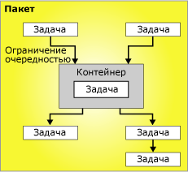

# Поток управления

[!INCLUDE[ssis-appliesto](../../includes/ssis-appliesto-ssvrpluslinux-asdb-asdw-xxx.md)]

  Пакет состоит из потока управления, а также, одного или нескольких потоков данных (необязательно). [!INCLUDE[ssNoVersion](../../includes/ssnoversion-md.md)] [!INCLUDE[ssISnoversion](../../includes/ssisnoversion-md.md)] предоставляют три различных типа элементов потока управления: контейнеры, которые обеспечивают структуры в пакетах; задачи, которые обеспечивают функциональность; элементы управления очередностью, соединяющие выполняемые компоненты, контейнеры и задачи в упорядоченный поток управления.  
  
 Дополнительные сведения см. в разделах [Precedence Constraints](../../integration-services/control-flow/precedence-constraints.md), [Integration Services Containers](../../integration-services/control-flow/integration-services-containers.md)и [Integration Services Tasks](../../integration-services/control-flow/integration-services-tasks.md).  
  
 Следующая диаграмма показывает поток управления, который имеет один контейнер и шесть задач. Пять задач пакетного уровня и одна задача уровня контейнера. Задача находится в контейнере.  
  
   
  
 Архитектура служб [!INCLUDE[ssISnoversion](../../includes/ssisnoversion-md.md)] поддерживает вложение контейнеров, и поток управления может включать множество уровней вложенных контейнеров. Так, пакет может содержать контейнер, например контейнер «цикл по каждому элементу», который в свою очередь может содержать другой контейнер «цикл по каждому элементу», и так далее.  
  
 Обработчики событий также имеют потоки управления, которые формируются, используя те же самые виды элементов потока управления.  
  
## Реализация потока управления  
 Поток управления в пакете создается с помощью вкладки **Поток управления** в конструкторе служб [!INCLUDE[ssIS](../../includes/ssis-md.md)] . Когда вкладка **Поток управления** открыта в области элементов приводится список задач и контейнеров, которые можно добавить в поток управления.  
  
 Следующая диаграмма демонстрирует поток управления простого пакета в конструкторе потока управления. Поток управления, показанный на диаграмме, состоит из трех задач пакетного уровня и одного контейнера пакетного уровня, который содержит три задачи. Задачи и контейнер связаны с помощью элементов управления очередностью.  
  
   
  
 Создание потока управления включает следующие задачи.  
  
-   Добавление контейнеров, которые реализуют повторяющиеся рабочие процессы в пакете или разделяют поток управления на подмножества.  
  
-   Добавление задач, которые поддерживают поток данных, подготавливают данные, исполняют рабочий процесс и функции бизнес-аналитики и реализуют скрипт.  
  
     Службы [!INCLUDE[ssISnoversion](../../includes/ssisnoversion-md.md)] включает множество задач, которые можно использовать для создания потока управления, отвечающего бизнес-требованиям пакета. Если пакет должен работать с данными, поток управления должен содержать по крайней мере одну задачу потока данных. Например, пакет может извлекать данные, объединять значения данных и затем записывать результаты в источник данных.  Дополнительные сведения см. в разделах [Задачи служб Integration Services](../../integration-services/control-flow/integration-services-tasks.md) и [Добавление задачи или контейнера в поток управления или удаление их из него](../../integration-services/control-flow/add-or-delete-a-task-or-a-container-in-a-control-flow.md).  
  
-   Соединение контейнеров и задач в упорядоченный поток управления путем использования элементов управления очередностью.  
  
     После добавления задачи или контейнера в область конструктора вкладки **Поток управления** конструктор служб [!INCLUDE[ssIS](../../includes/ssis-md.md)] автоматически добавляет к элементу соединитель. Если пакет содержит два или более элемента, задачи или контейнера, то их присоединение к потоку управления происходит путем перетаскивания их соединителей из одного элемента в другой.  
  
     Соединитель между двумя элементами представляет собой управление очередностью. Управление очередностью описывает связь между двумя соединенными элементами. Оно указывает порядок запуска задач и контейнеров во время выполнения и условия, при которых запускаются задачи и контейнеры. Например, элемент управления очередностью может указывать, что для запуска следующей задачи в потоке управления должна быть успешно выполнена предыдущая задача. Дополнительные сведения см. в статье [Precedence Constraints](../../integration-services/control-flow/precedence-constraints.md).  
  
-   Добавление диспетчеров соединений.  
  
     Многим задачам требуется соединение с источником данных, поэтому необходимо добавить диспетчеры соединений, запрашиваемые задачей для пакета. Контейнер «цикл по каждому элементу» также может затребовать диспетчер соединений, в зависимости от используемого им типа перечислителя. Добавление диспетчеров соединений возможно в процессе поэлементного построения потока управления или до начала конструирования потока управления. Дополнительные сведения см. в разделах [Соединения в службах Integration Services (SSIS)](../../integration-services/connection-manager/integration-services-ssis-connections.md) и [Создание диспетчеров соединений](https://msdn.microsoft.com/library/6ca317b8-0061-4d9d-b830-ee8c21268345).  
  
 Конструктор служб [!INCLUDE[ssIS](../../includes/ssis-md.md)] также включает много возможностей разработки, которые можно использовать для управления областью конструктора и производить самодокументирование потока управления.  
  
## Связанные задачи  
  
-   [Добавление задачи или контейнера в поток управления или удаление их из него](../../integration-services/control-flow/add-or-delete-a-task-or-a-container-in-a-control-flow.md)  
  
-   [Задание свойств задач или контейнеров](https://msdn.microsoft.com/library/52d47ca4-fb8c-493d-8b2b-48bb269f859b)  
  
-   [Группирование и разгруппирование компонентов](../../integration-services/group-or-ungroup-components.md)  
  
  
