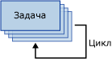

# Контейнер «цикл по элементам»
  Контейнер «цикл по элементам» определяет повторяющийся поток управления в пакете. Управление циклом аналогично структуре цикла **For** в языках программирования. В ходе каждого повтора цикла контейнер «цикл по элементам» вычисляет выражение и повторяет рабочий процесс до тех пор, пока результатом выражения не станет **False**.  
  
 Контейнер "цикл по элементам" использует следующие элементы для определения цикла:  
  
-   дополнительное выражение инициализации, в котором присваиваются значения счетчикам цикла;  
  
-   выражение вычисления, содержащее выражение, которое используется для проверки необходимости продолжения или остановки цикла;  
  
-   дополнительное выражение итерации, которое увеличивает или уменьшает счетчик цикла.  
  
 На следующей диаграмме показан контейнер «цикл по элементам» с задачей «Отправка почты». Если выражение инициализации равно `@Counter = 0`, выражение вычисления равно `@Counter < 4`, а выражение итерации равно `@Counter = @Counter + 1`, то цикл повторяется четыре раза, после чего отправляет четыре электронных сообщения.  
  
   
  
 Выражения должны являться допустимыми выражениями служб [!INCLUDE[ssNoVersion](../../includes/ssnoversion-md.md)] [!INCLUDE[ssISnoversion](../../includes/ssisnoversion-md.md)] .  
  
 Для создания выражений инициализации и присваивания можно использовать оператор присваивания (=). Этот оператор не поддерживается грамматикой выражений служб Integration Services и может быть использован в контейнере «цикл по элементам» только в выражениях инициализации и присваивания. Любое выражение, использующее оператор присваивания должен иметь синтаксис `@Var = <expression>`, где **Var** является переменной среды выполнения и \<выражение > — это выражение, соответствующее правилам [!INCLUDE[ssIS](../../includes/ssis-md.md)] выражение синтаксис. Выражение может содержать переменные, литералы и другие операторы и функции, которые поддерживаются грамматикой выражений служб SSIS. Выражение должно возвращать тип данных, который может быть приведен к типу данных переменной.  
  
 Контейнер «цикл по элементам» может содержать только одно выражение вычисления. Это означает, что контейнер «цикл по элементам» выполняет все элементы потока управления одинаковое количество раз. Ввиду того, что контейнер «цикл по элементам» может включать другие контейнеры «цикл по элементам», в пакетах можно создавать вложенные циклы и сложные циклы выполнения.  
  
 Можно устанавливать свойство транзакции для контейнера «цикл по элементам», чтобы определить транзакцию для вложенного набора пакета потока управления. Таким образом, возможно выполнение транзакции на более детальном уровне. Например, если контейнер «цикл по элементам» несколько раз повторяет выполнение потока управления для обновления данных, можно настроить «цикл по элементам» и его поток управления с использованием транзакции, чтобы в случае неполного обновления данных обновление вообще не было произведено. Дополнительные сведения см. в разделе [Транзакции служб Integration Services](../../integration-services/integration-services-transactions.md).  
  
## Добавление итерации к потоку управления с контейнер цикла For
  [!INCLUDE[ssISnoversion](../../includes/ssisnoversion-md.md)]включает в себя контейнер цикла For, — элемент потока управления, который позволяет легко использовать циклы, условно повторяет выполнение потока управления в пакете. Дополнительные сведения см. в разделе [Контейнер «цикл по элементам»](../../integration-services/control-flow/for-loop-container.md).  
  
 Контейнер «цикл по элементам» проверяет условие на каждом шаге цикла и останавливается, если условие приобретает значение false. Контейнер «цикл по элементам» включает в себя выражения для инициализации цикла, указывающие условие выполнения, которое останавливает выполнение повторяющегося потока управления, а также выражения, присваивающие значение, изменяющее данное значение, с которым сравнивается условие выполнения. Условие выполнения является обязательным, выражения инициализации и присваивания являются необязательными.  
  
 Контейнер «цикл по элементам» не добавляет новых функций, а только предоставляет структуру, в которой можно построить повторяемый поток управления. Чтобы контейнер заработал, необходимо включить в контейнер «цикл по элементам» как минимум одну задачу. Дополнительные сведения см. в разделе [Integration Services Tasks](../../integration-services/control-flow/integration-services-tasks.md).  
  
 Контейнер «цикл по элементам» может включать поток управления с несколькими задачами и может содержать другие контейнеры. Добавление задач и контейнеров в контейнер «цикл по элементам» сходно с добавлением их к пакету, только перетаскивание происходит в контейнер «цикл по элементам», а не в пакет. Если контейнер «цикл по элементам» содержит более одной задачи или контейнера, их можно соединить с использованием объектов управления очередностью, как и в пакете. Дополнительные сведения см. в статье [Precedence Constraints](../../integration-services/control-flow/precedence-constraints.md).  
  
## Добавить контейнер в потоке управления  
  
1.  Добавьте к пакету контейнер «цикл по элементам». Дополнительные сведения см. в разделе [Добавление задачи или контейнера в поток управления или удаление их из него](../../integration-services/control-flow/add-or-delete-a-task-or-a-container-in-a-control-flow.md).  
  
2.  Добавьте в контейнер «цикл по элементам» задачи и контейнеры. Дополнительные сведения см. в разделе [Добавление задачи или контейнера в поток управления или удаление их из него](../../integration-services/control-flow/add-or-delete-a-task-or-a-container-in-a-control-flow.md).  
  
3.  Соедините задачи и контейнеры в контейнере «цикл по элементам», используя объекты управления очередностью. Дополнительные сведения см. в разделе [Соединение задач и контейнеров с помощью элементов управления очередностью по умолчанию](http://msdn.microsoft.com/library/8f31f15f-98ff-4c35-b41f-8b8cfd148d75).  
  
4.  Задайте параметры контейнера «цикл по элементам». Дополнительные сведения см. в разделе [Настройка контейнера «цикл по элементам»](http://msdn.microsoft.com/library/b9cd7ea7-b198-4a35-8b16-6acf09611ca5).  

##  Настройка контейнера «цикл по элементам»
В процедуре описывается, как настроить контейнер «цикл по элементам» с помощью диалогового окна **Редактор циклов по элементам** .  
  
 Пример контейнера цикла «по элементам» см. в статье [Циклы SSIS, не завершающиеся сбоями](http://go.microsoft.com/fwlink/?LinkId=240295) на сайте bimonkey.com.  
  
1.  В среде [!INCLUDE[ssBIDevStudioFull](../../includes/ssbidevstudiofull-md.md)]дважды щелкните контейнер "цикл по элементам", чтобы открыть **Редактор циклов по элементам**.  
  
2.  При необходимости измените имя и описание контейнера «цикл по элементам».  
  
3.  При необходимости введите выражение инициализации в текстовое поле **InitExpression** .  
  
4.  Введите выражение в текстовое поле **EvalExpression** .  
  
    > [!NOTE]  
    >  Выражение должно иметь логическое значение. Если значением этого выражения будет **false**, выполнение цикла останавливается.  
  
5.  При необходимости введите выражение присвоения в текстовое поле **AssignExpression** .  
  
6.  При необходимости щелкните **Выражения** и на странице **Выражения** создайте выражения свойств для свойств контейнера «цикл по элементам». Дополнительные сведения см. в разделе [Добавление или изменение выражение свойства](../../integration-services/expressions/add-or-change-a-property-expression.md).  
  
7.  Щелкните **ОК** , чтобы закрыть **Редактор циклов For**.  

## Для диалогового окна Редактор циклов
На странице **Цикл по элементам** диалогового окна **Редактор циклов по элементам** можно настроить цикл, в котором рабочий процесс будет повторяться до тех пор, пока заданное условие не примет значение False.  
  
 Дополнительные сведения о контейнере «цикл по элементам» и его использовании в пакетах см. в разделе [For Loop Container](../../integration-services/control-flow/for-loop-container.md).  
  
### Параметры  
 **InitExpression**  
 Необязательный параметр. Выражение для инициализации значений, используемых в цикле.  
  
 **EvalExpression**  
 Выражение, с помощью которого определяется условие завершения или продолжения цикла.  
  
 **AssignExpression**  
 Необязательный параметр. Выражение, с помощью которого каждый раз при повторении цикла изменяется условие.  
  
 **Название**  
 Содержит уникальное имя для контейнера «цикл по элементам». Это имя используется в качестве метки для значка задачи.  
  
> [!NOTE]  
>  Имена объектов в пределах пакета должны быть уникальными.  
  
 **Description**  
 Описание контейнера «цикл по элементам».  
 
## Использование выражений с контейнер цикла For  
 При конфигурировании контейнера «цикл по элементам» указанием условия выполнения, начального значения или присваиваемого значения можно использовать или константы, или выражения.  
  
 Выражения могут содержать переменные. Преимущество использования переменных состоит в том, что они могут изменяться во время выполнения, делая пакеты более гибкими и простыми в управлении. Максимальная длина выражения составляет 4000 символов.  
  
 При указании в выражении переменной ее имя должно начинаться с символа @. Например, переменная с именем **счетчика**, введите @Counter в выражении, которое использует контейнер цикла For. Если для данной переменной указывается пространство имен, необходимо заключать переменную и пространство имен в скобки. Например, для **счетчика** переменных в **MyNamespace** пространств имен, типов [@MyNamespace::Counter].  
  
 Переменные, используемые в контейнере «цикл по элементам», должны быть определены в области действия данного контейнера «цикл по элементам» или в области действия любого контейнера, стоящего выше в иерархии контейнеров данного пакета. Например контейнер «цикл по элементам» может использовать переменные, определенные в его области действия и определенные в области действия пакета. Дополнительные сведения см. в разделах [Переменные в службах Integration Services (SSIS)](../../integration-services/integration-services-ssis-variables.md) и [Использование переменных в пакетах](http://msdn.microsoft.com/library/7742e92d-46c5-4cc4-b9a3-45b688ddb787).  
  
 Грамматика выражений [!INCLUDE[ssIS](../../includes/ssis-md.md)] предоставляет полный набор операторов и функций для реализации сложных выражений для вычислений, инициализации и присваивания. Дополнительные сведения см. в разделе [Выражения служб Integration Services (SSIS)](../../integration-services/expressions/integration-services-ssis-expressions.md).  
  
  
## См. также  
 [Поток управления](../../integration-services/control-flow/control-flow.md)   
 [Службы Integration Services &#40; Службы SSIS &#41; Выражения](../../integration-services/expressions/integration-services-ssis-expressions.md)  
  
  
