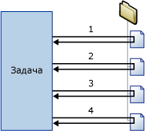

# Контейнер «цикл по каждому элементу»
  Контейнер «цикл по каждому элементу» определяет повторяющийся поток управления в пакете. Реализация цикла схожа с циклической структурой **Foreach** в языках программирования. Организация цикла в пакете происходит с помощью перечислителя Foreach.  Контейнер «цикл по каждому элементу» повторяет операции потока управления для каждого члена заданного перечислителя.  
  
 [!INCLUDE[ssNoVersion](../../includes/ssnoversion-md.md)] [!INCLUDE[ssISnoversion](../../includes/ssisnoversion-md.md)] доступны следующие типы перечислителей:  
  
-   Перечислитель ADO по каждой строке для перечисления строк в таблицах. Например, можно получить все строки в наборе записей ADO.  
  
     Назначение «Набор записей» сохраняет данные в памяти в наборе записей, который хранится в переменной пакета, относящейся к типу данных **Object** . Как правило, используется контейнер «цикл по каждому элементу» с перечислителем ADO по каждой строке для обработки одной строки набора записей за раз. Переменная, указанная для перечислителя ADO по каждой строке, должна иметь тип данных Object. Дополнительные сведения о назначении «набор записей» см. в разделе [Use a Recordset Destination](../../integration-services/data-flow/use-a-recordset-destination.md).  
  
-   Перечислитель набора строк схемы ADO.NET для перечисления сведений схемы об источнике данных. Например, можно перечислить таблицы базы данных [!INCLUDE[ssSampleDBnormal](../../includes/sssampledbnormal-md.md)] [!INCLUDE[ssNoVersion](../../includes/ssnoversion-md.md)] и вывести их список.  
  
-   Перечислитель с циклом по каждому файлу для перечисления файлов в папке. Перечислитель может просматривать вложенные папки. Например, можно считать все файлы с расширением LOG, находящиеся в папке Windows и всех вложенных в нее папках.  
  
-   Перечислитель по объекту из переменной для перечисления объектов, содержащихся в заданной переменной. Перечисляемым объектом может быть массив, объект **DataTable**ADO.NET, перечислитель служб [!INCLUDE[ssISnoversion](../../includes/ssisnoversion-md.md)] и т. п. Например, можно перечислить значения массива, в которых содержатся имена серверов.  
  
-   Перечислитель Foreach Item для перечисления элементов коллекций. Например, можно перечислить имена исполняемых объектов и рабочие каталоги, используемые задачей «Выполнение процесса».  
  
-   Перечислитель по набору узлов для перечисления результирующего набора выражения XPath. Например, указанное выражение может перечислить и вывести список всех авторов классического периода: `/authors/author[@period='classical']`.  
  
-   Перечислитель по объектам SMO для перечисления объектов служб [!INCLUDE[ssNoVersion](../../includes/ssnoversion-md.md)] SMO. Например, можно перечислить представления в базе данных [!INCLUDE[ssNoVersion](../../includes/ssnoversion-md.md)] и вывести их список.  
  
-   Перечислитель с циклом по каждому файлу HDFS позволяет перечислить файлы HDFS в указанном расположении HDFS.  
  
-   Перечислитель больших двоичных объектов Azure по циклу Foreach позволяет перечислить большие двоичные объекты в контейнере больших двоичных объектов в службе хранилища Azure.  

-   Перечислитель с циклом по каждому файлу ADLS для перечисления файлов в каталоге в хранилище Озера данных Azure.
  
 На приведенной ниже диаграмме представлен контейнер «цикл по каждому элементу», в котором содержится задача «Файловая система». В цикле «по каждому элементу» используется перечислитель с циклом по каждому файлу, а задача «Файловая система» настроена для копирования файла. В заданной перечислителем папке цикл повторяется четыре раза и копирует четыре файла.  
  
   
  
 Для обновления свойства объекта в пакете, соответствующего значению коллекции перечислителя, можно использовать сочетание переменных и выражений для свойств. Вначале необходимо сопоставить значение коллекции с пользовательской переменной, а затем задать выражение для свойства, которое использует указанную переменную. Например, значение коллекции, заданное в перечислителе с циклом по каждому файлу, сопоставляется с переменной с именем **MyFile** , а указанная переменная затем используется в выражении для свойства Subject задачи "Отправка почты". Во время выполнения пакета свойству Subject присваивается имя файла на каждой итерации цикла. Дополнительные сведения см. в разделе [Использование выражений свойств в пакетах](../../integration-services/expressions/use-property-expressions-in-packages.md).  
  
 Переменные, сопоставленные со значением коллекции в перечислителе, также могут использоваться в выражениях и скриптах.  
  
 Контейнер «цикл по каждому элементу» может включать в себя несколько задач и контейнеров, однако в нем может использоваться только один тип перечислителя. В случае если контейнер «цикл по каждому элементу» включает в себя несколько задач, можно связывать значение коллекции в перечислителе с несколькими свойствами каждой задачи.  
  
 Чтобы определить преобразование для подмножества потока управления пакета, можно задать атрибуты преобразования для контейнера «цикл по каждому элементу». Таким образом, процесс настройки преобразований происходит на уровне контейнера «цикл по каждому элементу», а не на уровне пакета. Например, в случае когда контейнер «цикл по каждому элементу» выполняет поток управления, обновляющий измерения и таблицы фактов в схеме «звезда», можно настроить преобразование таким образом, чтобы каждый раз проводилась проверка обновлений всех таблиц фактов. Дополнительные сведения см. в разделе [Транзакции служб Integration Services](../../integration-services/integration-services-transactions.md).  
  
## Типы перечислителей  
 Перечислители являются настраиваемыми. Для настройки необходимо предоставлять различные сведения в зависимости от перечислителя.  
  
 В приведенной ниже таблице перечисляются все типы сведений для разных типов перечислителей.  
  
|Перечислитель|Требования настройки|  
|----------------|--------------------------------|  
|Перечислитель ADO по каждой строке|Задайте исходную переменную для объекта ADO, а также режим перечислителя. Переменная должна иметь тип Object.|  
|Перечислитель по набору строк схемы ADO.NET|Задайте соединение с базой данных, а также перечисляемую схему.|  
|Перечислитель с циклом по каждому файлу|Задайте папку и файлы для перечисления, формат имен полученных файлов, а также укажите, нужно ли просматривать вложенные папки.|  
|Перечислитель по объекту из переменной|Задайте переменную, которая содержит объекты перечисления.|  
|Перечислитель по каждому элементу|Задайте элементы в коллекции перечислителя по каждому элементу, включая столбцы и типы данных в них.|  
|Перечислитель по набору узлов|Задайте источник XML-документа, а также настройте операцию XPath.|  
|Перечислитель по объектам SMO|Задайте соединение с базой данных, а также перечисляемые объекты SMO.|  
|Перечислитель с циклом по каждому файлу HDFS|Задайте папку и файлы для перечисления, формат имен полученных файлов, а также укажите, нужно ли просматривать вложенные папки.|  
|Большой двоичный объект Azure Foreach|Укажите контейнер больших двоичных объектов Azure, который содержит большие двоичные объекты перечисления.|  
|Файл ADLS по каждому элементу|Укажите каталог хранилища Озера данных Azure, который содержит файлы для перечисления.|

## Добавление перечисления к потоку управления с контейнером Foreach Loop
 [!INCLUDE[ssISnoversion](../../includes/ssisnoversion-md.md)]включает в себя контейнер цикла Foreach, — элемент потока управления, который позволяет легко использовать циклы, перечисляющие файлы и объекты в потоке управления пакета. Дополнительные сведения см. в разделе [Контейнер «цикл по каждому элементу»](../../integration-services/control-flow/foreach-loop-container.md).  
  
 Контейнер «цикл по каждому элементу» не добавляет новых функций, он только предоставляет структуру, в которой можно построить повторяемый поток управления, указать тип перечислителя и задать его параметры. Чтобы контейнер заработал, необходимо включить в контейнер «цикл по каждому элементу» как минимум одну задачу. Дополнительные сведения см. в разделе [Integration Services Tasks](../../integration-services/control-flow/integration-services-tasks.md).  
  
 Контейнер «цикл по каждому элементу» может включать поток управления из нескольких задач и может содержать другие контейнеры. Добавление задач и контейнеров в контейнер «цикл по каждому элементу» сходно с добавлением их к пакету, только перетаскивание происходит в контейнер «цикл по каждому элементу», а не в пакет. Если контейнер «цикл по каждому элементу» содержит более одной задачи или контейнера, их можно соединить с использованием объектов управления очередностью, как и в пакете. Дополнительные сведения см. в статье [Precedence Constraints](../../integration-services/control-flow/precedence-constraints.md).  
  
### Добавьте и настройке контейнера «цикл по каждому элементу»
  
1.  Добавьте к пакету контейнер «цикл по каждому элементу». Дополнительные сведения см. в разделе [Добавление задачи или контейнера в поток управления или удаление их из него](../../integration-services/control-flow/add-or-delete-a-task-or-a-container-in-a-control-flow.md).  
  
2.  Добавьте в контейнер «цикл по каждому элементу» задачи и контейнеры. Дополнительные сведения см. в разделе [Добавление задачи или контейнера в поток управления или удаление их из него](../../integration-services/control-flow/add-or-delete-a-task-or-a-container-in-a-control-flow.md).  
  
3.  Соедините задачи и контейнеры в контейнере «цикл по каждому элементу» с помощью объектов управления очередностью. Дополнительные сведения см. в разделе [Соединение задач и контейнеров с помощью элементов управления очередностью по умолчанию](http://msdn.microsoft.com/library/8f31f15f-98ff-4c35-b41f-8b8cfd148d75).  
  
4.  Задайте параметры контейнера «цикл по каждому элементу». Дополнительные сведения см. в разделе [Настройка контейнера «цикл по каждому элементу»](http://msdn.microsoft.com/library/519c6f96-5e1f-47d2-b96a-d49946948c25).  

## Настройка контейнера «цикл по каждому элементу»
Эта процедура описывает принципы настройки контейнера «цикл по каждому элементу», включая выражения свойств на уровнях перечислителя и контейнера.  
  
1.  В среде [!INCLUDE[ssBIDevStudioFull](../../includes/ssbidevstudiofull-md.md)]откройте проект служб [!INCLUDE[ssISnoversion](../../includes/ssisnoversion-md.md)] , содержащий необходимый пакет.  
  
2.  Перейдите на вкладку **Поток управления** и дважды щелкните "Цикл по каждому элементу".  
  
3.  В диалоговом окне **Редактор циклов по каждому элементу** нажмите **Общие** и при необходимости измените имя и описание контейнера «цикл по каждому элементу».  
  
4.  Щелкните **Коллекция** и выберите тип перечислителя из списка **Перечислитель** .  
  
5.  Укажите перечислитель и установите параметры перечислителя, как показано далее.  
  
    -   Чтобы использовать в перечислителе с циклом по каждому файлу, укажите папку, содержащую файлы для перечисления, укажите фильтр для имени и типа файла и укажите, нужно ли возвращать полное имя файла. Также укажите, нужно ли для поиска файлов обращаться ко вложенным папкам.  
  
    -   Чтобы использовать перечислитель по каждому элементу, нажмите кнопку **Столбцы**и в диалоговом окне **Столбцы For Each Item** для добавления столбцов нажмите кнопку **Добавить** . Выберите тип данных из списка **Тип данных** для каждого столбца и нажмите кнопку **ОК**.  
  
         Введите значения в столбцах или выберите их из списков.  
  
        > [!NOTE]  
        >  Чтобы добавить новую строку, щелкните в любом месте за пределами ячейки, в которую было введено значение.  
  
        > [!NOTE]  
        >  Если значение несовместимо с типом данных столбца, текст будет выделен.  
  
    -   Чтобы использовать перечислитель ADO по каждой строке, выберите существующую переменную или нажмите **Создать переменную** в списке **Переменная источника объекта ADO** , чтобы указать переменную, содержащую необходимое для перечисления имя объекта ADO, и выберите параметр режима перечисления.  
  
         Если создается новая переменная, установите ее свойства в диалоговом окне **Добавить переменную** .  
  
    -   Чтобы использовать перечислитель ADO.NET по набору строк схемы, выберите существующее соединение ADO.NET или нажмите **Создать соединение** в списке **Соединение** , а затем выберите схему.  
  
         При необходимости нажмите кнопку **Задать ограничения** и выберите ограничения схемы, переменную, содержащую значение ограничения, или введите значение ограничения, а затем нажмите кнопку **ОК**.  
  
    -   Чтобы использовать перечислитель по объекту из переменной, выберите переменную из списка **Переменные** .  
  
    -   Чтобы использовать перечислитель по набору узлов, щелкните DocumentSourceType, выберите из списка тип источника, а затем щелкните DocumentSource. В зависимости от значения, выбранного для DocumentSourceType, выберите из списка переменную или подключение файла, создайте новую переменную или подключение файла или введите источник XML в **Редакторе исходного текста документа**.  
  
         Затем щелкните EnumerationType и выберите тип перечисления из списка. Если значением EnumerationType является **Navigator, Node или NodeText**, щелкните OuterXPathStringSourceType и выберите тип источника, затем щелкните OuterXPathString. В зависимости от значения, установленного для OuterXPathStringSourceType, выберите из списка переменную или подключение файла, создайте новую переменную или подключение файла или введите строку для внешнего выражения языка пути XML (XPath).  
  
         Если EnumerationType **ElementCollection**, задайте OuterXPathStringSourceType и OuterXPathString, как описано выше. Затем щелкните InnerElementType и выберите тип перечисления для внутренних элементов, потом щелкните InnerXPathStringSourceType. В зависимости от значения, установленного для InnerXPathStringSourceType, выберите переменную или подключение файла или введите строку для внутреннего выражения XPath.  
  
    -   Чтобы использовать перечислитель по объектам SMO, выберите существующее соединение ADO.NET или нажмите **Создать соединение** в списке **Соединения** , затем либо введите строку для использования, либо нажмите **Обзор**. Если выбран **Обзор**, в диалоговом окне **Выбор перечисления SMO** выберите необходимый для перечисления тип объекта и тип перечисления, а затем нажмите кнопку **ОК**.  
  
6.  При необходимости нажмите кнопку обзора **(…)** в текстовом поле **Выражения** на странице **Коллекция** , чтобы создать выражения, при помощи которых происходит обновление значений свойств. Дополнительные сведения см. в разделе [Добавление или изменение выражение свойства](../../integration-services/expressions/add-or-change-a-property-expression.md).  
  
    > [!NOTE]  
    >  Свойства, перечисленные в **свойство** список различаются в зависимости от перечислителя.  
  
7.  При необходимости щелкните **сопоставления переменной** для сопоставления свойств объектов со значениями коллекции, а затем выполните следующие действия:  
  
    1.  В **переменных** выберите переменную или нажмите кнопку  **\<создать переменную >** для создания новой переменной.  
  
    2.  Если создается новая переменная, установите ее свойства в диалоговом окне **Добавить переменные** и нажмите кнопку **ОК**.  
  
    3.  При использовании перечислителя по каждому элементу можно обновить значение индекса в списке **Индекс** .  
  
        > [!NOTE]  
        >  Значение индекса показывает, какой столбец в элементе нужно сопоставить с переменной. Только перечислитель по каждому элементу может использовать значение индекса, отличное от 0.  
  
8.  При необходимости нажмите **Выражения** и на странице **Выражения** создайте выражения свойств для свойств контейнера «цикл по каждому элементу». Дополнительные сведения см. в разделе [Добавление или изменение выражение свойства](../../integration-services/expressions/add-or-change-a-property-expression.md).  
  
9. Нажмите кнопку **ОК**.  

## Страница «Общие» — Редактор циклов по каждому элементу
Страница **Общие** диалогового окна **Редактор циклов по каждому элементу** позволяет дать имя и описать контейнер «цикл по каждому элементу», использующий указанный перечислитель для повторения рабочего процесса для каждого элемента в коллекции.  
  
 Дополнительные сведения о контейнере "цикл по каждому элементу" и его настройке см. в разделах [Контейнер "цикл по каждому элементу"](../../integration-services/control-flow/foreach-loop-container.md) и [Настройка контейнера "цикл по каждому элементу"](http://msdn.microsoft.com/library/519c6f96-5e1f-47d2-b96a-d49946948c25).  
  
### Параметры  
 **Название**  
 Содержит уникальное имя для контейнера «цикл по каждому элементу». Это имя используется в качестве метки в значке задачи и в журналах.  
  
> [!NOTE]  
>  Имена объектов в пределах пакета должны быть уникальными.  
  
 **Description**  
 Введите описание контейнера «цикл по каждому элементу».  

## Страница «Коллекция» — Редактор циклов по каждому элементу
 Используйте **коллекции** страница **Редактор циклов по каждому элементу** диалоговое окно «», чтобы указать тип перечислителя и настроить его.  
  
 Дополнительные сведения о контейнере "цикл по каждому элементу" и его настройке см. в разделах [Контейнер "цикл по каждому элементу"](../../integration-services/control-flow/foreach-loop-container.md) и [Настройка контейнера "цикл по каждому элементу"](http://msdn.microsoft.com/library/519c6f96-5e1f-47d2-b96a-d49946948c25).  
  
### Статические параметры  
 **Перечислитель**  
 Выберите тип перечислителя из списка. Параметры этого свойства приведены в следующей таблице.  
  
|Значение|Description|  
|-----------|-----------------|  
|**Перечислитель с циклом по каждому файлу**|Перечисляет файлы. При выборе этого значения в разделе **Перечислитель с циклом по каждому файлу**отображаются динамические параметры.|  
|**Перечислитель по каждому элементу**|Перечисляет значения в элементе. При выборе этого значения в разделе **Перечислитель элементов Foreach**отображаются динамические параметры.|  
|**Перечислитель ADO**|Перечисляет таблицы или строки в таблицах. При выборе этого значения в разделе **Перечислитель ADO по каждой строке**отображаются динамические параметры.|  
|**Перечислитель по набору строк схемы ADO.NET**|Перечисляет строки схемы. При выборе этого значения в разделе **Перечислитель ADO.NET по информации о схеме**отображаются динамические параметры.|  
|**Перечислитель по объекту из переменной**|Перечисляет значения в переменной. При выборе этого значения в разделе **Перечислитель Foreach из переменной**отображаются динамические параметры.|  
|**Перечислитель по набору узлов**|Перечисляет узлы в XML-документе. При выборе этого значения в разделе **Перечислитель Foreach Nodelist**отображаются динамические параметры.|  
|**Перечислитель по объектам SMO**|Перечисляет объекты SMO. При выборе этого значения в разделе **Перечислитель по объектам SMO**отображаются динамические параметры.|  
|**Перечислитель с циклом по каждому файлу HDFS**|Перечисляет файлы HDFS в указанном расположении HDFS. При выборе этого значения в разделе **Перечислитель с циклом по каждому файлу HDFS**отображаются динамические параметры.|  
|**Перечислитель Foreach Azure BLOB-объект**|Перечисляет файлы больших двоичных объектов в указанном расположении больших двоичных объектов. При выборе этого значения в разделе **Перечислитель по большим двоичным объектам Azure**отображаются динамические параметры.|  
|**Перечислитель по каждому элементу ADLS файла**|Перечисляет файлы в указанном каталоге хранилища Озера данных. При выборе этого значения отображаются динамические параметры в данном разделе **файл ADLS перечислитель**.|
  
 **Выражения**  
 Щелкните или разверните узел **Выражения** , чтобы посмотреть список существующих выражений свойств. Нажмите кнопку с многоточием **(…)**, чтобы добавить выражение свойства для свойства перечислителя или изменить и оценить существующее выражение свойства.  
  
 **См. также:** [Выражения служб Integration Services (SSIS)](../../integration-services/expressions/integration-services-ssis-expressions.md), [Редактор выражений свойств](../../integration-services/expressions/property-expressions-editor.md), [Построитель выражений](../../integration-services/expressions/expression-builder.md)  
  
### Динамические параметры перечислителя  
  
#### Перечислитель = перечислитель с циклом по каждому файлу  
 Используйте перечислитель с циклом по каждому файлу для перечисления файлов в папке. Например: если цикл по каждому элементу включает задачу «Выполнение SQL», то можно использовать перечислитель с циклом по каждому файлу для перечисления файлов, содержащих инструкции SQL, которые выполняются задачей «Выполнение SQL». Перечислитель может быть настроен для обработки вложенных папок.  
  
 Содержимое папок и подпапок, которые перечисляются перечислителем с циклом по каждому файлу, может изменяться во время цикла, потому что внешние процессы или задачи добавляют, переименовывают или удаляют файлы во время выполнения цикла. Эти изменения могут сделать некоторые непредвиденные ситуации:  
  
-   Если файлы удаляются, одна задача в цикле Foreach действий может повлиять на другой набор файлов, отличным от файлов, используемых последующими задачами.  
  
-   Если файлы переименовываются и внешний процесс автоматически добавляет файлы для замены переименованных файлов, действий, выполняемых задач в цикле по каждому элементу может повлиять на те же файлы дважды.  
  
-   Если файлы добавляются, может быть трудно определить, для которого затронутых файлов цикл по каждому элементу.  
  
 **Папка**  
 Укажите путь к корневой папке для перечисления.  
  
 **Обзор**  
 Используйте обзор, чтобы установить месторасположение корневой папки.  
  
 **Files**  
 Укажите файлы для перечисления.  
  
> [!NOTE]  
>  Используйте символы-шаблоны (*), чтобы указать файлы, которые необходимо включить в коллекцию. Например, чтобы включить файлы с именами, содержащими "abc", используйте фильтр \*abc\*.  
>   
>  При указании расширения имени файла перечислитель возвращает также файлы, имеющие такое же расширение и добавленные в конец символы (Точно так же себя ведет команда **dir** операционной системы, которая также проверяет имена файлов в формате 8.3 на предмет обратной совместимости.) Это поведение перечислителя может привести к непредвиденным результатам. Например, при перечислении только файлов Excel 2003 указывается «*.xls». Однако перечислитель возвращает также файлы Excel 2007, так как эти файлы имеют расширение «.xlsx».  
>   
>  Можно указать файлы, включаемые в коллекцию, с помощью выражения. Для этого разверните узел **Выражения** на странице **Коллекция** , выберите свойство **FileSpec** и нажмите кнопку с многоточием (…), чтобы добавить выражение свойства.  
  
 **Полное**  
 Выберите этот параметр, чтобы получить путь с полной спецификацией к именам файлов. Если в параметрах файлов заданы символы-шаблоны, полные пути, которые возвращаются соответствуют этому фильтру.  
  
 **Только имя**  
 Выберите, чтобы получить только имена файлов. Если в параметрах файлов заданы символы-шаблоны, возвращаемые имена файлов соответствуют этому фильтру.  
  
 **Имя и расширение**  
 Выберите, чтобы получить имена файлов и их расширения. Если в параметрах файлов заданы символы-шаблоны, возвращаемые имена и расширения файлов соответствуют этому фильтру.  
  
 **Обзор подпапок**  
 Выберите, чтобы включить вложенные папки в перечисление.  
  
#### Перечислитель = перечислитель по каждому элементу  
 Используйте перечислитель по каждому элементу для перечисления элементов в коллекции. Элементы в коллекции определяются указанием столбцов и значений столбцов. Столбцы в строке определяют элемент. Например: элемент, определяющий исполняемые объекты для запуска задачей «Выполнение процесса» и рабочий каталог этой задачи, содержит два столбца; один предназначен для указания имен исполняемых объектов, другой — для указания рабочего каталога. Количество строк определяет число повторений цикла. Если таблица содержит 10 строк, значит, цикл повторяется 10 раз.  
  
 Чтобы обновить свойства задачи «Выполнение процесса», можно сопоставить переменные с элементами столбцов с помощью индекса столбца. Первый столбец, определенный в перечислителе элементов, имеет значение индекса 0, второй столбец — 1 и так далее. Значения переменных обновляются при каждом повторении цикла. Свойства **Executable** и **WorkingDirectory** задачи «Выполнение процесса» могут затем быть обновлены при помощи выражений свойств, использующих данные переменные.  
  
 **Задайте элементы в коллекции по каждому элементу**  
 Задайте значение для каждого столбца в таблице.  
  
> [!NOTE]  
>  Новая строка автоматически добавляется к таблице после ввода значений в столбцы строки.  
  
> [!NOTE]  
>  Если предоставленные значения несовместимы с типом данных столбца, текст выделяется красным цветом.  
  
 **Тип данных столбца**  
 Перечисляет тип данных активного столбца.  
  
 **Удалить**  
 Выберите элемент и нажмите **Удалить** , чтобы удалить его из списка.  
  
 **Столбцы**  
 Нажмите, чтобы настроить тип данных столбца в элементе.  
  
 **См. также:** [Справочник по пользовательскому интерфейсу для диалогового окна "Столбцы For Each Item"](http://msdn.microsoft.com/library/ea76aae0-8798-4677-8ab8-4a579de4957c)  
  
#### Перечислитель = перечислитель ADO по каждой строке  
 Перечислитель ADO по каждой строке можно использовать для перечисления строк или таблиц в объекте ADO или ADO.NET, который хранится в переменной. Например: если цикл по каждому элементу включает задачу «Скрипт», которая записывает набор данных в переменную, можно использовать перечислитель ADO по каждой строке для перечисления строк в наборе данных. Если переменная содержит набор данных ADO.NET, то перечислитель может быть настроен на перечисление строк в нескольких таблицах или на перечисление самих таблиц.  
  
 **Переменная источника объекта ADO**  
 Выберите пользовательскую переменную из списка или нажмите кнопку \< **создать переменную...** > для создания новой переменной.  
  
> [!NOTE]  
>  Переменная должна иметь тип данных Object; в противном случае возникнет ошибка.  
  
 **См. также:** [Переменные в службах Integration Services (SSIS)](../../integration-services/integration-services-ssis-variables.md), [Добавление переменной](http://msdn.microsoft.com/library/d09b5d31-433f-4f7c-8c68-9df3a97785d5)  
  
 **Строки в первой таблице**  
 Выберите для перечисления только строк в первой таблице.  
  
 **Строки во всех таблицах (только для наборов данных ADO.NET)**  
 Выберите для перечисления строк во всех таблицах. Данный параметр доступен, только если все объекты для перечисления являются элементами одного набора данных ADO.NET.  
  
 **Все таблицы (только для наборов данных ADO.NET)**  
 Выберите для перечисления только таблиц.  
  
#### Перечислитель = перечислитель по набору строк схемы ADO.NET  
 Перечислитель по набору строк схемы ADO.NET можно использовать для перечисления схем для указанного источника данных. Например: если цикл по каждому элементу включает задачу «Выполнение SQL», то можно использовать перечислитель по каждому набору строк схемы ADO.NET для перечисления схем, таких как столбцы базы данных **AdventureWorks** , а задачу «Выполнение SQL» — для извлечения разрешений схемы.  
  
 **Соединение**  
 Выберите из списка диспетчер соединений ADO.NET или нажмите кнопку \< **новое подключение...** > для создания нового соединения ADO.NET диспетчера.  
  
> [!IMPORTANT]  
>  Диспетчер соединений ADO.NET должен использовать поставщика данных .NET для OLE DB. При соединении с SQL Server рекомендуемым поставщиком данных является собственный клиент [!INCLUDE[ssNoVersion](../../includes/ssnoversion-md.md)] , находящийся в области **Поставщики .NET для OleDb** диалогового окна **Диспетчер соединений** .  
  
 **См. также:** [ADO Connection Manager](../../integration-services/connection-manager/ado-connection-manager.md), [Configure ADO.NET Connection Manager](../../integration-services/connection-manager/configure-ado-net-connection-manager.md)  
  
 **Схема**  
 Выберите схему для перечисления.  
  
 **Задать ограничения**  
 Задайте ограничения, которые необходимо применить к указанной схеме.  
  
 **См. также:** [Диалоговое окно "Ограничения схемы"](http://msdn.microsoft.com/library/92e5fd32-4944-4f7c-a448-b458df93d0d5)  
  
#### Перечислитель = перечислитель по объекту из переменной  
 Перечислитель по объекту из переменной можно использовать для перечисления перечисляемых объектов в указанной переменной. Например: если цикл по каждому элементу включает задачу «Выполнение SQL», которая запускает запрос и сохраняет результаты в переменной, то можно использовать перечислитель по объекту из переменной для перечисления результатов запросов.  
  
 **Переменная**  
 Выберите переменную из списка или нажмите кнопку \< **создать переменную...** > для создания новой переменной.  
  
 **См. также:** [Переменные в службах Integration Services (SSIS)](../../integration-services/integration-services-ssis-variables.md), [Добавление переменной](http://msdn.microsoft.com/library/d09b5d31-433f-4f7c-8c68-9df3a97785d5)  
  
#### Перечислитель = перечислитель по набору узлов  
 Перечислитель по набору узлов можно использовать для перечисления набора XML-узлов, которые являются результатом применения выражения XPath к XML-файлу. Например: если цикл по каждому элементу включает задачу «Скрипт», то перечислитель по набору узлов можно использовать для передачи от XML-файла к задаче «Скрипт» значения, которое удовлетворяет критерию выражения XPath.  
  
 Выражение XPath, применяемое к XML-файлу, является внешней операцией XPath, сохраненной в свойстве OuterXPathString. Если тип перечисления XPath установлен в значение **ElementCollection**, то перечислитель Foreach NodeList может применять внутреннее выражение XPath, сохраненное в свойстве InnerXPathString, к коллекции элементов.  
  
 Дополнительные сведения по работе с XML-документами и данными см. в разделе «[Employing XML in the .NET Framework](http://go.microsoft.com/fwlink/?LinkId=56214)» в библиотеке MSDN.  
  
 **DocumentSourceType**  
 Выберите тип источника XML-документа. Параметры этого свойства приведены в следующей таблице.  
  
|Значение|Description|  
|-----------|-----------------|  
|**Прямой ввод**|Задайте источник для XML-документа.|  
|**Соединение с файлом**|Выберите файл, содержащий XML-документ.|  
|**Переменная**|В качестве источника задайте переменную, содержащую XML-документ.|  
  
 **DocumentSource**  
 Если параметр **DocumentSourceType** имеет значение **Прямой ввод**, укажите код XML или нажмите кнопку с многоточием (…), чтобы указать XML с помощью диалогового окна **Редактор исходного текста документа**.  
  
 Если **DocumentSourceType** равно **соединение с файлом**, выберите диспетчер подключения файлов или нажмите кнопку \< **новое подключение...** > для создания нового соединения диспетчера.  
  
 **См. также:** [File Connection Manager](../../integration-services/connection-manager/file-connection-manager.md), [File Connection Manager Editor](../../integration-services/connection-manager/file-connection-manager-editor.md)  
  
 Если **DocumentSourceType** равно **переменной**, выберите существующую переменную или нажмите \< **создать переменную...** > для создания новой переменной.  
  
 **См. также:** [Переменные в службах Integration Services (SSIS)](../../integration-services/integration-services-ssis-variables.md), [Добавление переменной](http://msdn.microsoft.com/library/d09b5d31-433f-4f7c-8c68-9df3a97785d5).  
  
 **EnumerationType**  
 Выберите тип перечисления из списка. Параметры этого свойства приведены в следующей таблице.  
  
|Значение|Description|  
|-----------|-----------------|  
|**Навигатор**|Перечисление с помощью компонента XPathNavigator.|  
|**Узел**|Перечисление узлов, возвращенных операцией XPath.|  
|**NodeText**|Перечисление текстовых узлов, возвращенных операцией XPath.|  
|**ElementCollection**|Перечисление узлов элементов, возвращенных операцией XPath.|  
  
 **OuterXPathStringSourceType**  
 Выберите тип источника строки XPath. Параметры этого свойства приведены в следующей таблице. 
  
|Значение|Description|  
|-----------|-----------------|  
|**Прямой ввод**|Задайте источник для XML-документа.|  
|**Соединение с файлом**|Выберите файл, содержащий XML-документ.|  
|**Переменная**|В качестве источника задайте переменную, содержащую XML-документ.|  
  
 **OuterXPathString**  
 Если **OuterXPathStringSourceType** имеет значение **Прямой ввод**, укажите строку XPath.  
  
 Если **OuterXPathStringSourceType** равно **соединение с файлом**, выберите диспетчер подключения файлов или нажмите кнопку \< **новое подключение...** > для создания нового соединения диспетчера.  
  
 **См. также:** [File Connection Manager](../../integration-services/connection-manager/file-connection-manager.md), [File Connection Manager Editor](../../integration-services/connection-manager/file-connection-manager-editor.md)  
  
 Если **OuterXPathStringSourceType** равно **переменной**, выберите существующую переменную или нажмите \< **создать переменную...** > для создания новой переменной.  
  
 **См. также:** [Переменные в службах Integration Services (SSIS)](../../integration-services/integration-services-ssis-variables.md), [Добавление переменной](http://msdn.microsoft.com/library/d09b5d31-433f-4f7c-8c68-9df3a97785d5).  
  
 **InnerElementType**  
 Если **EnumerationType** имеет значение **ElementCollection**, выберите из списка тип внутреннего элемента.  
  
 **InnerXPathStringSourceType**  
 Выбрать тип источника внутренней строки XPath. Параметры этого свойства приведены в следующей таблице.  
  
|Значение|Description|  
|-----------|-----------------|  
|**Прямой ввод**|Задайте источник для XML-документа.|  
|**Соединение с файлом**|Выберите файл, содержащий XML-документ.|  
|**Переменная**|В качестве источника задайте переменную, содержащую XML-документ.|  
  
 **InnerXPathString**  
 Если **InnerXPathStringSourceType** имеет значение **Прямой ввод**, укажите строку XPath.  
  
 Если **InnerXPathStringSourceType** равно **соединение с файлом**, выберите диспетчер подключения файлов или нажмите кнопку \< **новое подключение...** > для создания нового соединения диспетчера.  
  
 **См. также:** [File Connection Manager](../../integration-services/connection-manager/file-connection-manager.md), [File Connection Manager Editor](../../integration-services/connection-manager/file-connection-manager-editor.md)  
  
 Если **InnerXPathStringSourceType** равно **переменной**, выберите существующую переменную или нажмите \< **создать переменную...** > для создания новой переменной.  
  
 **См. также:** [Переменные в службах Integration Services (SSIS)](../../integration-services/integration-services-ssis-variables.md), [Добавление переменной](http://msdn.microsoft.com/library/d09b5d31-433f-4f7c-8c68-9df3a97785d5).  
  
#### Перечислитель = перечислитель по объектам SMO  
 Перечислитель по объектам SMO используется для перечисления объектов SMO. Например, если цикл по каждому элементу включает задачу «Выполнение SQL», можно использовать перечислитель по объектам SMO для перечисления таблиц в **AdventureWorks** базы данных и выполнения запросов, подсчета количества строк в каждой таблице.  
  
 **Соединение**  
 Выберите существующий диспетчер соединений ADO.NET или нажмите кнопку \< **новое подключение...** > для создания нового соединения диспетчера.  
  
 См. также: [ADO.NET Connection Manager](../../integration-services/connection-manager/ado-net-connection-manager.md), [Configure ADO.NET Connection Manager](../../integration-services/connection-manager/configure-ado-net-connection-manager.md)  
  
 **Перечисление**  
 Укажите объект SMO для перечисления.  
  
 **Обзор**  
 Выберите перечисление SMO.  
  
 **См. также:** [Диалоговое окно "Выбор перечисления SMO"](http://msdn.microsoft.com/library/64ada1fe-21a2-4675-98fc-d5c803aa32f0)  
  
####  Перечислитель = перечислитель Foreach HDFS файла  
 **Перечислитель с циклом по каждому файлу HDFS** позволяет пакету служб SSIS перечислить файлы HDFS в указанном расположении HDFS. Имя каждого файла HDFS может храниться в переменной и использоваться в задачах внутри контейнера "цикла по каждому элементу".  
  
 **Диспетчер подключений Hadoop**  
 Задайте существующий диспетчер подключений Hadoop или создайте новый, указывающий на размещение файлов HDFS. Дополнительные сведения см. в разделе [Hadoop Connection Manager](../../integration-services/connection-manager/hadoop-connection-manager.md).  
  
 **Путь к каталогу**  
 Укажите имя каталога HDFS, содержащего файлы HDFS, которые необходимо перечислить.  
  
 **Фильтр по имени файла**  
 Укажите фильтр имен, чтобы выбрать файлы с определенным шаблоном имени. Например, MySheet*.xls\* включает в себя файлы, такие как MySheet001.xls и MySheetABC.xlsx.  
  
 **Получение имени файла**  
 Укажите тип имени файла, получаемого службами SSIS.  
  
-   **Полное имя** означает полное имя, содержащее путь и имя каталога.  
  
-   **Только имя** — получается имя файла без пути.  
  
 **Обзор подпапок**  
 Укажите, следует ли выполнить цикл по вложенным папкам рекурсивно.  
  
 На странице **Сопоставления переменной** редактора выберите или создайте переменную, в которой будет храниться имя перечисленного файла HDFS.  
  
####  Перечислитель = перечислитель Foreach Azure BLOB-объект  
 **Перечислитель больших двоичных объектов Azure** позволяет пакету службы SSIS перечислять файлы больших двоичных объектов в указанном расположении этих объектов. Можно сохранить имя файла перечисляемое большого двоичного объекта в переменной и использовать его в задачах в контейнере цикла Foreach.  
  
 **Перечислитель больших двоичных объектов Azure** входит в состав пакета дополнительных компонентов SQL Server Integration Services (SSIS) для Azure для [!INCLUDE[ssSQL15](../../includes/sssql15-md.md)]. Пакет дополнительных компонентов можно скачать [отсюда](http://go.microsoft.com/fwlink/?LinkID=626967).  
  
 **Диспетчер подключений службы хранилища Azure**  
 Выберите существующий диспетчер подключений службы хранилища Azure или создайте новый, который ссылается на учетную запись хранения Azure.  
  
 См. также: [Azure Storage Connection Manager](../../integration-services/connection-manager/azure-storage-connection-manager.md).  
  
 **Имя контейнера больших двоичных объектов**  
 Укажите имя контейнера BLOB-объект, который содержит перечисляемые файлы больших двоичных объектов.
  
 **Каталог больших двоичных объектов**  
 Укажите каталог больших двоичных объектов, который содержит перечисляемые файлы больших двоичных объектов. Каталог больших двоичных объектов — это виртуальная иерархическая структура.  
  
 **Фильтр по именам для больших двоичных объектов**  
 Укажите фильтр по именам для перечисления файлов по определенному шаблону имен. Например `MySheet*.xls\*` включает в себя файлы, такие как MySheet001.xls и MySheetABC.xlsx.  
  
 **Диапазон времени BLOB-объектов из/в фильтр**  
 Укажите фильтр по диапазону времени. Файлы, измененные после **TimeRangeFrom** и перед **TimeRangeTo** будут перечисляться. 

####  Перечислитель = перечислитель по каждому элементу ADLS файла 
**ADLS файла перечислитель** позволяет пакету служб SSIS перечислять файлы в хранилище Озера данных Azure. Можно хранить полный путь перечисленного файла (с префиксом с косой черты - `/`) в переменной и используйте путь к файлу в задачах в контейнере цикла Foreach.
  
**AzureDataLakeConnection**  
Задает диспетчер соединений Озера данных Azure, или создает новый, который ссылается на учетной записи ADLS.   
  
**AzureDataLakeDirectory**  
Указывает каталог ADLS, который содержит файлы, которые необходимо перечислить.
  
**FileNamePattern**  
Указывает фильтр по имени файла. Выполняется перечисление только файлы, имена которых соответствуют указанному шаблону. Подстановочные знаки `*` и `?` поддерживаются. 
  
**SearchRecursively**  
Указывает, следует ли выполнять поиск рекурсивно внутри указанного каталога.  

## Страница «сопоставления переменных» — Редактор циклов по каждому элементу
 Страница **Сопоставления переменных** диалогового окна **Редактор циклов по каждому элементу** используется для сопоставления переменных со значениями коллекции. Значение переменной обновляется значениями из коллекции при каждом повторе цикла.  
  
 Дополнительные сведения о том, как использовать цикл контейнера в пакете служб Integration Services см. в разделе [контейнер цикла Foreach](../../integration-services/control-flow/foreach-loop-container.md). Сведения о его настройке см. в разделе [Настройка контейнера "цикл по каждому элементу"](http://msdn.microsoft.com/library/519c6f96-5e1f-47d2-b96a-d49946948c25).  
  
 Учебник по службам [!INCLUDE[msCoName](../../includes/msconame-md.md)] [!INCLUDE[ssNoVersion](../../includes/ssnoversion-md.md)] [!INCLUDE[ssISnoversion](../../includes/ssisnoversion-md.md)] «Создание простого учебного пакета ETL» содержит занятие, посвященное добавлению и настройке «цикла по каждому элементу».  
  
### Параметры  
 **Переменная**  
 Выберите существующую переменную или нажмите кнопку **создать переменную...**  для создания новой переменной.  
  
> [!NOTE]  
>  После установки сопоставления переменной новая строка автоматически добавится к списку **Переменная**.  
  
 **См. также:** [Переменные в службах Integration Services (SSIS)](../../integration-services/integration-services-ssis-variables.md), [Добавление переменной](http://msdn.microsoft.com/library/d09b5d31-433f-4f7c-8c68-9df3a97785d5)  
  
 **Index**  
 При использовании перечислителя по каждому элементу задайте индекс столбца в значении коллекции, чтобы установить сопоставление переменных. Для других типов перечислителей индекс доступен только для чтения.  
  
> [!NOTE]  
>  Индекс отсчитывается от 0.  
  
**Delete**  
 Выберите переменную и нажмите кнопку **Удалить**.  

## Диалоговое окно «ограничения схемы» (ADO.NET)
Используйте диалоговое окно **Ограничения схемы** , чтобы установить ограничения схемы, которые необходимо применить к перечислителю набора строк схемы Foreach ADO.NET.  
  
### Параметры  
 **Ограничения**  
 Выберите ограничения, которые необходимо применить к схеме.  
  
 **Переменная**  
 Используйте переменную для определения ограничений. Выберите переменную из списка или нажмите кнопку **Создать переменную...** , чтобы создать переменную.  
  
 **См. также:** [Переменные в службах Integration Services (SSIS)](../../integration-services/integration-services-ssis-variables.md), [Добавление переменной](http://msdn.microsoft.com/library/d09b5d31-433f-4f7c-8c68-9df3a97785d5)  
  
 **Текст**  
 Введите текст для определения ограничений.  
 
## диалоговое окно «Столбцы For Each Item»
Используйте диалоговое окно **Столбцы For Each Item** для задания столбцов, которые будет перечислять перечислитель Foreach Item.  
  
### Параметры  
 **Столбец**  
 Содержит столбцы.  
  
 **Тип данных**  
 Выберите тип данных.  
  
 **Добавить**  
 Добавление нового столбца.  
  
 **Удалить**  
 Выберите столбец и нажмите **Удалить**.  
 
 ## диалоговое окно «Выбор перечисления SMO»
Диалоговое окно **Выбор перечисления SMO** позволяет указать в заданном экземпляре [!INCLUDE[ssNoVersion](../../includes/ssnoversion-md.md)] управляющий объект [!INCLUDE[ssNoVersion](../../includes/ssnoversion-md.md)] (SMO) для перечисления, а также выбрать тип перечисления.  
  
### Параметры  
 **Перечисление**  
 Разверните сервер и выберите объект SMO.  
  
 **Объекты**  
 Применение типа перечисления объектов.  
  
 **Заполнить**  
 Использование параметра **Заполнить предварительно** для типа перечисления объектов.  
  
 **Имена**  
 Применение типа перечисления имен.  
  
 **Имена URN**  
 Применение типа перечисления имен URN.  
  
 **Расположения**  
 Применение типа перечисления местонахождений. Этот параметр доступен только для файлов.  

## Использование выражений свойств с контейнеры циклов по каждому элементу  
 Пакеты можно настроить на одновременный запуск нескольких исполняемых объектов. Такую конфигурацию следует использовать с осторожностью, если пакет содержит контейнер «цикл по каждому элементу», в котором реализованы выражения свойств.  
  
 Часто в реализации выражения свойства полезно устанавливать значение свойства ConnectionString диспетчера соединений, которое используют перечислители контейнера "цикл по каждому элементу". Выражение свойства ConnectionString устанавливается переменной, которая сопоставляется со значением коллекции перечислителя и обновляется при каждом повторении цикла.  
  
 Пакет необходимо настроить на запуск только одного исполняемого объекта в каждый момент времени. Это позволит избежать негативного влияния неопределенности временных рамок действий, присущей параллельному выполнению задач в цикле. Например, если пакет может одновременно запускать несколько задач, то контейнер «цикл по каждому элементу», который перечисляет файлы в папке, получает имена файлов и затем использует для вставки имен файлов в таблицу задачу «Выполнение SQL», может вызывать конфликт операций записи, если два экземпляра задачи «Выполнение SQL» предпримут попытку записи в одно и то же время. Дополнительные сведения см. в разделе [Использование выражений свойств в пакетах](../../integration-services/expressions/use-property-expressions-in-packages.md).  

## См. также  
 [Поток управления](../../integration-services/control-flow/control-flow.md)   
 [Контейнеры служб Integration Services](../../integration-services/control-flow/integration-services-containers.md)  
  
  

