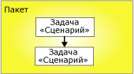
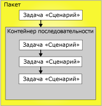

# Управление очередностью
  Элементы управления очередностью связывает исполняемые объекты, контейнеры и задачи в пакетах в поток управления и задают условия, которые определяют, выполняются ли исполняемые объекты. В качестве исполняемого объекта могут быть контейнеры «цикл по элементам» и «цикл по каждому элементу», контейнеры последовательности, задача или обработчик события. Обработчики событий также используют управление очередностью для связывания своих исполняемых объектов в поток управления.  
  
 Элементы управления очередностью связывает два исполняемых объекта: ограничивающий исполняемый объект и исполняемый объект с ограничением. Ограничивающие исполняемые объекты выполняются перед исполняемыми объектами с ограничением, и в результате выполнения ограничивающих исполняемых объектов определяется, выполняются ли исполняемые объекты с ограничением. На следующей диаграмме представлены два исполняемых объекта, связанные элементы управлением очередностью.  
  
   
  
 При линейном потоке управления, то есть без ветвления, элементы управления очередностью сами управляют последовательностью, в которой запускаются задачи. Если поток управления содержит ветвления, ядро во время выполнения служб [!INCLUDE[ssISnoversion](../../includes/ssisnoversion-md.md)] определяет порядок выполнения задачи и контейнеров, которые непосредственно следуют за ветвлением. Ядро во время выполнения также определяет порядок выполнения несвязанных рабочих процессов в потоке управления.  
  
 Архитектура вложенных контейнеров служб [!INCLUDE[ssISnoversion](../../includes/ssisnoversion-md.md)] позволяет всем контейнерам, за исключением контейнеров сервера задач, которые могут инкапсулировать только одну задачу, содержать другие контейнеры, каждый из которых имеет собственный поток управления. Контейнеры «цикл по элементам», «цикл по каждому элементу» и контейнеры последовательности могут включать несколько задач и другие контейнеры, которые, в свою очередь, могут содержать несколько задач и контейнеров. Например, пакет с задачей «Скрипт» и контейнером последовательности имеет управление очередностью, которое связывает задачу «Скрипт» и контейнер последовательности. Контейнер последовательности содержит три задачи «Скрипт», и его управления очередностью связывают три задачи «Скрипт» в поток управления. На следующей диаграмме показаны управления очередностью в пакете с двумя уровнями вложенности.  
  
   
  
 Так как пакет находится наверху иерархии контейнеров служб [!INCLUDE[ssIS](../../includes/ssis-md.md)] , несколько пакетов не могут быть связаны управлениями очередностью, однако можно добавить в пакет задачу «Выполнение пакета» и косвенно связать другой пакет в поток управления.  
  
 Управление очередностью можно настроить следующими способами:  
  
-   Задать операцию вычисления. Управление очередностью использует ограничение по значению, выражение, оба эти элемента или один из них для определения, выполняется ли исполняемый объект с ограничением.  
  
-   Если управление очередностью использует результат выполнения, в качестве результата выполнения могут быть заданы успех, ошибка или завершение.  
  
-   Если управление очередностью использует результат оценки, может быть задано выражение, значением которого является логическое значение.  
  
-   Укажите, оценивается ли управление очередностью одно или совместно с другими ограничениями, применимыми к исполняемому объекту с ограничением.  
  
## Операции вычисления  
 [!INCLUDE[ssISnoversion](../../includes/ssisnoversion-md.md)] предоставляют следующие операции вычисления:  
  
-   Ограничение, использующее только результат выполнения ограничивающего исполняемого объекта для определения, выполняется ли исполняемый объект с ограничением. Результатом выполнения приоритетного ограничивающего объекта может быть завершение, успех или ошибка. Это операция по умолчанию.  
  
-   Выражение, оцениваемое для определения, выполняется ли исполняемый объект с ограничением. Если результатом оценки этого выражения является TRUE, исполняемый объект с ограничением выполняется.  
  
-   Выражение и ограничение, объединяющие требования результатов выполнения ограничивающего исполняемого объекта и результатов, возвращаемых после оценки выражения.  
  
-   Выражение или ограничение, использующие результаты выполнения ограничивающего исполняемого объекта или результаты, возвращаемые после оценки выражения.  
  
 [!INCLUDE[ssIS](../../includes/ssis-md.md)] использует цвет для определения типа элементов управления очередностью. Успешное ограничение отмечается зеленым, неуспешное — красным, завершенное — синим. Для отображения текстовых меток в конструкторе служб [!INCLUDE[ssIS](../../includes/ssis-md.md)] , обозначающих тип ограничения, необходимо настроить специальные возможности конструктора служб [!INCLUDE[ssIS](../../includes/ssis-md.md)] .  
  
 Выражение должно быть действительным выражением служб [!INCLUDE[ssIS](../../includes/ssis-md.md)] , оно может содержать функции, операторы, а также системные и пользовательские переменные. Дополнительные сведения см. в разделах [Выражения в службах Integration Services (SSIS)](../../integration-services/expressions/integration-services-ssis-expressions.md) и [Переменные в службах Integration Services (SSIS)](../../integration-services/integration-services-ssis-variables.md).  
  
## Результаты выполнения  
 Управление очередностью может использовать следующие результаты выполнения поодиночке или в сочетании с выражением.  
  
-   Завершение означает только то, что ограничивающий исполняемый объект завершился без учета результата, вследствие чего запустился исполняемый объект с ограничением.  
  
-   Успешное окончание означает, что для выполнения ограничивающего объекта с ограничением необходимо, чтобы приоритетный исполняемый объект был успешно завершен.  
  
-   Завершение с ошибкой означает, что для выполнения исполняемого объекта с ограничением необходимо, чтобы ограничивающий исполняемый объект завершился со сбоем.  
  
> [!NOTE]  
>  Только управления очередностью, являющиеся элементами одной коллекции **Precedence Constraint** , могут быть сгруппированы в логическом условии AND. Например, нельзя объединить элементы управления очередностью из двух контейнеров «цикл по каждому элементу».  
  
## Настройка свойств управления очередностью с помощью редактора управления очередностью  
  
1.  В среде [!INCLUDE[ssBIDevStudioFull](../../includes/ssbidevstudiofull-md.md)]откройте проект служб [!INCLUDE[ssISnoversion](../../includes/ssisnoversion-md.md)] , содержащий необходимый пакет.  
  
2.  Чтобы открыть пакет, дважды щелкните его в обозревателе решений.  
  
3.  Перейдите на вкладку **Поток управления** .  
  
4.  Дважды щелкните объект управления очередностью.  
  
     Открывается **Редактор управления очередностью** .  
  
5.  В раскрывающемся списке **Операция оценки** выберите операцию оценки.  
  
6.  В раскрывающемся списке **Значение** выберите результат выполнения для ограничивающего исполняемого объекта.  
  
7.  Если при выполнении операции оценки используется выражение, введите его в окне **Выражение** , а затем нажмите кнопку **Проверка** , чтобы оценить выражение.  
  
    > [!NOTE]  
    >  В именах переменных учитывается регистр букв.  
  
8.  При подключении задач или контейнеров к исполняемому объекту с ограничением выберите **Логическое И** для обозначения того, что все предшествующие исполняемые модули должны возвращать **true**. Выберите **Логическое ИЛИ** , если необходимо, чтобы только один исполняемый объект возвращал значение **true**.  
  
9. Нажмите кнопку **ОК** , чтобы закрыть **Редактор управления очередностью**.  
  
10. Чтобы сохранить обновленный пакет, выберите пункт **Сохранить выбранные элементы** в меню **Файл** .  

## Редактор управления очередностью
Диалоговое окно **Редактор ограничений очередностью** используется для настройки ограничений очередностью.  
  
### Параметры  
 **Вычислительная операция**  
 Определяет вычислительную операцию, которую использует ограничение очередностью. Операциями могут быть: **Ограничение**, **Выражение**, **Выражение и ограничение**и **Выражение или ограничение**.  
  
 **Value**  
 Укажите ограничение по значению: **Успешно**, **Сбой**или **Завершение**.  
  
> [!NOTE]  
>  Строка элементов управления очередностью имеет зеленый цвет для значения **Успех**, синий — для значения **Завершение**и выделяется для значения **Неудача**.  
  
 **Выражение**  
 При использовании действий **Выражение**, **Выражение и ограничение**или **Выражение или ограничение**введите выражение или запустите построитель выражений для создания выражения. Выражение должно иметь логическое значение.  
  
 **Тест**  
 Проверка выражения.  
  
 **Логическое И**  
 Выберите, чтобы указать, что несколько ограничений очередности в одном исполняемом объекте должны учитываться вместе. Все ограничения должны иметь значение **True**.  
  
> [!NOTE]  
>  Этот тип элементов управления очередностью имеет вид сплошной зеленой или синей линии либо выделяется.  
  
 **Логическое ИЛИ**  
 Выберите, чтобы указать, что несколько ограничений очередности в одном исполняемом объекте должны учитываться вместе. По крайней мере, одно ограничение должно иметь значение **True**.  
  
> [!NOTE]  
>  Этот тип элементов управления очередностью имеет вид пунктирной зеленой или синей линии либо выделяется.  
  
## Настройка свойств управления очередностью в окне "Свойства"  
  
1.  В среде [!INCLUDE[ssBIDevStudioFull](../../includes/ssbidevstudiofull-md.md)]откройте проект служб [!INCLUDE[ssISnoversion](../../includes/ssisnoversion-md.md)] , содержащий пакет, который необходимо изменить.  
  
2.  Чтобы открыть пакет, дважды щелкните его в обозревателе решений.  
  
3.  Перейдите на вкладку **Поток управления** . В области конструктора на вкладке **Поток управления** щелкните правой кнопкой мыши элемент управления очередностью и выберите пункт **Свойства**. В окне «Свойства» измените значения свойств.  
  
4.  В окне **Свойства** установите следующие свойства элементов управления очередностью, доступные для чтения-записи.  
  
    |Свойство, доступное для чтения-записи|Действие настройки|  
    |--------------------------|--------------------------|  
    |Description|Введите описание.|  
    |EvalOp|Выберите операцию вычисления. Если выбрана одна из операций **Expression**, **ExpressionAndConstant**или **ExpressionOrConstant** , можно указать выражение.|  
    |Выражение|Если операция вычисления включает в себя выражение, введите выражение. Выражение должно иметь логическое значение. Дополнительные сведения о языке выражений см. в разделе [Выражения служб Integration Services (SSIS)](../../integration-services/expressions/integration-services-ssis-expressions.md).|  
    |LogicalAnd|Установите значение **LogicalAnd** , чтобы указать, должно ли оцениваться управление очередностью совместно с другими элементами управлениями очередностью, когда несколько исполняемых объектов предшествуют исполняемому объекту с ограничениями и связаны с ним.|  
    |Имя|Обновите имя элемента управления очередностью.|  
    |ShowAnnotation|Укажите тип заметки, который должен использоваться. Выберите значение **Never** , чтобы отключить заметки, **AsNeeded** , чтобы разрешить заметки по запросу, **ConstraintName** , чтобы автоматически вставлять заметки, используя значения свойства Name, **ConstraintDescription** , чтобы автоматически вставлять заметки, используя значения свойства Description, и **ConstraintOptions** , чтобы автоматически вставлять заметки, используя значения свойств Value и Expression.|  
    |Значение|Если операция вычисления, указанная в свойстве EvalOP, содержит ограничение, выберите результат выполнения исполняемого объекта с ограничением.|  
  
5.  Закройте окно «Свойства».  
  
6.  Чтобы сохранить обновленный пакет, выберите пункт **Сохранить выбранные элементы** в меню **Файл** .  

## Установка значения управления очередностью с помощью контекстного меню  
  
1.  В среде [!INCLUDE[ssBIDevStudioFull](../../includes/ssbidevstudiofull-md.md)]откройте проект служб [!INCLUDE[ssISnoversion](../../includes/ssisnoversion-md.md)] , содержащий необходимый пакет.  
  
2.  Чтобы открыть пакет, дважды щелкните его в обозревателе решений.  
  
3.  Перейдите на вкладку **Поток управления** .  
  
4.  В области конструктора на вкладке **Поток управления** щелкните правой кнопкой мыши объект управления очередностью, а затем выберите пункт **Успешно**, **Сбой**или **Завершено**.  
  
5.  Чтобы сохранить обновленный пакет, щелкните **Сохранить выбранные элементы** в меню **Файл** .  

## Добавление выражений к элементам управления очередностью
 Элементы управления очередностью могут использовать выражение для определения зависимости между двумя исполняемыми объектами: приоритетным исполняемым объектом и исполняемым объектом с ограничением. Исполняемыми объектами могут быть задачи или контейнеры. Выражение может быть использовано само по себе или в сочетании с результатом выполнения приоритетного исполняемого объекта. Выполнение любого исполняемого объекта может закончиться успешно или со сбоем. При настройке результата выполнения управления очередностью доступны варианты **Success**, **Failure**или **Completion**. Для варианта**Success** требуется успешное выполнение ограничивающего исполняемого объекта, для **Failure** — его неудачное выполнение, а **Completion** означает, что ограничивающий исполняемый объект должен запускаться независимо от успешности выполнения приоритетной задачи. Дополнительные сведения см. в разделах [Управление очередностью](../../integration-services/control-flow/precedence-constraints.md).  
  
 Выражение должно возвращать **True** или **False** и быть допустимым для [!INCLUDE[ssISnoversion](../../includes/ssisnoversion-md.md)] . Выражение может использовать литералы, системные и пользовательские переменные, функции и операторы, определяемые грамматикой выражений служб [!INCLUDE[ssIS](../../includes/ssis-md.md)] . Например выражение `@Count == SQRT(144) + 10` использует переменную **Count**, функцию SQRT() и операторы сравнения (==) и сложения (+). Дополнительные сведения см. в разделе [Выражения служб Integration Services (SSIS)](../../integration-services/expressions/integration-services-ssis-expressions.md).  
  
 На следующей иллюстрации задача A связана с задачей B управлением очередностью, которое использует результат вычисления и выражение. Ограничение принимает значение **Success** , а выражением является  `@X >== @Z`. Задача B является задачей с ограничением, которая запускается, только если задача A успешно завершается, а значение переменной **X** больше или равно значению переменной **Z**.  
  
   
  
 Исполняемые объекты могут быть связаны множественными управлениями очередностью, которые содержат различные выражения. Например в следующем примере задачи B и C связаны с задачей A управлениями очередностью, которые используют результаты выполнения и выражения. Оба значения ограничения задаются равными **Success.** Но одно управление очередностью включает в себя выражение `@X >== @Z`, а другое — `@X < @Z`. В зависимости от значения переменных **X** и **Z**будет запущена либо задача C, либо задача B.  
  
   
  
 Добавить или изменить выражение можно с помощью **Редактора управления очередностью** в конструкторе служб [!INCLUDE[ssIS](../../includes/ssis-md.md)] и окна свойств, предоставляемого средой [!INCLUDE[ssBIDevStudioFull](../../includes/ssbidevstudiofull-md.md)] . Однако окно свойств не поддерживает проверку синтаксиса выражения.  
  
 Если управление очередностью включает выражение, то в области конструктора на вкладке **Поток управления** рядом с правилом появится соответствующий значок, а всплывающее окно с подсказкой для значка будет содержать данное выражение.  

### Добавление выражения к элементу управления очередностью  
  
1.  В среде [!INCLUDE[ssBIDevStudioFull](../../includes/ssbidevstudiofull-md.md)]откройте проект служб [!INCLUDE[ssISnoversion](../../includes/ssisnoversion-md.md)] , содержащий необходимый пакет.  
  
2.  Чтобы открыть пакет, дважды щелкните его в обозревателе решений.  
  
3.  Перейдите на вкладку **Поток управления** .  
  
4.  В области конструктора на вкладке **Поток управления** дважды щелкните объект управления очередностью. Открывается **Редактор управления очередностью** .  
  
5.  Выберите пункт **Выражение**, **Выражение и ограничение**или **Выражение или ограничение** в списке **Вычислительная операция** .  
  
6.  Введите выражение в текстовое поле **Выражение** или запустите построитель выражений, чтобы создать выражение.  
  
7.  Чтобы проверить правильность синтаксиса выражения, нажмите кнопку **Проверить**.  
  
8.  Чтобы сохранить обновленный пакет, выберите пункт **Сохранить выбранные элементы** в меню **Файл** .  
 
### Объединение значений выполнения и выражений  
 Следующая таблица описывает эффекты объединения ограничения значений выполнения и выражения в управлении очередностью.  
  
|Вычислительная операция|Результат ограничения|Результат выражения|Запуск исполняемого объекта с ограничением|  
|--------------------------|-----------------------------|-----------------------------|---------------------------------|  
|Ограничение|True|Недоступно|True|  
|Ограничение|False|Недоступно|False|  
|Выражение|Недоступно|True|True|  
|Выражение|Недоступно|False|False|  
|Ограничение и выражение|True|True|True|  
|Ограничение и выражение|True|False|False|  
|Ограничение и выражение|False|True|False|  
|Ограничение и выражение|False|False|False|  
|Ограничение или выражение|True|True|True|  
|Ограничение или выражение|True|False|True|  
|Ограничение или выражение|False|True|True|  
|Ограничение или выражение|False|False|False|  

## Комплексные сценарии ограничения с несколькими элементами управления очередностью 
Объект управления очередностью соединяет два исполняемых объекта: две задачи, два контейнера или задачу и контейнер. Они известны как приоритетный исполняемый объект и исполняемый объект с ограничением. Исполняемый объект с ограничениями может иметь несколько элементов управления очередностью. Дополнительные сведения см. в статье [Precedence Constraints](../../integration-services/control-flow/precedence-constraints.md).  
  
 Сборка сложных сценариев ограничений путем их группирования позволяет создавать сложный поток управления в пакетах. Например, на следующей иллюстрации задача Г связана с задачей А ограничением **Success** , задача Г с задачей Б — ограничением **Failure** , а задачи Г и В — ограничением **Success** . Элементы управления очередностью между задачами Г и А, между Г и Б, а также между Г и В участвуют в логических связях типа *and* . Таким образом, для запуска задачи Г должна успешно запуститься задача А, аварийно завершиться задача Б и успешно запуститься задача В.  
  
   
  
### Свойство LogicalAnd  
 Если задача или контейнер содержит несколько ограничений, то при помощи свойства **LogicalAnd** указывается, следует ли вычислять управление очередностью отдельно или вместе с остальными ограничениями.  
  
 Свойство **LogicalAnd** может быть задано в окне **Редактор управления очередностью** в конструкторе служб [!INCLUDE[ssIS](../../includes/ssis-md.md)] или в окне настроек, предоставленных [!INCLUDE[ssBIDevStudioFull](../../includes/ssbidevstudiofull-md.md)].  

## Настройка значения по умолчанию для управления очередностью  
При первом запуске конструктора служб [!INCLUDE[ssIS](../../includes/ssis-md.md)] значение по умолчанию для управления очередностью равно **Успешно**. Чтобы изменить в конструкторе служб [!INCLUDE[ssIS](../../includes/ssis-md.md)] значение по умолчанию для управления очередностью, выполните следующие действия.
  
1.  Откройте среду [!INCLUDE[ssBIDevStudioFull](../../includes/ssbidevstudiofull-md.md)].  
  
2.  В меню **Сервис** выберите команду **Параметры**.  
  
3.  В диалоговом окне **Параметры** разверните узел **Конструкторы бизнес-аналитики** , затем разверните **Конструкторы служб Integration Services**.  
  
4.  Щелкните **Автосоединение для потока управления** и выберите **Подключить новую фигуру к выбранной фигуре по умолчанию**.  
  
5.  В раскрывающемся списке выберите либо **Использовать ограничение ошибки для новой фигуры** , либо **Использовать ограничение завершения для новой фигуры**.  
  
6.  Нажмите кнопку **ОК**.  
  
## Создание элемента управления очередностью по умолчанию  
  
1.  В среде [!INCLUDE[ssBIDevStudioFull](../../includes/ssbidevstudiofull-md.md)]откройте проект служб [!INCLUDE[ssISnoversion](../../includes/ssisnoversion-md.md)] , содержащий необходимый пакет.  
  
2.  Чтобы открыть пакет, дважды щелкните его в обозревателе решений.  
  
3.  Перейдите на вкладку **Поток управления** .  
  
4.  В области конструктора на вкладке **Поток управления** щелкните задачу или контейнер и перетащите их соединители на исполняемый объект, к которому нужно применить управление очередностью.  
  
5.  Чтобы сохранить обновленный пакет, выберите пункт **Сохранить выбранные элементы** в меню **Файл** .  
