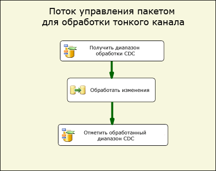
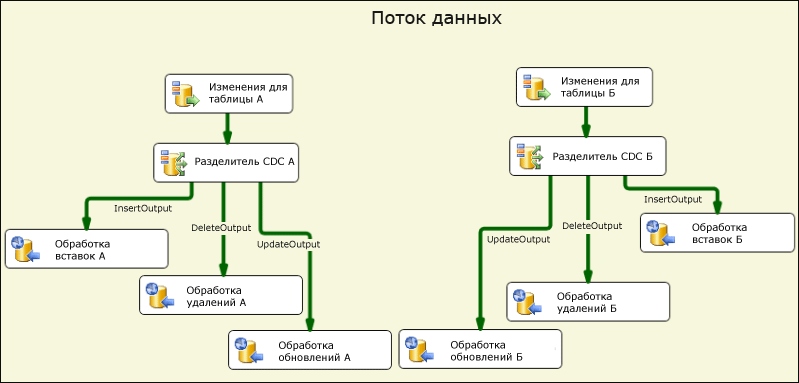
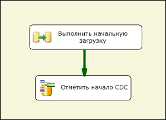
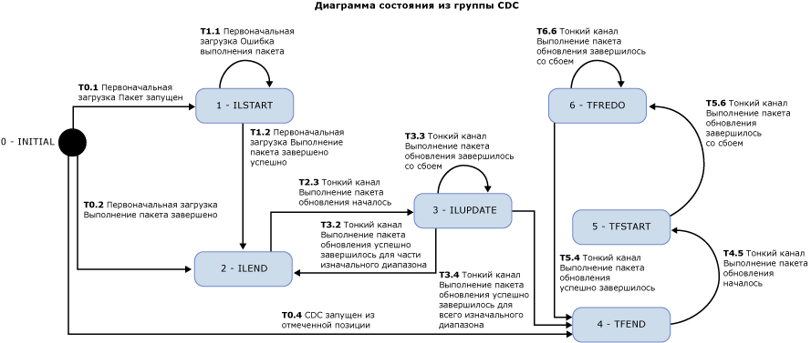

# Компоненты потока CDC

[!INCLUDE[sqlserver-ssis](../../includes/applies-to-version/sqlserver-ssis.md)]

  Компоненты отслеживания измененных данных Attunity для служб Microsoft [!INCLUDE[ssISCurrent](../../includes/ssiscurrent-md.md)] позволяют разработчикам служб SSIS работать с CDC и уменьшают сложность пакетов CDC.  
  
 Компоненты CDC служб SSIS предназначены для работы с функцией [!INCLUDE[ssCurrent](../../includes/sscurrent-md.md)] CDC, когда исходные таблицы находятся в одной базе данных [!INCLUDE[ssCurrent](../../includes/sscurrent-md.md)] или базе данных Oracle (если используется служба Oracle CDC для [!INCLUDE[ssCurrent](../../includes/sscurrent-md.md)]). Поддерживаются секционированные таблицы.  
  
 В компоненты входят компоненты потока управления и потока данных, которые рационализируют чтение и обработку информации об изменениях в пакетах служб SSIS. Компоненты могут добавляться в библиотеку компонентов в Microsoft [!INCLUDE[ssCurrent](../../includes/sscurrent-md.md)], но устанавливаются отдельно.  
  
 Далее представлены компоненты отслеживания измененных данных Attunity.  
  
 **Компонент потока управления CDC**.  
  
 [CDC Control Task](../../integration-services/control-flow/cdc-control-task.md)  
  
 **Компоненты потока данных CDC**.  
  
 [CDC-источник](../../integration-services/data-flow/cdc-source.md)  
  
 [Разделитель CDC](../../integration-services/data-flow/cdc-splitter.md)  
  
## Установка  
 В этом разделе описываются процедуры установки для компонентов CDC для служб Microsoft [!INCLUDE[ssISCurrent](../../includes/ssiscurrent-md.md)].  
  
 Компоненты CDC для SSIS входят в пакет с конструктором и службой системы отслеживания измененных данных Microsoft® для Oracle (от Attunity для Microsoft SQL Server®). Скачиваемые компоненты входят в пакет дополнительных компонентов SQL Server. Скачать компоненты пакета дополнительных компонентов можно со страницы [Microsoft® SQL Server® 2016 Feature Pack](https://go.microsoft.com/fwlink/?LinkId=746297)(Пакет дополнительных компонентов Microsoft® SQL Server® 2016).  
  
### Поддерживаемые версии

#### Поддержка версий SQL Server

Компоненты CDC для служб SSIS поддерживаются во всех поддерживаемых версиях Microsoft SQL Server. В настоящее время поддерживаются версии SQL Server с SQL Server 2012 по SQL Server 2017.

#### Поддержка версий операционной системы
  
Компоненты CDC для служб SSIS поддерживаются для следующих операционных систем и платформ:  
  
-   Windows 8 и 8.1
-   Windows 10  
-   Windows Server 2012 и 2012 R2
-   Windows Server 2016
  
### Запуск программы установки  
 Перед запуском мастера установки убедитесь, что среда [!INCLUDE[ssCurrent](../../includes/sscurrent-md.md)][!INCLUDE[ssBIDevStudio](../../includes/ssbidevstudio-md.md)] закрыта. Затем выполните указания мастера установки.  
  
### Перезапуск службы SSIS 
После установки компонентов CDC необходимо перезапустить службу SSIS, чтобы обеспечить правильную работу компонентов в среде SQL [!INCLUDE[ssBIDevStudio](../../includes/ssbidevstudio-md.md)].  
  
После установки компонентов отображается сообщение. Нажмите кнопку **Да** в открывшемся окне.  
  
### Удаление компонентов Microsoft CDC  
 Источник CDC, разделитель CDC и задача «Управление CDC» удаляются с помощью мастера удаления. Если для разработки пакетов используется среда [!INCLUDE[ssCurrent](../../includes/sscurrent-md.md)][!INCLUDE[ssBIDevStudio](../../includes/ssbidevstudio-md.md)] , убедитесь, что среда [!INCLUDE[ssBIDevStudio](../../includes/ssbidevstudio-md.md)] закрыта перед запуском мастера удаления.  
  
## Преимущества  
 Компоненты CDC для компонентов служб [!INCLUDE[ssCurrent](../../includes/sscurrent-md.md)][!INCLUDE[ssISnoversion](../../includes/ssisnoversion-md.md)] позволяют разработчикам служб SSIS с легкостью создавать пакеты служб SSIS, обрабатывающие информацию об изменениях. Эти компоненты расширяют возможности разработчиков служб SSIS по работе с CDC и уменьшают сложность пакетов CDC.  
  
 Компоненты CDC служб SSIS предоставляют информацию об изменениях в виде, удобном для дальнейшей обработки с целью репликации, загрузки хранилища данных, обновления медленно изменяющихся измерений для OLAP, аудита изменений и других сценариев применения. Тип дальнейшей обработки определяется разработчиком служб SSIS.  
  
 Компоненты CDC служб SSIS предназначены для работы с функцией [!INCLUDE[ssCurrent](../../includes/sscurrent-md.md)] CDC, когда таблицы изменений находятся в одной базе данных [!INCLUDE[ssCurrent](../../includes/sscurrent-md.md)] .  
  
## Приступая к работе с компонентами отслеживания измененных данных  
 Типичный пакет CDC обрабатывает изменения в группе таблиц. Часть базового потока управления этого типа пакета CDC показана на следующем рисунке. Такой пакет называется пакетом обработки тонкого канала.  
  
   
  
 Этот поток данных служб [!INCLUDE[ssCurrent](../../includes/sscurrent-md.md)][!INCLUDE[ssISnoversion](../../includes/ssisnoversion-md.md)] содержит две задачи "Управление CDC" и задачу потока данных. Первая задача, которая называется **Получить диапазон обработки CDC** , устанавливает диапазон номеров LSN для изменений, которые обрабатываются в задаче потока данных, которая называется **Обработка изменений**. Этот диапазон определяется на основании данных, обработанных при последнем выполнении пакета и сохраненных в постоянном хранилище.  
  
 Дополнительные сведения об использовании задачи «Управление CDC» см. в разделах [CDC Control Task](../../integration-services/control-flow/cdc-control-task.md) и [CDC Control Task Editor](../../integration-services/control-flow/cdc-control-task-editor.md).  
  
 На следующем рисунке показан поток данных **Обработка изменений** , задающий общий порядок обработки изменений.  
  
   
  
 На этом рисунке показаны следующие действия.  
  
-   **Изменения для таблицы X** — это источник CDC, который считывает изменения, внесенные в таблицу X в пределах диапазона обработки CDC, определенного в родительском потоке управления.  
  
-   **Разделитель CDC X** используется для разбиения изменений на операции вставки, удаления и обновления. В этом сценарии предполагается, что источник CDC настроен для составления суммарных изменений, чтобы различные типы изменений можно было обрабатывать параллельно.  
  
-   Затем отдельные изменения обрабатываются в следующих компонентах потока. На этом рисунке изменения вставляются в таблицы с использованием нескольких назначений ODBC, но в реальных случаях обработка может отличаться.  
  
 Дополнительные сведения об источнике CDC см. в разделе  
  
 [CDC-источник](../../integration-services/data-flow/cdc-source.md)  
  
 [Редактор источника "CDC" (страница "Диспетчер соединений")](../../integration-services/data-flow/cdc-source-editor-connection-manager-page.md)  
  
 [Редактор источника "CDC" (страница "Столбцы")](../../integration-services/data-flow/cdc-source-editor-columns-page.md)  
  
 [Редактор источника "CDC" (страница "Вывод ошибок")](../../integration-services/data-flow/cdc-source-editor-error-output-page.md)  
  
 Дополнительные сведения о разделителе CDC см. в разделе  
  
 [Разделитель CDC](../../integration-services/data-flow/cdc-splitter.md)  
  
 Одним из основных вопросов, требующих внимания при создании пакетов CDC, является взаимодействие обработки изменений с начальной загрузкой (или начальной обработкой) данных.  
  
 Компоненты CDC поддерживают три различных сценария начальной загрузки и обработки изменений.  
  
-   Начальная загрузка выполняется с моментальным снимком базы данных. В этом случае обработка изменений начинается с номера LSN события моментального снимка.  
  
-   Начальная загрузка из замороженной базы данных. В этом случае во время начальной загрузки изменения не вносятся, текущий номер LSN выбирается в рамках периода начальной загрузки и обработка изменений начинается с этого номера LSN.  
  
-   Начальная загрузка из активной базы данных. В этом случае, пока выполняется начальная загрузка, в базу данных вносятся изменения и нет точного номера LSN, с которого можно начать обработку изменений. В этом случае разработчик пакета начальной загрузки может зафиксировать текущий номер LSN в базе данных-источнике до и после начальной загрузки. Затем при обработке изменений следует соблюдать осторожность параллельно с начальной загрузкой, поскольку некоторые из обработанных изменений уже включены в начальную загрузку (например, операция вставки может завершиться с ошибкой повторяющегося ключа, поскольку вставленная строка уже считана в процессе начальной загрузки).  
  
 На следующем рисунке показан пакет служб SSIS, поддерживающий первые два сценария:  
  
   
  
 На следующем рисунке показан пакет служб SSIS, поддерживающий третий сценарий:  
  
   
  
 После пакета начальной загрузки несколько раз выполняется пакет обновления тонкого канала в соответствии с расписанием для обработки изменений, готовых к обработке.  
  
 Передача состояния обработки CDC из пакета начальной загрузки в пакет тонкого канала, а также между различными задачами в рамках каждого пакета выполняется посредством специальной строковой переменной пакета служб SSIS. Значение этой переменной называется состоянием CDC. Оно отражает текущее состояние обработки CDC для групп таблиц, которые обрабатываются пакетами начальной загрузки и тонкого канала.  
  
 Значение переменной состояния CDC должно храниться в постоянном хранилище. Оно должно считываться перед началом обработки CDC и сохраняться с текущим состоянием после завершения обработки. Задача загрузки и сохранения состояния CDC может выполняться разработчиком служб SSIS, но компонент управления CDC может автоматизировать эту задачу, сохраняя значение состояния CDC в таблице базы данных.  
  
## Вопросы безопасности  
 В этом разделе перечислены некоторые соображения по безопасности, связанные с использованием компонентов CDC в службах SSIS.  
  
### Авторизация доступа к информации об изменениях  
 Пакетам обновления тонкого канала необходим доступ к функциям [!INCLUDE[ssCurrent](../../includes/sscurrent-md.md)] CDC. Такой доступ по умолчанию предоставляется членам предопределенной роли базы данных **db_owner** . Поскольку роль **db_owner** обладает широкими возможностями, то при определении экземпляров системы отслеживания в [!INCLUDE[ssCurrent](../../includes/sscurrent-md.md)] рекомендуется связать с каждым экземпляром системы отслеживания шлюзовую роль безопасности, которая позволит пакету CDC служб SSIS использовать для обработки изменений пользователя с намного более узким диапазоном возможностей.  
  
### Доступ к текущему номеру LSN базы данных CDC  
 Операции задачи «Управление CDC», помечающие начальный номер LSN для обработки изменений, должны иметь возможность определить текущий номер LSN базы данных CDC. Для поиска LSN компоненты используют процедуру **sp_replincrementlsn** из базы данных master. Разрешение на выполнение этой процедуры должно предоставляться имени входа, используемому для подключения к базе данных [!INCLUDE[ssCurrent](../../includes/sscurrent-md.md)] CDC.  
  
### Доступ к таблице состояний CDC  
 Таблица состояний CDC используется для автоматического сохранения состояний CDC. Имя входа, используемое для соединения с базой данных [!INCLUDE[ssCurrent](../../includes/sscurrent-md.md)] CDC, должно иметь возможность обновлять эту таблицу. Поскольку эта таблица создается разработчиком служб SSIS, задайте в качестве системного администратора [!INCLUDE[ssCurrent](../../includes/sscurrent-md.md)] пользователя, который имеет разрешения на создание таблиц [!INCLUDE[ssCurrent](../../includes/sscurrent-md.md)] и выполнение административных задач и задач по обслуживанию. Кроме того, системный администратор [!INCLUDE[ssCurrent](../../includes/sscurrent-md.md)] , работающий с базами данных с поддержкой CDC, должен располагать знаниями о технологии [!INCLUDE[ssCurrent](../../includes/sscurrent-md.md)] CDC и ее реализации.  
  
## Группирование таблиц для обработки CDC  
 Размер проектов баз данных меняется от нескольких таблиц до нескольких тысяч таблиц. Во время разработки пакетов начальной загрузки и пакетов CDC разумно группировать таблицы по группам меньшего размера для упрощения управления и повышения эффективности. В этом разделе перечислены различные соображения, относящиеся к сортировке таблиц по малым группам, когда таблицы в каждой группе проходят начальную загрузку и затем обновляются всей группой.  
  
 В шаблонах CDC, поддерживаемых компонентами CDC, предполагается, что такое группирование уже определено. Каждая группа определяет отдельный контекст CDC, который поддерживается отдельно от остальных групп. Для каждой группы создаются пакеты начальной загрузки и обновления тонкого канала. Обновления тонкого канала планируются для периодического выполнения в зависимости от частоты изменений, ограничений обработки (например, расхода ресурсов ЦП и ввода-вывода, влияния на другие системы) и требуемой задержки.  
  
 Таблицы группируются по следующим принципам.  
  
1.  В соответствии с целевой базой данных. Все таблицы, которые записываются в различные целевые базы данных или проходят различную обработку, должны помещаться в различные группы CDC.  
  
2.  Таблицы, которые связаны с ограничениями ссылочной целостности, должны помещаться в одну группу, чтобы избежать проблем со ссылочной целостностью в целевой базе данных.  
  
3.  Таблицы, для которых допустима высокая задержка, можно помещать в одну группу, чтобы обрабатывать их с меньшей частотой и уменьшить общую загрузку системы.  
  
4.  Таблицы с высокой частотой изменений следует размещать в группах меньшего размера, а таблицы с низкой частотой изменений можно размещать в группах большего размера.  
  
 Для каждой группы CDC создаются следующие два пакета.  
  
-   Пакет начальной загрузки, который считывает весь диапазон данных из исходных таблиц и применяет их к целевым таблицам.  
  
-   Пакет обновления тонкого канала, который считывает изменения, внесенные в исходные таблицы, и применяет изменения к целевым таблицам. Этот пакет следует регулярно выполнять по расписанию.  
  
## CDC State  
 С каждой группой CDC связано состояние, которое представляется строкой особого формата. Дополнительные сведения см. в разделе [CDC Control Task](../../integration-services/control-flow/cdc-control-task.md). В следующей таблице показаны возможные значения состояния CDC.  
  
|Состояние|Описание|  
|-----------|-----------------|  
|0-(INITIAL)|Состояние, которое имеет место до выполнения пакетов в текущей группе CDC. Это состояние также имеет место, если состояние CDC пусто.   Дополнительные сведения об операциях задачи «Управление CDC» см. в разделе [CDC Control Task](../../integration-services/control-flow/cdc-control-task.md).|  
|1-ILSTART (начало начальной загрузки)|Это состояние, которое имеет место при запуске пакета начальной загрузки. Это происходит после вызова операции **MarkInitialLoadStart** в задаче «Управление CDC».   Дополнительные сведения об операциях задачи «Управление CDC» см. в разделе [CDC Control Task](../../integration-services/control-flow/cdc-control-task.md).|  
|2- ILEND (завершение начальной загрузки)|Это состояние, которое имеет место при успешном завершении пакета начальной загрузки. Это происходит после вызова операции MarkInitialLoadEnd в задаче «Управление CDC».   Дополнительные сведения об операциях задачи «Управление CDC» см. в разделе [CDC Control Task](../../integration-services/control-flow/cdc-control-task.md).|  
|3-ILUPDATE (обновление начальной загрузки)|Это состояние, которое имеет место после первого выполнения пакета обновления после начальной загрузки, пока продолжается обработка диапазона начальной обработки. Это происходит после вызова операции **GetProcessingRange** в задаче «Управление CDC».   Если используется столбец **_$reprocessing** , он получает значение 1, чтобы показать, что пакет может повторно обрабатывать строки, уже находящиеся в целевой базе данных.   Дополнительные сведения об операциях задачи «Управление CDC» см. в разделе [CDC Control Task](../../integration-services/control-flow/cdc-control-task.md).|  
|4-TFEND (завершение обновления тонкого канала)|Это состояние, ожидаемое для регулярного выполнения CDC. Оно показывает, что предыдущее выполнение завершилось успешно и можно начинать новое выполнение с новым диапазоном обработки.|  
|5 TFSTART (начало обновления тонкого канала)|Это состояние, которое имеет место при последующих выполнениях пакета обновления после вызова операции **GetProcessingRange** в задаче «Управление CDC».   Оно показывает, что регулярное выполнение CDC начато, но еще не завершено или не завершено верно (**MarkProcessedRange**).   Дополнительные сведения об операциях задачи «Управление CDC» см. в разделе [CDC Control Task](../../integration-services/control-flow/cdc-control-task.md).|  
|6-TFREDO (повторная обработка обновлений тонкого канала)|Это состояние операции **GetProcessingRange** , наступающее после TFSTART. Оно показывает, что предыдущее выполнение не завершилось успешно.   Если используется столбец __$reprocessing, он получает значение 1, чтобы показать, что пакет может повторно обрабатывать строки, уже находящиеся в целевой базе данных.|  
|7-ERROR|Группа CDC находится в состоянии ERROR.|  
  
 Ниже представлена диаграмма состояний для компонентов CDC. Состояние ERROR наступает, если обнаруживается непредвиденное состояние. Ожидаемые состояния показаны на следующем рисунке. Тем не менее на диаграмме не показано состояние ERROR.  
  
 Например, в конце пакета начальной загрузки, когда состояние должно получить значение ILEND, но обнаруживается состояние TFSTART, группа CDC переходит в состояние ошибки, а пакет обновления тонкого канала не выполняется (выполняется пакет начальной загрузки).  
  
   
  
 После успешного выполнения пакета начальной загрузки пакет обновления тонкого канала многократно выполняется по заранее определенному расписанию для обработки изменений в исходных таблицах. Каждое выполнение пакета обновления тонкого канала означает выполнение CDC.  
  
## в этом разделе  
  
-   [CDC-источник](../../integration-services/data-flow/cdc-source.md)  
  
-   [Разделитель CDC](../../integration-services/data-flow/cdc-splitter.md)  
  
## Связанные задачи  
  
-   [Выбор направления потока CDC в соответствии с типом изменения](../../integration-services/data-flow/direct-the-cdc-stream-according-to-the-type-of-change.md)  
  
-   [Определение переменной состояния](../../integration-services/data-flow/define-a-state-variable.md)  
  
## См. также  
  
-   Запись в блоге [CDC в SSIS для SQL Server 2012](https://www.mattmasson.com/2011/12/cdc-in-ssis-for-sql-server-2012-2/)на сайте mattmasson.com.  
  
-   Запись в блоге [Служба CDC для Oracle в SQL Server 2012](https://go.microsoft.com/fwlink/?LinkId=247827), касающуюся параметра службы CDC, см. на сайте blogs.msdn.com.  
  
-   Техническую статью [Установка системы отслеживания измененных данных Microsoft SQL Server 2012 для Oracle компании Attunity](https://go.microsoft.com/fwlink/?LinkId=252958)см. на сайте social.technet.microsoft.com.  
  
-   Техническую статью [Устранение неполадок в конфигурации системы отслеживания измененных данных Майкрософт для Oracle компании Attunity](https://go.microsoft.com/fwlink/?LinkId=252960)см. на сайте social.technet.microsoft.com.  
  
-   Техническую статью [Устранение неполадок в конфигурации системы отслеживания измененных данных Майкрософт для Oracle компании Attunity](https://go.microsoft.com/fwlink/?LinkId=252961)см. на сайте social.technet.microsoft.com.  
  
-   Видеоролик [CDC для баз данных Oracle, использующих службы SQL Server Integration Services 2012 (видео по SQL Server)](https://technet.microsoft.com/sqlserver/jj218898)на сайте technet.microsoft.com.  
  
## См. также  
 [CDC Control Task](../../integration-services/control-flow/cdc-control-task.md)  
  
  
