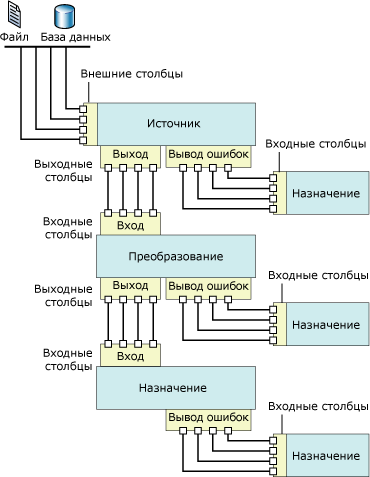

# Поток данных
  [!INCLUDE[ssNoVersion](../../includes/ssnoversion-md.md)] [!INCLUDE[ssISnoversion](../../includes/ssisnoversion-md.md)] предоставляет три различных типа компонентов потока данных: источники, преобразования и назначения. Источники извлекают данные из хранилищ, таких как таблицы и представления реляционных баз данных, файлы и базы данных служб [!INCLUDE[ssASnoversion](../../includes/ssasnoversion-md.md)] . Преобразования изменяют, объединяют и очищают данные. Целевые объекты загружают данные в хранилища или создают наборы данных в памяти.  
  
> [!NOTE]  
>  При использовании настраиваемых поставщиков в файл ProviderDescriptors.xml необходимо внести значения столбца метаданных.  
  
 Кроме того, службы [!INCLUDE[ssISnoversion](../../includes/ssisnoversion-md.md)] предоставляют пути, соединяющие выход одного компонента со входом другого. Пути определяют последовательность компонентов и дают возможность добавлять заметки к потоку данных или просматривать источник столбца.  
  
 Соединение компонентов потока данных осуществляется путем соединения выходов источников и преобразований с входами преобразований и целевых объектов. При создании потока данных обычно соединяются второй и последующие компоненты — так же, как их добавляли к потоку данных. После соединения компонента входные столбцы могут быть использованы при настройке компонента. Когда нет доступных входных столбцов, настройка компонента завершится после его подсоединения к потоку данных. Дополнительные сведения см. в статьях [Пути служб Integration Services](../../integration-services/data-flow/integration-services-paths.md) и [Соединение компонентов с путями](http://msdn.microsoft.com/library/05633e4c-1370-4b05-802b-f36b07dd71c8).  
  
 На следующей диаграмме показан поток данных с источником, преобразованием с одним входом и одним выходом и целевым объектом. На диаграмме присутствуют входы, выходы, выходы ошибок, а также входные, выходные и внешние столбцы.  
  
   
  
## Реализация потока данных  
 Добавление задачи потока данных к потоку управления пакета является первым шагом реализации потока данных в пакете. Пакет может включать несколько задач потока данных, каждая из которых имеет свой собственный поток данных. Например, если пакет требует, чтобы потоки данных были запущены в указанной последовательности или чтобы между потоками данных были выполнены другие задачи, необходимо указывать отдельную задачу потока данных для каждого потока данных.  
  
 После того как поток управления включает задачу потока данных, можно начать формировать поток данных, используемый пакетом. Дополнительные сведения см. в статье [Задача потока данных](../../integration-services/control-flow/data-flow-task.md).  
  
 Создание потока данных включает следующие шаги.  
  
-   Добавление одного или нескольких источников для извлечения данных из файлов и баз данных, а также добавление диспетчеров соединений для подключения к источникам.  
  
-   Добавление преобразований, удовлетворяющих бизнес-требования пакета. Поток данных не обязательно должен содержать преобразования.  
  
     Для некоторых преобразований требуется диспетчер соединений. Например, преобразование «Уточняющий запрос» использует диспетчер соединений для подключения к базе данных, содержащей искомые данные.  
  
-   Соединение компонентов потока данных путем соединения выходов источников и преобразований с входами преобразований и целевых объектов.  
  
-   Добавление одного или нескольких назначений для загрузки данных в источники данных, например в файлы и базы данных, а также добавление диспетчеров соединений для подключения к источникам данных.  
  
-   Настройка выходов ошибок для компонентов в целях решения проблем.  
  
     Во время выполнения могут возникать ошибки на уровне строк при преобразовании данных, выполнении уточняющего запроса или вычислении выражений компонентами потока данных. Например, столбец данных, содержащий строковое значение, не удалось преобразовать в целое число, либо в выражении была попытка деления на ноль. Обе операции вызывают ошибки, и строки, содержащие ошибки, можно обработать отдельно при помощи потока ошибок. Дополнительные сведения об использовании потоков ошибок в потоке данных пакета см. в разделе [Обработка ошибок в данных](../../integration-services/data-flow/error-handling-in-data.md).  
  
-   Включение примечаний для самодокументирования потока данных. Дополнительные сведения см. в разделе [Использование заметок в пакетах](../../integration-services/use-annotations-in-packages.md).  
  
> [!NOTE]  
>  При создании нового пакета можно воспользоваться мастером, который поможет правильно настроить диспетчеры соединений, источники и назначения. Дополнительные сведения см. в разделе [Create Packages in SQL Server Data Tools](../../integration-services/create-packages-in-sql-server-data-tools.md).  
  
 Если активна вкладка **Поток данных** , то на панели элементов будут находиться источники, преобразования и назначения, которые можно добавлять в поток данных.  
  
## Выражения  
 Некоторые из компонентов потоков данных — источники, фильтры и цели — поддерживают использование выражений с некоторыми своими свойствами. Выражение свойств — это выражение, которое заменяет значение свойства при загрузке пакета. Во время выполнения пакет будет использовать обновленные значения свойств. Выражения строятся с использованием синтаксиса выражений служб [!INCLUDE[ssISnoversion](../../includes/ssisnoversion-md.md)] и могут включать функции служб [!INCLUDE[ssISnoversion](../../includes/ssisnoversion-md.md)], операторы, идентификаторы и переменные. Дополнительные сведения см. в разделах [Выражения служб Integration Services (SSIS)](../../integration-services/expressions/integration-services-ssis-expressions.md), [Выражения служб Integration Services (SSIS)](../../integration-services/expressions/integration-services-ssis-expressions.md) и [Использование выражений свойств в пакетах](../../integration-services/expressions/use-property-expressions-in-packages.md).  
  
 При построении пакета в среде [!INCLUDE[ssBIDevStudioFull](../../includes/ssbidevstudiofull-md.md)] свойства компонентов потоков данных, которые поддерживают выражения свойств, публикуются в задаче потока данных, которой они принадлежат. Чтобы добавить, изменить или удалить выражения свойств из компонентов потока данных, щелкните задачу потока данных и в окне «Свойства» или в редакторе задачи добавьте, измените или удалите выражения свойств. Выражения свойств для задачи потока данных можно добавлять, изменять или удалять в окне «Свойства».  
  
 Если в потоке данных содержатся компоненты, использующие выражения свойств, эти выражения также отображаются в окне «Свойства». Для просмотра выражений выберите задачу потока данных, которой принадлежат компоненты. Свойства можно просматривать по категориям или в алфавитном порядке. Если в окне "Свойства" отображается представление по категориям, все выражения, не использующиеся в конкретном свойстве, приводятся в списке категории **Прочие** . Если выражения представлены в алфавитном порядке, они отображаются по имени компонента потока данных.  
  
## Источники  
 В службах [!INCLUDE[ssISnoversion](../../includes/ssisnoversion-md.md)]источником называется компонент потока данных, который делает данные из внешнего источника данных доступными для других компонентов потока данных. Предусмотрена возможность извлекать данные из неструктурированных файлов, XML-файлов, книг Microsoft Excel и файлов с необработанными данными. Данные можно извлекать путем доступа к таблицам и представлениям баз данных, а также с помощью запросов.  
  
 Поток данных может содержать один или несколько источников.  
  
 У источника потока данных обычно есть один стандартный выход. В стандартном выходе содержатся выходные столбцы, которые источник добавляет к потоку данных.  
  
 Стандартный выход ссылается на внешние столбцы. Внешним называется столбец в источнике. Например, столбец **MadeFlag** в таблице **Product** базы данных **AdventureWorks** — внешний столбец, который можно добавить к стандартному выходу. Метаданные внешних столбцов хранят информацию об имени исходного столбца, типе и длине хранящихся в нем данных.  
  
 Выход ошибок источника хранит те же столбцы, что и стандартный выход, а также два дополнительных столбца, предоставляющих информацию об ошибках. Объектная модель служб [!INCLUDE[ssISnoversion](../../includes/ssisnoversion-md.md)] не ограничивает число стандартных выходов и выходов ошибок, которые могут быть связаны с источником. У большей части включенных в службы [!INCLUDE[ssISnoversion](../../includes/ssisnoversion-md.md)] источников, за исключением компонента скрипта, имеется один стандартный выход, а у многих также есть один выход ошибок. Пользовательские источники могут быть спроектированы так, чтобы содержать несколько стандартных выходов и выходов ошибок.  
  
 Все выходные столбцы доступны в качестве входных столбцов для следующего компонента потока данных.  
  
 Кроме того, существует возможность указывать пользовательские источники. Дополнительные сведения см. в разделах [Разработка пользовательского компонента потока данных](../../integration-services/extending-packages-custom-objects/data-flow/developing-a-custom-data-flow-component.md) и [Разработка компонентов потока данных определенных типов](../../integration-services/extending-packages-custom-objects-data-flow-types/developing-specific-types-of-data-flow-components.md).  
  
 Следующие источники имеют свойства, которые могут обновляться через выражения свойств.  
  
-   [Источник ADO NET](../../integration-services/data-flow/ado-net-source.md)  
  
-   [XML-источник](../../integration-services/data-flow/xml-source.md)  
  
### Источники, доступные для загрузки  
 В приведенной ниже таблице перечислены дополнительные источники, которые можно загрузить с веб-сайта [!INCLUDE[msCoName](../../includes/msconame-md.md)] .  
  
|Source|Описание|  
|------------|-----------------|  
|Источник Oracle|Источник Oracle — это компонент-источник соединителя для Oracle ( [!INCLUDE[msCoName](../../includes/msconame-md.md)] ) от компании Attunity. Кроме того, в состав соединителя для Oracle ( [!INCLUDE[msCoName](../../includes/msconame-md.md)] ) от компании Attunity входят диспетчер подключений и назначение. Дополнительные сведения см. на странице скачивания [Microsoft Connectors for Oracle and Teradata by Attunity](http://go.microsoft.com/fwlink/?LinkId=789384)(Соединители Майкрософт для Oracle и Teradata от компании Attunity).|  
|Источник SAP BI|Источник SAP BI — это компонент-источник соединителя для SAP BI ( [!INCLUDE[msCoName](../../includes/msconame-md.md)] ). Кроме того, в состав соединителя для SAP BI ( [!INCLUDE[msCoName](../../includes/msconame-md.md)] ) входят диспетчер подключений и назначение. Дополнительные сведения см. на странице скачивания [Microsoft SQL Server Feature Pack](http://go.microsoft.com/fwlink/?LinkID=746297)(Пакет дополнительных компонентов Microsoft SQL Server).|  
|Источник Teradata|Источник Teradata — это компонент-источник соединителя для Teradata ( [!INCLUDE[msCoName](../../includes/msconame-md.md)] ) от компании Attunity. Кроме того, в состав соединителя для Teradata ( [!INCLUDE[msCoName](../../includes/msconame-md.md)] ) от компании Attunity входят диспетчер подключений и назначение. Дополнительные сведения см. на странице скачивания [Microsoft Connectors for Oracle and Teradata by Attunity](http://go.microsoft.com/fwlink/?LinkId=789384) (Соединители Майкрософт для Oracle и Teradata от компании Attunity).|  
  
 Демонстрация использования средств повышения производительности соединителя для Oracle ( [!INCLUDE[msCoName](../../includes/msconame-md.md)] ) от компании Attunity приведена в видеоролике [Performance of Microsoft Connector for Oracle by Attunity (SQL Server Video)](http://go.microsoft.com/fwlink/?LinkID=210369)(Работа соединителя для Oracle (Майкрософт) от компании Attunity — видео по SQL Server).  
  
## Преобразования  
 Возможности преобразований очень разнообразны. Преобразования могут выполнять такие задачи, как обновление, очистка, слияние и распространение данных и сбор статистики о них. Можно изменять значения в столбцах, выполнять поиск значений в таблицах, очищать данные и выполнять статистические вычисления по значениям столбцов.  
  
 Входы и выходы преобразований определяют столбцы входных и выходных данных. В зависимости от выполняемых операций над данными у одних преобразований может быть один вход и несколько выходов, а у других — несколько входов и один выход. Преобразования также могут включать выходы ошибок, которые предоставляют сведения о произошедших ошибках и сами данные, вызвавшие ошибку: например, строковые данные, которые не могут быть преобразованы в тип данных integer. Объектная модель служб [!INCLUDE[ssISnoversion](../../includes/ssisnoversion-md.md)] не ограничивает число входов, стандартных выходов и выходов ошибок, которые могут быть связаны с преобразованием. Пользовательские преобразования могут реализовывать любое сочетание входов, стандартных выходов и выходов ошибок.  
  
 Вход преобразования определяется как один или более входных столбцов. Некоторые преобразования служб [!INCLUDE[ssISnoversion](../../includes/ssisnoversion-md.md)] также могут ссылаться на входные столбцы в качестве входных. Например, вход преобразования «Команда OLE DB» включает в себя внешние столбцы. Выходным называется столбец, который добавляется преобразованием в поток данных. И стандартные выходы, и выходы ошибок содержат выходные столбцы. Эти выходные столбцы, в свою очередь, служат входными столбцами для следующего компонента потока данных: или другого преобразования, или целевого объекта.  
  
 Следующие преобразования имеют свойства, которые могут обновляться через выражения свойств.  
  
-   [Преобразование "Условное разбиение"](../../integration-services/data-flow/transformations/conditional-split-transformation.md)  
  
-   [Преобразование "Производный столбец"](../../integration-services/data-flow/transformations/derived-column-transformation.md)  
  
-   [Преобразование "Нечеткое группирование"](../../integration-services/data-flow/transformations/fuzzy-grouping-transformation.md)  
  
-   [Преобразование "Нечеткий уточняющий запрос"](../../integration-services/data-flow/transformations/fuzzy-lookup-transformation.md)  
  
-   [Преобразование "Команда OLE DB"](../../integration-services/data-flow/transformations/ole-db-command-transformation.md)  
  
-   [Преобразование "Процентная выборка"](../../integration-services/data-flow/transformations/percentage-sampling-transformation.md)  
  
-   [Преобразование "Сведение"](../../integration-services/data-flow/transformations/pivot-transformation.md)  
  
-   [Преобразование "Выборка строк"](../../integration-services/data-flow/transformations/row-sampling-transformation.md)  
  
-   [Преобразование "Сортировка"](../../integration-services/data-flow/transformations/sort-transformation.md)  
  
-   [Преобразование отмены свертывания](../../integration-services/data-flow/transformations/unpivot-transformation.md)  
  
 Дополнительные сведения см. в статье [Integration Services Transformations](../../integration-services/data-flow/transformations/integration-services-transformations.md).  
  
## Назначения  
 Целевым называется компонент потока данных, который записывает данные из потока в указанное хранилище или создает набор данных в памяти. Можно загружать данные в неструктурированные файлы, объединять аналитические объекты и предоставлять данные для других процессов. Данные можно загружать путем доступа к таблицам и представлениям баз данных, а также с помощью запросов.  
  
 Поток данных может содержать несколько назначений для загрузки данных в различные хранилища.  
  
 У целевого объекта служб [!INCLUDE[ssISnoversion](../../includes/ssisnoversion-md.md)] должен быть по крайней мере один вход. Вход содержит входные столбцы, которые предоставляются другим компонентом потока данных. Входные столбцы сопоставляются со столбцами целевого объекта.  
  
 У многих целевых объектов есть также один выход ошибок. Выход ошибок назначения содержит выходные столбцы, которые обычно хранят информацию об ошибках, произошедших во время записи в целевое хранилище данных. Ошибки могут происходить по разным причинам. Например, столбец может содержать значение NULL, а целевой столбец этого не допускает.  
  
 Объектная модель служб [!INCLUDE[ssISnoversion](../../includes/ssisnoversion-md.md)] не ограничивает число стандартных входов и выходов ошибок, которые могут быть связаны с целевым объектом, пользовательские назначения могут реализовывать комбинации из нескольких стандартных входов и выходов ошибок.  
  
 Можно также написать отдельные назначения. Дополнительные сведения см. в разделах [Разработка пользовательского компонента потока данных](../../integration-services/extending-packages-custom-objects/data-flow/developing-a-custom-data-flow-component.md) и [Разработка компонентов потока данных определенных типов](../../integration-services/extending-packages-custom-objects-data-flow-types/developing-specific-types-of-data-flow-components.md).  
  
 Следующие назначения обладают свойствами, которые могут обновляться через выражения свойств.  
  
-   [Назначение "Неструктурированный файл"](../../integration-services/data-flow/flat-file-destination.md)  
  
-   [Назначение SQL Server Compact Edition](../../integration-services/data-flow/sql-server-compact-edition-destination.md)  
  
### Назначения, доступные для загрузки  
 В следующей таблице перечислены дополнительные назначения, которые можно скачать на веб-сайте [!INCLUDE[msCoName](../../includes/msconame-md.md)] .  
  
|Source|Описание|  
|------------|-----------------|  
|Назначение Oracle|Назначение Oracle — компонент назначения соединителя для Oracle ( [!INCLUDE[msCoName](../../includes/msconame-md.md)] ) от компании Attunity. Соединитель для Oracle ( [!INCLUDE[msCoName](../../includes/msconame-md.md)] ) от компании Attunity также включает диспетчер подключений и источник. Дополнительные сведения см. на странице скачивания [Microsoft Connectors for Oracle and Teradata by Attunity](http://go.microsoft.com/fwlink/?LinkId=789384) (Соединители Майкрософт для Oracle и Teradata от компании Attunity).|  
|Назначение SAP BI|Назначение SAP BI — компонент назначения соединителя для SAP BI ( [!INCLUDE[msCoName](../../includes/msconame-md.md)] ). Соединитель для SAP BI ( [!INCLUDE[msCoName](../../includes/msconame-md.md)] ) также включает диспетчер подключений и источник. Дополнительные сведения см. на странице скачивания [Microsoft SQL Server Feature Pack](http://go.microsoft.com/fwlink/?LinkID=746297)(Пакет дополнительных компонентов Microsoft SQL Server).|  
|Назначение Teradata|Назначение Teradata — компонент назначения соединителя для Teradata ( [!INCLUDE[msCoName](../../includes/msconame-md.md)] ) от компании Attunity. Соединитель для Teradata ( [!INCLUDE[msCoName](../../includes/msconame-md.md)] ) от компании Attunity также включает диспетчер подключений и источник. Дополнительные сведения см. на странице скачивания [Microsoft Connectors for Oracle and Teradata by Attunity](http://go.microsoft.com/fwlink/?LinkId=789384) (Соединители Майкрософт для Oracle и Teradata от компании Attunity).|  
  
 Демонстрация использования средств повышения производительности соединителя для Oracle ( [!INCLUDE[msCoName](../../includes/msconame-md.md)] ) от компании Attunity приведена в видеоролике [Performance of Microsoft Connector for Oracle by Attunity (SQL Server Video)](http://go.microsoft.com/fwlink/?LinkID=210369)(Работа соединителя для Oracle (Майкрософт) от компании Attunity — видео по SQL Server).  
  
## Диспетчеры соединений  
 Многие компоненты потока данных подключаются к источниками данных. Добавить диспетчеры соединений, необходимые для компонентов пакета, следует до того, как компонент будет правильно настроен. Диспетчеры соединений можно добавить при создании потока данных или до начала его создания. Дополнительные сведения см. в разделах [Соединения в службах Integration Services (SSIS)](../../integration-services/connection-manager/integration-services-ssis-connections.md) и [Создание диспетчеров соединений](http://msdn.microsoft.com/library/6ca317b8-0061-4d9d-b830-ee8c21268345).  
  
## Внешние метаданные  
 При создании потока данных в пакете с помощью конструктора служб [!INCLUDE[ssIS](../../includes/ssis-md.md)] , метаданные из источников и целевых объектов копируются во внешние столбцы источников и целевых объектов и играют роль моментального снимка схемы. Когда службы [!INCLUDE[ssISnoversion](../../includes/ssisnoversion-md.md)] проверяют правильность пакета, конструктор служб [!INCLUDE[ssIS](../../includes/ssis-md.md)] сравнивает этот снимок со схемой источника или назначения и в зависимости от найденных изменений выдает ошибки и предупреждения.  
  
 Проект служб [!INCLUDE[ssISnoversion](../../includes/ssisnoversion-md.md)] поддерживает работу в режиме «вне сети». При работе в режиме «вне сети» соединения с используемыми пакетом источниками и целевыми объектами не устанавливаются, а метаданные внешних столбцов не обновляются.  
  
## Входы и выходы  
 У источников есть выходы, у целевых объектов — входы, а у преобразований есть и входы, и выходы. Кроме того, многие компоненты потока данных могут быть настроены для использования выхода ошибок.  
  
### Входные данные  
 У целевых объектов и преобразований есть входы. Вход содержит один или более входных столбцов, которые могут ссылаться на внешние столбцы, если компонент потока данных настроен так, чтобы использовать их. Входы могут быть настроены для наблюдения за потоком данных и управления им: например, можно определить, что компонент должен прерывать нормальный ход работы при возникновении ошибки, пропускать ошибки или перенаправлять строки, содержащие ошибки, на вывод ошибок. Можно также задавать описание входа или обновлять имя входа. В конструкторе [!INCLUDE[ssIS](../../includes/ssis-md.md)] входы настраиваются в диалоговом окне **Расширенный редактор** . Дополнительные сведения о **расширенном редакторе** см. в статье [Пользовательский интерфейс служб Integration Services](../../integration-services/integration-services-user-interface.md).  
  
### Выходные данные  
 У источников и преобразований всегда есть выходы. Выход содержит один или более выходных столбцов, которые могут ссылаться на внешние столбцы, если компонент потока данных настроен так, чтобы использовать их. Выходы могут предоставлять информацию, полезную при последующей обработке данных. Например, можно указать, что данные на выходе отсортированы. Можно также задавать описание выхода или обновлять имя выхода. В конструкторе [!INCLUDE[ssIS](../../includes/ssis-md.md)] выходы настраиваются в диалоговом окне **Расширенный редактор** .  
  
### Выходы ошибок  
 У источников, целевых объектов и преобразований могут быть выходы ошибок. В диалоговом окне **Настройка вывода ошибок** можно определить, как компонент потока данных будет реагировать на ошибки в каждом входе или столбце. Если во время выполнения произошла ошибка или усечение данных, а компонент потока данных настроен так, чтобы перенаправлять строки, строки данных, содержащие ошибки, будут отправлены на выход ошибок. Выход ошибки может быть подсоединен к преобразованиям, что инициирует дополнительные преобразования или направляет данные в другой целевой объект. По умолчанию вывод ошибок содержит выходные столбцы и два столбца с данными об ошибках: **ErrorCode** и **ErrorColumn**. Выходные столбцы содержат данные из строки с ошибкой, **ErrorCode** хранит код ошибки, а **ErrorColumn** определяет столбец, в котором произошла ошибка.  
  
 Дополнительные сведения см. в разделе [Обработка ошибок в данных](../../integration-services/data-flow/error-handling-in-data.md).  
  
### Столбцы  
 Входы, выходы и выходы ошибок представляют собой коллекции столбцов. Каждый столбец является настраиваемым и, в зависимости от его типа (входной, выходной или внешний), службы[!INCLUDE[ssISnoversion](../../includes/ssisnoversion-md.md)] предусматривают для него разные свойства. [!INCLUDE[ssISnoversion](../../includes/ssisnoversion-md.md)] позволяет задавать свойства столбцов тремя различными способами: программно, с помощью специфических для компонентов диалоговых окон или с помощью диалогового окна **Расширенный редактор**.  
  
## Пути  
 Пути соединяют компоненты потока данных. В конструкторе [!INCLUDE[ssIS](../../includes/ssis-md.md)] можно просматривать и изменять свойства путей, просматривать выходные метаданные для начальной точки пути и связывать средства просмотра данных с путем.  
  
 Дополнительные сведения см. в разделах [Пути служб Integration Services](../../integration-services/data-flow/integration-services-paths.md) и [Отладка потока данных](../../integration-services/troubleshooting/debugging-data-flow.md).  
  
## Настройка компонентов потока данных  
 Компоненты потока данных могут настраиваться на уровне компонента в целом; на уровне входа, выхода и выхода ошибок, а также на уровне столбцов.  
  
-   На уровне компонента определяются общие для всех компонентов свойства, а также свойства, характерные для конкретного компонента.  
  
-   На уровне входа, выхода и выхода ошибок определяются общие свойства входов, выходов и выходов ошибок компонента. Если компонент поддерживает работу с несколькими выходами, то их можно добавить.  
  
-   На уровне столбцов в дополнение к общим для всех столбцов свойствам задаются характерные свойства, предоставляемые компонентом для столбцов. Если компонент поддерживает добавление выходных столбцов, то их можно добавить к выходам.  
  
 Значения свойств можно задавать с помощью конструктора [!INCLUDE[ssIS](../../includes/ssis-md.md)] или программными средствами. В конструкторе [!INCLUDE[ssIS](../../includes/ssis-md.md)] можно задавать свойства элементов в специальных диалоговых окнах, существующих для каждого типа элементов, в окне "Свойства" или в диалоговом окне **Расширенный редактор** .  
  
 Дополнительные сведения о настройке свойств с помощью конструктора [!INCLUDE[ssIS](../../includes/ssis-md.md)] см. в разделе [Установление свойств компонента потока данных](../../integration-services/data-flow/set-the-properties-of-a-data-flow-component.md).  
  
## Related Tasks  
 [Добавление или удаление компонента в потоке данных](../../integration-services/data-flow/add-or-delete-a-component-in-a-data-flow.md)  
  
 [Соединение компонентов в потоке данных](../../integration-services/data-flow/connect-components-in-a-data-flow.md)  
  
## См. также  
 Видеоролик [Performance of Microsoft Connector for Oracle by Attunity (SQL Server Video)](http://go.microsoft.com/fwlink/?LinkID=210369)(Работа соединителя для Oracle (Майкрософт) от компании Attunity — видео по SQL Server) на сайте technet.microsoft.com.  
