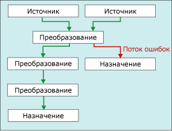

# <a name="error-handling-in-data"></a>Обработка ошибок в данных

[!INCLUDE[ssis-appliesto](../../includes/ssis-appliesto-ssvrpluslinux-asdb-asdw-xxx.md)]


  Если компонент потока данных применяет преобразование к данным столбца, выделяет данные из источников или загружает данные в назначения, то может возникнуть ошибка. Ошибки часто возникают из-за непредвиденных значений данных. Например, преобразование данных не выполняется, так как столбец вместо числа содержит строку; вставка в столбец базы данных не выполняется, потому что данные имеют тип даты, а столбец содержит числовые данные; наконец, результат выражения не может быть определен, так как значение столбца равно нулю, поэтому математическая операция недопустима.  
  
 Обычно происходят ошибки следующих категорий.  
  
-   Ошибки преобразования данных, возникающие, если преобразование приводит к потере значащих разрядов, потере незначащих разрядов или к усечению строк. Ошибки преобразования данных также возникают, если запрашиваемое преобразование не поддерживается.  
  
-   Ошибки оценки выражений, возникающие, если выражения, оцениваемые во время исполнения, выполняют недействительные операции или становятся синтаксически неправильными из-за потери данных или их неверных значений данных.  
  
-   Ошибки поиска, возникающие, если операция поиска не может обнаружить соответствия в таблице уточняющих запросов.  
  
 Список ошибок, предупреждений и других сообщений служб Integration Services см. в разделе [Integration Services Error and Message Reference](../../integration-services/integration-services-error-and-message-reference.md).  
  
## <a name="use-error-outputs-to-capture-row-level-errors"></a>Использование выводов ошибок для записи ошибок на уровне строк  
 Многие компоненты потока данных поддерживают выходы ошибок, которые позволяют пользователю контролировать обработку ошибок компонентом на уровне строки как во входных, так и в выходных данных. Заданием параметров на отдельных столбцах на входе или выходе определяется, какие действия выполняет компонент при возникновении усечения или ошибки. Например, можно указать, что компонент завершается ошибкой, если имя клиента усечено, но пропускает ошибки в другом столбце, содержащем менее важные данные.  
  
 Вывод ошибок может быть связан с входными данными другого преобразования или загружен в назначение, отличное от назначения выхода без ошибок. Например, выход ошибки может быть привязан к преобразованию «Производный столбец», которое формирует строку для пустого столбца.  
  
 На следующей диаграмме показан простой поток данных, содержащий выход ошибок.  
  
   
  
 Дополнительные сведения см. в статьях [Поток данных](../../integration-services/data-flow/data-flow.md) и [Пути служб Integration Services](../../integration-services/data-flow/integration-services-paths.md).  

## <a name="configure-error-output-dialog-box"></a>Диалоговое окно "Настройка вывода ошибок"
Используйте диалоговое окно **Настройка вывода ошибок** , чтобы настроить параметры обработки ошибок для преобразований потока данных, поддерживающих вывод ошибок.  
  
 Дополнительные сведения о работе с выводом ошибок на выходе см. в разделе [Обработка ошибок в данных](../../integration-services/data-flow/error-handling-in-data.md).  
  
### <a name="options"></a>Параметры  
 **Вход или выход**  
 Просмотр имени вывода.  
  
 **Столбец**  
 Просмотр выходных столбцов, выбранных в диалоговом окне редактора преобразования.  
  
 **Ошибка**  
 Если это применимо, при возникновении ошибки задайте событие: пропустить ошибку, перенаправить строку или вызвать сбой компонента.  
  
 **См. также:** [Обработка ошибок в данных](../../integration-services/data-flow/error-handling-in-data.md)  
  
 **Усечение**  
 Если это применимо, при возникновении усечения задайте событие: пропустить ошибку, перенаправить строку или вызвать сбой компонента.  
  
 **См. также:** [Обработка ошибок в данных](../../integration-services/data-flow/error-handling-in-data.md)  
  
 **Описание**  
 Просмотрите описание операции.  
  
 **Присвоить указанное значение выбранным ячейкам**  
 Укажите действие, которое необходимо применить ко всем выбранным ячейкам при возникновении ошибки или усечения: пропустить ошибку, перенаправить строку или вызвать сбой компонента.  
  
 **Применить**  
 Применить параметр обработки ошибок к выбранным ячейкам.  
  
## <a name="errors-are-either-failures-or-truncations"></a>Ошибки — сбои или усечения  
 Ошибки разделяются на две категории: ошибки и усечения.  
  
 **Ошибки**. Ошибка указывает на определенную неполадку и формирует результат NULL. Такие ошибки могут включать в себя ошибки преобразования данных или ошибки оценки выражений. Например, попытка преобразовать в число строку, содержащую буквенные символы, вызывает ошибку. Преобразования данных, вычисления выражений и назначения результатов выражений переменным, свойствам и столбцам данных могут завершиться неудачей вследствие неверного приведения типа или несовместимости типов данных. Дополнительные сведения см. в разделах [Приведение (выражение служб SSIS)](../../integration-services/expressions/cast-ssis-expression.md), [Типы данных в выражениях служб Integration Services](../../integration-services/expressions/integration-services-data-types-in-expressions.md) и [Типы данных служб Integration Services](../../integration-services/data-flow/integration-services-data-types.md).  
  
 **Усечения**. Усечение менее серьезно, чем ошибка. Усечение формирует результаты, которые могут использоваться или даже быть желательными. Можно выбрать, интерпретировать усечения как ошибки или как приемлемые состояния. Например, при вставке 15-символьной строки в столбец шириной всего в один символ можно выбрать усечение строки.  
  
## <a name="select-an-error-handling-option"></a>Выбор параметра обработки ошибок  
 Можно установить, как источники, преобразования и назначения обрабатывают ошибки и усечения. В следующей таблице приводятся описания дополнительных параметров.  
  
|Параметр|Описание|  
|------------|-----------------|  
|Компонент, завершившийся сбоем|Задача потока данных заканчивается сбоем, если возникли ошибка или усечение. Неудача является параметром по умолчанию для ошибки и усечения.|  
|Пропуск неудачи|Ошибка или усечение пропускаются, и строка данных направляется на выход преобразования или источника.|  
|Перенаправление строки|Ошибка или строка данных усечения направляется на выход ошибок источника, преобразования или назначения.|  
  
## <a name="get-more-info-about-the-error"></a>Получение дополнительных сведений об ошибке  
 В дополнение к столбцам данных выход ошибок включает в себя столбцы **ErrorCode** и **ErrorColumn** . Столбец **ErrorCode** идентифицирует ошибку, а столбец **ErrorColumn** содержит идентификатор журнала обращений и преобразований столбца с ошибкой.  
  
 В некоторых случаях значение столбца **ErrorColumn** устанавливается в ноль. Это происходит, если условие ошибки влияет на целую строку, а не один столбец. Например, если преобразование «Уточняющий запрос» завершилось неудачно.  
  
 Эти два числовые значения могут быть малополезны без соответствующего описания ошибки и имени столбца. Ниже приведены несколько способов, как получить описание ошибки и имя столбца.  
  
-   Чтобы просматривать описания ошибок и имена столбцов, можно подключить к выводу ошибок средство просмотра данных. В конструкторе служб SSIS щелкните правой кнопкой мыши красную стрелку для вывода ошибок и выберите **Включить средство просмотра данных**.  
  
-   Вы можете найти имена столбцов, включив ведение журнала и выбрав событие **DiagnosticEx** . Это событие записывает карту столбцов потока данных в журнал. Затем можно найти имя столбца по его идентификатору в карте столбцов. Обратите внимание, что событие **DiagnosticEx** не сохраняет пробелы в выводе XML, чтобы уменьшить размер журнала. Для улучшения удобочитаемости скопируйте журнал (например, в решении Visual Studio) в редактор XML, поддерживающий форматирование XML и выделение синтаксиса. Дополнительные сведения о ведении журналов см. в разделе [Ведение журналов в службах Integration Services (SSIS)](../../integration-services/performance/integration-services-ssis-logging.md).  
  
     Ниже приведен пример карты столбцов потока данных.  
  
    ```xml  
  
    \<DTS:PipelineColumnMap xmlns:DTS="www.microsoft.com/SqlServer/Dts">  
        \<DTS:Pipeline DTS:Path="\Package\Data Flow Task">  
            \<DTS:Column DTS:ID="11" DTS:IdentificationString="ADO NET Source.Outputs[ADO NET Source Output].Columns[Customer]"/>  
            \<DTS:Column DTS:ID="12" DTS:IdentificationString="ADO NET Source.Outputs[ADO NET Source Output].Columns[Product]"/>  
            \<DTS:Column DTS:ID="13" DTS:IdentificationString="ADO NET Source.Outputs[ADO NET Source Output].Columns[Price]"/>  
            \<DTS:Column DTS:ID="14" DTS:IdentificationString="ADO NET Source.Outputs[ADO NET Source Output].Columns[Timestamp]"/>  
            \<DTS:Column DTS:ID="20" DTS:IdentificationString="ADO NET Source.Outputs[ADO NET Source Error Output].Columns[Customer]"/>  
            \<DTS:Column DTS:ID="21" DTS:IdentificationString="ADO NET Source.Outputs[ADO NET Source Error Output].Columns[Product]"/>  
            \<DTS:Column DTS:ID="22" DTS:IdentificationString="ADO NET Source.Outputs[ADO NET Source Error Output].Columns[Price]"/>  
            \<DTS:Column DTS:ID="23" DTS:IdentificationString="ADO NET Source.Outputs[ADO NET Source Error Output].Columns[Timestamp]"/>  
            \<DTS:Column DTS:ID="24" DTS:IdentificationString="ADO NET Source.Outputs[ADO NET Source Error Output].Columns[ErrorCode]"/>  
            \<DTS:Column DTS:ID="25" DTS:IdentificationString="ADO NET Source.Outputs[ADO NET Source Error Output].Columns[ErrorColumn]"/>  
            \<DTS:Column DTS:ID="31" DTS:IdentificationString="Flat File Destination.Inputs[Flat File Destination Input].Columns[Customer]"/>  
            \<DTS:Column DTS:ID="32" DTS:IdentificationString="Flat File Destination.Inputs[Flat File Destination Input].Columns[Product]"/>  
            \<DTS:Column DTS:ID="33" DTS:IdentificationString="Flat File Destination.Inputs[Flat File Destination Input].Columns[Price]"/>  
            \<DTS:Column DTS:ID="34" DTS:IdentificationString="Flat File Destination.Inputs[Flat File Destination Input].Columns[Timestamp]"/>  
        \</DTS:Pipeline>  
    \</DTS:PipelineColumnMap>  
  
    ```  
  
-   Можно также использовать компонент сценария, чтобы включить описание ошибки и имя столбца в дополнительные столбцы вывода ошибок. Например, см. раздел [Расширение вывода ошибок с помощью компонента скрипта](../../integration-services/extending-packages-scripting-data-flow-script-component-examples/enhancing-an-error-output-with-the-script-component.md).  
  
    -   Чтобы включить описание ошибки в дополнительный столбец, используйте одну строку скрипта для вызова метода <xref:Microsoft.SqlServer.Dts.Pipeline.Wrapper.IDTSComponentMetaData100.GetErrorDescription%2A> интерфейса <xref:Microsoft.SqlServer.Dts.Pipeline.Wrapper.IDTSComponentMetaData100> .  
  
    -   Чтобы включить имя столбца в дополнительный столбец, используйте одну строку скрипта для вызова метода <xref:Microsoft.SqlServer.Dts.Pipeline.Wrapper.IDTSComponentMetaData100.GetIdentificationStringByID%2A> интерфейса <xref:Microsoft.SqlServer.Dts.Pipeline.Wrapper.IDTSComponentMetaData100> .  
  
     Компонент сценария можно добавить в сегмент ошибок потока данных после компонентов потока данных, чьи ошибки необходимо записать. Как правило, этот компонент помещается непосредственно перед записью строк с ошибками в целевой объект. В этом случае сценарий просматривает только описание записанных строк с ошибками. Сегмент ошибок потока данных может исправить некоторые ошибки и не писать эти строки в целевой объект ошибки.  

## <a name="see-also"></a>См. также:  
 [Поток данных](../../integration-services/data-flow/data-flow.md)   
 [Преобразование данных с помощью преобразований](../../integration-services/data-flow/transformations/transform-data-with-transformations.md)   
 [Соединение компонентов с путями](https://msdn.microsoft.com/library/05633e4c-1370-4b05-802b-f36b07dd71c8)   
 [Задача потока данных](../../integration-services/control-flow/data-flow-task.md)   
 [Поток данных](../../integration-services/data-flow/data-flow.md)  
  
  
