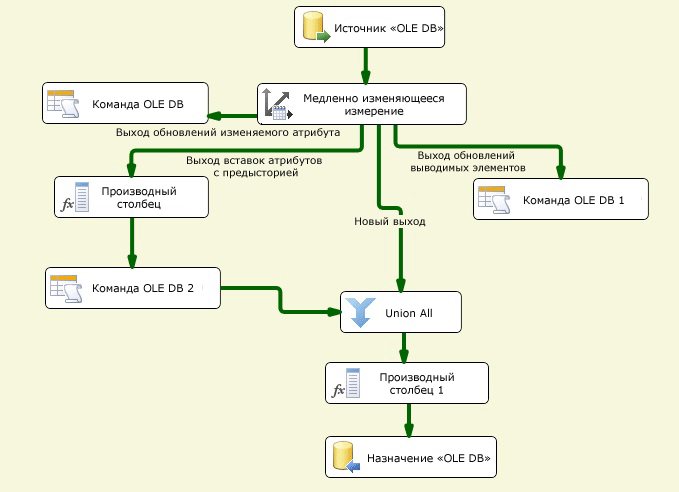

# Настройка выходов при помощи мастера медленно изменяющихся измерений
  Мастер медленно изменяющихся измерений выполняет функции редактора преобразования «Медленно изменяющиеся измерения». Построение и настройка потока данных для данных медленно изменяющегося измерения может оказаться сложной задачей. С помощью мастера медленно изменяющихся измерений легко создавать поток данных для выходов преобразования «Медленно изменяющиеся измерения», руководствуясь шагами по сопоставлению столбцов, выбору столбцов с бизнес-ключами, заданию атрибутов изменения столбцов и настройке поддержки выводимого элемента измерения.  
  
 Необходимо выбрать хотя бы один ключевой бизнес-столбец в таблице измерения и сопоставить его с входным столбцом. Значения данных столбцов бизнес-ключей связывают записи источника с записями таблицы измерения. Данное сопоставление используется преобразованием для обнаружения записи в таблице измерения, а также для определения, является ли данная запись новой или меняющейся. Бизнес-ключ обычно является первичным ключом источника, однако он может являться и резервным ключом в том случае, если однозначно определяет запись, а его значение не меняется. Бизнес-ключ также может являться составным ключом, состоящим из нескольких столбцов. Первичный ключ таблицы измерений обычно является суррогатным ключом — числовым значением, автоматически формируемым столбцом идентификаторов либо пользовательским решением, например скриптом.  
  
 Прежде чем запустить мастер медленно изменяющихся измерений, к потоку данных необходимо добавить источник и преобразование «Медленно изменяющиеся измерения», а затем соединить выход источника с входом преобразования. В случае необходимости поток данных может включать другие преобразования между источником данных и преобразованием «Медленно изменяющиеся измерения».  
  
 Чтобы открыть мастер медленно изменяющихся измерений в конструкторе служб [!INCLUDE[ssIS](../../../includes/ssis-md.md)] , дважды щелкните преобразование "Медленно изменяющиеся измерения".  
  
## Создание выходов медленно изменяющегося измерения  
  
#### Создание выходов преобразования «Медленно изменяющиеся измерения»  
  
1.  Выберите диспетчер соединений для доступа к источнику данных, содержащему таблицу измерения, которую необходимо обновить.  
  
     Можно выбрать диспетчер соединений из списка, входящего в пакет.  
  
2.  Выберите таблицу измерения или представление, которое необходимо обновить.  
  
     После выбора диспетчера соединений можно выбрать таблицу или представление источника данных.  
  
3.  Установите ключевые атрибуты для столбцов, а также сопоставьте входные столбцы со столбцами таблицы измерения.  
  
     Необходимо выбрать хотя бы один ключевой бизнес-столбец в таблице измерения и сопоставить его с входным столбцом. Остальные входные столбцы могут быть сопоставлены со столбцами таблицы измерения без сопоставления ключей.  
  
4.  Выберите тип изменения для каждого столбца.  
  
    -   Тип**Изменяемый атрибут** производит перезапись существующих значений в записях.  
  
    -   Тип**Атрибут с предысторией** производит создание новых записей.  
  
    -   Тип**Атрибут неизменности** означает, что значение элементов столбца не должно меняться.  
  
5.  Задать параметры для неизменяемых и изменяемых атрибутов.  
  
     При установке столбцам типа изменения **Атрибут неизменности** можно задать, чтобы в преобразовании «Медленно изменяющееся измерение» возникал сбой при обнаружении изменений в данных столбцах. При установке столбцам типа изменения **Изменяемый атрибут** можно указать, чтобы обновлялись все совпадающие записи, включая устаревшие записи.  
  
6.  Установка параметров атрибутов с предысторией.  
  
     При установке столбцам типа изменения **Атрибут с предысторией** необходимо выбрать способ отличия текущих и устаревших записей. Для отличия текущих и устаревших записей используется столбец-признак текущей строки или два столбца с датами. При использовании столбца-признака текущей строки необходимо присваивать ему значение **Current**или **True** , если запись еще не устарела. В противном случае столбцу необходимо присваивать значение **Expired** или **False** . Также можно задавать пользовательские значения. При использовании двух столбцов с начальной и конечной датой можно задавать их значения как вручную, так и сохраняя значение соответствующей системной переменной.  
  
7.  Задайте поддержку выводимых элементов и выберите столбцы, содержащиеся в записи выводимых элементов.  
  
     При загрузке мер в таблицу фактов можно создавать предварительные записи для еще не существующих выводимых элементов. Далее, при получении значащих данных записи измерений могут быть обновлены. Могут быть созданы предварительные записи следующих типов:  
  
    -   Запись, в которой все столбцы с типами изменения пусты.  
  
    -   Запись, в которой логический столбец показывает, что она является выводимым элементом.  
  
8.  Просмотрите конфигурации, созданные мастером медленно изменяющихся измерений. В зависимости от поддерживаемых типов изменений к пакету добавляются различные наборы компонентов потока данных.  
  
     На представленной ниже диаграмме показан пример потока данных, поддерживающего изменения атрибутов неизменности, изменяемых атрибутов и атрибутов с предысторией, выводимые элементы, а также изменения совпадающих записей.  
  
       
  
## Обновление выходов медленно изменяющегося измерения  
 Чтобы обновить конфигурацию выходов преобразования «Медленно изменяющиеся измерения», вернитесь в мастер медленно изменяющихся измерений и измените свойства на его страницах. Также преобразование «Медленно изменяющееся измерение» можно обновить с помощью диалогового окна **Расширенный редактор** или программно.  
  
## См. также  
 [Slowly Changing Dimension Transformation](../../../integration-services/data-flow/transformations/slowly-changing-dimension-transformation.md)  
  
  
