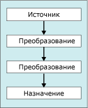

# Преобразование данных с помощью преобразований
  [!INCLUDE[ssISnoversion](../../../includes/ssisnoversion-md.md)] включают три различных типа компонентов потока данных: источники, преобразования и назначения.  
  
 На следующей диаграмме показан простой поток данных, который имеет источник, два преобразования и назначение.  
  
   
  
 [!INCLUDE[ssISnoversion](../../../includes/ssisnoversion-md.md)] обеспечивают следующие функциональные возможности:  
  
-   разделение, копирование и объединение наборов строк и выполнение операций уточняющего запроса;  
  
-   обновление значений столбца и создание новых столбцов путем применения преобразований, таких как изменение нижнего регистра в верхний регистр;  
  
-   выполнение операций бизнес-аналитики, таких как очистка данных, интеллектуальный анализ текста или выполнение запросов прогноза интеллектуального анализа данных;  
  
-   создание новых наборов строк, содержащих статистические или упорядоченные значения, образцы данных, сведенные данные или данные, сведение которых отменено;  
  
-   выполнение задач, таких как экспорт и импорт данных, предоставление данных аудита, работа с медленно изменяющимися измерениями.  
  
 Дополнительные сведения см. в статье [Integration Services Transformations](../../../integration-services/data-flow/transformations/integration-services-transformations.md).  
  
 Также можно создавать пользовательские преобразования. Дополнительные сведения см. в разделах [Разработка пользовательского компонента потока данных](../../../integration-services/extending-packages-custom-objects/data-flow/developing-a-custom-data-flow-component.md) и [Разработка компонентов потока данных определенных типов](../../../integration-services/extending-packages-custom-objects-data-flow-types/developing-specific-types-of-data-flow-components.md).  
  
 После добавления преобразования к конструктору потока данных, но до настройки преобразования нужно подключить преобразование к потоку данных путем подключения к входу данного преобразования выхода другого преобразования или источника в потоке данных. Соединитель компонентов потока данных называется путем. Дополнительные сведения о соединении компонентов и работе с путями см. в разделе [Соединение компонентов с путями](../Topic/Connect%20Components%20with%20Paths.md).  
  
### Добавление преобразования к потоку данных  
  
-   [Добавление или удаление компонента в потоке данных](../../../integration-services/data-flow/add-or-delete-a-component-in-a-data-flow.md)  
  
### Подключение преобразования к потоку данных  
  
-   [Соединение компонентов в потоке данных](../../../integration-services/data-flow/connect-components-in-a-data-flow.md)  
  
### Установка свойства преобразования  
  
-   [Установление свойств компонента потока данных](../../../integration-services/data-flow/set-the-properties-of-a-data-flow-component.md)  
  
## См. также  
 [Задача потока данных](../../../integration-services/control-flow/data-flow-task.md)   
 [Поток данных](../../../integration-services/data-flow/data-flow.md)   
 [Соединение компонентов с путями](../Topic/Connect%20Components%20with%20Paths.md)   
 [Обработка ошибок в данных](../../../integration-services/data-flow/error-handling-in-data.md)   
 [Поток данных](../../../integration-services/data-flow/data-flow.md)  
  
  