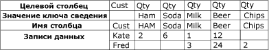
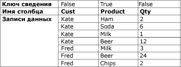

# Преобразование отмены свертывания

[!INCLUDE[ssis-appliesto](../../../includes/ssis-appliesto-ssvrpluslinux-asdb-asdw-xxx.md)]

  Преобразование «Отмена свертывания» превращает набор ненормализованных данных в более нормализованную версию за счет развертывания значений из нескольких столбцов одной записи в несколько записей с теми же значениями в одном столбце. Например, набор данных с перечнем имен клиентов имеет одну строку для каждого клиента, при этом купленные товары и их количество отображаются в столбцах строки. После нормализации с помощью преобразования отмены свертывания набор данных содержит отдельную строку по каждому продукту, приобретенному клиентом.  
  
 На диаграмме ниже показан набор данных до преобразования «Отмена сведения» в столбце Product.  
  
   
  
 На диаграмме ниже показан набор данных после преобразования «Отмена сведения» в столбце Product.  
  
   
  
 В некоторых случаях результаты преобразования «Отмена свертывания» могут содержать строки с непредвиденными значениями. Например, если образец данных для отмены свертывания, показанных на диаграмме, содержит для пользователя Фреда во всех столбцах Qty значения NULL, то для Фреда выходные данные будут содержать только одну строку, а не пять. Столбец Qty будет содержать либо значение NULL, либо ноль в зависимости от типа данных столбца.  
  
## Настройка преобразования «Отмена сведения»  
 Преобразование «Отмена свертывания» включает пользовательское свойство **PivotKeyValue** . Это свойство может быть обновлено выражением свойства при загрузке пакета. Дополнительные сведения см. в разделах [Выражения служб Integration Services (SSIS)](../../../integration-services/expressions/integration-services-ssis-expressions.md), [Использование выражений свойств в пакетах](../../../integration-services/expressions/use-property-expressions-in-packages.md) и [Пользовательские свойства преобразований](../../../integration-services/data-flow/transformations/transformation-custom-properties.md).  
  
 Это преобразование имеет один вход и один выход. Оно не имеет выхода ошибок.  
  
 Значения свойств можно задавать с помощью конструктора [!INCLUDE[ssIS](../../../includes/ssis-md.md)] или программными средствами.  
  
 Дополнительные сведения о свойствах, которые вы можете задать в диалоговом окне **Расширенный редактор** или программными средствами, см. в следующих разделах.  
  
-   [Общие свойства](https://msdn.microsoft.com/library/51973502-5cc6-4125-9fce-e60fa1b7b796)  
  
-   [Пользовательские свойства преобразований](../../../integration-services/data-flow/transformations/transformation-custom-properties.md)  
  
 Дополнительные сведения о настройке свойств см. в разделе [Установление свойств компонента потока данных](../../../integration-services/data-flow/set-the-properties-of-a-data-flow-component.md).  
  
## Редактор преобразования «Отмена свертывания»
  Используйте диалоговое окно **Редактор преобразования «Отмена свертывания»** , чтобы выбрать столбцы для сведения в строки, а также указать столбцы данных и новый выходной столбец сведенных значений.  
  
> [!NOTE]  
>  Этот раздел опирается на сценарий отмены свертывания, описанный в разделе [Unpivot Transformation](../../../integration-services/data-flow/transformations/unpivot-transformation.md) , чтобы проиллюстрировать использование параметров.  
  
### Параметры  
 **Доступные входные столбцы**  
 Используя флажки, укажите столбцы, которые должны быть сведены в строки.  
  
 **Название**  
 Просмотрите имя доступного входного столбца.  
  
 **Передать**  
 Укажите, следует ли включить этот столбец в выход с отмененным сведением.  
  
 **Входной столбец**  
 Выберите для каждой строки столбец из списка доступных входных столбцов. Выбранные столбцы обозначаются флажками в таблице **Доступные входные столбцы** .  
  
 В сценарии отмены свертывания, описанном в разделе [Unpivot Transformation](../../../integration-services/data-flow/transformations/unpivot-transformation.md), входными столбцами являлись столбцы **Ham**, **Soda**, **Milk**, **Beer**и **Chips** .  
  
 **Целевой столбец**  
 Введите имя столбца данных.  
  
 В сценарии отмены свертывания, описанном в разделе [Преобразование отмены свертывания](../../../integration-services/data-flow/transformations/unpivot-transformation.md), целевым столбцом является столбец количества (**Qty**).  
  
 **Значение ключа сведения**  
 Введите имя значения сведения. По умолчанию, используется имя входного столбца, однако можно выбрать любое уникальное описательное имя.  
  
 Значение этого свойства можно задать с помощью выражения свойства.  
  
 В сценарии отмены свертывания, описанном в разделе [Unpivot Transformation](../../../integration-services/data-flow/transformations/unpivot-transformation.md), значения сведения представлены в новом столбце Product, обозначенном параметром **Имя столбца значений ключа сведения** , в виде текстовых значений **Ham**, **Soda**, **Milk**, **Beer**и **Chips**.  
  
 **Имя столбца значений ключа сведения**  
 Введите имя столбца значений ключа сведения. По умолчанию, используется «Значение ключа сведения», тем не менее можно выбрать любое уникальное описательное имя.  
  
 В сценарии отмены свертывания, описанном в разделе [Unpivot Transformation](../../../integration-services/data-flow/transformations/unpivot-transformation.md), именем столбца значений ключа сведения является **Product** , оно обозначает новый столбец **Product** , в который осуществляется отмена свертывания столбцов **Ham**, **Soda**, **Milk**, **Beer**и **Chips** .  
  
## См. также:  
 [Справочник по сообщениям об ошибках служб Integration Services](../../../integration-services/integration-services-error-and-message-reference.md)   
 [Преобразование «Сведение»](../../../integration-services/data-flow/transformations/pivot-transformation.md)  
  
  
