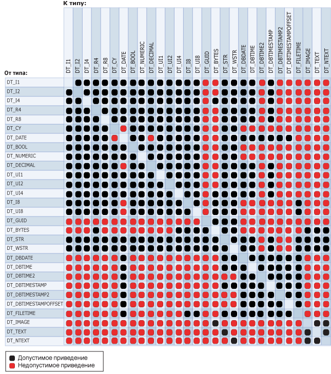

# <a name="cast-ssis-expression"></a>Приведение (выражение служб SSIS)

[!INCLUDE[ssis-appliesto](../../includes/ssis-appliesto-ssvrpluslinux-asdb-asdw-xxx.md)]


  Явно приводит выражение одного типа данных к другому типу. Оператор приведения может также выполнять функцию оператора усечения.  
  
## <a name="syntax"></a>Синтаксис  
  
```  
  
(type_spec) expression  
  
```  
  
## <a name="arguments"></a>Аргументы  
 *type_spec*  
 Является допустимым типом данных [!INCLUDE[ssIS](../../includes/ssis-md.md)] .  
  
 *expression*  
 Является допустимым выражением.  
  
## <a name="result-types"></a>Типы результата  
 Тип данных *type_spec*. Дополнительные сведения см. в разделе [Integration Services Data Types](../../integration-services/data-flow/integration-services-data-types.md).  
  
## <a name="remarks"></a>Remarks  
 На следующей диаграмме перечислены допустимые операторы приведения.  
  
   
  
 Для приведения к некоторым типам данных необходимо задавать определенные параметры. В следующей таблице приведены эти типы данных и их параметры.  
  
|Тип данных|Параметр|Пример|  
|---------------|---------------|-------------|  
|DT_STR|*charcount*<br /><br /> *codepage*|Команда (DT_STR,30,1252) приводит 30 байт (или 30 символов) к значению типа DT_STR, используя кодовую страницу 1252.|  
|DT_WSTR|*Charcount*|Команда (DT_WSTR,20) приводит 20 пар байт (или символов в формате Юникод) к значению типа DT_WSTR.|  
|DT_BYTES|*Bytecount*|(DT_BYTES,50) приводит 50 байт к типу данных DT_BYTES.|  
|DT_DECIMAL|*Масштабирование*|(DT_DECIMAL,2) приводит числовое значение к типу данных DT_DECIMAL, используя масштаб 2.|  
|DT_NUMERIC|*Точность*<br /><br /> *Масштабирование*|(DT_NUMERIC,10,3) приводит числовое значение к типу данных DT_NUMERIC, используя точность 10 и масштаб 3.|  
|DT_TEXT|*Codepage*|(DT_TEXT,1252) приводит значение к типу данных DT_TEXT, используя кодовую страницу 1252.|  
  
 При приведении строки к значению типа DT_DATE (или обратно) используется локаль преобразования. Однако дата задается в формате ISO (ГГГГ-ММ-ДД) вне зависимости от того, используется ли в локали формат ISO.  
  
> [!NOTE]  
>  Инструкции по преобразованию строк в тип даты, отличный от DT_DATE, см. в разделе [Типы данных служб Integration Services](../../integration-services/data-flow/integration-services-data-types.md).  
  
 Если кодовая страница является многобайтовой, число байт и символов может не совпадать. При приведении преобразования данных типа DT_WSTR к данным типа DT_STR с одинаковым значением параметра *charcount* может произойти усечение символов в результирующей строке. При наличии соответствующего места в столбце целевой таблицы присвойте параметру *charcount* значение, равное числу байт, требующихся для многобайтовой кодовой страницы. Например, при приведении символьных данных к формату DT_STR с использованием кодовой страницы 936 необходимо задать значение параметра *charcount* в два раза большее, чем количество символов в исходных данных. При преобразовании символьных данных с использованием кодовой страницы UTF-8 необходимо задать значение параметра *charcount* в четыре раза большее.  
  
 Дополнительные сведения о структуре типов данных «date» см. в разделе [Integration Services Data Types](../../integration-services/data-flow/integration-services-data-types.md).  
  
## <a name="ssis-expression-examples"></a>Примеры выражений служб SSIS  
 В данном примере числовое значение приводится к целому.  
  
```  
(DT_I4) 3.57  
```  
  
 В данном примере целое число приводится в символьную строку, используя кодовую страницу 1252.  
  
```  
(DT_STR,1,1252)5  
```  
  
 В данном примере строка, состоящая из трех символов, преобразуется в двухбайтовые символы.  
  
```  
(DT_WSTR,3)"Cat"  
```  
  
 В данном примере целое число преобразуется в десятичное с масштабом 2.  
  
```  
(DT_DECIMAl,2)500  
```  
  
 В данном примере целое число преобразуется в число с точностью 7 и масштабом 3.  
  
```  
(DT_NUMERIC,7,3)4000  
```  
  
 В данном примере значения столбца **FirstName** преобразуются из формата **nvarchar** длиной 50 в символьную строку, используя кодовую страницу 1252.  
  
```  
(DT_STR,50,1252)FirstName  
```  
  
 В этом примере значения в столбце **DateFirstPurchase** типа DT_DBDATE приводятся к строке в Юникоде длиной 20 символов.  
  
```  
(DT_WSTR,20)DateFirstPurchase  
```  
  
 В данном примере строковый литерал «True» преобразуется в логическое значение.  
  
```  
(DT_BOOL)"True"  
```  
  
 В данном примере строковый литерал приводится к типу DT_DBDATE.  
  
```  
(DT_DBDATE) "1999-10-11"  
```  
  
 В данном примере строковый литерал приводится к типу данных DT_DBTIME2 с 5 цифрами для представления долей секунды. (Тип данных DT_DBTIME2 допускает использование от 0 до 7 цифр, выделенных на представление долей секунд).  
  
```  
(DT_DBTIME2, 5) "16:34:52.12345"  
```  
  
 В данном примере строковый литерал приводится к типу данных DT_DBTIMESTAMP2 с 4 цифрами для представления долей секунды. (Тип данных DT_DBTIMESTAMP2 допускает использование от 0 до 7 цифр, выделенных на представление долей секунд).  
  
```  
(DT_DBTIMESTAMP2, 4) "1999-10-11 16:34:52.1234"  
```  
  
 В данном примере строковый литерал приводится к типу данных DT_DBTIMESTAMPOFFSET с 7 цифрами для представления долей секунды. (Тип данных DT_DBTIMESTAMPOFFSET допускает использование от 0 до 7 цифр, выделенных на представление долей секунд).  
  
```  
(DT_DBTIMESTAMPOFFSET, 7) "1999-10-11 16:34:52.1234567 + 5:35"  
```  
  
## <a name="see-also"></a>См. также:  
 [Очередность и ассоциативность операторов](../../integration-services/expressions/operator-precedence-and-associativity.md)   
 [Операторы (выражение служб SSIS)](../../integration-services/expressions/operators-ssis-expression.md)   
 [Выражения служб Integration Services (SSIS)](../../integration-services/expressions/integration-services-ssis-expressions.md)   
 [Типы данных служб Integration Services в выражениях](../../integration-services/expressions/integration-services-data-types-in-expressions.md)  
  
  
