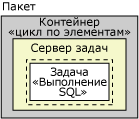

# Обработчики событий в службах Integration Services (SSIS)
  Во время выполнения исполняемых объектов (пакетов, контейнеров «цикл по каждому элементу», «цикл по элементам», последовательности и узлы задач) возникают события. Например, в случае ошибки возникает событие OnError. Можно создать пользовательские обработчики событий для этих событий, чтобы расширить функциональность пакетов и упростить управление пакетами во время их выполнения. Обработчики событий могут выполнять следующие задачи:  
  
-   Очистка временного хранилища данных, когда пакет или задача прекращает выполнение.  
  
-   Получение сведений о системе для слежения за доступностью ресурса перед запуском пакета.  
  
-   Обновление данных в таблице, когда уточняющий запрос в ссылочной таблице закончился неудачей.  
  
-   Отправка сообщения по электронной почте при возникновении ошибки или предупреждения или при неудачном завершении задачи.  
  
 Если у события нет обработчика, событие передается контейнеру выше по иерархии контейнеров пакета. Если у этого контейнера есть обработчик, он выполняется в ответ на событие. Если нет, то событие передается контейнеру выше в иерархии контейнеров.  
  
 Следующая диаграмма приводит простой пакет, имеющий контейнер «цикл по элементам», который, в свою очередь, содержит задачу «Выполнение SQL».  
  
   
  
 Только у пакета имеется обработчик для события **OnError** . Когда ошибка происходит во время выполнения задачи «Выполнение SQL», то запускается обработчик события **OnError** данного пакета. Следующая диаграмма показывает последовательность вызовов, вследствие которой выполняется обработчик события **OnError** данного пакета.  
  
   
  
 Обработчики событий являются элементами коллекции обработчиков событий, и эта коллекция включена во все контейнеры. Если пакет создается при помощи конструктора служб [!INCLUDE[ssIS](../includes/ssis-md.md)] , то можно видеть элементы коллекции обработчиков событий в папке **Обработчики событий** на вкладке **Обозреватель пакетов** конструктора служб [!INCLUDE[ssIS](../includes/ssis-md.md)] .  
  
 Можно настроить контейнер обработчика событий следующим образом:  
  
-   Укажите имя и описание для обработчика событий.  
  
-   Укажите, следует ли запускать обработчик событий, следует ли считать выполнение пакета неудачным в случае неудачи выполнения обработчика событий, а также укажите максимальное число ошибок, после которого обработчик считается неудачно завершенным.  
  
-   Укажите результат выполнения, который будет возвращен вместо действительного результата, возвращаемого обработчиком событий во время выполнения.  
  
-   Укажите параметр преобразования обработчика события.  
  
-   Укажите режим создания журнала, используемого обработчиком событий.  
  
## Содержимое обработчика событий  
 Создание обработчика событий сходно с построением пакета: у обработчика есть задачи и контейнеры, которые по порядку включаются в поток управления, и обработчик также может включать в себя потоки данных. Конструктор служб [!INCLUDE[ssIS](../includes/ssis-md.md)] содержит вкладку **Обработчики событий** для создания пользовательских обработчиков событий.  
  
 Обработчики событий также могут быть созданы программно. Дополнительные сведения см. в статье [Программная обработка событий](../integration-services/building-packages-programmatically/handling-events-programmatically.md).  
  
## События времени выполнения  
 В следующей таблице перечисляются обработчики событий, предоставляемые службами [!INCLUDE[ssISnoversion](../includes/ssisnoversion-md.md)], и описываются события времени выполнения, в случае которых обработчик запускается.  
  
|Обработчик событий|Событие|  
|-------------------|-----------|  
|**OnError**|Обработчик события **OnError** . Событие вызывается исполняемым объектом при возникновении ошибки.|  
|**OnExecStatusChanged**|Обработчик события **OnExecStatusChanged** . Событие вызывается исполняемым объектом при изменении его состояния выполнения.|  
|**OnInformation**|Обработчик события **OnInformation** . Это событие вызывается во время проверки и выполнения исполняемого объекта для передачи данных. Событие передает только данные; ошибки и предупреждения не передаются.|  
|**OnPostExecute**|Обработчик события **OnPostExecute** . Событие вызывается исполняемым объектом сразу после выполнения.|  
|**OnPostValidate**|Обработчик события **OnPostValidate** . Событие вызывается исполняемым объектом после завершения проверки.|  
|**OnPreExecute**|Обработчик события **OnPreExecute** . Событие вызывается исполняемым объектом непосредственно перед его запуском.|  
|**OnPreValidate**|Обработчик события **OnPreValidate** . Событие вызывается исполняемым объектом в начале проверки.|  
|**OnProgress**|Обработчик события **OnProgress** . Событие вызывается исполняемым объектом в процессе выполнения.|  
|**OnQueryCancel**|Обработчик события **OnQueryCancel** . Событие вызывается исполняемым объектом, чтобы установить, следует ли ему прекратить выполнение.|  
|**OnTaskFailed**|Обработчик события **OnTaskFailed** . Событие вызывается неудачно завершившейся задачей.|  
|**OnVariableValueChanged**|Обработчик события **OnVariableValueChanged** . Событие вызывается исполняемым объектом при изменении значения переменной. Событие вызывается исполняемым объектом, в котором определена переменная. Событие не происходит, если свойство **RaiseChangeEvent** для этой переменной установлено в значение **False**. Дополнительные сведения см. в разделе [Переменные служб Integration Services (SSIS)](../integration-services/integration-services-ssis-variables.md).|  
|**OnWarning**|Обработчик события **OnWarning** . Событие вызывается исполняемым объектом при возникновении предупреждения.|  
  
## Настройка обработчика событий  
 Задать свойства можно в окне **Свойства** среды [!INCLUDE[ssBIDevStudioFull](../includes/ssbidevstudiofull-md.md)] или программными средствами.  
  
 Дополнительные сведения о настройке свойств этих свойств в [!INCLUDE[ssBIDevStudioFull](../includes/ssbidevstudiofull-md.md)] см. в разделе [Задание свойств задач или контейнеров](../Topic/Set%20the%20Properties%20of%20a%20Task%20or%20Container.md).  
  
 Дополнительные сведения о настройке этих свойств программными средствами см. в разделе <xref:Microsoft.SqlServer.Dts.Runtime.DtsEventHandler>.  
  
## Связанные задачи  
 Сведения о том, как добавить обработчик событий в пакет, см. в разделе [Добавление к пакету обработчик событий](../Topic/Add%20an%20Event%20Handler%20to%20a%20Package.md).  
  
  