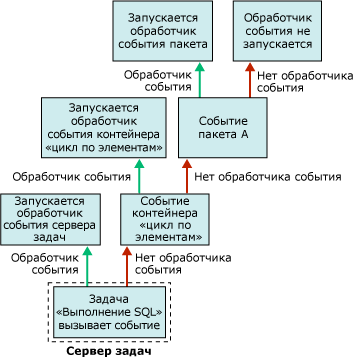

# Обработчики событий в службах Integration Services (SSIS)
  Во время выполнения исполняемых объектов (пакетов, контейнеров «цикл по каждому элементу», «цикл по элементам», последовательности и узлы задач) возникают события. Например, в случае ошибки возникает событие OnError. Можно создать пользовательские обработчики событий для этих событий, чтобы расширить функциональность пакетов и упростить управление пакетами во время их выполнения. Обработчики событий могут выполнять следующие задачи:  
  
-   Очистка временного хранилища данных, когда пакет или задача прекращает выполнение.  
  
-   Получение сведений о системе для слежения за доступностью ресурса перед запуском пакета.  
  
-   Обновление данных в таблице, когда уточняющий запрос в ссылочной таблице закончился неудачей.  
  
-   Отправка сообщения по электронной почте при возникновении ошибки или предупреждения или при неудачном завершении задачи.  
  
 Если у события нет обработчика, событие передается контейнеру выше по иерархии контейнеров пакета. Если у этого контейнера есть обработчик, он выполняется в ответ на событие. Если нет, то событие передается контейнеру выше в иерархии контейнеров.  
  
 Следующая диаграмма приводит простой пакет, имеющий контейнер «цикл по элементам», который, в свою очередь, содержит задачу «Выполнение SQL».  
  
   
  
 Только у пакета имеется обработчик для события **OnError** . Когда ошибка происходит во время выполнения задачи «Выполнение SQL», то запускается обработчик события **OnError** данного пакета. Следующая диаграмма показывает последовательность вызовов, вследствие которой выполняется обработчик события **OnError** данного пакета.  
  
   
  
 Обработчики событий являются элементами коллекции обработчиков событий, и эта коллекция включена во все контейнеры. Если пакет создается при помощи конструктора служб [!INCLUDE[ssIS](../includes/ssis-md.md)] , то можно видеть элементы коллекции обработчиков событий в папке **Обработчики событий** на вкладке **Обозреватель пакетов** конструктора служб [!INCLUDE[ssIS](../includes/ssis-md.md)] .  
  
 Можно настроить контейнер обработчика событий следующим образом:  
  
-   Укажите имя и описание для обработчика событий.  
  
-   Укажите, следует ли запускать обработчик событий, следует ли считать выполнение пакета неудачным в случае неудачи выполнения обработчика событий, а также укажите максимальное число ошибок, после которого обработчик считается неудачно завершенным.  
  
-   Укажите результат выполнения, который будет возвращен вместо действительного результата, возвращаемого обработчиком событий во время выполнения.  
  
-   Укажите параметр преобразования обработчика события.  
  
-   Укажите режим создания журнала, используемого обработчиком событий.  
  
## Содержимое обработчика событий  
 Создание обработчика событий сходно с построением пакета: у обработчика есть задачи и контейнеры, которые по порядку включаются в поток управления, и обработчик также может включать в себя потоки данных. Конструктор служб [!INCLUDE[ssIS](../includes/ssis-md.md)] содержит вкладку **Обработчики событий** для создания пользовательских обработчиков событий.  
  
 Обработчики событий также могут быть созданы программно. Дополнительные сведения см. в статье [Программная обработка событий](../integration-services/building-packages-programmatically/handling-events-programmatically.md).  
  
## События времени выполнения  
 В следующей таблице перечисляются обработчики событий, предоставляемые службами [!INCLUDE[ssISnoversion](../includes/ssisnoversion-md.md)] , и описываются события времени выполнения, в случае которых обработчик запускается.  
  
|Обработчик событий|Событие|  
|-------------------|-----------|  
|**OnError**|Обработчик события **OnError** . Событие вызывается исполняемым объектом при возникновении ошибки.|  
|**OnExecStatusChanged**|Обработчик события **OnExecStatusChanged** . Событие вызывается исполняемым объектом при изменении его состояния выполнения.|  
|**OnInformation**|Обработчик события **OnInformation** . Это событие вызывается во время проверки и выполнения исполняемого объекта для передачи данных. Событие передает только данные; ошибки и предупреждения не передаются.|  
|**OnPostExecute**|Обработчик события **OnPostExecute** . Событие вызывается исполняемым объектом сразу после выполнения.|  
|**OnPostValidate**|Обработчик события **OnPostValidate** . Событие вызывается исполняемым объектом после завершения проверки.|  
|**OnPreExecute**|Обработчик события **OnPreExecute** . Событие вызывается исполняемым объектом непосредственно перед его запуском.|  
|**OnPreValidate**|Обработчик события **OnPreValidate** . Событие вызывается исполняемым объектом в начале проверки.|  
|**OnProgress**|Обработчик события **OnProgress** . Событие вызывается исполняемым объектом в процессе выполнения.|  
|**OnQueryCancel**|Обработчик события **OnQueryCancel** . Событие вызывается исполняемым объектом, чтобы установить, следует ли ему прекратить выполнение.|  
|**OnTaskFailed**|Обработчик события **OnTaskFailed** . Событие вызывается неудачно завершившейся задачей.|  
|**OnVariableValueChanged**|Обработчик события **OnVariableValueChanged** . Событие вызывается исполняемым объектом при изменении значения переменной. Событие вызывается исполняемым объектом, в котором определена переменная. Событие не происходит, если свойство **RaiseChangeEvent** для этой переменной установлено в значение **False**. Дополнительные сведения см. в разделе [Integration Services &#40;SSIS&#41; Variables](../integration-services/integration-services-ssis-variables.md).|  
|**OnWarning**|Обработчик события **OnWarning** . Событие вызывается исполняемым объектом при возникновении предупреждения.|  

## Добавление к пакету обработчик событий
При выполнении контейнеров и задач происходят разные события. Возможно создание обработчиков пользовательских событий, которые отвечают на возникающие события запуском рабочего процесса. Например, можно создать обработчик событий, который по электронной почте посылает сообщение, если задача завершается неудачей.  
  
 Обработчик событий аналогичен пакету. Как и пакет, обработчик событий обеспечивает область действия для переменных и включает поток управления и потоки данных по выбору. Можно построить обработчик событий для пакетов, контейнера «цикл по каждому элементу», контейнера «цикл по элементам», контейнера последовательности и всех задач.  
  
 Создайте обработчик событий, используя область конструктора вкладки **Обработчики событий** в конструкторе служб [!INCLUDE[ssIS](../includes/ssis-md.md)] .  
  
 Если вкладка **Обработчики событий** активна, узлы **Элементы потока управления** и **Задачи плана обслуживания** в области элементов конструктора служб [!INCLUDE[ssIS](../includes/ssis-md.md)] содержат задачу и контейнеры для построения потока управления в обработчике событий. Узлы **Источники потока данных**, **Преобразования**и **Назначения потока данных** содержат источники данных, преобразования и назначения для построения потоков данных в обработчике событий. Дополнительные сведения см. в разделах [Control Flow](../integration-services/control-flow/control-flow.md) и [Data Flow](../integration-services/data-flow/data-flow.md).  
  
 Вкладка **Обработчики событий** также включает зону диспетчеров **Соединения** , в которой можно создавать и изменять диспетчеры соединений, используемых обработчиками событий для соединения с серверами и источниками данных. Дополнительные сведения см. в разделе [Создание диспетчеров соединений](http://msdn.microsoft.com/library/6ca317b8-0061-4d9d-b830-ee8c21268345).  
  
### Добавление обработчика событий на вкладку "Обработчики событий"  
  
1.  В среде [!INCLUDE[ssBIDevStudioFull](../includes/ssbidevstudiofull-md.md)]откройте проект служб [!INCLUDE[ssISnoversion](../includes/ssisnoversion-md.md)] , содержащий необходимый пакет.  
  
2.  Чтобы открыть пакет, дважды щелкните его в обозревателе решений.  
  
3.  Перейдите на вкладку **Обработчики событий** .  
  
       
  
     Создание потока управления и потоков данных в обработчике событий аналогично созданию потока управления и потока данных в пакете. Дополнительные сведения см. в разделах [Control Flow](../integration-services/control-flow/control-flow.md) и [Data Flow](../integration-services/data-flow/data-flow.md).  
  
4.  В списке **Исполняемый объект** выберите исполняемый объект, для которого создается обработчик события.  
  
5.  В списке **Обработчик событий** выберите обработчик событий, который необходимо построить.  
  
6.  Щелкните ссылку в области конструктора на вкладке **Обработчик событий** .  
  
7.  Добавьте элементы потока управления к обработчику событий и подключите элементы, используя управление очередностью (перетаскивая ограничение из одного элемента потока управления в другой). Дополнительные сведения см. в статье [Control Flow](../integration-services/control-flow/control-flow.md).  
  
8.  Дополнительно можно добавить задачу потока данных и в области конструктора на вкладке **Поток данных** создать поток данных для обработчика событий. Дополнительные сведения см. в статье [Data Flow](../integration-services/data-flow/data-flow.md).  
  
9. Чтобы сохранить пакет, в меню **Файл** выберите пункт **Сохранить выбранные элементы** .  

## Задание свойств обработчика событий  
 Задать свойства можно в окне **Свойства** среды [!INCLUDE[ssBIDevStudioFull](../includes/ssbidevstudiofull-md.md)] или программными средствами.  
  
 Дополнительные сведения о настройке свойств этих свойств в [!INCLUDE[ssBIDevStudioFull](../includes/ssbidevstudiofull-md.md)]см. в разделе [Задание свойств задач или контейнеров](http://msdn.microsoft.com/library/52d47ca4-fb8c-493d-8b2b-48bb269f859b).  
  
 Дополнительные сведения о настройке этих свойств программными средствами см. в разделе <xref:Microsoft.SqlServer.Dts.Runtime.DtsEventHandler>.  
  
## Related Tasks  
 Сведения о том, как добавить обработчик событий в пакет, см. в разделе [Добавление к пакету обработчик событий](http://msdn.microsoft.com/library/5e56885d-8658-480a-bed9-3f2f8003fd78).  
  
  
