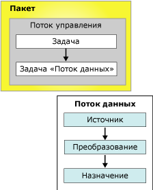

# Пакеты служб Integration Services (SSIS)

[!INCLUDE[ssis-appliesto](../includes/ssis-appliesto-ssvrpluslinux-asdb-asdw-xxx.md)]

  Пакет — это организованная коллекция соединений, элементов потока управления, элементов потока данных, обработчиков событий, переменных, параметров и конфигураций, которая собирается либо с помощью графических средств проектирования, предоставляемых службами [!INCLUDE[ssNoVersion](../includes/ssnoversion-md.md)] [!INCLUDE[ssISnoversion](../includes/ssisnoversion-md.md)] , либо программно.  Затем собранный пакет сохраняется в [!INCLUDE[ssNoVersion](../includes/ssnoversion-md.md)], хранилище пакетов [!INCLUDE[ssIS](../includes/ssis-md.md)] или в файловую систему. Также вы можете развернуть проект служб ssISnoversion на сервере [!INCLUDE[ssIS](../includes/ssis-md.md)] . Пакет — это рабочий блок, который можно получить, выполнить и сохранить.  
  
 Пакет сразу после создания — это пустой объект, который ничего не содержит. Чтобы расширить функциональные возможности пакета, в него добавляется поток управления и, при необходимости, один или несколько потоков данных.  
  
 На приведенной ниже диаграмме показан простой пакет, содержащий поток управления с задачей потока данных, которая, в свою очередь, содержит поток данных.  
  
   
  
 После создания основного пакета в него добавляются дополнительные функции, такие как ведение журнала, и переменные, расширяющие функциональные возможности пакета. Дополнительные сведения приведены в разделе, посвященном объектам, расширяющим функциональность пакетов.  
  
 Законченный пакет можно настраивать, задавая свойства уровня пакета, обеспечивающие безопасность, разрешающие перезапуск пакетов с контрольных точек и встраивающие транзакции в рабочем процессе пакета. Дополнительные сведения приведены в разделе, посвященном свойствам и поддержке расширенных функциональных возможностей.  
  
## Содержимое пакета  
 **Задачи и контейнеры (поток управления).** Поток управления состоит из одной или нескольких задач и контейнеров, которые выполняются при запуске пакета. Контролировать поток управления порядком выполнения задач или контейнеров и определять условия их запуска можно с помощью средств управления очередностью, позволяющих связывать задачи и контейнеры в пакете. Кроме того, подмножество задач и контейнеров можно группировать и повторно запускать как блок в потоке управления пакета. Дополнительные сведения см. в разделе [Поток управления](../integration-services/control-flow/control-flow.md).  
  
 **Источники данных и назначения (поток данных).** Поток данных состоит из источников и назначений, извлекающих и загружающих данные, из преобразований, изменяющих и расширяющих данные, а также из путей, связывающих источники, преобразования и назначения. Чтобы в пакет можно было добавить поток данных, поток управления пакета должен содержать задачу потока данных. Эта задача является исполняемым объектом пакета [!INCLUDE[ssIS](../includes/ssis-md.md)] , который создает, упорядочивает и запускает поток данных. Отдельный экземпляр подсистемы обработки потока данных открывается для каждой задачи потока данных в пакете. Дополнительные сведения см. в разделах [Задача потока данных](../integration-services/control-flow/data-flow-task.md) и [Поток данных](../integration-services/data-flow/data-flow.md).  
  
 **Диспетчеры подключений (подключения).** Как правило, в состав пакета входит как минимум один диспетчер соединений. Диспетчер сообщений используется в качестве связи между пакетом и источником данных, определяющей строку соединения для доступа к данным, которые используются задачами, преобразованиями и обработчиками событий в пакете. [!INCLUDE[ssISnoversion](../includes/ssisnoversion-md.md)] включены типы соединений для таких источников данных, как текстовые и XML-файлы, реляционные базы данных, а также базы данных и проекты служб [!INCLUDE[ssASnoversion](../includes/ssasnoversion-md.md)] . Дополнительные сведения см. в разделе [Соединения в службах Integration Services (SSIS)](../integration-services/connection-manager/integration-services-ssis-connections.md).  
  
## Объекты, расширяющие функциональные возможности пакета  
 В пакетах могут содержаться дополнительные объекты, обеспечивающие расширенные функциональные возможности или расширяющие имеющиеся возможности, например обработчики событий, конфигурации, ведение журналов и переменные.  
  
### Обработчики событий  
 Обработчик событий — это рабочий процесс, который запускается в ответ на события, вызванные пакетом, задачей или контейнером. Например, с помощью обработчика событий можно проверять наличие свободного места на диске при возникновении ошибки или события предварительного выполнения и отправлять по электронной почте сообщение о свободном месте на диске или об ошибке администратору. Обработчик событий имеет такую же структуру, как и пакет: поток управления и необязательные потоки данных. Обработчики событий можно добавлять в отдельные задачи или контейнеры в пакете. Дополнительные сведения см. в разделе [Обработчики событий в службах Integration Services (SSIS)](../integration-services/integration-services-ssis-event-handlers.md).  
  
### Конфигурации  
 Конфигурация — это набор пар вида "свойство-значение", определяющий свойства пакета и его задачи, контейнеры, переменные, соединения, а также обработчики событий при запуске пакета. Конфигурации позволяют обновлять свойства без изменения пакета. При запуске пакета загружаются данные конфигурации, обновляя значения свойств. Например, конфигурация может обновлять строку соединения для соединения.  
  
 Конфигурация сохраняется, а затем развертывается вместе с пакетом при установке пакета на другом компьютере. Для поддержки пакета в другой среде значения его конфигурации можно обновлять при установке пакета. Дополнительные сведения см. в разделе [Создание конфигурации пакетов](../integration-services/packages/create-package-configurations.md).  
  
### Ведение журналов и регистраторы  
 Журнал — это коллекция данных о пакете, собираемых во время работы пакета. Например, в журнале может быть записано время начала и окончания работы пакета. Регистратор определяет целевой тип и формат, который пакет с его контейнерами и задачами применяет для записи сведений о выполнении. Журналы связаны с пакетом, но задачи и контейнеры в пакете могут сохранять данные в журнале любого пакета. [!INCLUDE[ssISnoversion](../includes/ssisnoversion-md.md)] включают в себя различные встроенные регистраторы. Например, в состав служб [!INCLUDE[ssISnoversion](../includes/ssisnoversion-md.md)] входят регистраторы для [!INCLUDE[ssNoVersion](../includes/ssnoversion-md.md)] и текстовых файлов. Кроме того, можно создавать пользовательские регистраторы и применять их для ведения журналов. Дополнительные сведения см. в разделе [Ведение журналов в службах Integration Services (SSIS)](../integration-services/performance/integration-services-ssis-logging.md).  
  
### Переменные  
 [!INCLUDE[ssISnoversion](../includes/ssisnoversion-md.md)] поддерживают системные и пользовательские переменные. В системных переменных хранятся полезные сведения об объектах пакета во время выполнения, а пользовательские переменные поддерживают пользовательские сценарии в пакетах. Оба типа переменных можно использовать в выражениях, скриптах и конфигурациях.  
  
 Переменные уровня пакета — это предопределенные системные переменные, доступные для пакета, а также пользовательские переменные области пакета. Дополнительные сведения см. в статье [Переменные в службах Integration Services (SSIS)](../integration-services/integration-services-ssis-variables.md).  
 
### Параметры  
 [!INCLUDE[ssISnoversion](../includes/ssisnoversion-md.md)] могут быть использованы для присвоения значений свойствам внутри пакетов во время их выполнения. Можно создать *параметры проекта* на уровне проекта и *параметры пакета* на уровне пакета. Параметры проекта используются для предоставления любых внешних данных, получаемых проектом, одному пакету в проекте или более. Параметры пакета позволяют изменить выполнение пакета. При этом изменять пакет и развертывать его повторно не придется. Дополнительные сведения см. в статье [Параметры служб Integration Services (SSIS)](../integration-services/integration-services-ssis-package-and-project-parameters.md).  
 
## Свойства пакета, поддерживающие расширенные функциональные возможности  
 В объекте пакета можно настроить поддержку следующих возможностей: перезапуск пакета с контрольных точек, подпись пакета цифровым сертификатом, настройка уровня защиты пакета, а также проверка целостности данных с помощью транзакций.  
  
### Перезапуск пакетов  
 В пакете предусмотрены свойства контрольных точек, применяемых для перезапуска пакета в случае сбоя одной или нескольких задач. Например, если в пакете две задачи потока данных, обновляющих две различных таблицы, и одна из этих задач дает сбой, то пакет можно перезапустить без повторения первой задачи потока данных. Перезапуск может сэкономить время при использовании долго выполняющихся пакетов. При перезапуске пакет запускается сразу с задачи, вызвавшей сбой, а не повторяется целиком. Дополнительные сведения см. в разделе [Restart Packages by Using Checkpoints](../integration-services/packages/restart-packages-by-using-checkpoints.md).  
  
### Защита пакетов  
 Пакет можно подписать цифровой подписью и зашифровать с помощью пароля и ключа пользователя. Электронная подпись определяет подлинность источника пакета. Однако следует также настроить службы [!INCLUDE[ssISnoversion](../includes/ssisnoversion-md.md)] для проверки цифровой подписи при загрузке пакета. Дополнительные сведения см. в разделах [Определение источника пакетов с помощью цифровых подписей](../integration-services/security/identify-the-source-of-packages-with-digital-signatures.md) и [Контроль доступа для конфиденциальных данных в пакетах](../integration-services/security/access-control-for-sensitive-data-in-packages.md).  
  
### Поддержка транзакций  
 С помощью атрибута транзакции в пакете можно разрешать задачам, контейнерам и соединениям пакета присоединятся к транзакции. Атрибуты транзакции обеспечивают выполнение пакета со всеми его элементами как единого блока. Кроме того, пакеты могут запускать другие пакеты и регистрировать другие пакеты в транзакциях, что позволяет запускать несколько пакетов в качестве одного рабочего блока. Дополнительные сведения см. в разделе [Транзакции служб Integration Services](../integration-services/integration-services-transactions.md).  
  
## Пользовательские записи журнала, доступные в пакете  
 В следующей таблице перечислены пользовательские записи в журнале для пакетов. Дополнительные сведения см. в разделе [Ведение журналов в службах Integration Services (SSIS)](../integration-services/performance/integration-services-ssis-logging.md).  
  
|Запись журнала|Описание|  
|---------------|-----------------|  
|**PackageStart**|Указывает, что выполнение пакета началось.   Примечание. Эта запись журнала формируется автоматически. Ее нельзя исключить.|  
|**PackageEnd**|Указывает, что выполнение пакета завершено.   Примечание. Эта запись журнала формируется автоматически. Ее нельзя исключить.|  
|**Диагностика**|Предоставляет сведения о настройках системы, влияющих на выполнение пакета, таких как количество одновременно исполняемых объектов.|  
  
## Установка свойств пакета  
 Задать свойства можно в окне **Свойства** среды [!INCLUDE[ssBIDevStudioFull](../includes/ssbidevstudiofull-md.md)] или программными средствами.  
  
 Дополнительные сведения о задании этих свойств с использованием среды [!INCLUDE[ssBIDevStudioFull](../includes/ssbidevstudiofull-md.md)]см. в разделе [Установка свойств пакета](../integration-services/set-package-properties.md).  
  
 Дополнительные сведения о настройке этих свойств программными средствами см. в разделе <xref:Microsoft.SqlServer.Dts.Runtime.Package>.  

## Повторное использование существующего пакета в качестве шаблона  
 Пакеты часто используются как шаблоны, из которых формируются пакеты, обладающие базовой функциональностью. Можно создать базовый пакет и скопировать его или же обозначить пакет как шаблон. Например, пакет, загружающий и копирующий файлы, а затем извлекающий данные, может содержать задачи "FTP" и "Файловая система" в контейнере "цикл по каждому элементу", который перечисляет файлы в папке. Он также может включать диспетчеры соединений с неструктурированными файлами для доступа к данным и источники неструктурированных файлов для уточнения данных. Назначение данных изменяется и добавляется к каждому новому пакету после того, как он копируется из базового пакета. Можно создавать пакеты, а затем использовать их как шаблоны для новых пакетов, добавляемых в проект служб [!INCLUDE[ssISnoversion](../includes/ssisnoversion-md.md)] . Дополнительные сведения см. в разделе [Create Packages in SQL Server Data Tools](../integration-services/create-packages-in-sql-server-data-tools.md).  
  
 Если пакет создан программно или с помощью конструктора служб SSIS, идентификатор GUID добавляется в свойство **ID** , а имя — в свойство **Name** . При создании нового пакета с помощью шаблона или копирования уже существующего пакета имя и идентификатор GUID также копируются. Ведение журналов может вызвать проблемы, так как идентификатор GUID и имя пакета записываются в журналы для идентификации пакета, к которому относятся записанные данные. Поэтому необходимо изменять имя и идентификатор GUID для новых пакетов, чтобы отличать их от пакета, из которого они были скопированы, и чтобы отличать их друг от друга.  
  
 Чтобы изменить идентификатор пакета GUID, повторно сформируйте значение идентификатора GUID для свойства **ID** в окне свойств среды [!INCLUDE[ssBIDevStudioFull](../includes/ssbidevstudiofull-md.md)]. Чтобы изменить имя пакета, можно изменить значение свойства **Name** в окне свойств. Можно также использовать средство командной строки **dtutil** или изменить идентификатор GUID и имя программными средствами. Дополнительные сведения см. в разделах [Установка свойств пакета](../integration-services/set-package-properties.md) и [Программа dtutil](../integration-services/dtutil-utility.md).  
  
## Связанные задачи  
 [!INCLUDE[ssISnoversion](../includes/ssisnoversion-md.md)] для создания пакетов, в состав служб [!INCLUDE[ssIS](../includes/ssis-md.md)] входят два графических средства: конструктор служб [!INCLUDE[ssNoVersion](../includes/ssnoversion-md.md)] и мастер импорта и экспорта служб [!INCLUDE[ssIS](../includes/ssis-md.md)] . Подробные сведения см. в следующих разделах.  
  
-   [Импорт и экспорт данных с помощью мастера импорта и экспорта SQL Server](../integration-services/import-export-data/import-and-export-data-with-the-sql-server-import-and-export-wizard.md)  
  
-   [Создание пакетов в SQL Server Data Tools](../integration-services/create-packages-in-sql-server-data-tools.md)  
  
-   См. раздел [Программное построение пакетов](../integration-services/building-packages-programmatically/building-packages-programmatically.md) руководства разработчика. 
  
  
