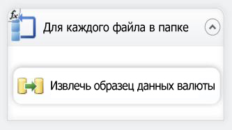
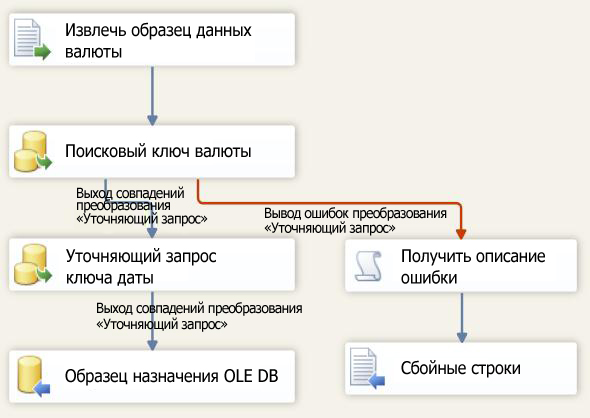

# Занятие 6–3. Проверка пакета, созданного на занятии 6
Во время выполнения пакет получит значение для свойства Directory из параметра VarFolderName.  
  
Чтобы убедиться, что пакет обновляет свойство Directory новым значением во время выполнения, выполните пакет. Поскольку в новый каталог были скопированы только три файла образцов данных, поток данных будет запущен только три раза, а не 14 раз в соответствии с количеством файлов в исходном каталоге.  
  
## Проверка макета пакета  
Прежде чем тестировать пакет, следует убедиться, что поток управления и поток данных пакета, созданного на занятии 6, содержит объекты, показанные на следующих диаграммах. Поток управления должен быть таким же, как и поток управления в занятии 5. Поток данных должен быть идентичен потоку данных в занятии 5.  
  
**Поток управления**  
  
  
  
**Поток данных**  
  
  
  
### Тестирование пакета учебника Lesson 6  
  
1.  В меню Отладка выберите команду Начать отладку.  
  
2.  После окончания работы пакета выберите в меню Отладка пункт Остановить отладку.  
  
## Следующая задача занятия  
[Шаг 4. Развертывание пакета, созданного на занятии 6](../integration-services/lesson-6-4-deploying-the-lesson-6-package.md)  
  
  
  
