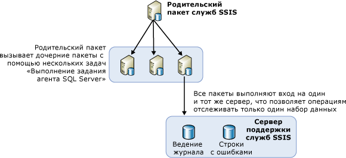

# Пакеты балансировки нагрузки на удаленном сервере с использованием агента SQL Server
  Если нужно загрузить много пакетов, удобно использовать другие доступные серверы. Балансировка нагрузки — это метод использования других серверов для загрузки пакетов, когда пакеты находятся под контролем родительского пакета. В службах [!INCLUDE[ssNoVersion](../../includes/ssnoversion-md.md)] [!INCLUDE[ssISnoversion](../../includes/ssisnoversion-md.md)]балансировка нагрузки — это ручная процедура, которая должна быть разработана владельцами пакетов. Балансировка нагрузки не выполняется серверами автоматически. Кроме того, пакеты, выполняемые на удаленных серверах, должны быть полными, а не отдельными задачами из других пакетов.  
  
 Балансировка нагрузки полезна в следующих случаях.  
  
-   Пакеты могут запускаться одновременно.  
  
-   Пакеты большие, и их последовательное выполнение может занять больше времени, чем выделено на их обработку.  
  
 Администраторы и архитекторы должны определить эффективность использования дополнительных серверов.  
  
## Иллюстрация к балансировке нагрузки  
 Следующая диаграмма показывает родительский пакет на сервере. Родительский пакет содержит несколько задач «Выполнение задания агента SQL Server». Каждая задача в родительском пакете вызывает агент SQL Server на удаленном сервере. Удаленные серверы содержат задания агента SQL Server, которые включают шаги, вызывающие пакет на сервере.  
  
   
  
 Шаги, необходимые для балансировки нагрузки в данной архитектуре, не являются новыми понятиями. Напротив, балансировка нагрузки достигнута благодаря использованию существующих основных понятий и общих объектов служб SSIS в новом качестве.  
  
## Выполнение пакетов на дистанционно расположенном экземпляре с помощью агента SQL Server  
 В базовой архитектуре выполнения удаленных пакетов центральный пакет находится на экземпляре SQL Server, управляющем другими удаленными пакетами. Следующая диаграмма представляет центральный пакет с именем «Родитель служб SSIS». Экземпляр, на котором находится данный родительский пакет, управляет выполнением заданий агента SQL Server, запускающего дочерний пакет. Дочерние пакеты не запускаются согласно установленному расписанию, управляемому агентом SQL Server на удаленном сервере. Вместо этого дочерние пакеты запускаются агентом SQL Server, затем вызываются родительским пакетом и запускаются на том же экземпляре SQL Server, на котором находится агент SQL Server.  
  
 Перед тем как запустить удаленный пакет, используя агент SQL Server, нужно сконфигурировать родительские и дочерние пакеты и установить задания агента SQL Server, управляющего дочерними пакетами. Следующие разделы содержат сведения о том, как создавать, конфигурировать, запускать и обслуживать пакеты на удаленном сервере. Для этого нужно сделать следующие несколько шагов.  
  
-   Создание дочерних пакетов и установка на удаленных серверах.  
  
-   Создание заданий агента SQL Server на удаленных экземплярах, которые будут запускать пакеты.  
  
-   Создание родительских пакетов.  
  
-   Определение сценария ведения журнала для дочерних пакетов.  
  
## Осуществление дочерних пакетов
  При реализации балансировки нагрузки с помощью служб [!INCLUDE[ssISnoversion](../../includes/ssisnoversion-md.md)]дочерние пакеты устанавливаются на другие серверы для получения преимуществ от доступного времени ЦП или сервера. Чтобы создать и запустить дочерние пакеты, требуется выполнить следующие шаги.  
  
-   Разработка дочерних пакетов.  
  
-   Перемещение пакетов на удаленный сервер.  
  
-   Создание задания агента SQL Server, содержащего шаг запуска дочернего пакета, на удаленном сервере.  
  
-   Тестирование и отладка задания агента SQL Server и дочерних пакетов.  
  
 При разработке дочерних пакетов нет никаких ограничений, и в них можно заложить любую функциональность. Однако если пакет получает доступ к данным, необходимо быть уверенным в том, что сервер, который запускает пакет, имеет доступ к этим данным.  
  
 Чтобы определить родительский пакет, который выполняет дочерние пакеты, в [!INCLUDE[ssBIDevStudioFull](../../includes/ssbidevstudiofull-md.md)] щелкните пакет правой кнопкой мыши в обозревателе решений и выберите команду **Пакет точки входа**.  
  
 После разработки дочернего пакета следующий шаг состоит в его развертывании на удаленных серверах.  
  
### Перемещение дочернего пакета на удаленный экземпляр сервера  
 Существует несколько способов перемещения пакетов на другие серверы. Вот два рекомендуемых метода.  
  
-   Экспорт пакетов с помощью среды [!INCLUDE[ssManStudioFull](../../includes/ssmanstudiofull-md.md)].  
  
-   Развертывание пакетов путем построения программы развертывания для проекта, содержащего необходимые пакеты, с последующим запуском мастера установки пакета для размещения пакетов в файловой системе или на экземпляре [!INCLUDE[ssNoVersion](../../includes/ssnoversion-md.md)]. Дополнительные сведения см. в разделе [Устаревшее развертывание пакетов (службы SSIS)](../../integration-services/packages/legacy-package-deployment-ssis.md).  
  
 Развертывание необходимо повторить на каждом используемом удаленном сервере.  
  
### Создание задания агента SQL Server  
 После того как дочерние пакеты были развернуты на различных серверах, создайте задание агента SQL Server на каждом сервере, содержащем дочерний пакет. Задание агента SQL Server содержит шаг, который запускает дочерний пакет при вызове агента задания. Задания агента SQL Server не являются запланированными заданиями. Они запускают дочерние пакеты только тогда, когда они вызываются родительским пакетом. Уведомления об успешном или неуспешном выполнении задания возвращаются в родительский пакет, отражая успешное или неуспешное выполнение задания агента SQL Server и факт его успешного вызова, а не результат или факт выполнения дочернего пакета.  
  
### Отладка задания агента SQL Server и дочерних пакетов  
 Протестировать задания агента SQL Server и их дочерние пакеты можно с помощью одного из следующих методов:  
  
-   выполняя каждый пакет в конструкторе служб SSIS в режиме **Отладка** / **Запуск без отладки**;  
  
-   выполняя индивидуальное задание агента SQL Server на удаленном компьютере, используя среду [!INCLUDE[ssManStudioFull](../../includes/ssmanstudiofull-md.md)], чтобы убедиться в том, что пакет запущен.  
  
 Сведения о решении проблем с пакетами, запускаемыми из заданий агента [!INCLUDE[ssNoVersion](../../includes/ssnoversion-md.md)] см. в статье [Пакет служб SSIS не запускается при вызове пакета служб SSIS на шаге задания агента SQL Server](http://support.microsoft.com/kb/918760) в базе знаний поддержки [!INCLUDE[msCoName](../../includes/msconame-md.md)] .  
  
 Агент SQL Server проверяет действительность доступа к подсистеме учетной записи-посредника и предоставляет ей доступ при каждом выполнении шага задания.  
  
 Создать прокси-сервер можно в среде [!INCLUDE[ssManStudioFull](../../includes/ssmanstudiofull-md.md)].  

## Осуществление родительского пакета
  После создания и развертывания дочерних пакетов, а также назначения заданий удаленного агента SQL Server для запуска дочерних пакетов следующим шагом при распределении нагрузки пакетов служб SSIS по различным серверам является создание родительского пакета. В родительском пакете будет содержаться множество задач «Выполнение задания агента SQL Server», каждая из которых отвечает за вызов своего задания агента SQL Server, запускающего один из дочерних пакетов. Задачи «Выполнение задания агента SQL Server» в родительском пакете в свою очередь запускают различные задания агента SQL Server. Каждая задача в родительском пакете содержит сведения о подключении к удаленному серверу и имя задания, которое необходимо запустить на этом сервере. Дополнительные сведения см. в статье [Execute SQL Server Agent Job Task](../../integration-services/control-flow/execute-sql-server-agent-job-task.md).  
  
 Чтобы определить родительский пакет, который выполняет дочерние пакеты, в [!INCLUDE[ssBIDevStudioFull](../../includes/ssbidevstudiofull-md.md)] щелкните пакет правой кнопкой мыши в обозревателе решений и выберите команду **Пакет точки входа**.  
  
### Прослушивание дочерних пакетов  
 При развертывании проекта, содержащего родительский пакет и один или несколько дочерних пакетов, на сервере [!INCLUDE[ssISnoversion](../../includes/ssisnoversion-md.md)] можно просмотреть список дочерних пакетов, выполняемых родительским пакетом. После запуска родительского пакета в **автоматически создается отчет** Обзор [!INCLUDE[ssManStudioFull](../../includes/ssmanstudiofull-md.md)]для этого пакета. В отчете содержится список дочерних пакетов, выполненных задачей «Выполнение пакета», которая находится в родительском пакете, как показано далее.  
  
   
  
 Сведения о доступе к отчету **Обзор** см. в разделе [Reports for the Integration Services Server](../../integration-services/performance/monitor-running-packages-and-other-operations.md#reports).  
  
### Элементы управления очередностью в родительском пакете  
 Создаваемые в родительском пакете элементы управления очередностью между задачами «Выполнение задания агента SQL Server» управляют временем запуска заданий агента SQL Server на удаленных серверах, но не могут получать данные об успешном или неуспешном завершении работы дочерних пакетов, запускаемых при выполнении шагов соответствующих заданий агента SQL Server.  
  
 Это означает, что данные об успешном или неуспешном завершении работы дочернего пакета не передаются родительскому пакету, потому что задача «Выполнение задания агента SQL Server» в родительском пакете предназначена исключительно для запроса выполнения пакета с помощью задания агента SQL Server. После успешного вызова задания агента SQL Server родительский пакет получает результат <xref:Microsoft.SqlServer.Dts.Runtime.DTSExecResult.Success>.  
  
 Ошибка при работе по такому сценарию может произойти только в случае неуспешного вызова удаленной задачи «Выполнение задания агента SQL Server». Единственной причиной невозможности вызвать задачу является отсутствие связи с сервером, когда агент не отвечает на запросы. Если же агент отвечает на вызов родительского пакета, тот успешно завершает свою работу.  
  
> [!NOTE]  
>  Можно использовать задачу "Выполнение SQL", содержащую инструкцию Transact-SQL **sp_start_job N'имя_пакета'**. Дополнительные сведения см. в разделе [sp_start_job (Transact-SQL)](../../relational-databases/system-stored-procedures/sp-start-job-transact-sql.md).  
  
### Среда отладки  
 Во время тестирования родительского пакета запустите в конструкторе среду отладки, выбрав в меню «Отладка» команду «Начать отладку» или нажав клавишу F5. Или можно воспользоваться программой командной строки **dtexec**. Дополнительные сведения см. в статье [dtexec Utility](../../integration-services/packages/dtexec-utility.md).  

## Ведение журнала для пакетов с балансировкой нагрузки на удаленных серверах
  Для администратора проще управлять журналами для всех дочерних пакетов, выполняющихся на разных серверах, когда все дочерние пакеты используют один регистратор и все они выполняют запись в одно назначение. Одним из способов создания общего файла журнала для всех дочерних пакетов является настройка дочерних пакетов на запись своих событий в регистратор служб SQL Server. Для всех пакетов можно задать использование одной базы данных, одного сервера и одного экземпляра сервера.  
  
 При просмотре журналов администратору достаточно подключиться к одному серверу, чтобы просмотреть файлы журналов для всех дочерних пакетов.  
  
 Дополнительные сведения о том, как включить ведение журналов в пакете, см. в разделе [Ведение журналов в службах Integration Services (SSIS)](../../integration-services/performance/integration-services-ssis-logging.md).  

## Related Tasks  
 [Пакеты служб из заданий агента SQL Server](../../integration-services/packages/sql-server-agent-jobs-for-packages.md)  
  
  
