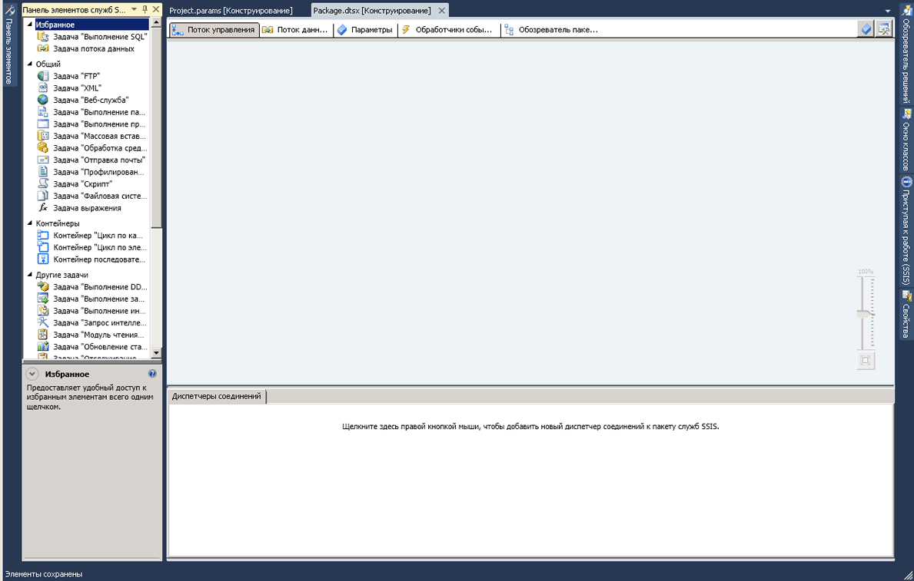

# конструктор служб SSIS
  [!INCLUDE[ssIS](../includes/ssis-md.md)] Конструктор служб — это графическое средство, с помощью которого можно создавать и обслуживать пакеты служб [!INCLUDE[ssISnoversion](../includes/ssisnoversion-md.md)] . [!INCLUDE[ssIS](../includes/ssis-md.md)] Конструктор служб доступен из среды [!INCLUDE[ssBIDevStudioFull](../includes/ssbidevstudiofull-md.md)] в составе проекта служб [!INCLUDE[ssISnoversion](../includes/ssisnoversion-md.md)] .  
  
 Конструктор служб [!INCLUDE[ssIS](../includes/ssis-md.md)] можно использовать для выполнения следующих задач:  
  
-   конструирование потока управления в пакете;  
  
-   конструирование потока данных в пакете;  
  
-   добавление обработчиков событий в пакет и его объекты;  
  
-   просмотр содержимого пакета;  
  
-   просмотр хода выполнения пакета во время выполнения.  
  
 На следующем рисунке показано окно конструктора диаграмм [!INCLUDE[ssIS](../includes/ssis-md.md)] и окно **Область элементов** .  
  
   
  
 [!INCLUDE[ssISnoversion](../includes/ssisnoversion-md.md)] содержат дополнительные диалоговые окна и окна просмотра для добавления функций в пакеты, а среда [!INCLUDE[ssBIDevStudioFull](../includes/ssbidevstudiofull-md.md)] предоставляет диалоговые окна и окна просмотра для настройки среды разработки и для работы с пакетами. Дополнительные сведения см. в статье [Пользовательский интерфейс служб Integration Services](../integration-services/integration-services-user-interface.md).  
  
 [!INCLUDE[ssIS](../includes/ssis-md.md)] Конструктор служб не зависит от службы [!INCLUDE[ssISnoversion](../includes/ssisnoversion-md.md)] , которая наблюдает за пакетами и управляет ими, поэтому для создания и редактирования пакетов в конструкторе служб [!INCLUDE[ssIS](../includes/ssis-md.md)] запуск этой службы не требуется. Однако, если остановить службу во время работы конструктора служб [!INCLUDE[ssIS](../includes/ssis-md.md)] , нельзя будет открывать диалоговые окна конструктора служб [!INCLUDE[ssIS](../includes/ssis-md.md)] ; кроме того, возможно появление сообщения об ошибке "Сервер RPC недоступен". Чтобы перезагрузить конструктор служб [!INCLUDE[ssIS](../includes/ssis-md.md)] и продолжить работу с пакетом, надо закрыть конструктор, выйти из среды [!INCLUDE[ssBIDevStudioFull](../includes/ssbidevstudiofull-md.md)], а затем снова открыть среду [!INCLUDE[ssBIDevStudioFull](../includes/ssbidevstudiofull-md.md)], проект служб [!INCLUDE[ssISnoversion](../includes/ssisnoversion-md.md)] и пакет.  
  
## Отмена и повторение  
 В конструкторе [!INCLUDE[ssIS](../includes/ssis-md.md)] можно отменять и повторять выполнение до 20 действий. Для пакетов отмена и повторение доступны на вкладках **Поток управления**, **Поток данных**, **Обработчики событий**и **Параметры** , а также в окне **Переменные** . Для проекта отмена и повторение доступны в окне **Параметры проекта** .  
  
 Изменения, выполняемые в **Области элементов служб SSIS**, нельзя отменять и повторять.  
  
 При внесении изменений в компонент с помощью редактора компонентов изменения отменяются и повторяются как целостный набор изменений, а не по отдельности. Набор изменений отображается в раскрывающемся списке отмены и повторения как одно действие.  
  
 Чтобы отменить действие, нажмите кнопку отмены на панели инструментов, выберите элемент меню **Редактировать/Отменить** или нажмите сочетание клавиш CTRL+Z. Чтобы повторить действие, нажмите кнопку повтора на панели инструментов, выберите пункт меню **Редактировать/Повторить** или нажмите сочетание клавиш CTRL+Y. Можно отменять и повторять несколько действий сразу. Для этого щелкните стрелку рядом с кнопкой на панели инструментов, выделите в раскрывающемся списке несколько действий и щелкните список.  
  
## Части конструктора служб SSIS  
 [!INCLUDE[ssIS](../includes/ssis-md.md)] В конструкторе служб есть пять постоянных вкладок: по одной для построения потока управления, потоков данных, параметров и обработчиков событий, а также одна вкладка для просмотра содержимого пакета. В процессе выполнения появляется шестая вкладка, отображающая ход выполнения пакета и результаты выполнения после его завершения.  
  
 Кроме того, в конструкторе служб [!INCLUDE[ssIS](../includes/ssis-md.md)] есть область «Диспетчеры соединений» для добавления и настройки диспетчеров соединений, которые используются пакетом для подключения к данным.  
  
### Вкладка «Поток управления»  
 Поток управления пакета проектируется в области конструктора на вкладке **Поток управления** . Перетащите элементы с вкладки **Область элементов** в область конструктора и подключите их к потоку управления, щелкнув значок элемента и перетащив стрелку от одного элемента к другому.  
  
 Дополнительные сведения см. в статье [Control Flow](../integration-services/control-flow/control-flow.md).  
  
### Вкладка «Поток данных»  
 Если в пакете содержится задача потока данных, в него можно добавлять потоки данных. Потоки данных пакета проектируются в области конструктора во вкладке **Поток данных** . Перетащите элементы с вкладки **Панель элементов** в область конструктора и подключите их к потоку данных, щелкнув значок элемента и перетащив стрелку от одного элемента к другому.  
  
 Дополнительные сведения см. в статье [Data Flow](../integration-services/data-flow/data-flow.md).  
  
### Вкладка «Параметры»  
 Параметры служб Integration Services (SSIS) могут быть использованы для присвоения значений свойствам внутри пакетов во время их выполнения. Можно создать параметры проекта на уровне проекта и параметры пакета на уровне пакета. Параметры проекта используются для предоставления любых внешних данных, получаемых проектом, одному пакету в проекте или более. Параметры пакета позволяют изменить выполнение пакета. При этом изменять пакет и развертывать его повторно не придется. Эта вкладка позволяет управлять параметрами пакета.  
  
 Дополнительные сведения о параметрах см. в разделе [Параметры служб Integration Services (SSIS)](integration-services-ssis-package-and-project-parameters.md).  
  
> **ВАЖНО!**  Параметры доступны только для проектов, разработанных для модели развертывания проекта. Следовательно, вкладка «Параметры» появится только для пакетов, которые являются частью проекта, настроенного на использование модели развертывания проекта.  
  
### Вкладка «Обработчики событий»  
 События пакета проектируются в области конструктора на вкладке **Обработчики событий** . На вкладке **Обработчики событий** выбирается пакет или его объект, для которого необходимо создать обработчик событий, а затем выбирается событие, которое будет связано с обработчиком. Обработчик событий имеет поток управления и (при необходимости) потоки данных.  
  
 Дополнительные сведения см. в разделе [Добавление обработчика событий к пакету](http://msdn.microsoft.com/library/5e56885d-8658-480a-bed9-3f2f8003fd78).  
  
### Вкладка «Обозреватель пакетов»  
 Пакеты могут быть сложными, содержать много задач, диспетчеров соединений, переменных и других элементов. Окно обозревателя пакета позволяет просмотреть полный список элементов пакета.  
  
 Дополнительные сведения см. в разделе [Просмотр объектов пакета](../integration-services/view-package-objects.md).  
  
### Вкладки «Выполнение» и «Результаты выполнения»  
 Во время выполнения пакета на вкладке **Выполнение** отображается ход выполнения пакета. После завершения выполнения пакета результаты будут доступны во вкладке **Результаты выполнения** .  
  
> **ПРИМЕЧАНИЕ.** Чтобы включить или отключить отображение сообщений на вкладке **Выполнение** , установите или снимите флажок **Отчеты о состоянии** отладки в меню **Службы SSIS** .  
  
#### Область диспетчеров соединений  
 Добавление и изменение диспетчеров соединений, используемых пакетом, выполняется в области **Диспетчеры соединений** . [!INCLUDE[ssISnoversion](../includes/ssisnoversion-md.md)] включает диспетчеры соединений, используемые для подключения к различным источникам данных, например текстовым файлам, базам данных OLE DB и поставщикам .NET.  
  
 Дополнительные сведения см. в разделах [Соединения в службах Integration Services (SSIS)](../integration-services/connection-manager/integration-services-ssis-connections.md) и [Создание диспетчеров соединений](http://msdn.microsoft.com/library/6ca317b8-0061-4d9d-b830-ee8c21268345).  
 
## Вкладка «Поток управления»
Используйте вкладку **Поток управления** конструктора служб [!INCLUDE[ssIS](../includes/ssis-md.md)] , чтобы создать поток управления в пакете служб [!INCLUDE[ssISnoversion](../includes/ssisnoversion-md.md)] .  
  
 Создайте поток управления путем перетаскивания графических объектов, которые представляют задачи и контейнеры служб [!INCLUDE[ssIS](../includes/ssis-md.md)] , с **области элементов** на область конструктора вкладки **Поток управления** и последующего соединения объектов путем перетаскивания соединителя одного объекта к другому. Каждая соединительная линия представляет собой управление очередностью, которое определяет порядок запуска задач и контейнеров.  
  
 Можно также использовать конструктор служб [!INCLUDE[ssIS](../includes/ssis-md.md)] , чтобы добавить из вкладки **Поток управления** следующие возможности:  
  
-   внедрить ведение журналов;  
  
-   создать конфигурации пакетов;  
  
-   подписать пакет сертификатом;  
  
-   Управление переменными  
  
-   Добавление заметок  
  
-   настроить точки останова.  
  
 Чтобы добавить эти функции к отдельным задачам или контейнерам в конструкторе служб [!INCLUDE[ssIS](../includes/ssis-md.md)] , щелкните правой кнопкой мыши объект в области конструктора и выберите параметр.  
 
## Вкладка «Поток данных»
Используйте вкладку **Поток данных** конструктора служб [!INCLUDE[ssIS](../includes/ssis-md.md)] , чтобы создать поток данных в пакете служб [!INCLUDE[ssISnoversion](../includes/ssisnoversion-md.md)] .  
  
 Создайте потоки данных путем перетаскивания графических объектов, представляющих источники, преобразования и адресаты, из **области элементов** в область конструктора вкладки **Поток данных** , а затем так соедините объекты, чтобы получились пути, задающие последовательность выполнения преобразований.  
  
 Щелкните правой кнопкой мыши путь и затем щелкните **Средства просмотра данных** , чтобы добавить средства просмотра для просмотра данных до и после каждого объекта потока данных.  
  
 Можно также использовать конструктор служб [!INCLUDE[ssIS](../includes/ssis-md.md)] , чтобы добавить следующие функциональные возможности из вкладки **Поток данных** :  
  
-   Управление переменными  
  
-   Добавление заметок  
  
 Чтобы добавить эти функции в конструкторе служб [!INCLUDE[ssIS](../includes/ssis-md.md)] , щелкните правой кнопкой мыши область конструктора, а затем выберите желаемый параметр.  
 
## Вкладка «Обработчики событий»
  Используйте вкладку **Обработчики событий** конструктора служб [!INCLUDE[ssIS](../includes/ssis-md.md)] , чтобы сформировать поток управления в пакете служб [!INCLUDE[ssISnoversion](../includes/ssisnoversion-md.md)] . Обработчик события запускается в ответ на событие, инициированное либо пакетом, либо задачей или контейнером в пакете.  
  
## Параметры  
 **Исполняемый объект**  
 Выберите исполняемый объект, для которого необходимо создать обработчик события. Исполняемый объект может быть либо пакетом, либо задачей или контейнером в пакете.  
  
 **Обработчик событий**  
 Выберите тип обработчика события. Создайте обработчик события, перетащив элементы из **Области элементов**.  
  
 **Удаление**  
 Выберите обработчик события и удалите его из пакета, нажав кнопку **Удалить**.  
  
 **Щелкните здесь, чтобы создать \<имя_обработчика_событий\> для исполняемого файла \<имя_исполняемого_файла\>**  
 Нажмите, чтобы создать обработчик события.  
  
 Создайте поток управления, перетащив графические объекты, которые представляют задачи и контейнеры служб [!INCLUDE[ssIS](../includes/ssis-md.md)] , из **Области элементов** в область конструктора вкладки **Обработчики событий** , соединяя затем объекты при помощи объектов управления очередностью, чтобы определить последовательность их запуска.  
  
 Кроме того, чтобы добавить заметки, щелкните правой кнопкой мыши в области конструктора и выберите из меню команду **Добавить заметку**.  
 
## Вкладка «Обозреватель пакетов»
Используйте вкладку **Обозреватель пакетов** конструктора служб [!INCLUDE[ssIS](../includes/ssis-md.md)] , чтобы просмотреть иерархическое представление всех элементов в пакете: конфигураций, соединений, обработчиков событий таких исполняемых объектов, как задачи и контейнеры, регистраторы журналов объектов управления очередностью и переменных. Если пакет содержит задачу потока данных, то на вкладке **Обозреватель пакетов** имеется узел, который содержит иерархическое представление компонентов потока.  
  
 Щелкните правой кнопкой мыши элемент пакета, затем щелкните **Свойства** для отображения свойств элемента в окне **Свойства** или нажмите кнопку **Удалить** для того, чтобы удалить элемент. 
 
## Вкладка "Выполнение"
Вкладка **Выполнение** конструктора служб [!INCLUDE[ssIS](../includes/ssis-md.md)] используется для просмотра выполнения пакета служб [!INCLUDE[ssISnoversion](../includes/ssisnoversion-md.md)] при его запуске в среде [!INCLUDE[ssBIDevStudioFull](../includes/ssbidevstudiofull-md.md)]. На вкладке **Выполнение** приводится время начала, время окончания и истекшее время для оценки выполнения пакета и его исполняемых объектов, а также все данные и предупреждения пакета, уведомления о ходе выполнения пакета; успешный или неудачный результат выполнения пакета; все сообщения об ошибках, сформированные в ходе выполнения пакета.  
  
 Чтобы включить или отключить отображение сообщений на вкладке **Выполнение** , установите или снимите флажок **Отчет о ходе отладки** в меню **Службы SSIS** . Отключение отчетов о состоянии способствует повышению производительности выполнения сложных пакетов в среде [!INCLUDE[ssBIDevStudio](../includes/ssbidevstudio-md.md)].  
  
 После завершения пакета вкладка **Выполнение** становится вкладкой **Результаты выполнения** .  
 
## Область диспетчеров соединений
Пакеты используют диспетчеры соединений для подключения к источникам данных — файлам, реляционным базам данных и серверам.  
  
 Область **Диспетчеры соединений** конструктора служб [!INCLUDE[ssIS](../includes/ssis-md.md)] позволяет создавать, удалять, изменять, переименовывать и копировать диспетчеры соединений.  
  
 Щелкните правой кнопкой мыши в этой области, затем из контекстного меню выберите нужную задачу.
 
## Связанные задачи  
  
-   [Создание пакетов в SQL Server Data Tools](../integration-services/create-packages-in-sql-server-data-tools.md)  
  
## См. также:  
 [Пользовательский интерфейс служб Integration Services](../integration-services/integration-services-user-interface.md)  
  
  
