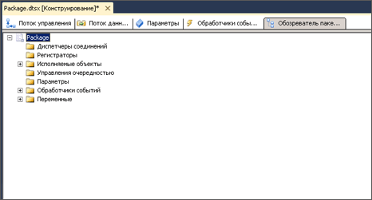

# просмотр объектов пакета
  В конструкторе служб [!INCLUDE[ssIS](../includes/ssis-md.md)] вкладка **Обозреватель пакетов** предоставляет режим обозревателя. В данном режиме отображается иерархия контейнеров архитектуры [!INCLUDE[ssISnoversion](../includes/ssisnoversion-md.md)] . Контейнер пакетов стоит на самом верху иерархии. При разворачивании пакета можно просмотреть все соединения, исполняемые объекты, обработчики событий, регистраторы, объекты управления очередностью и переменные.  
  
 Исполняемые объекты, то есть контейнеры и задачи в пакете, могут содержать обработчики событий, элементы управления очередностью и переменные. [!INCLUDE[ssISnoversion](../includes/ssisnoversion-md.md)] поддерживают вложенную иерархию контейнеров, а контейнеры «цикл по элементам», «цикл по каждому элементу» и контейнер последовательности могут содержать другие исполняемые объекты.  
  
 Если пакет содержит поток данных, то вкладка **Обозреватель пакетов** содержит задачу потока данных, а также папку **Компоненты** , которая содержит список компонентов потока данных.  
  
 На вкладке **Обозреватель пакетов** можно удалять объекты из пакета, а также открыть окно **Свойства** для просмотра свойств объектов.  
  
 На следующей диаграмме показана древовидная структура простого пакета.  
  
   
  
### Просмотр содержимого пакета  
  
-   [Просмотр объектов пакета в обозревателе пакетов](../Topic/View%20Package%20Objects%20in%20Package%20Explorer.md)  
  
## См. также  
 [Задачи служб Integration Services](../integration-services/control-flow/integration-services-tasks.md)   
 [Контейнеры служб Integration Services](../integration-services/control-flow/integration-services-containers.md)   
 [Управление очередностью](../integration-services/control-flow/precedence-constraints.md)   
 [Переменные в службах Integration Services (SSIS)](../integration-services/integration-services-ssis-variables.md)   
 [Обработчики событий в службах Integration Services (SSIS)](../integration-services/integration-services-ssis-event-handlers.md)   
 [Ведение журналов в службах Integration Services (SSIS)](../integration-services/performance/integration-services-ssis-logging.md)  
  
  