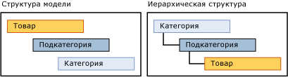

# Производные иерархии (Master Data Services)
  Производная иерархия [!INCLUDE[ssMDSshort](../includes/ssmdsshort-md.md)] происходит от связей атрибутов на основе домена, уже существующих между сущностями в модели.  
  
 Можно создать производную иерархию, в которой выделяется любая из существующих связей атрибутов на основе домена в модели.  
  
## Конечные элементы группируют другие конечные элементы  
 В производной иерархии конечные элементы из одной сущности используются для группировки конечных элементов другой сущности. Производная иерархия основана на связи между этими сущностями. Явная иерархия, напротив, основана на элементах только из одной сущности и структурируется любым заданным способом.  
  
 Можно изменить структуру производной иерархии, не затрагивая базовые данные. Пока отношения существуют в модели, удаление производной иерархии не влияет на основные данные.  
  
## Явные иерархии или производные иерархии  
 В следующей таблице приведены некоторые различия между явными и производными иерархиями.  
  
> [!NOTE]  
>  В этом выпуске [!INCLUDE[ssMDSshort](../includes/ssmdsshort-md.md)]явные иерархии являются нерекомендуемыми.  
  
|Явные иерархии|Производные иерархии|  
|--------------------------|-------------------------|  
|Структура определяется пользователем|Структура образуется из связей между атрибутами на основе домена|  
|Содержит элементы из одной сущности|Содержит элементы из нескольких сущностей|  
|Использует консолидированные элементы для группировки других элементов|Использует конечные элементы одной сущности для группировки конечных элементов другой сущности|  
  
## Создание иерархии с изменяемой глубиной  
 Есть два проверенных способа создания иерархии с изменяемой глубиной.  
  
-   Если необходимо, чтобы все уровни имели одинаковые атрибуты, создайте одну сущность и затем создайте рекурсивную иерархию для сущности с помощью доменного атрибута, основанного на сущности.  
  
-   Если необходимо получить один набор атрибутов для конечных элементов и другой набор для верхних уровней, создайте две сущности для производной иерархии. Для конечной сущности используйте атрибут домена, который основывается на родительской сущности. Для родительской сущности используйте атрибут на основе домена, который основывается сам на себе.  
  
## Пример производной иерархии  
 В следующем примере конечные элементы сущности «Продукт» сгруппированы по конечным элементам сущности «Подкатегория», которые затем сгруппированы по конечным элементам сущности «Категория». Эта иерархия возможна, потому что у сущности «Продукт» есть атрибут «Подкатегория» на основе домена, а у сущности «Подкатегория» есть атрибут «Категория» на основе домена.  
  
 Структура иерархии показывает, как группируются элементы. Сущность с наибольшим числом элементов располагается в самом низу.  
  
   
  
 В производной иерархии можно выделить связь между «Продуктом» и «Подкатегорией» и затем между «Подкатегорией» и «Категорией». При просмотре элементов в этой иерархии каждый уровень дерева содержит элементы из одной сущности.  
  
   
  
 Иерархия такого типа предотвращает перемещение элемента на недопустимый уровень. Например, можно переместить велосипед Road-650 из одной подкатегории, «Дорожные велосипеды», в другую, «Горные велосипеды». Нельзя перенести Road-650 напрямую внутри категории, например 1 {велосипеды}. Каждый раз при перемещении элемента в дереве иерархии значение атрибута на основе домена для элемента изменяется, отражая это перемещение.  
  
## Примечания  
 Все элементы в производной иерархии сортируются по коду. Нельзя менять порядок сортировки.  
  
 Если атрибут на основе домена для элемента пуст и атрибут используется в производной иерархии, то элемент не отображается в иерархии. Можно создать бизнес-правила, которые требуют заполнения атрибутов. Дополнительные сведения см. в разделе [Запрос значений атрибута (службы Master Data Services)](../master-data-services/require-attribute-values-master-data-services.md).  
  
## Related Tasks  
  
|Описание задачи|Раздел|  
|----------------------|-----------|  
|Создание новой производной иерархии.|[Создание производной иерархии (службы Master Data Services)](../master-data-services/create-a-derived-hierarchy-master-data-services.md)|  
|Скрытие или удаление уровней в существующей производной иерархии.|[Скрытие или удаление уровней в производной иерархии (службы Master Data Services)](../master-data-services/hide-or-delete-levels-in-a-derived-hierarchy-master-data-services.md)|  
|Изменение имени существующей производной иерархии.|[Изменение имени производной иерархии (службы Master Data Services)](../master-data-services/change-a-derived-hierarchy-name-master-data-services.md)|  
|Удаление существующей производной иерархии.|[Удаление производной иерархии (службы Master Data Services)](../master-data-services/delete-a-derived-hierarchy-master-data-services.md)|  
  
## См. также  
  
-   [Атрибуты на основе домена (службы Master Data Services)](../master-data-services/domain-based-attributes-master-data-services.md)  
  
-   [Явные иерархии (службы Master Data Services)](../master-data-services/explicit-hierarchies-master-data-services.md)  
  
-   [Рекурсивные иерархии (службы Master Data Services)](../master-data-services/recursive-hierarchies-master-data-services.md)  
  
-   [Производные иерархии с явными ограничениями (службы Master Data Services)](../master-data-services/derived-hierarchies-with-explicit-caps-master-data-services.md)  
  
-   [Отображение связей "многие ко многим" в производных иерархиях (Master Data Services)](../master-data-services/show-many-to-many-relationships-in-derived-hierarchies-master-data-services.md)  
  
-   [Коллекции (службы Master Data Services)](../master-data-services/collections-master-data-services.md)  
  
  
