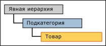
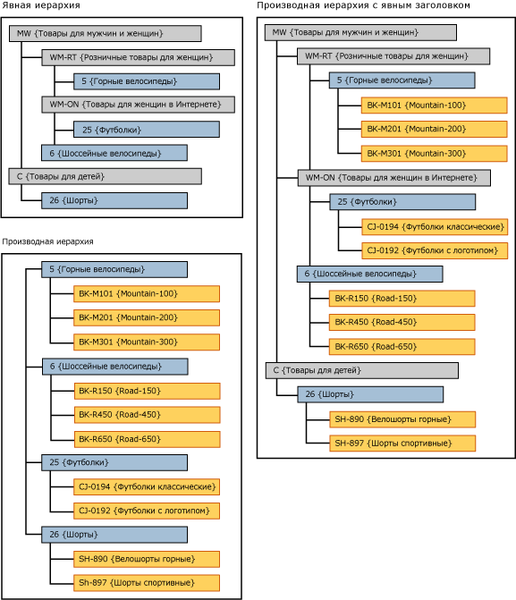

# Производные иерархии с явными ограничениями (службы Master Data Services)

[!INCLUDE[appliesto-ss-xxxx-xxxx-xxx-md-winonly](../includes/appliesto-ss-xxxx-xxxx-xxx-md-winonly.md)]

  В [!INCLUDE[ssMDSshort](../includes/ssmdsshort-md.md)]использование уровней явной иерархии в качестве высших уровней производной иерархии называется «производной иерархией с явным ограничением».  
  
 Явная иерархия должна быть основана на той же сущности, что и сущность на вершине производной иерархии.  
  
 В пользовательском интерфейсе [!INCLUDE[ssMDSmdm](../includes/ssmdsmdm-md.md)] такой тип иерархии можно создать, перетащив явную иерархию на вершину производной иерархии.  
  
   
  
## Образец производной иерархии с явным ограничением  
 В данном примере элементы явной иерархии происходят из сущности «Подкатегория». В производной иерархии элементы высшего уровня также происходят из сущности «Подкатегория».  
  
   
  
 При использовании явной иерархии на вершине производной иерархии производная иерархия становится неоднородной.  
  
## Правила  
  
-   В производной иерархии с явным ограничением не может быть больше одной явной иерархии.  
  
-   Одну и ту же явную иерархию можно использовать как ограничение для нескольких производных иерархий.  
  
-   Нельзя назначить разрешения на элементы иерархии производным иерархиям с явными ограничениями. Если назначить разрешение явной иерархии или производной иерархии индивидуально, то разрешение затронет обе иерархии.  
  
## Связанные задачи  
  
|Описание задачи|Раздел|  
|----------------------|-----------|  
|Создание производной иерархии.|[Создание производной иерархии (службы Master Data Services)](../master-data-services/create-a-derived-hierarchy-master-data-services.md)|  
|Создание явной иерархии.|[Создание явной иерархии (службы Master Data Services)](../master-data-services/create-an-explicit-hierarchy-master-data-services.md)|  
|Удаление существующей производной иерархии.|[Удаление производной иерархии (службы Master Data Services)](../master-data-services/delete-a-derived-hierarchy-master-data-services.md)|  
|||  
  
## См. также  
  
-   [Производные иерархии (службы Master Data Services)](../master-data-services/derived-hierarchies-master-data-services.md)  
  
-   [Явные иерархии (службы Master Data Services)](../master-data-services/explicit-hierarchies-master-data-services.md)  
  
  
