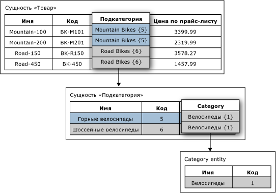

# Атрибуты на основе домена (службы Master Data Services)

[!INCLUDE[appliesto-ss-xxxx-xxxx-xxx-md-winonly](../includes/appliesto-ss-xxxx-xxxx-xxx-md-winonly.md)]

  В [!INCLUDE[ssMDSshort](../includes/ssmdsshort-md.md)]атрибут на основе домена — это атрибут, значения которого заполняются элементами другой сущности. Атрибут на основе домена можно представить как ограниченный список. Атрибуты на основе домена не позволяют пользователям вводить недопустимые значения атрибутов. Для задания значения атрибута пользователь должен выбрать его из списка.  
  
## Пример атрибута на основе домена  
 На следующем рисунке сущность Product имеет атрибут на основе домена с именем Subcategory. Атрибут «Подкатегория» заполняется значениями из сущности «Подкатегория».  
  
 Сущность «Подкатегория» имеет атрибут на основе домена с именем «Категория». Атрибут «Категория» заполняется значениями из сущности «Категория».  
  
   
  
## Использование одной и той же сущности для нескольких атрибутов на основе домена  
 Одну и ту же сущность можно использовать в качестве атрибута на основе домена для нескольких других сущностей. Например, можно создать сущность "ИндикаторДаНет" со следующими элементами: "Да", "Нет" и "Может быть". Можно создать атрибут «ВНаличии» на основе домена и использовать сущность «ИндикаторДаНет» как источник. Также можно создать другой атрибут на основе домена под названием Approved и использовать сущность YesNoIndicator в качестве источника. Каждый раз, когда пользователи должны выбирать из списка членов сущности «ИндикаторДаНет», можно использовать сущность как атрибут на основе домена.  
  
## Атрибуты на основе домена формируют производные иерархии  
 Связи между атрибутами на основе домена служат основой для производных иерархий. Дополнительные сведения см. в разделе [Производные иерархии (службы Master Data Services)](../master-data-services/derived-hierarchies-master-data-services.md).  
  
## Связанные задачи  
  
|Описание задачи|Раздел|  
|----------------------|-----------|  
|Создание нового атрибута на основе домена, источником для которого является существующая сущность.|[Создание атрибута на основе домена (службы Master Data Services)](../master-data-services/create-a-domain-based-attribute-master-data-services.md)|  
|Создание новой сущности.|[Создание сущности (службы Master Data Services)](../master-data-services/create-an-entity-master-data-services.md)|  
  
## См. также  
  
-   [Производные иерархии (службы Master Data Services)](../master-data-services/derived-hierarchies-master-data-services.md)  
  
-   [Атрибуты (службы Master Data Services)](../master-data-services/attributes-master-data-services.md)  
  
-   [Сущности (службы Master Data Services)](../master-data-services/entities-master-data-services.md)  
  
  
