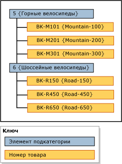

# Иерархии (службы основных данных)
  Иерархия в [!INCLUDE[ssMDSshort](../includes/ssmdsshort-md.md)]— древовидная структура, которую можно использовать:  
  
-   для группировки схожих элементов с целью систематизации;  
  
-   объединения и сведения элементов для отчетов или анализа.  
  
## Что содержится в иерархиях  
 Каждая иерархия содержит элементы из одной или нескольких сущностей. При добавлении, изменении или удалении элемента все иерархии обновляются. Это гарантирует, что данные будут точными во всех иерархиях. Иерархии также гарантируют, что каждый элемент будет учитываться ровно один раз.  
  
 Если необходимо создать группирование подмножества элементов, рассмотрите возможность использования коллекции. Дополнительные сведения см. в разделе [Collections &#40;Master Data Services&#41;](../master-data-services/collections-master-data-services.md).  
  
## Виды иерархий  
 Можно создавать разные иерархии для просмотра и систематизации элементов разными способами. Можно создавать:  
  
-   Неоднородные иерархии из единой сущности, которые называются явными иерархиями. Дополнительные сведения см. в разделе [Explicit Hierarchies &#40;Master Data Services&#41;](../master-data-services/explicit-hierarchies-master-data-services.md).  
  
-   Иерархии на основе уровней, состоящие из многих сущностей и основанные на существующих связях между сущностями и их атрибутами, которые называются производными иерархиями. Дополнительные сведения см. в разделе [Derived Hierarchies &#40;Master Data Services&#41;](../master-data-services/derived-hierarchies-master-data-services.md).  
  
> [!NOTE]  
>  Все элементы в иерархии должны быть в одной модели.  
  
## Иерархии не являются классификациями  
 Иерархия отличается от классификации. В классификации элементы упорядочены в соответствии с несколькими атрибутами одновременно, а в иерархии — только по одному атрибуту. Классификации может включать один элемент несколько раз, а иерархия имеет только одно вхождение элемента.  
  
 Например, один велосипед может быть упомянут в классификации дважды: один раз, потому что его цвет красный, и один раз, потому что его размер равен 38. В иерархии велосипед включен только один раз, поэтому нужно определить, в соответствии с чем он будет отображаться: с цветом или размером.  
  
## Пример иерархии  
 В следующем примере в иерархии элементы продуктов группируются по элементам подкатегории.  
  
   
  
## Связанные задачи  
  
|Описание задачи|Раздел|  
|----------------------|-----------|  
|Создание явной иерархии.|[Создать явную иерархию &#40; Службы Master Data Services &#41;](../master-data-services/create-an-explicit-hierarchy-master-data-services.md)|  
|Создание производной иерархии.|[Создание производной иерархии &#40; Службы Master Data Services &#41;](../master-data-services/create-a-derived-hierarchy-master-data-services.md)|  
|Скрытие или удаление уровней в существующей производной иерархии.|[Скрытие или удаление уровней в производной иерархии &#40; Службы Master Data Services &#41;](../master-data-services/hide-or-delete-levels-in-a-derived-hierarchy-master-data-services.md)|  
  
## См. также  
  
-   [Явные иерархии &#40; Службы Master Data Services &#41;](../master-data-services/explicit-hierarchies-master-data-services.md)  
  
-   [Производные иерархии &#40; Службы Master Data Services &#41;](../master-data-services/derived-hierarchies-master-data-services.md)  
  
-   [Рекурсивные иерархии &#40; Службы Master Data Services &#41;](../master-data-services/recursive-hierarchies-master-data-services.md)  
  
-   [Производные иерархии с явными ограничениями &#40; Службы Master Data Services &#41;](../master-data-services/derived-hierarchies-with-explicit-caps-master-data-services.md)  
  
-   [Коллекции &#40; Службы Master Data Services &#41;](../master-data-services/collections-master-data-services.md)  
  
  

