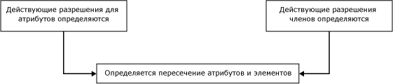
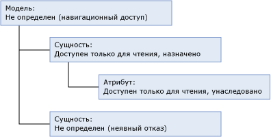
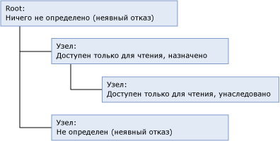
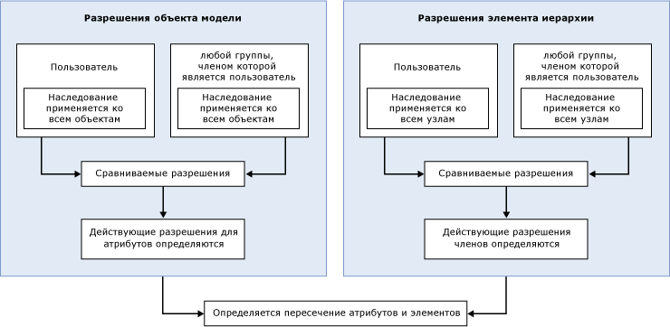

# Способ определения разрешений (службы Master Data Services)

[!INCLUDE[appliesto-ss-xxxx-xxxx-xxx-md-winonly](../includes/appliesto-ss-xxxx-xxxx-xxx-md-winonly.md)]

  Простейшим способом настройки безопасности служб [!INCLUDE[ssMDSshort](../includes/ssmdsshort-md.md)]является назначение разрешений на объекты модели для группы, членом которой является пользователь.  
  
 Настройка безопасности становится более сложной в следующих случаях.  
  
-   Назначены разрешения как для объектов модели, так и для элементов иерархии.  
  
-   Пользователь принадлежит к группам, причем разрешения назначены как для пользователя, так и для групп.  
  
-   Пользователь принадлежит к группам, причем разрешения назначены для нескольких групп.  
  
## Разрешения, назначенные одной группе или одному пользователю  
 Если разрешения назначаются одной группе или одному пользователю, они определяются на основании следующего рабочего процесса.  
  
   
  
### Шаг 1. Определяются действующие разрешения для атрибутов.  
 Следующий список показывает, как определяются действующие разрешения для атрибутов.  
  
-   Разрешения, назначенные для объектов модели, определяют, к каким атрибутам имеет доступ пользователь.  
  
-   Все объекты модели автоматически наследуют разрешение от ближайшего объекта на более высоком уровне в структуре модели.  
  
-   Всем объектам на том же уровне, на котором находится сущность, в разрешении неявно отказывается.  
  
-   Всем объектам на более высоком уровне предоставляется неявное разрешение на чтение. Дополнительные сведения о неявном разрешении на чтение см. в разделе [Навигационный доступ (службы Master Data Services)](../master-data-services/navigational-access-master-data-services.md).  
  
 В этом примере сущности назначается разрешение **Чтение**. Это же разрешение наследуется и атрибутом сущности, находящимся на более низком уровне структуры модели. Модель предоставляет неявное разрешение на чтение этой сущности и ее атрибуту. Другая сущность модели не имеет явно назначенного разрешения и не наследует никаких разрешений, поэтому доступ для нее неявно закрыт.  
  
   
  
### Шаг 2. Если назначены разрешения для элементов иерархии, определяются действующие разрешения для элементов.  
 Следующий список показывает, как определяются действующие разрешения для элементов иерархии.  
  
-   Разрешения, назначенные для узлов иерархии, определяют, к каким элементам имеет доступ пользователь.  
  
-   Все узлы иерархии автоматически наследуют разрешение от ближайшего объекта на более высоком уровне в структуре иерархии.  
  
-   Всем узлам того же уровня в разрешении неявно отказывается.  
  
-   Любым узлам на более высоких уровнях, которые не имеют явно назначенных разрешений, в разрешении неявно отказывается.  
  
 В этом примере одному узлу иерархии назначается разрешение **Чтение** . Это же разрешение наследуется и узлом, находящимся на более низком уровне структуры иерархии. Корневому узлу разрешения не назначены, поэтому в разрешении ему неявно отказано. Другой узел в структуре иерархии не имеет явно назначенного разрешения и не наследует никаких разрешений, поэтому доступ для него неявно закрыт.  
  
   
  
### Шаг 3. Определяется пересечение разрешений для атрибутов и элементов.  
 Если действующие разрешения для атрибутов отличаются от действующих разрешений для элементов, разрешения должны определяться для каждого отдельного значения атрибута. Дополнительные сведения см. в разделе [Перекрытие разрешений моделей и элементов (службы основных данных)](../master-data-services/overlapping-model-and-member-permissions-master-data-services.md).  
  
## Разрешения, назначенные нескольким группам  
 Если пользователь принадлежит одной или более группам и разрешения назначены как пользователю, так и группам, рабочий процесс определения усложняется.  
  
   
  
 В этом случае пересечения разрешений пользователя и группы должны определяться, прежде чем можно будет сравнивать разрешения для объектов модели и элементов иерархии. Дополнительные сведения см. в разделе [Перекрытие разрешений пользователей и групп (службы основных данных)](../master-data-services/overlapping-user-and-group-permissions-master-data-services.md).  
  
## См. также:  
 [Перекрытие разрешений пользователей и групп (службы основных данных)](../master-data-services/overlapping-user-and-group-permissions-master-data-services.md)   
 [Перекрытие разрешений моделей и элементов (службы Master Data Services)](../master-data-services/overlapping-model-and-member-permissions-master-data-services.md)  
  
  
