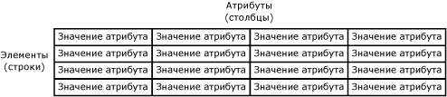
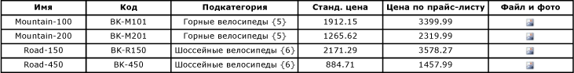

# Элементы (службы основных данных)

[!INCLUDE[appliesto-ss-xxxx-xxxx-xxx-md-winonly](../includes/appliesto-ss-xxxx-xxxx-xxx-md-winonly.md)]

  В [!INCLUDE[ssMDSshort](../includes/ssmdsshort-md.md)]элементы являются физическими основными данными. Например, элемент может быть велосипедом «Road-150» в сущности «Product» или конкретным клиентом в сущности «Customer».  
  
## Связь элементов с другими объектами модели  
 Элементы можно представить как строки в таблице. Связанные элементы содержатся в сущности, а каждый элемент определен значениями атрибутов.  
  
 В этом примере таблица представляет собой сущность, строки в таблице представляют элементы, а столбцы — атрибуты. Каждая ячейка представляет значение атрибута для определенного элемента.  
  
   
  
## Типы элементов  
 Существует три типа элементов: конечные элементы, консолидированные элементы и элементы коллекции.  
  
 Конечные элементы являются элементами по умолчанию в сущности.  
  
-   В производных иерархиях единственный тип элементов — конечные элементы. Конечные элементы одной сущности используются как родительские элементы для конечных элементов другой сущности.  
  
-   В явных иерархиях конечные элементы находятся на низшем уровне и не могут иметь дочерних элементов.  
  
 Консолидированные элементы существуют, только если для сущности допускаются явные иерархии и коллекции.  
  
-   Производные иерархии не содержат консолидированных элементов.  
  
-   В явных иерархиях консолидированные элементы могут быть родителями других элементов в иерархии, а также дочерними элементами.  
  
## Использование иерархии и коллекций для организации элементов  
 Иерархии и коллекции можно использовать для группировки элементов для отчетов или анализа. Дополнительные сведения см. в разделах [Hierarchies &#40;Master Data Services&#41;](../master-data-services/hierarchies-master-data-services.md) и [Collections &#40;Master Data Services&#41;](../master-data-services/collections-master-data-services.md).  
  
## Пример элемента  
 В следующем примере каждый элемент состоит из значений атрибутов Name, Code, Subcategory, StandardCost, ListPrice и FilePhoto.  
  
   
  
## Связанные задачи  
  
|Описание задачи|Раздел|  
|----------------------|-----------|  
|Создание нового конечного элемента.|[Создание конечного элемента (службы Master Data Services)](../master-data-services/create-a-leaf-member-master-data-services.md)|  
|Создание нового объединенного элемента.|[Создание объединенного элемента (службы Master Data Services)](../master-data-services/create-a-consolidated-member-master-data-services.md)|  
|Удаление существующего элемента или коллекции.|[Удаление элемента или коллекции (службы Master Data Services)](../master-data-services/delete-a-member-or-collection-master-data-services.md)|  
|Повторная активация удаленного элемента или коллекции.|[Повторная активация элемента или коллекции (службы Master Data Services)](../master-data-services/reactivate-a-member-or-collection-master-data-services.md)|  
|Обновление значений атрибутов элемента.|[Изменение типа атрибута (надстройка MDS для Excel)](../master-data-services/microsoft-excel-add-in/change-the-attribute-type-mds-add-in-for-excel.md)|  

  
## См. также  
  
-   [Общие сведения о службах Master Data Services (MDS)](../master-data-services/master-data-services-overview-mds.md)  
  
-   [Сущности (службы Master Data Services)](../master-data-services/entities-master-data-services.md)  
  
-   [Атрибуты (службы Master Data Services)](../master-data-services/attributes-master-data-services.md)  
  
-   [Иерархии (службы Master Data Services)](../master-data-services/hierarchies-master-data-services.md)  
  
-   [Коллекции (службы Master Data Services)](../master-data-services/collections-master-data-services.md)  
  
-   [Разрешения конечного элемента (службы основных данных)](../master-data-services/leaf-permissions-master-data-services.md)  
  
 
-   [Операторы фильтров (службы Master Data Services)](../master-data-services/filter-operators-master-data-services.md)  
  
  
