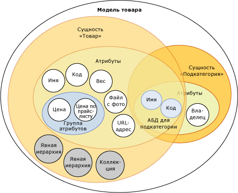

# Модели (службы основных данных)
  Модели — это самый высокий уровень организации данных в [!INCLUDE[ssMDSshort](../includes/ssmdsshort-md.md)]. Модель определяет структуру данных в решении управления основными данными. Модель содержит следующие объекты:  
  
-   Сущности  
  
-   Атрибуты и группы атрибутов  
  
-   Производные и явные иерархии  
  
-   Коллекции  
  
 Модели организуют структуру основных данных. Реализация [!INCLUDE[ssMDSshort](../includes/ssmdsshort-md.md)] может иметь одну или несколько моделей, которые объединяют схожие данные. В общем случае основные понятия могут быть сгруппированы одним из четырех способов: по лицам, местам, предметам или понятиям. Например, можно создать модель «Продукт» для данных, связанных с продуктами, или модель «Клиент»для данных, связанных с клиентами.  
  
 Пользователям и группам можно давать разрешения на просмотр и обновление объектов внутри модели. Если модели не назначено разрешение, она не отображается.  
  
 В любой момент времени можно создать копии основных данных в модели. Эти копии называются версиями.  
  
 При определении модели в тестовой среде ее можно развернуть с соответствующими данными или без них в рабочей среде. Это устраняет необходимость повторного создания моделей в рабочей среде.  
  
## Связь моделей с другими объектами  
 В модели содержатся сущности. Сущности содержат атрибуты, явные иерархии и коллекции. Атрибуты можно объединять в группы. Атрибуты на основе домена существуют, когда сущность используется как атрибут для другой сущности.  
  
 На рисунке отображены связи между объектами модели.  
  
   
  
> [!NOTE]  
>  Производные иерархии — это тоже объекты модели, но на рисунке они не показаны. Производные иерархии происходят от связей атрибутов на основе домена, существующих между сущностями. В разделе [производных иерархий &#40; Службы Master Data Services &#41; ](../master-data-services/derived-hierarchies-master-data-services.md) для получения дополнительной информации.  
  
 Основные данные — это данные, содержащиеся в объектах модели. В среде [!INCLUDE[ssMDSshort](../includes/ssmdsshort-md.md)]основные данные хранятся в виде элементов сущностей.  
  
 Объекты моделей находятся в функциональной области **Администрирование системы** пользовательского интерфейса [!INCLUDE[ssMDSmdm](../includes/ssmdsmdm-md.md)] .  
  
## Пример модели  
 В следующем примере объекты в модели «Продукт» логически группируют данные, связанные с продуктом.  
  
   
  
 Другие распространенные модели:  
  
-   «Счета» — может включать такие сущности, как балансы, счета прибылей, статистика и тип счета;  
  
-   клиенты — может включать в себя такие сущности, как пол, образование, занятость и семейное положение;  
  
-   географический регион — может включать в себя такие сущности, как почтовые коды, города, округа, районы, республики, края, страны и континенты.  
  
## Связанные задачи  
  
|Описание задачи|Раздел|  
|----------------------|-----------|  
|Создание модели для организации основных данных.|[Создать модель &#40; Службы Master Data Services &#41;](../master-data-services/create-a-model-master-data-services.md)|  
|Изменение имени существующей модели.|[Изменение модели &#40; Службы Master Data Services &#41;](../master-data-services/edit-model-master-data-services.md)|  
|Удаление существующей модели.|[Удалить модель &#40; Службы Master Data Services &#41;](../master-data-services/delete-a-model-master-data-services.md)|  
  
## См. также  
  
-   [Общие сведения о службах Master Data Services (MDS)](../master-data-services/master-data-services-overview-mds.md)  
  
-   [Сущности (службы Master Data Services)](../master-data-services/entities-master-data-services.md)  
  
-   [Атрибуты &#40; Службы Master Data Services &#41;](../master-data-services/attributes-master-data-services.md)  
  
-   [Развертывание моделей &#40; Службы Master Data Services &#41;](../master-data-services/deploying-models-master-data-services.md)  
  
-   [Разрешения объекта модели &#40; Службы Master Data Services &#41;](../master-data-services/model-object-permissions-master-data-services.md)  
  
  
