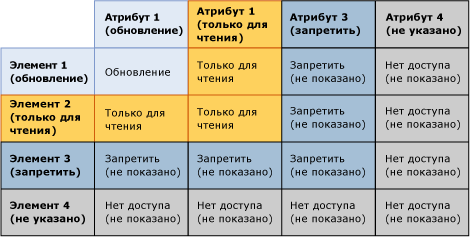
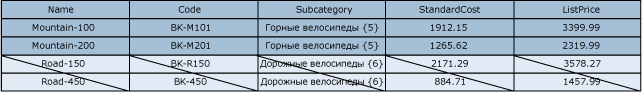
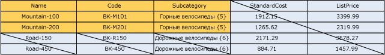

# Перекрытие разрешений моделей и элементов (службы основных данных)

[!INCLUDE[appliesto-ss-xxxx-xxxx-xxx-md-winonly](../includes/appliesto-ss-xxxx-xxxx-xxx-md-winonly.md)]

  Разрешение для элемента может переопределять разрешение для объекта модели. При возникновении перекрытия действует более жесткое разрешение.  
  
 Если разрешение элемента отличается от разрешения соответствующего модельного объекта, то применяются следующие правила.  
  
-   **Запретить** переопределяет все остальные разрешения.  
  
-   Разрешение**Администратор** на уровне модели переопределяет все остальные разрешения и изменяется на разрешение доступа "Все (CRUD)" на подуровнях.  
  
-   Действующее разрешение доступа пересекается с разрешениями для элементов и атрибутов.  
  
     Например, если разрешения элементов включают **Создание** и **Обновление**, разрешением для атрибутов будет **Обновление**. Действующее разрешение — **Обновление**.  
  
 На следующем рисунке показано, какие разрешения влияют на отдельное значение атрибута, если разрешения для атрибутов отличаются от разрешений для элементов.  
  
   
  
## Пример 1  
   
  
 На вкладке **Модели** для сущности Product назначено разрешение **Обновление** . Это разрешение наследуют все атрибуты сущности.  
  
 На вкладке **Элементы иерархии** узлу подкатегории Mountain Bikes в производной иерархии назначено разрешение **Обновление** .  
  
 Результат: в **обозревателе**пользователь имеет разрешение **Обновление** для всех значений атрибутов всех элементов узла Mountain Bikes. Все остальные элементы и их атрибуты скрыты.  
  
   
  
## Пример 2  
   
  
 На вкладке **Модели** для атрибута Subcategory назначено разрешение **Обновление** .  
  
 На вкладке **Элементы иерархии** узлу подкатегории Mountain Bikes в производной иерархии явно назначено разрешение **Чтение** .  
  
 Результат: в **обозревателе**пользователь имеет разрешение **Чтение** для значений атрибута Subcategory всех элементов узла Mountain Bikes. Все остальные элементы и их атрибуты скрыты.  
  
   
  
## Пример 3  
   
  
 На вкладке **Модели** для атрибута Subcategory назначено разрешение **Чтение** .  
  
 На вкладке **Элементы иерархии** узлу подкатегории Mountain Bikes в порожденной иерархии явно назначено разрешение **Обновление** .  
  
 Результат: в **обозревателе**пользователь имеет разрешение **Чтение** для значений атрибутов. Все остальные элементы и их атрибуты скрыты.  
  
   
  
## См. также:  
 [Способ определения разрешений (службы Master Data Services)](../master-data-services/how-permissions-are-determined-master-data-services.md)   
 [Перекрытие разрешений пользователей и групп (службы Master Data Services)](../master-data-services/overlapping-user-and-group-permissions-master-data-services.md)  
  
  
