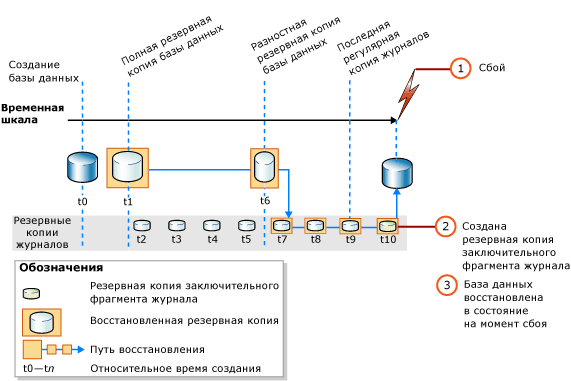

# <a name="complete-database-restores-full-recovery-model"></a>Выполнение полного восстановления базы данных (модель полного восстановления)
[!INCLUDE[appliesto-ss-xxxx-xxxx-xxx-md](../../includes/appliesto-ss-xxxx-xxxx-xxx-md.md)]

  Задача полного восстановления — восстановить базу данных целиком. В период восстановления база данных находится вне сети. Прежде чем какая-либо часть базы данных перейдет в режим «в сети», все данные восстанавливаются до точки согласования, в которой все части базы данных находятся в одном и том же моменте времени и в которой нет незафиксированных транзакций.  
  
 При работе в режиме модели полного восстановления после восстановления резервных копий данных необходимо восстановить все последующие резервные копии журнала транзакций, а затем саму базу данных. Базу данных можно восстановить до определенной *точки восстановления* в одной из этих резервных копий журналов. Этой точкой восстановления может быть заданная дата и время, помеченная транзакция или регистрационный номер транзакции в журнале (LSN).  
  
 При восстановлении базы данных, в особенности при использовании модели полного восстановления или модели восстановления с неполным протоколированием, следует использовать одну последовательность восстановления. *Последовательность восстановления* состоит из одной или нескольких операций восстановления, которые выполняют перемещение данных в одном или нескольких этапах восстановления.  
  
### <a name="untrusted-sources"></a>Ненадежные источники

_Не_ рекомендуется подключать или восстанавливать базы данных, полученные из неизвестных или ненадежных источников. В этих базах данных может содержаться вредоносный код, вызывающий выполнение непредусмотренных инструкций [!INCLUDE[tsql](../../includes/tsql-md.md)] или появление ошибок путем изменения схемы или физической структуры базы данных. Перед тем как использовать базу данных, полученную из ненадежного источника, выполните для нее инструкцию [DBCC CHECKDB](../../t-sql/database-console-commands/dbcc-checkdb-transact-sql.md) на тестовом сервере. Также изучите содержащийся в ней код, написанный пользователем: хранимые процедуры и другой пользовательский код.

### <a name="backups-from-earlier-versions"></a>Резервные копии из предыдущих версий

Сведения о поддержке резервных копий более ранних версий [!INCLUDE[ssNoVersion](../../includes/ssnoversion-md.md)]см. в подразделе "Поддержка совместимости" раздела [RESTORE (Transact-SQL)](../../t-sql/statements/restore-statements-transact-sql.md).
  
##  <a name="restoring-a-database-to-the-point-of-failure"></a><a name="PointOfFailure"></a> Восстановление базы данных до точки сбоя  

 Обычно восстановление базы данных до точки сбоя включает следующие основные шаги:  
  
1.  Произведите резервное копирование активного журнала транзакций (также известного как заключительный фрагмент журнала). На этом шаге создается резервная копия заключительного фрагмента журнала. Если активный журнал транзакций недоступен, все транзакции этой части журнала будут потеряны.  
  
    > [!IMPORTANT]  
    >  При использовании модели восстановления с неполным протоколированием для создания резервной копии для журнала, содержащего операции с неполным протоколированием, требуется доступ ко всем файлам базы данных. Если файлы данных недоступны, резервное копирование журнала транзакций невозможно. В этом случае необходимо вручную внести все изменения, произошедшие с момента последнего резервного копирования журнала.  
  
     Дополнительные сведения см. в статье [Резервные копии заключительного фрагмента журнала (SQL Server)](../../relational-databases/backup-restore/tail-log-backups-sql-server.md).  
  
2.  Восстановите самую последнюю полную резервную копию базы данных без восстановления самой базы данных (RESTORE DATABASE *имя_базы_данных* FROM *устройство_резервного_копирования* WITH NORECOVERY).  
  
3.  Если существуют разностные резервные копии, восстановите самую последнюю из них без восстановления базы данных (RESTORE DATABASE *имя_базы_данных* FROM *устройство_разностного_резервного_копирования* WITH NORECOVERY).  
  
     При восстановлении последней разностной резервной копии уменьшается число подлежащих восстановлению резервных копий журнала.  
  
4.  Начиная с первой резервной копии журнала транзакций, созданной после только что восстановленной резервной копии, последовательно восстановите журналы с параметром NORECOVERY.  
  
5.  Восстановите базу данных (RESTORE DATABASE *имя_базы_данных* WITH RECOVERY). Этот шаг можно объединить с восстановлением последней резервной копии журнала.  
  
 На следующем рисунке показана эта последовательность восстановления. После сбоя (1) создается резервная копия заключительного фрагмента журнала (2). Затем база данных восстанавливается до точки сбоя. Это включает восстановление резервной копии базы данных, последующей разностной резервной копии и всех резервных копий журналов, сохраненных после разностной резервной копии, в том числе резервной копии заключительного фрагмента журнала.  
  
   
  
> [!NOTE]  
>  Если база данных восстанавливается на другой экземпляр сервера, см. раздел [Копирование баз данных путем создания и восстановления резервных копий](../../relational-databases/databases/copy-databases-with-backup-and-restore.md).  
  
###  <a name="basic-transact-sql-restore-syntax"></a><a name="TsqlSyntax"></a> Базовый синтаксис инструкции Transact-SQL RESTORE  
 Базовый синтаксис инструкции [RESTORE](../../t-sql/statements/restore-statements-transact-sql.md)[!INCLUDE[tsql](../../includes/tsql-md.md)] для последовательности восстановления в предыдущей иллюстрации выглядит следующим образом:  
  
1.  RESTORE DATABASE *база_данных* FROM *full database backup* WITH NORECOVERY;  
  
2.  RESTORE DATABASE *база_данных* FROM *полная_разностная_резервная_копия* WITH NORECOVERY;  
  
3.  RESTORE LOG *база_данных* FROM *резервная_копия_журнала* WITH NORECOVERY;  
  
     Повторите шаг по восстановлению журнала из резервной копии для каждой резервной копии журнала.  
  
4.  RESTORE DATABASE *база_данных* WITH RECOVERY;  
  
###  <a name="example-recovering-to-the-point-of-failure-transact-sql"></a><a name="ExampleToPoFTsql"></a> Пример. Восстановление до точки сбоя (Transact-SQL)  
 В следующем примере [!INCLUDE[tsql](../../includes/tsql-md.md)] показаны важные параметры в последовательности восстановления для восстановления базы данных до точки сбоя. На этом шаге создается резервная копия заключительного фрагмента журнала базы данных. Далее в примере восстанавливается полная резервная копия базы данных и резервная копия журнала, а затем восстанавливается резервная копия заключительного фрагмента журнала. В этом примере показан отдельный последний шаг восстановления базы данных.  
  
> [!NOTE]  
>  В примере используется резервная копия базы данных и резервная копия журнала, созданные в подразделе "Использование резервных копий при модели полного восстановления" раздела [Полные резервные копии баз данных (SQL Server)](../../relational-databases/backup-restore/full-database-backups-sql-server.md). До создания резервной копии базы данных образец базы данных [!INCLUDE[ssSampleDBobject](../../includes/sssampledbobject-md.md)] был настроен на использование модели полного восстановления.  
  
```  
USE master;  
--Create tail-log backup.  
BACKUP LOG AdventureWorks2012   
TO DISK = 'Z:\SQLServerBackups\AdventureWorksFullRM.bak'    
   WITH NORECOVERY;   
GO  
--Restore the full database backup (from backup set 1).  
RESTORE DATABASE AdventureWorks2012   
  FROM DISK = 'Z:\SQLServerBackups\AdventureWorksFullRM.bak'   
  WITH FILE=1,   
    NORECOVERY;  
  
--Restore the regular log backup (from backup set 2).  
RESTORE LOG AdventureWorks2012   
  FROM DISK = 'Z:\SQLServerBackups\AdventureWorksFullRM.bak'   
  WITH FILE=2,   
    NORECOVERY;  
  
--Restore the tail-log backup (from backup set 3).  
RESTORE LOG AdventureWorks2012   
  FROM DISK = 'Z:\SQLServerBackups\AdventureWorksFullRM.bak'  
  WITH FILE=3,   
    NORECOVERY;  
GO  
--recover the database:  
RESTORE DATABASE AdventureWorks2012 WITH RECOVERY;  
GO  
```  
  
##  <a name="restoring-a-database-to-a-point-within-a-log-backup"></a><a name="PointWithinBackup"></a> Восстановление базы данных на момент времени в пределах резервной копии журнала  
 При работе в режиме полного восстановления можно провести полное восстановление базы данных до состояния на момент времени, до помеченной транзакции или до номера LSN в резервной копии журнала. Однако в модели восстановления с неполным протоколированием, если в резервной копии журнала содержатся изменения с неполным протоколированием, восстановление до момента времени невозможно.  
  
### <a name="sample-point-in-time-restore-scenarios"></a>Образцы сценариев восстановления на определенный момент времени  
 В следующем примере предполагается использование критически важной системы баз данных, в которой полная резервная копия баз данных создается ежедневно в полночь, разностная резервная копия — каждый час, с понедельника до субботы. Резервные копии журнала создаются каждые 10 минут в течение дня. Чтобы восстановить базу данных до ее состояния на 05:19 среды, необходимо выполнить следующие действия.  
  
1.  Восстановить полную резервную копию базы данных, полученную в полночь вторника.  
  
2.  Восстановление разностной резервной копии базы данных, созданной в 5:00 в среду.  
  
3.  Применение резервной копии журнала транзакций, созданной в 5:10 в среду.  
  
4.  Применение резервной копии журнала транзакций, созданной в 5:20 в среду, с указанием того, что процесс восстановления относится лишь к происшедшим до 5:19 транзакциям.  
  
 В случае если нужно восстановить базу данных до ее состояния на 03:04 четверга, но разностная резервная копия базы данных, созданная в 3:00 четверга недоступна, выполните следующие действия.  
  
1.  Восстановить резервную копию базы данных, полученную в полночь в среду.  
  
2.  Восстановление разностной резервной копии базы данных, созданной в 2:00 в четверг.  
  
3.  Применение всех резервных копий журнала транзакций, созданных за время от 2:10 до 3:00 в четверг.  
  
4.  Применение резервной копии журнала транзакций, созданной в 3:10 в четверг с остановкой процесса восстановления на момент 3:04.  
  
> [!NOTE]  
>  Пример восстановления на определенный момент времени см. в разделе [Восстановление базы данных SQL Server до определенного момента времени (модель полного восстановления)](../../relational-databases/backup-restore/restore-a-sql-server-database-to-a-point-in-time-full-recovery-model.md).  
  
##  <a name="related-tasks"></a><a name="RelatedTasks"></a> Связанные задачи  
 **Восстановление полной резервной копии базы данных**  
  
-   [Restore a Database Backup Using SSMS](../../relational-databases/backup-restore/restore-a-database-backup-using-ssms.md)  
  
-   [Восстановление базы данных в новом расположении (SQL Server)](../../relational-databases/backup-restore/restore-a-database-to-a-new-location-sql-server.md)  
  
 **Восстановление разностной резервной копии базы данных**  
  
-   [Восстановление разностной резервной копии базы данных (SQL Server)](../../relational-databases/backup-restore/restore-a-differential-database-backup-sql-server.md)  
  
 **Восстановление резервной копии журнала транзакций**  
  
-   [Восстановление резервной копии журнала транзакций (SQL Server)](../../relational-databases/backup-restore/restore-a-transaction-log-backup-sql-server.md)  
  
 **Восстановление резервной копии с помощью управляющих объектов SQL Server (SMO)**  
  
-   <xref:Microsoft.SqlServer.Management.Smo.Restore.SqlRestore%2A>  
  
 **Восстановление базы данных до точки в резервной копии журнала**  
  
-   [Восстановление базы данных SQL Server до определенного момента времени (модель полного восстановления)](../../relational-databases/backup-restore/restore-a-sql-server-database-to-a-point-in-time-full-recovery-model.md)  
  
-   [Восстановление связанных баз данных, которые содержат помеченную транзакцию](../../relational-databases/backup-restore/recovery-of-related-databases-that-contain-marked-transaction.md)  
  
-   [Восстановление до номера LSN (SQL Server)](../../relational-databases/backup-restore/recover-to-a-log-sequence-number-sql-server.md)  
  
## <a name="see-also"></a>См. также:  
 [RESTORE (Transact-SQL)](../../t-sql/statements/restore-statements-transact-sql.md)   
 [BACKUP (Transact-SQL)](../../t-sql/statements/backup-transact-sql.md)   
 [Применение резервных копий журналов транзакций (SQL Server)](../../relational-databases/backup-restore/apply-transaction-log-backups-sql-server.md)   
 [sp_addumpdevice (Transact-SQL)](../../relational-databases/system-stored-procedures/sp-addumpdevice-transact-sql.md)   
 [Полные резервные копии баз данных (SQL Server)](../../relational-databases/backup-restore/full-database-backups-sql-server.md)   
 [Разностные резервные копии (SQL Server)](../../relational-databases/backup-restore/differential-backups-sql-server.md)   
 [Общие сведения о резервном копировании (SQL Server)](../../relational-databases/backup-restore/backup-overview-sql-server.md)   
 [Обзор процессов восстановления (SQL Server)](../../relational-databases/backup-restore/restore-and-recovery-overview-sql-server.md)  
  
  
