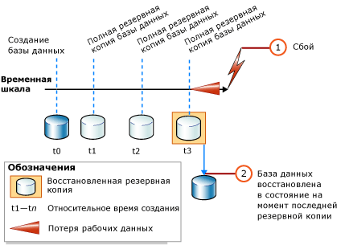
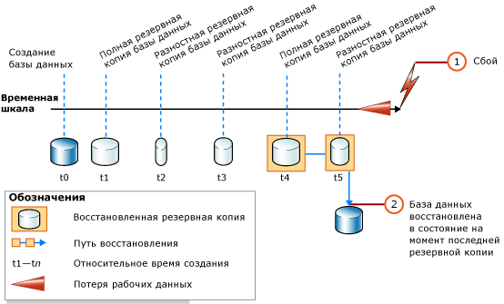

# <a name="complete-database-restores-simple-recovery-model"></a>Выполнение полного восстановления базы данных (Простая модель восстановления)
[!INCLUDE[tsql-appliesto-ss2016-xxxx-xxxx-xxx_md](../../includes/tsql-appliesto-ss2016-xxxx-xxxx-xxx-md.md)]

  Задача полного восстановления — восстановить базу данных целиком. В период восстановления база данных находится вне сети. Прежде чем какая-либо часть базы данных перейдет в режим «в сети», все данные восстанавливаются до точки согласования, в которой все части базы данных находятся в одном и том же моменте времени и в которой нет незафиксированных транзакций.  
  
 При использовании простой модели восстановления база данных не может быть восстановлена к определенному моменту времени внутри заданной резервной копии.  
  
> [!IMPORTANT]  
>  Не рекомендуется подключать или восстанавливать базы данных, полученные из неизвестных или ненадежных источников. В этих базах данных может содержаться вредоносный код, вызывающий выполнение непредусмотренных инструкций [!INCLUDE[tsql](../../includes/tsql-md.md)] или появление ошибок путем изменения схемы или физической структуры базы данных. Перед тем как использовать базу данных, полученную из неизвестного или ненадежного источника, выполните на тестовом сервере инструкцию [DBCC CHECKDB](../../t-sql/database-console-commands/dbcc-checkdb-transact-sql.md) для этой базы данных, а также изучите исходный код в базе данных, например хранимые процедуры и другой пользовательский код.  
  
 **В этом разделе.**  
  
-   [Общие сведения о восстановлении баз данных в рамках простой модели восстановления](#Overview)  
  
-   [Связанные задачи](#RelatedTasks)  
  
> [!NOTE]  
>  Сведения о поддержке резервных копий более ранних версий [!INCLUDE[ssNoVersion](../../includes/ssnoversion-md.md)]см. в подразделе "Поддержка совместимости" раздела [RESTORE (Transact-SQL)](../../t-sql/statements/restore-statements-transact-sql.md).  
  
##  <a name="Overview"></a> Общие сведения о восстановлении баз данных в рамках простой модели восстановления  
 Полное восстановление базы данных при использовании простой модели восстановления состоит из одной или двух инструкций [RESTORE](../../t-sql/statements/restore-statements-transact-sql.md) , в зависимости от того, нужно ли выполнять восстановление разностной резервной копии базы данных. При использовании только полной резервной копии базы данных просто восстановите последнюю резервную копию, как показано на следующем рисунке.  
  
   
  
 Если используется также восстановление разностной резервной копии базы данных, восстановите самую последнюю полную резервную копию базы данных без восстановления самой базы данных, а затем восстановите самую последнюю разностную резервную копию базы данных и восстановите саму базу данных. На следующем рисунке показан этот процесс.  
  
   
  
> [!NOTE]  
>  Если база данных восстанавливается на другой экземпляр сервера, см. раздел [Копирование баз данных путем создания и восстановления резервных копий](../../relational-databases/databases/copy-databases-with-backup-and-restore.md).  
  
###  <a name="TsqlSyntax"></a> Базовый синтаксис инструкции Transact-SQL RESTORE  
 Базовый синтаксис инструкции [!INCLUDE[tsql](../../includes/tsql-md.md)][RESTORE](../../t-sql/statements/restore-statements-transact-sql.md) для восстановления полной резервной копии базы данных выглядит следующим образом:  
  
 RESTORE DATABASE *имя_базы_данных* FROM *устройство_резервного_копирования* [ WITH NORECOVERY ]  
  
> [!NOTE]  
>  Если планируется также восстановление разностной резервной копии базы данных, используйте параметр WITH NORECOVERY.  
  
 Базовый синтаксис инструкции [RESTORE](../../t-sql/statements/restore-statements-transact-sql.md) восстановления из резервной копии базы данных:  
  
 RESTORE DATABASE *имя_базы_данных* FROM *устройство_резервного_копирования* WITH RECOVERY  
  
###  <a name="Example"></a> Пример (Transact-SQL)  
 В следующем примере сначала показано, как использовать инструкцию [BACKUP](../../t-sql/statements/backup-transact-sql.md) , чтобы создать полную резервную копию базы данных и разностную резервную копию базы данных [!INCLUDE[ssSampleDBobject](../../includes/sssampledbobject-md.md)] . Затем в примере восстанавливаются резервные копии в последовательности восстановления. База данных восстанавливается к состоянию на момент создания разностной резервной копии базы данных.  
  
 В  примере показаны критически важные параметры в последовательности восстановления для полного восстановления базы данных. *Последовательность восстановления* состоит из одной или нескольких операций восстановления, которые выполняют перемещение данных в одном или нескольких этапах восстановления. Синтаксис и прочие подробности, несущественные для данной цели, опущены. При восстановлении базы данных рекомендуется явно указать параметр RECOVERY, несмотря на то, что он подразумевается по умолчанию.  
  
> [!NOTE]  
>  Пример начинается с инструкции [ALTER DATABASE](../../t-sql/statements/alter-database-transact-sql.md) , которая устанавливает модель восстановления `SIMPLE`.  
  
```  
USE master;  
--Make sure the database is using the simple recovery model.  
ALTER DATABASE AdventureWorks2012 SET RECOVERY SIMPLE;  
GO  
-- Back up the full AdventureWorks2012 database.  
BACKUP DATABASE AdventureWorks2012   
TO DISK = 'Z:\SQLServerBackups\AdventureWorks2012.bak'   
  WITH FORMAT;  
GO  
--Create a differential database backup.  
BACKUP DATABASE AdventureWorks2012   
TO DISK = 'Z:\SQLServerBackups\AdventureWorks2012.bak'  
   WITH DIFFERENTIAL;  
GO  
--Restore the full database backup (from backup set 1).  
RESTORE DATABASE AdventureWorks2012   
FROM DISK = 'Z:\SQLServerBackups\AdventureWorks2012.bak'   
   WITH FILE=1, NORECOVERY;  
--Restore the differential backup (from backup set 2).  
RESTORE DATABASE AdventureWorks2012   
FROM DISK = 'Z:\SQLServerBackups\AdventureWorks2012.bak'   
   WITH FILE=2, RECOVERY;  
GO  
```  
  
##  <a name="RelatedTasks"></a> Связанные задачи  
 **Восстановление полной резервной копии базы данных**  
  
-   [Восстановление резервной копии базы данных в простой модели восстановления (Transact-SQL)](../../relational-databases/backup-restore/restore-a-database-backup-under-the-simple-recovery-model-transact-sql.md)  
  
-   [Restore a Database Backup Using SSMS](../../relational-databases/backup-restore/restore-a-database-backup-using-ssms.md)  
  
-   [Восстановление базы данных в новое место (SQL Server)](../../relational-databases/backup-restore/restore-a-database-to-a-new-location-sql-server.md)  
  
 **Восстановление разностной резервной копии базы данных**  
  
-   [Восстановление разностной резервной копии базы данных (SQL Server)](../../relational-databases/backup-restore/restore-a-differential-database-backup-sql-server.md)  
  
 **Восстановление резервной копии с помощью управляющих объектов SQL Server (SMO)**  
  
-   <xref:Microsoft.SqlServer.Management.Smo.Restore.SqlRestore%2A>  
  
## <a name="see-also"></a>См. также:  
 [RESTORE (Transact-SQL)](../../t-sql/statements/restore-statements-transact-sql.md)   
 [BACKUP (Transact-SQL)](../../t-sql/statements/backup-transact-sql.md)   
 [sp_addumpdevice (Transact-SQL)](../../relational-databases/system-stored-procedures/sp-addumpdevice-transact-sql.md)   
 [Полные резервные копии баз данных (SQL Server)](../../relational-databases/backup-restore/full-database-backups-sql-server.md)   
 [Разностные резервные копии (SQL Server)](../../relational-databases/backup-restore/differential-backups-sql-server.md)   
 [Общие сведения о резервном копировании (SQL Server)](../../relational-databases/backup-restore/backup-overview-sql-server.md)   
 [Обзор процессов восстановления (SQL Server)](../../relational-databases/backup-restore/restore-and-recovery-overview-sql-server.md)  
  
  
