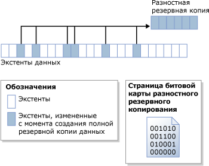

# Разностные резервные копии (SQL Server)
  В данной теме рассматривается резервное копирование и восстановление любых баз данных [!INCLUDE[ssNoVersion](../../includes/ssnoversion-md.md)] .  
  
 Разностное резервное копирование основано на самой последней предыдущей полной резервной копии данных. В разностной резервной копии сохраняются только те изменения, которые были произведены с момента создания последней полной резервной копии. Полная резервная копия, на которой основано разностное резервное копирование, известна также как *основа* разностной резервной копии. Полные резервные копии, за исключением резервных копий только для копирования, могут служить базой для последовательности разностных резервных копий, включая резервные копии баз данных, частичные резервные копии и резервные копии файлов. Базовая разностная резервная копия для файла может содержаться в полной резервной копии, в резервной копии файлов или частичной резервной копии.  
  
  
##   Преимущества  
  
-   Создание разностных резервных копий выполняется гораздо быстрее по сравнению с созданием полной резервной копии. Разностная резервная копия баз данных сохраняет только те данные, которые изменились по сравнению с полной резервной копией, которая служила основой для разностной резервной копии. Это облегчает процесс частого создания резервных копий с целью снижения риска потери данных. Однако перед восстановлением разностной резервной копии необходимо восстановить ее основу. Поэтому восстановление разностной резервной копии потребует большего количества шагов и времени по сравнению с восстановлением полной резервной копии, поскольку будут необходимы два файла резервных копий.  
  
-   Разностные резервные копии базы данных особенно полезны в тех случаях, когда в базе данных имеется подмножество, которое изменяется значительно чаще всех остальных данных. В этом случае разностная резервная копия позволит чаще производить резервное копирование, одновременно снижая издержки полного резервного копирования базы данных.  
  
-   В рамках модели полного восстановления использование разностных резервных копий позволяет сократить число резервных копий журналов, которые требуется восстановить.  
  
##   Общие сведения о разностных резервных копиях  
 Разностная резервная копия фиксирует состояние любого *экстента* (набора из 8 физически непрерывных страниц), который изменяется с момента создания базовой копии для разностного копирования до момента создания разностной резервной копии. Это означает, что размер разностной резервной копии зависит от объема данных, которые изменились со времени создания основы. Как правило, чем старее базовая резервная копия, тем больше должна быть новая разностная резервная копия. В последовательности разностных резервных копий часто обновляемый экстент в каждой разностной копии файлов с высокой вероятностью может содержать различные данные.  
  
 На следующем рисунке показано, как работает разностное резервное копирование. В базе данных содержится 24 экстента данных, 6 из которых изменены. Разностная резервная копия содержит только эти шесть экстентов данных. Разностное резервное копирование зависит от страницы битовой карты, которая содержит один бит для каждого экстента. Для каждого экстента, обновленного с момента создания основы для разностной копии, в битовой карте биту присваивается значение 1.  
  
   
  
> [!NOTE]  
>  Битовая карта разностного резервного копирования не обновляется при создании резервной копии только для копирования. Поэтому резервная копия только для копирования не оказывает никакого влияния на последующие разностные резервные копии.  
  
 Разностная резервная копия, создаваемая вскоре после своей основы, занимает значительно меньше места, чем базовая копия для разностного копирования. Это позволяет сэкономить место в хранилище и уменьшить время копирования. Однако с течением времени по мере изменения базы данных различие между базой данных и базовой копией для разностного копирования увеличивается. Чем больше промежуток времени между созданием основы для разностной копии и разностной резервной копией, тем больше места, скорее всего, будет занимать разностная резервная копия. Это означает, что в конце концов разностная резервная копия приблизится по размеру к своей базовой копии для разностного копирования. Разностная резервная копия большого размера теряет все свои преимущества: быстроту работы и малый объем.  
  
 Поскольку разностные резервные копии увеличиваются в размере, восстановление разностной резервной копии может значительно увеличить время, которое необходимо для восстановления базы данных. Поэтому рекомендуется через некоторое время выполнить создание новой полной резервной копии, чтобы получить новую базовую копию для разностного копирования. Например, можно выполнять полное резервное копирование всей базы данных один раз в неделю, а затем в течение недели регулярно создавать разностные резервные копии.  
  
 Прежде чем начать восстановление из разностной резервной копии, необходимо восстановить основу. Затем восстанавливается только самая последняя разностная копия, чтобы привести базу данных ко времени создания разностной резервной копии. Обычно восстанавливается последняя полная резервная копия, а затем последняя разностная резервная копия, которая на ней основана.  
  
## Разностные резервные копии баз данных с таблицами, оптимизированными для памяти  
 Сведения о разностных резервных копиях и базах данных с оптимизированными для памяти таблицами см. в статье [Резервное копирование базы данных с оптимизированными для памяти таблицами](../../relational-databases/in-memory-oltp/backing-up-a-database-with-memory-optimized-tables.md).  
  
##   Разностное резервное копирование баз данных только для чтения  
 В базах данных только для чтения использование полной резервной копии базы данных самой по себе проще, чем ее использование вместе с разностными резервными копиями. Это объясняется тем, что если база данных находится в режиме «только для чтения», то резервное копирование и прочие операции не в состоянии изменить содержащиеся в файле метаданные. Следовательно, необходимые для разностной резервной копии метаданные (в частности, номер LSN, с которого начинается разностное резервное копирование — номер LSN базовой копии для разностного копирования) хранятся в базе данных **master** . Если базовая копия для разностного копирования создавалась в тот момент, когда база данных была доступна только для чтения, то битовая карта разностного резервного копирования будет отображать большее число изменений, чем в действительности произошло с момента создания основы резервной копии. Дополнительные данные считываются при резервном копировании, но не записываются в резервную копию, так как столбец **differential_base_lsn** в системной таблице [backupset](../../relational-databases/system-tables/backupset-transact-sql.md) определяет, какие данные действительно были изменены с момента создания базы.  
  
 Если база данных, доступная только для чтения, перестраивается, восстанавливается или отсоединяется, а затем снова присоединяется, то теряются все данные основы для разностной резервной копии. Это происходит потому, что база данных **master** не синхронизована с базой данных пользователя. Компонент [!INCLUDE[ssDEnoversion](../../includes/ssdenoversion-md.md)] не может ни обнаружить, ни предотвратить возникновение этой проблемы. Все более поздние разностные резервные копии не будут основаны на последней полной резервной копии, что может привести к непредсказуемым результатам. Чтобы установить новую базовую копию для разностного копирования, рекомендуется создать полную резервную копию базы данных.  
  
### Рекомендации по использованию разностного резервного копирования с базами данных только для чтения  
 Если после создания полной резервной копии базы данных, доступной только для чтения, планируется последующее разностное резервное копирование, создайте резервную копию базы данных **master** .  
  
 Если база данных **master** утрачена, восстановите ее перед восстановлением любой разностной резервной копии пользовательской базы данных.  
  
 При отключении и подключении базы данных только для чтения, для которой в дальнейшем планируется создавать разностные резервные копии, как можно скорее создайте полную резервную копию самой базы данных и базы данных **master** .  
  
##   Связанные задачи  
  
-   [Создание разностной резервной копии базы данных (SQL Server)](../../relational-databases/backup-restore/create-a-differential-database-backup-sql-server.md)  
  
-   [Восстановление разностной резервной копии базы данных (SQL Server)](../../relational-databases/backup-restore/restore-a-differential-database-backup-sql-server.md)  
  
  
## См. также:  
 [Общие сведения о резервном копировании (SQL Server)](../../relational-databases/backup-restore/backup-overview-sql-server.md)   
 [Полные резервные копии баз данных (SQL Server)](../../relational-databases/backup-restore/full-database-backups-sql-server.md)   
 [Выполнение полного восстановления базы данных (модель полного восстановления)](../../relational-databases/backup-restore/complete-database-restores-full-recovery-model.md)   
 [Выполнение полного восстановления базы данных (простая модель восстановления)](../../relational-databases/backup-restore/complete-database-restores-simple-recovery-model.md)   
 [Резервные копии журналов транзакций (SQL Server)](../../relational-databases/backup-restore/transaction-log-backups-sql-server.md)  
  
  
