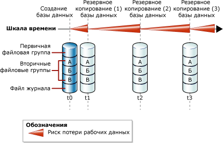
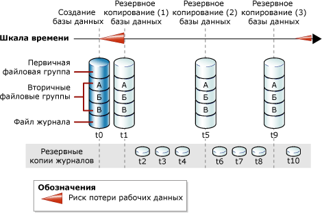

# <a name="full-database-backups-sql-server"></a>Полные резервные копии баз данных (SQL Server)
[!INCLUDE[appliesto-ss-xxxx-xxxx-xxx-md](../../includes/appliesto-ss-xxxx-xxxx-xxx-md.md)]
  При полном резервном копировании создается резервная копия всей базы данных целиком. В нее входит часть журнала транзакций, что позволяет восстановить полную базу данных из полной резервной копии базы данных. Полные резервные копии базы данных отображают состояние базы данных на момент завершения резервного копирования.  
  
> [!TIP]  
>  Однако по мере увеличения размера базы данных полное резервное копирование занимает больше времени и требует больше пространства для хранения. Поэтому для больших баз данных может потребоваться, кроме полных резервных копий, создавать также и *разностные резервные копии баз данных*. Дополнительные сведения см. в разделе [Разностные резервные копии (SQL Server)](../../relational-databases/backup-restore/differential-backups-sql-server.md).  
  
> [!IMPORTANT]  
>  Для резервной копии базы данных свойству TRUSTWORTHY присваивается значение OFF. Дополнительные сведения о том, как задать для параметра TRUSTWORTHY значение ON, см. в разделе [Параметры ALTER DATABASE SET (Transact-SQL)](../../t-sql/statements/alter-database-transact-sql-set-options.md).  
  
 **В этом разделе:**  
  
-   [Резервные копии баз данных при простой модели восстановления](#DbBuRMs)  
  
-   [Резервные копии баз данных при модели полного восстановления](#DbBuRMf)  
  
-   [Восстановление базы данных с помощью полной резервной копии](#RestoreDbBu)  
  
-   [Связанные задачи](#RelatedTasks)  
  
##  <a name="DbBuRMs"></a> Резервные копии баз данных при простой модели восстановления  
 При использовании простой модели восстановления после создания каждой резервной копии база данных уязвима для потенциальной потери данных в случае аварийной ситуации. Потенциальные потери работы растут с каждым внесенным изменением до следующего создания резервной копии, после чего объем потенциальных потерь работы снова уменьшается до нуля и начинается новый цикл. Потенциальные потери работы становятся тем больше, чем больше времени прошло со времени создания последней резервной копии. На следующем рисунке показана вероятность потери данных при использовании стратегии резервного копирования, в которой применяются только полные резервные копии базы данных.  
  
   
  
### <a name="example-includetsqlincludestsql-mdmd"></a>Пример ([!INCLUDE[tsql](../../includes/tsql-md.md)])  
 В следующем примере показано, как создать полную резервную копию базы данных с помощью предложения WITH FORMAT, чтобы перезаписать все существующие резервные копии и создать новый набор носителей.  
  
```  
-- Back up the AdventureWorks2012 database to new media set.  
BACKUP DATABASE AdventureWorks2012  
    TO DISK = 'Z:\SQLServerBackups\AdventureWorksSimpleRM.bak'   
    WITH FORMAT;  
GO  
```  
  
##  <a name="DbBuRMf"></a> Резервные копии баз данных при модели полного восстановления  
 Для баз данных, в которых используются полная модель восстановления и модель восстановления с неполным протоколированием, создание резервных копий баз данных необходимо, но недостаточно для нормальной работы. Требуется также создание резервных копий журнала транзакций. На следующем рисунке показан минимальный вариант полной стратегии резервного копирования, доступный при использовании модели полного восстановления.  
  
   
  
 Сведения о том, как создавать резервные копии журналов, см. в разделе [Резервные копии журналов транзакций (SQL Server)](../../relational-databases/backup-restore/transaction-log-backups-sql-server.md).  
  
### <a name="example-includetsqlincludestsql-mdmd"></a>Пример ([!INCLUDE[tsql](../../includes/tsql-md.md)])  
 В следующем примере показано, как создать полную резервную копию базы данных с помощью предложения WITH FORMAT, чтобы перезаписать все существующие резервные копии и создать новый набор носителей. Затем в примере производится резервное копирование журнала транзакций. В реальной ситуации, возможно, придется создать ряд обычных резервных копий журнала. В этом примере образец базы данных [!INCLUDE[ssSampleDBobject](../../includes/sssampledbobject-md.md)] должен быть переключен на модель полного восстановления.  
  
```  
USE master;  
ALTER DATABASE AdventureWorks2012 SET RECOVERY FULL;  
GO  
-- Back up the AdventureWorks2012 database to new media set (backup set 1).  
BACKUP DATABASE AdventureWorks2012  
  TO DISK = 'Z:\SQLServerBackups\AdventureWorks2012FullRM.bak'   
  WITH FORMAT;  
GO  
--Create a routine log backup (backup set 2).  
BACKUP LOG AdventureWorks2012 TO DISK = 'Z:\SQLServerBackups\AdventureWorks2012FullRM.bak';  
GO  
```  
  
##  <a name="RestoreDbBu"></a> Восстановление базы данных с помощью полной резервной копии  
 Из полной резервной копии базы данных путем ее восстановления можно за один этап восстановить всю базу данных в любом местоположении. В резервную копию включается достаточная часть журнала транзакций, чтобы можно было восстановить базу данных в состоянии на момент окончания резервного копирования. Восстановленная база данных соответствует состоянию исходной базы данных на момент окончания резервного копирования, за вычетом незавершенных транзакций. Согласно модели полного восстановления затем следует выполнить восстановление всех последующих резервных копий журналов транзакций. После восстановления базы данных выполняется откат незавершенных транзакций.  
  
 Дополнительные сведения см. в разделе [Выполнение полного восстановления базы данных (простая модель восстановления)](../../relational-databases/backup-restore/complete-database-restores-simple-recovery-model.md) или [Выполнение полного восстановления базы данных (модель полного восстановления)](../../relational-databases/backup-restore/complete-database-restores-full-recovery-model.md).  
  
##  <a name="RelatedTasks"></a> Связанные задачи  
 **Создание полной резервной копии базы данных**  
  
-   [Создание полной резервной копии базы данных (SQL Server)](../../relational-databases/backup-restore/create-a-full-database-backup-sql-server.md)  
  
-   <xref:Microsoft.SqlServer.Management.Smo.Backup.SqlBackup%2A> (SMO)  
  
 **Расписание заданий резервного копирования**  
  
 [Использование мастера планов обслуживания](../../relational-databases/maintenance-plans/use-the-maintenance-plan-wizard.md)  
  
## <a name="see-also"></a>См. также:  
 [Резервное копирование и восстановление баз данных SQL Server](../../relational-databases/backup-restore/back-up-and-restore-of-sql-server-databases.md)   
 [Общие сведения о резервном копировании (SQL Server)](../../relational-databases/backup-restore/backup-overview-sql-server.md)   
 [Создание и восстановление резервных копий баз данных служб Analysis Services](../../analysis-services/multidimensional-models/backup-and-restore-of-analysis-services-databases.md)  
  
  
