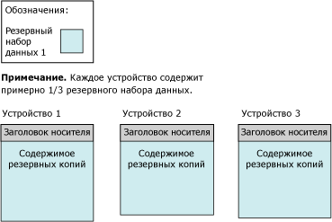
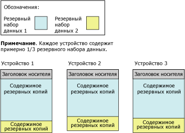

# <a name="media-sets-media-families-and-backup-sets-sql-server"></a>Наборы носителей, семейства носителей и резервные наборы данных (SQL Server)

[!INCLUDE[appliesto-ss-xxxx-xxxx-xxx-md](../../includes/appliesto-ss-xxxx-xxxx-xxx-md.md)]
  **В настоящем разделе приведена основная терминология, касающаяся носителей резервных копий для резервного копирования и восстановления в [!INCLUDE[ssNoVersion](../../includes/ssnoversion-md.md)] . Он предназначен для читателей, впервые знакомящихся с [!INCLUDE[ssNoVersion](../../includes/ssnoversion-md.md)].** 
  
  В этом разделе приведено описание формата, используемого в [!INCLUDE[ssNoVersion](../../includes/ssnoversion-md.md)] для носителей резервных копий, соответствия между носителями резервных копий и устройствами резервного копирования, организации резервных копий на носителях резервных копий, а также даны некоторые соображения, касающиеся наборов носителей и семейств носителей. Кроме того, в этом разделе описаны шаги инициализации или форматирования носителей резервных копий перед их использованием впервые или использованием для замены старого набора носителей новым набором носителей, а также показано, как перезаписать старые резервные наборы в наборе носителей и как добавить новые резервные наборы к набору носителей.  
  
>**Примечание.** Дополнительные сведения о резервном копировании SQL Server в хранилище BLOB-объектов Azure см. в статье [Резервное копирование и восстановление SQL Server с помощью службы хранилища BLOB-объектов Microsoft Azure](../../relational-databases/backup-restore/sql-server-backup-and-restore-with-microsoft-azure-blob-storage-service.md).  
   
##  <a name="terms"></a><a name="TermsAndDefinitions"></a> Термины  
 **набор носителей**  
 Упорядоченный набор носителей данных резервной копии в виде определенного количества ленточных устройств или дисков, на которые может быть записана одна или несколько операций резервного копирования, с использованием фиксированного типа и номера устройств резервного копирования.  
  
 **семейство носителей**  
 Резервные копии, созданные на одном устройстве без зеркального отображения или на наборе устройств с зеркальным отображением в наборе носителей  
  
**резервный набор данных**  
 Содержимое резервной копии добавляется на набор носителей при успешной операции резервного копирования.  
  

##  <a name="overview-of-media-sets-media-families-and-backup-sets"></a><a name="OvMediaSetsFamiliesBackupSets"></a> Общие сведения о наборах носителей, семействах носителей и резервных наборах  
 Резервные копии на наборе из одного или более носителей резервных копий образуют отдельный набор носителей. *Набор носителей* — упорядоченная коллекция *носителей резервных копий*, лент или дисковых файлов либо больших двоичных объектов Azure, на которые производили запись одна или несколько операций резервного копирования, получая доступ по фиксированному типу и номеру устройства. Данный набор носителей использует накопители на магнитной ленте или дисковые накопители либо большие двоичные объекты Azure, но не сочетание двух или нескольких типов носителей. 
 
**Например** , устройства резервного копирования, объединенные в набор носителей, могут включать в себя три ленточных накопителя с именами `\\.\TAPE0`, `\\.\TAPE1`и `\\.\TAPE2`. Этот набор содержит только ленточные носители, имеющие не менее трех лент (по одной на ленточный накопитель). Тип и номер устройства резервного копирования присваиваются при создании набора носителей и не могут меняться. Однако при необходимости, между операциями резервного копирования и восстановления можно заменить устройство на другое устройство аналогичного типа.  
  
 Набор носителей создается на носителе резервной копии во время операции резервного копирования при форматировании носителя. Дополнительные сведения см. в подразделе [Создание нового набора носителей](#CreatingMediaSet)ниже в данном разделе. После форматирования каждый файл или лента содержат заголовок носителя и готовы к записи данных. После формирования заголовка операция резервного копирования продолжает создавать резервную копию указанных данных на все заданные устройства резервного копирования.  
  
> **Примечание.** Для предотвращения потери данных в случае повреждения носителя (ленты или файла на диске), наборы носителей можно сделать зеркальными. Дополнительные сведения см. в подразделе [Зеркальные наборы носителей резервных копий (SQL Server)](../../relational-databases/backup-restore/mirrored-backup-media-sets-sql-server.md).  
  
 Сжатые и несжатые резервные копии не могут совместно использоваться в одном наборе носителей. Считывание сжатых резервных копий возможно в любом выпуске [!INCLUDE[ssKatmai](../../includes/sskatmai-md.md)] или более поздней версии. Дополнительные сведения см. в разделе [Сжатие резервных копий (SQL Server)](../../relational-databases/backup-restore/backup-compression-sql-server.md).  

  
## <a name="media-families"></a>Семейства носителей  
 Резервные копии, созданные на отдельном устройстве, не имеющем зеркального отображения, или на наборе устройств с зеркальным копированием, принадлежащем одному набору носителей, образуют *семейство носителей*. Количество устройств резервного копирования, используемых в наборе носителей, определяет количество семейств носителей в наборе носителей. Например, если набор носителей использует два незеркальных устройства резервного копирования, этот набор носителей содержит два семейства носителей.  
  
В зеркальном наборе носителей каждое семейство носителей является зеркальным. Например, если шесть устройств резервного копирования формируют набор носителей, в котором используются два зеркала, этот набор содержит три семейства носителей, каждое из которых содержит по две резервных копии данных. Дополнительные сведения о зеркальных наборах носителей резервных копий см. в разделе [Зеркальные наборы носителей резервных копий (SQL Server)](../../relational-databases/backup-restore/mirrored-backup-media-sets-sql-server.md).  
  
 Каждой ленте или диску в семействе носителей присваивается *порядковый номер носителя*. Порядковый номер носителя для диска всегда равен 1. Для семейства ленточных носителей порядковый номер исходной ленты равен 1, вторая лента получает номер 2 и т. д. Дополнительные сведения см. в подразделе [Наборы носителей, семейства носителей и резервные наборы данных (SQL Server)](../../relational-databases/backup-restore/media-sets-media-families-and-backup-sets-sql-server.md).
  
## <a name="the-media-header"></a>Заголовок носителя  
 Каждый том носителя резервной копии (дисковый файл или лента) содержит заголовок носителя, который создается первой операцией резервного копирования, использующей эту ленту или диск. Заголовок остается без изменений, пока носитель не будет отформатирован повторно.  
  
 Заголовок носителя содержит все сведения, необходимые, чтобы идентифицировать носитель (файл или ленту) и его место в семействе носителей. Эти данные включают:  
  
-   Имя носителя.  
  
     Имя носителя не является обязательным, но рекомендуется постоянно использовать имена носителей, чтобы однозначно их различать. Имя присваивается носителю во время форматирования.  
  
-   Уникальный идентификатор набора носителей.  
  
-   Количество семейств носителей в этом наборе носителей.  
  
-   Порядковый номер семейства носителей, содержащего данный носитель.  
  
-   Уникальный идентификатор семейства носителей.  
  
-   Порядковый номер носителя в семействе носителей. Для дискового файла это значение всегда равно 1.  
  
-   Содержит ли описание этого носителя метку MTF или описание носителя.  
  
    >**Примечание.** Во всех носителях, использующихся для операций резервного копирования или восстановления, применяется стандартный формат резервных копий под названием [!INCLUDE[msCoName](../../includes/msconame-md.md)] Tape Format (MTF). MTF позволяет пользователям задавать метку ленты, которая содержит описание, характерное для MTF. [!INCLUDE[ssNoVersion](../../includes/ssnoversion-md.md)] сохраняет любую метку носителя MTF, записанную другим приложением, но не записывает метки носителей MTF.  
  
-   Метка носителя в формате [!INCLUDE[msCoName](../../includes/msconame-md.md)] Tape Format или описание носителя (в свободной форме).  
  
-   Название программы резервного копирования, записавшей метку.  
  
-   Уникальный идентификатор поставщика программного обеспечения, с помощью которого отформатирован носитель.  
  
-   Дата и время записи метки.  
  
-   Количество зеркал в наборе (от 1 до 4); 1 является признаком того, что устройство не является зеркальным.  
  
 [!INCLUDE[ssCurrent](../../includes/sscurrent-md.md)] позволяет обрабатывать носители, отформатированные в более ранних версиях [!INCLUDE[ssNoVersion](../../includes/ssnoversion-md.md)].  
  
## <a name="backup-sets"></a>Резервные наборы данных  
 При успешном завершении операции резервного копирования к набору носителей добавляется один *резервный набор данных* . Резервный набор данных описывается в терминах набора носителей, на котором создан этот резервный набор. Если носитель резервной копии состоит только из одного семейства носителей, это семейство содержит весь резервный набор данных. Если носитель резервной копии состоит из нескольких семейств носителей, резервный набор данных распределяется между ними. На каждом носителе резервный набор данных содержит заголовок со своим описанием.  
  
 В этом примере показана инструкция [!INCLUDE[tsql](../../includes/tsql-md.md)] , с помощью которой создается набор носителей с именем `MyAdvWorks_MediaSet_1` для базы данных [!INCLUDE[ssSampleDBobject](../../includes/sssampledbobject-md.md)] , использующий три накопителя на магнитных лентах в качестве устройств резервного копирования:  
  
```  
BACKUP DATABASE AdventureWorks2012  
TO TAPE = '\\.\tape0', TAPE = '\\.\tape1', TAPE = '\\.\tape2'  
WITH   
   FORMAT,  
   MEDIANAME = 'MyAdvWorks_MediaSet_1'  
```  
  
 В случае успешного выполнения данной операции резервного копирования будет создан новый набор носителей, содержащий заголовок, и один резервный набор данных, распределенный на трех магнитных лентах. Результаты представлены на следующем рисунке.  
  
   
  
 Как правило, после создания набора носителей все последующие операции резервного копирования добавляют резервные наборы данных к этому набору носителей. Все носители, используемые резервным набором данных, составляют набор носителей независимо от числа вовлеченных в операцию носителей или устройств резервного копирования. Резервные наборы данных последовательно нумеруются согласно их позиции в наборе носителей, что позволяет указывать резервный набор для восстановления.  
  
 Каждая последующая операция резервного копирования требует одно и то же количество и тип резервных устройств. Содержимое каждой последующей резервной копии распределяется между носителями всех используемых устройств резервного копирования. Продолжая приведенный выше пример, при проведении второй операции резервного копирования (разностное резервное копирование) данные добавляются на тот же набор носителей:  
  
```  
BACKUP DATABASE AdventureWorks2012  
TO TAPE = '\\.\tape0', TAPE = '\\.\tape1', TAPE = '\\.\tape2'  
WITH   
   NOINIT,  
   MEDIANAME = 'AdventureWorksMediaSet1',  
   DIFFERENTIAL  
```  
  
> **Примечание.** Параметр NOINIT используется по умолчанию, но включен для ясности.  
  
 В случае успешного выполнения второй операции резервного копирования запись второго резервного набора данных на набор носителей производится со следующим распределением содержимого резервной копии.  
  
   
  
 При восстановлении резервных копий можно использовать параметр FILE, чтобы указать, какие резервные копии использовать. В следующем примере показано, как использовать предложения FILE **=** _номер_файла_резервного_набора_ при восстановлении полной резервной копии базы данных [!INCLUDE[ssSampleDBobject](../../includes/sssampledbobject-md.md)] , за которой следует разностная резервная копия на том же наборе носителей. Этот набор содержит три ленточных носителя, находящихся в накопителях на магнитной ленте `\\.\tape0`, `tape1`и `tape2`.  
  
```  
RESTORE DATABASE AdventureWorks2012 FROM TAPE = '\\.\tape0', TAPE = '\\.\tape1', TAPE = '\\.\tape2'  
   WITH   
   MEDIANAME = 'AdventureWorksMediaSet1',  
   FILE=1,   
   NORECOVERY;  
RESTORE DATABASE AdventureWorks2012 FROM TAPE = '\\.\tape0', TAPE = '\\.\tape1', TAPE = '\\.\tape2'   
   WITH   
   MEDIANAME = 'AdventureWorksMediaSet1',  
   FILE=2,   
   RECOVERY;  
GO  
```  
  
 Дополнительные сведения о таблицах журнала, содержащих данные о наборах носителей и их семействах, см. в разделе [Журнал и сведения о заголовке резервной копии (SQL Server)](../../relational-databases/backup-restore/backup-history-and-header-information-sql-server.md).  
  
 Число носителей резервной копии в наборе носителей зависит от нескольких факторов:  
  
-   от количества устройств резервного копирования;  
  
-   от типа устройств резервного копирования;  
  
-   от количества резервных наборов данных.  

  
##  <a name="creating-a-new-media-set"></a><a name="CreatingMediaSet"></a> Creating a new media set  
 Для создания нового набора носителей необходимо форматировать носитель резервной копии (одну или несколько магнитных лент или дисковых файлов). В процессе форматирования резервный носитель изменяется следующим образом.  
  
1.  Удаляется старый заголовок (если он есть), фактически удаляется прежнее содержимое носителя резервной копии.  
  
     При форматировании ленточного устройства удаляется все прежнее содержимое установленной на тот момент магнитной ленты. Форматирование диска затрагивает только файл, указанный для операции резервного копирования.  
  
2.  Записывается новый заголовок носителя на носитель резервной копии (магнитную ленту или дисковый файл) в каждом из устройств резервного копирования.  

  
##  <a name="backing-up-to-an-existing-media-set"></a><a name="UseExistingMediaSet"></a> Создание резервной копии на существующем наборе носителей  
 При создании резервной копии на существующем наборе носителей имеются следующие два параметра:  
  
-   Добавление к существующему резервному набору данных.  
  
     Чтобы использовать доступное пространство наилучшим образом, новые резервные наборы данных обычно добавляются к существующим наборам носителей. Добавление к резервной копии сохраняет любые предшествующие резервные копии. Дополнительные сведения см. в подразделе [Добавление к существующим резервным наборам](#Appending)ниже в этом разделе.  

Добавление, которое является поведением по умолчанию инструкции BACKUP, можно явно указать с помощью параметра NOINIT.  
  
-   Перезапись всех существующих резервных наборов данных текущими копиями с оставлением на месте текущего заголовка носителя.  
  
     [!INCLUDE[ssNoVersion](../../includes/ssnoversion-md.md)] имеет защиту от случайной перезаписи носителя. Однако резервная копия может автоматически переписать резервные наборы данных, которые достигли окончания предопределенного срока хранения.  
  
     При копировании на ленту может иметь смысл оставлять заголовки лент. Дополнительные сведения см. в подразделе [Перезапись резервных наборов](#Overwriting)ниже в данном разделе.  

    >  Перезапись существующих резервных наборов данных задается с помощью параметра INIT инструкции BACKUP.  
  
##  <a name="appending-to-existing-backup-sets"></a><a name="Appending"></a> Appending to existing backup sets  
 Резервные копии одной или разных баз данных в разные моменты времени могут храниться на одном носителе. При присоединении еще одного резервного набора данных к существующим копиям на носителе предыдущее содержимое носителя остается неизменным, и новая резервная копия записывается после окончания последней.  
  
 По умолчанию [!INCLUDE[ssNoVersion](../../includes/ssnoversion-md.md)] всегда присоединяет новую резервную копию к содержимому носителя. Присоединение может выполняться только в конец носителя. Например, если том содержит пять наборов резервных копий, нельзя пропустить первые три и перезаписать четвертый новым резервным набором.  
  
 Если для записи резервной копии на ленту используется инструкция BACKUP WITH NOREWIND, то в конце операции лента остается открытой. Это позволяет записывать последующие резервные копии на ленту без ее перемотки и последующего поиска последнего резервного набора. Список открытых накопителей на магнитной ленте можно получить из динамического административного представления **sys.dm_io_backup_tapes**. Дополнительные сведения см. в разделе [sys.dm_io_backup_tapes (Transact-SQL)](../../relational-databases/system-dynamic-management-views/sys-dm-io-backup-tapes-transact-sql.md).  
  
 Для резервных копий Microsoft Windows и резервных копий [!INCLUDE[ssNoVersion](../../includes/ssnoversion-md.md)] могут совместно использоваться одни и те же носители, но сами эти копии не являются функционально совместимыми. [!INCLUDE[ssNoVersion](../../includes/ssnoversion-md.md)] не позволяет создать резервную копию данных Windows.  
  
> **ВАЖНО!** Сжатые и несжатые резервные копии не могут совместно использоваться в одном наборе носителей. Любой выпуск [!INCLUDE[ssKatmai](../../includes/sskatmai-md.md)] или более поздних версий способен считывать сжатые резервные копии. Дополнительные сведения см. в разделе [Сжатие резервных копий (SQL Server)](../../relational-databases/backup-restore/backup-compression-sql-server.md).  
  
 
##  <a name="overwriting-backup-sets"></a><a name="Overwriting"></a> Overwriting backup sets  
 Перезапись существующих резервных наборов данных задается с помощью параметра INIT инструкции BACKUP. Этот параметр производит перезапись всех резервных наборов данных на носителе. Сохраняется только заголовок носителя. Если у носителя нет заголовка, он будет создан.  
  
 При копировании на ленту может иметь смысл оставлять заголовки лент. При копировании на дисковые носители переписываются только файлы, используемые устройствами резервного копирования, которые указаны в операции резервного копирования; остальные файлы на дисках сохраняются неизменными. При перезаписи резервных копий сохраняется каждый существующий заголовок носителя, и новая резервная копия создается в качестве первой для устройства. Если никакого заголовка у носителя нет, автоматически будет записан правильный заголовок, связанный с именем носителя и его описанием. Если существующий заголовок носителя недопустим, операция резервного копирования завершается. Если носитель пуст, формируется новый заголовок носителя с указанными параметрами MEDIANAME, MEDIAPASSWORD и MEDIADESCRIPTION, если таковые имеются.  
  
 
 Носители резервных копий не перезаписываются, если имеет место любое из следующих условий:  
  
-   Срок действия резервных копий на носителе еще не истек. (При указании аргумента SKIP срок действия не проверяется.)  
  
     Дата истечения срока хранения указывает день, когда истечет срок хранения резервной копии, и она сможет быть заменена другой копией. Дату истечения срока хранения резервной копии можно указать при ее создании. По умолчанию дата истечения срока хранения определяется набором параметров **media retention** хранимой процедуры **sp_configure**. Дополнительные сведения см. в подразделе [sp_configure &#40;Transact-SQL&#41;](../../relational-databases/system-stored-procedures/sp-configure-transact-sql.md).  
  
-   Имя носителя, если оно указано, не соответствует имени на носителе резервной копии.  
  
     Имя носителя представляет собой описательное имя, которое используется, чтобы облегчить распознавание носителя.  
  
 Если существует уверенность в том, что необходимо перезаписать существующий носитель (например, если известно, что резервные копии на ленте более не нужны), можно в явном виде отказаться от этих проверок.  
  
 Если носитель резервной копии защищен паролем Microsoft Windows, Microsoft SQL Server не будет производить записи на этот носитель. Чтобы перезаписать защищенный паролем носитель, нужно его заново инициализировать.  
  

  
##  <a name="sequence-numbers"></a><a name="SequenceNumbers"></a> Порядковые номера  
 Для нескольких семейств носителей в наборе носителей или нескольких резервных носителей в семействе носителей важен правильный порядок. Поэтому резервное копирование назначает порядковые номера следующими способами.  
  
-   Последовательные семейства носителей в наборе носителей.  
  
     Семейства носителей в наборе носителей последовательно нумеруются в соответствие с их позицией в наборе носителей. Номер семейства носителей записывается в столбец **family_sequence_number** таблицы **backupmediafamily** .  
  
-   Физический носитель в семействе носителей.  
  
     Порядковый номер носителя указывает на место физического носителя в семействе носителей. Порядковый номер начального носителя резервной копии равен 1. Он обозначен цифрой 1, второй (первый дополнительный носитель) обозначен цифрой 2 и т.д. При восстановлении из резервного набора данных наличие порядковых номеров носителей позволяет гарантировать, что оператор, выполняющий восстановление, монтирует носители в правильном порядке.  
  
###  <a name="multiple-devices"></a><a name="MultipleDevices"></a> Несколько устройств  
 При использовании нескольких ленточных накопителей или дисковых файлов необходимо помнить о следующем.  
  
-   При резервном копировании.  
  
     Весь набор носителей, созданный операцией резервного копирования, должен целиком использоваться всеми последующими операциями резервного копирования. Например, если в созданном наборе носителей используется два накопителя на магнитной ленте для резервного копирования, то все последующие операции резервного копирования, включающие этот набор носителей, должны использовать два устройства резервного копирования.  
  
-   При восстановлении.  
  
     При любом восстановлении из резервных копий на диске или восстановлении «в сети», необходимо последовательно подключить все семейства носителей. При восстановлении вне сети с ленточных устройств резервного копирования можно обработать семейства носителей с меньшего количества устройств резервного копирования. Каждое семейство носителей полностью обрабатывается перед тем, как начинается обработка другого. Семейства носителей всегда обрабатываются параллельно, если происходит восстановление более чем с одного устройства.  
  
##  <a name="related-tasks"></a><a name="RelatedTasks"></a> Связанные задачи  
 **Создание нового набора носителей**  
  
-   [Создание полной резервной копии базы данных (SQL Server)](../../relational-databases/backup-restore/create-a-full-database-backup-sql-server.md) (параметр **Создать резервную копию в новом наборе носителей и удалить все существующие резервные наборы данных**)  
  
-   [BACKUP (Transact-SQL)](../../t-sql/statements/backup-transact-sql.md) (параметр FORMAT)  
  
-   <xref:Microsoft.SqlServer.Management.Smo.Backup.FormatMedia%2A>  
  
 **Добавление новой резервной копии к существующим носителям**  
  
-   [Создание полной резервной копии (SQL Server)](../../relational-databases/backup-restore/create-a-full-database-backup-sql-server.md) (параметр **Добавить в существующий резервный набор данных**)  
  
-   [BACKUP (Transact-SQL)](../../t-sql/statements/backup-transact-sql.md) (параметр NOINIT)  
  
 **Перезапись существующих резервных наборов данных**  
  
-   [Создание полной резервной копии (SQL Server)](../../relational-databases/backup-restore/create-a-full-database-backup-sql-server.md) (параметр **Перезаписать все существующие резервные наборы данных**)  
  
-   [BACKUP (Transact-SQL)](../../t-sql/statements/backup-transact-sql.md) (параметр INIT)  
  
 **Дата истечения срока действия**  
  
-   [Назначение срока хранения резервной копии (SQL Server)](../../relational-databases/backup-restore/set-the-expiration-date-on-a-backup-sql-server.md)  
  
 **Просмотр порядкового номера носителя и порядковые номера семейств носителей**  
  
-   [Просмотр свойств и содержимого логического устройства резервного копирования (SQL Server)](../../relational-databases/backup-restore/view-the-properties-and-contents-of-a-logical-backup-device-sql-server.md)  
  
-   [backupmediafamily (Transact-SQL)](../../relational-databases/system-tables/backupmediafamily-transact-sql.md) (столбец **family_sequence_number**)  
  
 **Просмотр резервных наборов данных на конкретном устройстве резервного копирования**  
  
-   [Просмотр файлов данных и журналов в резервном наборе данных (SQL Server)](../../relational-databases/backup-restore/view-the-data-and-log-files-in-a-backup-set-sql-server.md)  
  
-   [Просмотр свойств и содержимого логического устройства резервного копирования (SQL Server)](../../relational-databases/backup-restore/view-the-properties-and-contents-of-a-logical-backup-device-sql-server.md)  
  
-   [RESTORE HEADERONLY (Transact-SQL)](../../t-sql/statements/restore-statements-headeronly-transact-sql.md)  
  
 **Считывание заголовка носителя с устройства резервного копирования**  
  
-   [RESTORE LABELONLY (Transact-SQL)](../../t-sql/statements/restore-statements-labelonly-transact-sql.md)  
 
  
## <a name="see-also"></a>См. также раздел  
 [Резервное копирование и восстановление баз данных SQL Server](../../relational-databases/backup-restore/back-up-and-restore-of-sql-server-databases.md)   
 [Возможные ошибки носителей во время резервного копирования и восстановления (SQL Server)](../../relational-databases/backup-restore/possible-media-errors-during-backup-and-restore-sql-server.md)   
 [Журнал и сведения о заголовке резервной копии (SQL Server)](../../relational-databases/backup-restore/backup-history-and-header-information-sql-server.md)   
 [Зеркальные наборы носителей резервных копий (SQL Server)](../../relational-databases/backup-restore/mirrored-backup-media-sets-sql-server.md)   
 [BACKUP (Transact-SQL)](../../t-sql/statements/backup-transact-sql.md)   
 [RESTORE (Transact-SQL)](../../t-sql/statements/restore-statements-transact-sql.md)   
 [RESTORE REWINDONLY (Transact-SQL)](../../t-sql/statements/restore-statements-rewindonly-transact-sql.md)   
 [sp_configure (Transact-SQL)](../../relational-databases/system-stored-procedures/sp-configure-transact-sql.md)  
  
  
